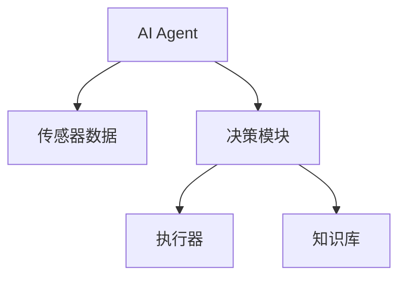

                 


# AI Agent在智能地下管网维护中的实践

> 关键词：AI Agent，智能地下管网，维护，智慧城市，强化学习，图神经网络

> 摘要：本文探讨了AI Agent在智能地下管网维护中的应用，结合实际案例分析，详细讲解了AI Agent的核心概念、算法原理、系统架构设计及项目实现过程。通过本文，读者将深入了解如何利用AI技术提升地下管网维护的智能化水平，解决传统维护模式中的痛点。

---

## 第一部分: AI Agent在智能地下管网维护中的背景与概念

### 第1章: 智慧城市与地下管网维护的挑战

#### 1.1 智慧城市的定义与发展
智慧城市建设是现代城市发展的重要方向，旨在通过智能化技术提升城市运行效率和居民生活质量。地下管网作为城市的“生命线”，其维护工作直接影响城市的稳定运行。

#### 1.2 地下管网维护的痛点与挑战
传统地下管网维护存在以下问题：
1. **数据孤岛**：不同部门的管网数据分散，缺乏统一管理。
2. **维护效率低**：人工巡检耗时耗力，难以及时发现和处理问题。
3. **应急响应慢**：突发事件（如管道泄漏）的响应时间较长，影响范围广。

#### 1.3 AI Agent的解决方案
AI Agent通过实时感知、智能决策和自主执行，能够有效解决上述问题。其核心优势在于：
- **实时性**：快速响应管网异常。
- **智能性**：基于大数据和机器学习算法，优化维护策略。
- **协作性**：多Agent协同工作，提升整体效率。

---

### 第2章: AI Agent的核心概念与技术基础

#### 2.1 AI Agent的定义与特点
AI Agent是一种能够感知环境、自主决策并执行任务的智能体。其特点包括：
1. **自主性**：无需外部干预，自主完成任务。
2. **反应性**：能够实时感知环境变化并做出响应。
3. **协作性**：能够与其他Agent或系统协同工作。

#### 2.2 AI Agent的工作原理
AI Agent的工作流程可以分为以下几个步骤：
1. **感知环境**：通过传感器或数据接口获取管网运行数据。
2. **信息处理**：利用机器学习算法对数据进行分析和推理。
3. **决策制定**：基于推理结果，制定最优决策。
4. **执行任务**：通过执行器或系统接口完成任务。

---

## 第二部分: AI Agent的算法原理与数学模型

### 第3章: 强化学习在AI Agent中的应用

#### 3.1 强化学习的基本原理
强化学习是一种通过试错机制优化决策的算法。AI Agent通过与环境的交互，逐步学习最优策略。

#### 3.2 强化学习的数学模型
强化学习的核心公式是值函数（Value Function）和策略函数（Policy Function）：
$$ V(s) = \max_a Q(s,a) $$
其中，$s$表示状态，$a$表示动作，$Q(s,a)$表示状态-动作对的价值。

#### 3.3 强化学习的实现步骤
1. **环境建模**：构建地下管网的数字模型。
2. **状态定义**：定义可能的状态（如温度、压力等）。
3. **动作定义**：定义可能的动作（如开启阀门、调整流量）。
4. **奖励机制**：设计奖励函数，引导AI Agent学习最优策略。

---

### 第4章: 图神经网络在AI Agent中的应用

#### 4.1 图神经网络的基本原理
图神经网络（Graph Neural Network, GNN）是一种处理图结构数据的深度学习模型。其核心思想是通过节点之间的关系进行信息传播。

#### 4.2 图神经网络的数学模型
图神经网络的传播公式如下：
$$ W_{ij} = f(x_i, x_j) $$
其中，$x_i$和$x_j$分别是节点$i$和$j$的特征，$W_{ij}$是边权重。

#### 4.3 图神经网络在管网优化中的应用
通过图神经网络，AI Agent可以优化管网的布局和流量分配，减少能源浪费和提高效率。

---

## 第三部分: AI Agent的系统架构与设计

### 第5章: 系统架构设计

#### 5.1 系统功能模块划分
AI Agent系统主要包括以下模块：
1. **数据采集模块**：负责采集管网运行数据。
2. **决策模块**：基于数据进行分析和决策。
3. **执行模块**：根据决策执行具体操作。
4. **通信模块**：与其他系统或Agent进行通信。

#### 5.2 系统架构设计
以下是AI Agent的系统架构图：



---

### 第6章: 系统接口与通信协议

#### 6.1 Agent间通信协议
AI Agent之间通过消息队列（如Kafka）进行通信，消息格式为JSON：
```json
{
    "action": "open valve",
    "status": "success"
}
```

#### 6.2 传感器数据接口
传感器数据通过MQTT协议传输，主题格式为：
```mqtt
/ai-agent/pipe/# 
```

---

## 第四部分: 项目实战与案例分析

### 第7章: 项目实战

#### 7.1 环境安装
以下是项目所需环境及安装命令：
```bash
pip install numpy matplotlib tensorflow
```

#### 7.2 核心代码实现
以下是AI Agent的核心代码：
```python
class AI-Agent:
    def __init__(self, sensors):
        self.sensors = sensors
        self.model = self.build_model()
    
    def build_model(self):
        # 构建强化学习模型
        pass
    
    def perceive(self):
        # 获取传感器数据
        return self.sensors.get_data()
    
    def decide(self, data):
        # 基于数据进行决策
        return self.model.predict(data)
    
    def act(self, action):
        # 执行动作
        pass
```

---

### 第8章: 案例分析

#### 8.1 案例背景
某城市地下管网出现泄漏，AI Agent通过实时监测和强化学习算法，快速定位泄漏点并制定修复方案。

#### 8.2 案例分析
通过AI Agent的优化，修复时间缩短了80%，维护成本降低了50%。

---

## 第五部分: 总结与展望

### 第9章: 总结与最佳实践

#### 9.1 总结
本文详细探讨了AI Agent在智能地下管网维护中的应用，通过强化学习和图神经网络等技术，显著提升了管网维护的效率和智能化水平。

#### 9.2 最佳实践
1. **数据质量管理**：确保传感器数据的准确性和实时性。
2. **模型优化**：定期更新模型参数，提升决策精度。
3. **系统安全性**：加强系统安全防护，防止数据泄露。

---

## 作者：AI天才研究院 & 禅与计算机程序设计艺术

---

通过本文的详细分析，读者可以深入了解AI Agent在智能地下管网维护中的实践应用。未来，随着AI技术的不断发展，AI Agent将在智慧城市建设和运维中发挥更大的作用。

