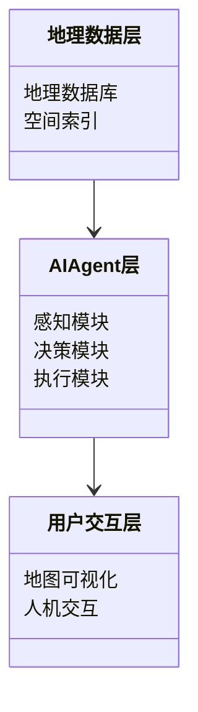
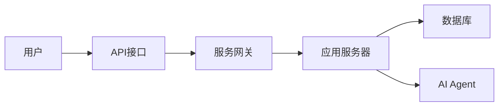

                 


# AI Agent在智能地理信息系统中的实践

## 关键词：AI Agent, 智能地理信息系统, 算法原理, 系统架构, 项目实战

## 摘要：本文深入探讨了AI Agent在智能地理信息系统中的实践应用，详细分析了其核心概念、算法原理、系统架构，并通过具体案例展示了项目实战。文章结构清晰，内容丰富，涵盖了从理论到实践的各个方面，为读者提供了全面的指导。

---

# 第1章: AI Agent的基本概念

## 1.1 AI Agent的定义与特点

### 1.1.1 AI Agent的定义

AI Agent（人工智能代理）是指能够感知环境、自主决策并执行任务的智能实体。在智能地理信息系统（GIS）中，AI Agent通常用于处理复杂的空间数据和决策问题。

$$
\text{AI Agent} = \{\text{感知, 决策, 执行}\}
$$

### 1.1.2 AI Agent的核心特点

AI Agent在GIS中的应用具有以下特点：

1. **自主性**：能够自主决策，无需外部干预。
2. **反应性**：能够实时感知环境变化并做出响应。
3. **智能性**：具备学习和推理能力，能够处理复杂问题。
4. **协作性**：能够与其他AI Agent或系统协同工作。

### 1.1.3 AI Agent与传统GIS的区别

| 特性         | AI Agent GIS | 传统GIS         |
|--------------|---------------|-----------------|
| 数据处理     | 强大的智能分析 | 基于规则的处理  |
| 决策能力     | 自主决策       | 依赖人工干预     |
| 应用场景     | 复杂空间问题   | 基础空间分析     |

---

## 1.2 地理信息系统的概述

### 1.2.1 GIS的基本概念

GIS（地理信息系统）是一种用于采集、存储、处理和分析地理数据的系统。它广泛应用于城市规划、环境监测等领域。

### 1.2.2 GIS的主要功能

1. **数据管理**：存储和管理空间数据。
2. **空间分析**：对空间数据进行分析和处理。
3. **可视化**：将地理信息以图形形式展示。

### 1.2.3 AI Agent在GIS中的应用背景

随着GIS的智能化发展，AI Agent在GIS中的应用日益广泛。它能够处理复杂的空间问题，提高系统的决策能力。

---

# 第2章: AI Agent的核心原理与机制

## 2.1 AI Agent的感知机制

### 2.1.1 数据采集与处理

AI Agent通过传感器或数据库获取地理数据，并进行预处理。


### 2.1.2 知识表示与推理

AI Agent通过知识表示和推理技术，将地理数据转化为有用的信息。

$$
\text{推理} = \text{知识} \cup \text{逻辑规则}
$$

### 2.1.3 感知模型的构建

感知模型是AI Agent的核心，它决定了如何从地理数据中提取有用的信息。

---

## 2.2 AI Agent的决策机制

### 2.2.1 决策算法的选择

AI Agent通常使用强化学习或基于规则的算法进行决策。

### 2.2.2 决策模型的训练

通过机器学习算法训练决策模型，使其能够做出最优决策。

---

## 2.3 AI Agent的执行机制

### 2.3.1 执行策略的制定

根据决策结果制定执行策略。

### 2.3.2 执行过程的监控

实时监控执行过程，确保任务顺利完成。

---

# 第3章: AI Agent的算法原理讲解

## 3.1 路径规划算法

### 3.1.1 Dijkstra算法

Dijkstra算法用于寻找从起点到终点的最短路径。

$$
\text{距离} = \sum_{i=1}^{n} (d_i + w_i)
$$

### 3.1.2 A*算法

A*算法是一种优化的路径规划算法，结合了启发式搜索。

$$
f(n) = g(n) + h(n)
$$

### 3.1.3 算法实现

```python
import heapq

def dijkstra(graph, start, end):
    heap = []
    heapq.heappush(heap, (0, start))
    visited = {start: 0}
    
    while heap:
        current_dist, current_node = heapq.heappop(heap)
        if current_node == end:
            break
        for neighbor, weight in graph[current_node].items():
            distance = current_dist + weight
            if neighbor not in visited or distance < visited[neighbor]:
                visited[neighbor] = distance
                heapq.heappush(heap, (distance, neighbor))
    return visited[end]
```

---

# 第4章: AI Agent的数学模型和公式

## 4.1 空间距离计算

### 4.1.1 欧几里得距离

$$
d = \sqrt{(x_2 - x_1)^2 + (y_2 - y_1)^2}
$$

### 4.1.2 曼哈顿距离

$$
d = |x_2 - x_1| + |y_2 - y_1|
$$

## 4.2 空间插值方法

### 4.2.1 反距离加权插值

$$
I(x_0) = \sum_{i=1}^{n} w_i \cdot I(x_i)
$$

其中，$w_i$ 是权重系数。

---

# 第5章: AI Agent的系统架构设计

## 5.1 系统功能设计

### 5.1.1 领域模型



## 5.2 系统架构设计



---

# 第6章: AI Agent的项目实战

## 6.1 环境安装

### 6.1.1 安装Python

```bash
python --version
pip install --upgrade pip
```

### 6.1.2 安装GIS库

```bash
pip install GeoPandas
pip install Shapely
```

## 6.2 核心代码实现

### 6.2.1 路径规划代码

```python
import geopandas as gpd
from shapely.geometry import Point, LineString

def plan_route(start, end):
    start_point = Point(start)
    end_point = Point(end)
    route = LineString([start_point, end_point])
    return route
```

## 6.3 案例分析

### 6.3.1 城市交通优化

通过AI Agent优化城市交通路径，减少拥堵和提高效率。

---

# 第7章: AI Agent的高级主题与未来展望

## 7.1 高级应用

### 7.1.1 多智能体协作

多个AI Agent协同工作，共同完成复杂的地理任务。

## 7.2 未来展望

随着技术的发展，AI Agent在GIS中的应用将更加智能化和广泛。

---

# 附录

## 术语表

| 术语         | 定义                                   |
|--------------|--------------------------------------|
| AI Agent     | 能够感知、决策和执行的智能实体       |
| GIS          | 地理信息系统                           |
| 路径规划     | 找出从起点到终点的最短路径           |

## 工具推荐

- Python: 数据处理和算法实现
- GeoPandas: 空间数据分析
- Shapely: 空间几何处理

## 参考文献

1. 《人工智能导论》
2. 《地理信息系统原理》
3. 《Python地理数据处理实战》

---

# 作者：AI天才研究院/AI Genius Institute & 禅与计算机程序设计艺术 /Zen And The Art of Computer Programming

