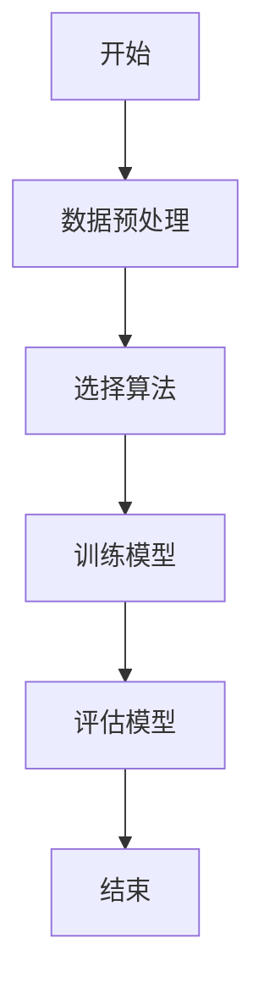

                 


# AI Agent在智能地震预测系统中的实践

## 关键词
AI Agent, 地震预测, 时间序列分析, LSTM网络, 系统架构, 实时监控

## 摘要
本文探讨AI Agent在智能地震预测系统中的应用，详细分析地震预测的关键因素、AI Agent的核心概念，以及如何通过时间序列分析和深度学习算法实现地震预测。文章还介绍了系统的架构设计、项目实战及最佳实践，为技术人员和研究人员提供深度的实践指导。

---

# 第1章: 地震预测与AI Agent概述

## 1.1 地震预测的基本概念
### 1.1.1 地震的基本原理
地震是由地壳内部的构造运动引起的，主要由板块运动和地质活动引发。地震预测的目标是通过分析地质数据和地震前兆，预测地震的发生时间和强度。

### 1.1.2 地震预测的难点与挑战
地震预测具有高度复杂性和不确定性，主要挑战包括：
1. 数据不足：地震事件稀少，难以训练有效的预测模型。
2. 多因素影响：地震的发生受多种地质条件影响，模型难以全面捕捉。
3. 预测精度：目前的预测方法难以实现高精度预测。

### 1.1.3 AI在地震预测中的潜在价值
AI技术可以通过分析大量历史数据，发现人类难以察觉的模式，为地震预测提供新的可能性。

## 1.2 AI Agent的基本概念
### 1.2.1 AI Agent的定义与特点
AI Agent是一种智能实体，能够感知环境、自主决策并执行任务。其特点包括：
1. 自主性：无需外部干预，自主完成任务。
2. 反应性：能够实时感知环境变化并做出反应。
3. 社交能力：能够与其他系统或用户进行交互。

### 1.2.2 AI Agent与传统AI的区别
AI Agent强调自主性和实时性，传统AI则侧重于数据处理和模式识别。

### 1.2.3 AI Agent在地震预测中的应用前景
AI Agent可以通过实时监控地质数据，动态调整预测模型，提高预测的准确性。

## 1.3 AI Agent在地震预测中的背景与需求
### 1.3.1 地震预测的现状与痛点
目前的地震预测主要依赖统计分析和经验模型，存在精度低、响应慢等问题。

### 1.3.2 AI Agent在地震预测中的优势
AI Agent能够实时处理大量数据，快速更新预测模型，提高预测的及时性和准确性。

### 1.3.3 本章小结
地震预测面临诸多挑战，AI Agent的引入为解决这些问题提供了新的思路。

---

# 第2章: 地震预测的核心概念与AI Agent的关联

## 2.1 地震预测的关键因素
### 2.1.1 地质活动的周期性
地质活动具有周期性，AI Agent可以通过分析周期性数据，预测未来地震活动。

### 2.1.2 地震前兆的多样性
地震前兆包括地壳变形、电磁异常等多种现象，AI Agent能够综合分析这些数据。

### 2.1.3 数据采集与分析的重要性
高质量的数据采集和分析是地震预测的基础。

## 2.2 AI Agent在地震预测中的角色
### 2.2.1 数据处理与分析
AI Agent负责采集和处理地震数据，提取特征。

### 2.2.2 模型训练与预测
AI Agent训练预测模型，并根据实时数据更新模型。

### 2.2.3 实时监控与反馈
AI Agent实时监控地质数据，及时反馈预测结果。

## 2.3 地震预测系统的核心要素
### 2.3.1 数据采集系统
负责采集地震相关的各种数据，如地壳运动、电磁场变化等。

### 2.3.2 数据分析与处理算法
包括时间序列分析和深度学习模型，用于数据处理和预测。

### 2.3.3 预测模型与结果输出
模型生成预测结果，并通过可视化界面输出。

### 2.3.4 本章小结
地震预测系统需要综合考虑数据采集、分析和模型预测等多个方面。

---

# 第3章: AI Agent的算法原理与数学模型

## 3.1 时间序列分析算法
### 3.1.1 ARIMA模型的原理
ARIMA模型是一种常用的时间序列分析方法，适用于线性数据。

#### ARIMA模型的数学公式
$$ ARIMA(p, d, q) $$
其中，p为自回归阶数，d为差分阶数，q为移动平均阶数。

### 3.1.2 LSTM网络的原理
LSTM是一种深度学习模型，适用于时间序列数据。

#### LSTM网络的数学公式
$$ f(t) = \sigma(W_{f} \cdot [h(t-1), x(t)] + b_f) $$

### 3.1.3 算法的优缺点对比
- **ARIMA**：简单易用，但难以捕捉复杂模式。
- **LSTM**：能够捕捉长期依赖关系，预测精度高。

## 3.2 AI Agent的决策机制
### 3.2.1 基于概率的决策模型
通过概率分布进行决策，适用于不确定性较高的场景。

### 3.2.2 基于规则的决策模型
根据预定义规则进行决策，适用于规则明确的场景。

### 3.2.3 基于强化学习的决策模型
通过奖励机制优化决策策略。

## 3.3 地震预测的数学模型
### 3.3.1 时间序列预测的数学公式
$$ y_t = \alpha y_{t-1} + \beta x_t + \gamma $$
其中，$\alpha$、$\beta$、$\gamma$为模型参数。

### 3.3.2 神经网络模型的数学表达
$$ y = \sigma(Wx + b) $$
其中，$W$为权重矩阵，$b$为偏置，$\sigma$为激活函数。

## 3.4 算法流程图


---

# 第4章: 系统分析与架构设计

## 4.1 问题场景介绍
地震预测系统需要实时处理大量数据，快速生成预测结果。

## 4.2 系统功能设计
- 数据采集模块：采集地震数据。
- 数据分析模块：处理数据并提取特征。
- 预测模型模块：训练并更新预测模型。
- 结果输出模块：展示预测结果。

## 4.3 系统架构设计


## 4.4 系统接口设计
- 数据采集接口：与传感器连接，获取实时数据。
- 模型训练接口：接收数据，训练预测模型。
- 结果输出接口：展示预测结果。

---

# 第5章: 项目实战

## 5.1 环境安装
安装必要的Python库，如TensorFlow、Keras等。

## 5.2 核心代码实现
```python
import numpy as np
from tensorflow.keras.models import Sequential
from tensorflow.keras.layers import LSTM, Dense

# 数据预处理
data = np.array(...)

# 模型构建
model = Sequential()
model.add(LSTM(64, input_shape=(timesteps, features)))
model.add(Dense(1))
model.compile(loss='mean_squared_error', optimizer='adam')
model.fit(...)
```

## 5.3 实际案例分析
通过实际数据训练模型，评估预测精度。

---

# 第6章: 最佳实践与小结

## 6.1 最佳实践
- 数据质量：确保数据准确性和完整性。
- 模型选择：根据数据特点选择合适的算法。
- 实时性：优化系统架构，提高响应速度。

## 6.2 小结
AI Agent在地震预测中具有重要作用，但需要结合多种技术，优化系统架构，才能实现高效预测。

## 6.3 注意事项
- 数据隐私：保护地震数据的安全性。
- 系统稳定性：确保系统在极端情况下的稳定性。

## 6.4 拓展阅读
推荐阅读相关领域的最新研究成果。

---

# 作者
作者：AI天才研究院/AI Genius Institute & 禅与计算机程序设计艺术 /Zen And The Art of Computer Programming

