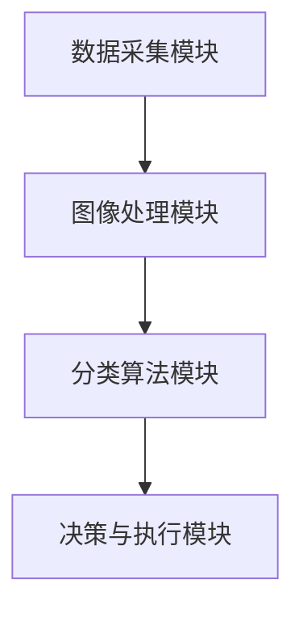

                 


# AI Agent在智能垃圾分类识别中的实践

> 关键词：AI Agent，智能垃圾分类，计算机视觉，机器学习，深度学习，图像分类

> 摘要：本文深入探讨了AI Agent在智能垃圾分类中的应用实践。从AI Agent的基本概念到其在垃圾分类中的具体实现，再到系统的架构设计和优化，全面分析了如何利用AI技术提升垃圾分类的效率和准确性。文章结合实际项目案例，详细讲解了基于深度学习的图像分类算法，并给出了系统设计和优化建议，为读者提供了从理论到实践的完整指导。

---

## 第1章: AI Agent与智能垃圾分类概述

### 1.1 AI Agent的基本概念

#### 1.1.1 什么是AI Agent
AI Agent（人工智能代理）是一种能够感知环境、自主决策并执行任务的智能实体。它通过传感器获取信息，利用算法处理数据，并通过执行器与环境交互。AI Agent的核心目标是通过智能化的方式解决问题，提高效率。

#### 1.1.2 AI Agent的核心特征
- **自主性**：能够自主决策，无需外部干预。
- **反应性**：能够实时感知环境并做出反应。
- **目标导向**：以特定目标为导向，优化行动策略。
- **学习能力**：能够通过数据和经验不断优化自身性能。

#### 1.1.3 AI Agent的应用场景
AI Agent广泛应用于自动驾驶、智能客服、推荐系统等领域。在垃圾分类中，AI Agent能够通过图像识别和分类算法，帮助自动识别和分类垃圾。

### 1.2 智能垃圾分类的背景与意义

#### 1.2.1 垃圾分类的重要性
垃圾分类是环保的重要环节，能够减少资源浪费、降低环境污染，提高资源利用率。智能垃圾分类通过技术手段，能够提高分类的准确性和效率。

#### 1.2.2 智能垃圾分类的优势
- **高效性**：AI Agent能够快速处理大量数据，实现高效的垃圾分类。
- **准确性**：通过深度学习算法，AI Agent能够实现高精度的分类。
- **可持续性**：智能化的垃圾分类系统能够长期稳定运行，减少人工成本。

#### 1.2.3 当前垃圾分类的主要挑战
- **数据多样性**：不同类型的垃圾图像差异较大，增加了分类的难度。
- **算法性能**：需要设计高效的算法来处理大规模数据。
- **系统稳定性**：垃圾分类系统需要在复杂环境下稳定运行。

### 1.3 AI Agent在垃圾分类中的应用

#### 1.3.1 AI Agent如何实现垃圾分类
AI Agent通过图像识别技术，获取垃圾的图像信息，利用分类算法识别垃圾类型，并通过执行器（如机械臂）完成分类任务。

#### 1.3.2 AI Agent在垃圾分类中的优势
- **高效性**：AI Agent能够快速处理大量数据，提高垃圾分类效率。
- **准确性**：通过深度学习算法，AI Agent能够实现高精度的分类。
- **适应性**：AI Agent能够根据环境变化自适应调整策略。

#### 1.3.3 当前AI Agent在垃圾分类中的应用现状
目前，AI Agent在垃圾分类中的应用主要集中在图像识别和分类领域。一些公司和研究机构已经推出了基于AI的垃圾分类系统，但在实际应用中仍面临一些挑战。

---

## 第2章: AI Agent的核心技术与原理

### 2.1 AI Agent的核心技术

#### 2.1.1 机器学习
机器学习是一种通过数据训练模型的技术，能够帮助AI Agent从数据中学习规律。在垃圾分类中，机器学习常用于图像分类任务。

#### 2.1.2 深度学习
深度学习是一种基于人工神经网络的机器学习技术，能够通过多层网络结构提取图像的深层特征。在垃圾分类中，深度学习是图像分类的核心技术。

#### 2.1.3 自然语言处理
自然语言处理（NLP）是一种处理文本的技术，虽然在垃圾分类中的应用较少，但在某些场景下（如处理垃圾标签）仍有一定的应用价值。

#### 2.1.4 计算机视觉
计算机视觉是一种处理图像的技术，能够通过算法提取图像中的有用信息。在垃圾分类中，计算机视觉是图像分类的基础。

### 2.2 AI Agent的基本原理

#### 2.2.1 数据采集与处理
数据采集是AI Agent的第一步，通常通过摄像头等设备获取垃圾图像。数据处理包括图像预处理、特征提取等步骤。

#### 2.2.2 特征提取与分类
特征提取是通过算法从图像中提取有用的特征，如颜色、形状、纹理等。分类是通过训练好的模型，根据特征将垃圾分类。

#### 2.2.3 决策与执行
决策是AI Agent根据分类结果做出的判断，执行是通过执行器（如机械臂）完成分类任务。

### 2.3 AI Agent的算法实现

#### 2.3.1 垃圾分类算法概述
垃圾分类算法主要分为监督学习、无监督学习和强化学习三类。监督学习是目前最常用的算法类型。

#### 2.3.2 基于CNN的图像分类算法
卷积神经网络（CNN）是一种专门用于图像处理的深度学习模型。它通过多层卷积操作提取图像特征，并通过全连接层进行分类。

#### 2.3.3 垃圾分类算法的实现步骤
1. 数据采集与预处理
2. 构建CNN模型
3. 模型训练与优化
4. 模型测试与评估

---

## 第3章: AI Agent的系统架构与设计

### 3.1 系统架构概述

#### 3.1.1 分层架构
分层架构将系统划分为数据层、算法层和应用层，每一层负责不同的功能。

#### 3.1.2 微服务架构
微服务架构将系统功能分解为多个独立的服务，每个服务负责不同的功能模块。

#### 3.1.3 模块化设计
模块化设计将系统划分为多个功能模块，每个模块独立开发和维护。

### 3.2 系统功能模块设计

#### 3.2.1 数据采集模块
数据采集模块负责获取垃圾图像数据，并将其传输到处理模块。

#### 3.2.2 图像处理模块
图像处理模块对图像进行预处理，提取有用的特征。

#### 3.2.3 分类算法模块
分类算法模块负责将图像特征输入到训练好的模型中，得到分类结果。

#### 3.2.4 决策与执行模块
决策与执行模块根据分类结果，通过执行器完成垃圾分类任务。

### 3.3 系统架构图


---

## 第4章: AI Agent在垃圾分类中的项目实战

### 4.1 项目背景与目标

#### 4.1.1 项目背景
随着环保意识的增强，智能垃圾分类系统的需求日益增长。

#### 4.1.2 项目目标
开发一个基于AI Agent的智能垃圾分类系统，能够高效、准确地完成垃圾分类任务。

#### 4.1.3 项目范围
本项目主要实现垃圾图像的采集、处理和分类功能。

### 4.2 项目实施步骤

#### 4.2.1 数据采集与预处理
使用摄像头采集垃圾图像，并对图像进行预处理，如调整大小、归一化等。

#### 4.2.2 模型训练与优化
构建CNN模型，使用预处理后的图像数据进行训练，并通过交叉验证优化模型性能。

#### 4.2.3 系统集成与测试
将各个功能模块集成到系统中，并进行功能测试和性能测试。

#### 4.2.4 系统部署与上线
将系统部署到实际应用场景中，并进行监控和维护。

### 4.3 项目代码实现

#### 4.3.1 数据预处理代码
```python
import cv2
import numpy as np

def preprocess_image(image_path):
    img = cv2.imread(image_path)
    img = cv2.resize(img, (224, 224))
    img = img / 255.0
    return img
```

#### 4.3.2 模型训练代码
```python
import tensorflow as tf
from tensorflow.keras.layers import Dense, Activation, Dropout, Flatten, Conv2D, MaxPooling2D

model = tf.keras.Sequential([
    Conv2D(32, (3,3), activation='relu', input_shape=(224, 224, 3)),
    MaxPooling2D((2,2)),
    Conv2D(64, (3,3), activation='relu'),
    MaxPooling2D((2,2)),
    Flatten(),
    Dense(128, activation='relu'),
    Dropout(0.5),
    Dense(10, activation='softmax')
])

model.compile(optimizer='adam', loss='categorical_crossentropy', metrics=['accuracy'])
model.fit(X_train, y_train, epochs=10, batch_size=32)
```

#### 4.3.3 系统集成代码
```python
import cv2
import numpy as np
import tensorflow as tf

# 加载训练好的模型
model = tf.keras.models.load_model('garbage_classifier.h5')

# 定义垃圾类别
classes = ['可回收物', '湿垃圾', '干垃圾', '有害垃圾']

# 初始化摄像头
cap = cv2.VideoCapture(0)

while True:
    ret, frame = cap.read()
    if not ret:
        continue
    # 预处理图像
    img = cv2.resize(frame, (224, 224))
    img = img / 255.0
    img = np.expand_dims(img, axis=0)
    # 预测分类
    prediction = model.predict(img)
    predicted_class = np.argmax(prediction)
    class_name = classes[predicted_class]
    # 显示结果
    cv2.putText(frame, class_name, (10, 30), cv2.FONT_HERSHEY_SIMPLEX, 1, (0, 255, 0), 2)
    cv2.imshow('Garbage Classification', frame)
    if cv2.waitKey(1) == ord('q'):
        break

cap.release()
cv2.destroyAllWindows()
```

### 4.4 项目小结

---

## 第5章: AI Agent在垃圾分类中的优化与扩展

### 5.1 系统优化策略

#### 5.1.1 算法优化
通过调整模型的超参数、引入数据增强技术等方法，提高模型的分类精度。

#### 5.1.2 系统性能优化
优化系统的运行效率，如减少数据处理时间、提高并行计算能力。

#### 5.1.3 可扩展性优化
设计模块化的系统架构，方便后续功能的扩展和升级。

### 5.2 系统扩展方案

#### 5.2.1 功能扩展
增加更多的垃圾分类功能，如垃圾体积测量、垃圾重量检测等。

#### 5.2.2 系统扩展
引入更多的传感器和执行器，实现更复杂的垃圾分类任务。

#### 5.2.3 智能化扩展
通过引入自然语言处理技术，实现与用户的交互式垃圾分类。

### 5.3 系统优化与扩展的注意事项
在优化和扩展系统时，需要注意系统的稳定性和安全性，避免引入新的问题。

---

## 第6章: 总结与展望

### 6.1 项目总结
通过本项目的实践，我们成功开发了一个基于AI Agent的智能垃圾分类系统，实现了高效的垃圾分类功能。

### 6.2 未来展望
随着AI技术的不断发展，智能垃圾分类系统将更加智能化和高效化。未来的垃圾分类系统可能会引入更多先进的技术，如边缘计算、物联网等，实现更复杂的垃圾分类任务。

---

## 作者

作者：AI天才研究院/AI Genius Institute & 禅与计算机程序设计艺术 /Zen And The Art of Computer Programming

---

希望这篇文章能够为读者提供关于AI Agent在智能垃圾分类中的实践的全面指导和深入分析。

