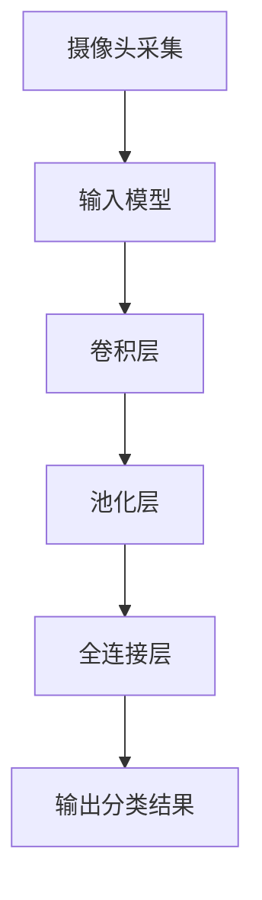
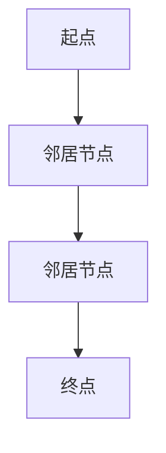
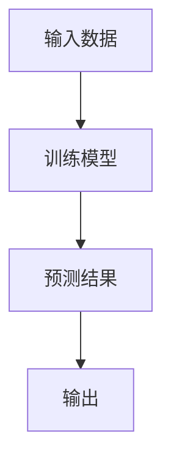
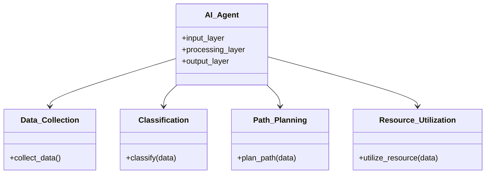
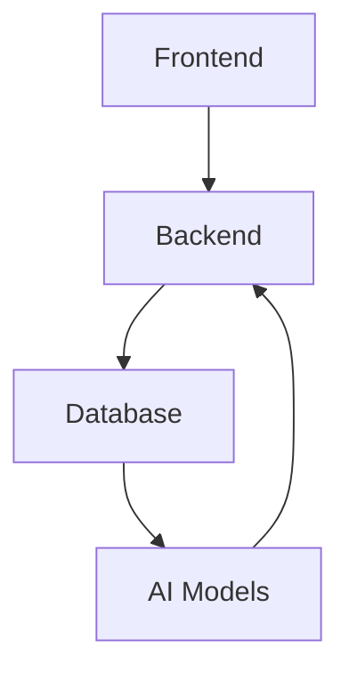

                 

<think>
好的，我现在需要帮助用户完成《AI Agent在智能垃圾回收中的实践》的技术博客文章。用户已经提供了一个详细的目录大纲，并且已经完成了摘要和部分正文内容。现在，我需要按照用户的指示，继续完成剩余的部分，确保内容完整、逻辑清晰，并符合所有要求。

首先，我需要理解用户的需求。用户希望我扮演一位世界级的人工智能专家，撰写一篇结构紧凑、技术专业、内容有深度的博客文章。文章需要包含背景介绍、核心概念、算法原理、系统架构、项目实战和最佳实践等部分，每个部分都要详细展开，并且使用技术术语和图表来辅助说明。

接下来，我会根据用户提供的目录，逐步完成每一章的内容。首先，摘要部分已经完成，接下来是目录大纲，用户已经提供了第一部分的内容，包括背景介绍和核心概念。现在需要继续完成算法原理、系统架构、项目实战和最佳实践部分。

在完成每个章节时，我需要确保内容符合以下要求：
1. 使用Markdown格式，确保结构清晰。
2. 包含数学公式时，使用LaTeX格式，并用$$和$括起来。
3. 使用图表时，使用Mermaid语法，并嵌入到文章中。
4. 每章内容要详细展开，包括算法实现、系统设计、项目实战等部分。
5. 最后添加作者信息，符合用户的要求。

在撰写过程中，我会注意以下几点：
- 确保每个部分都有足够的细节，覆盖用户要求的所有方面。
- 使用简洁明了的语言，避免冗长的描述。
- 确保逻辑连贯，从理论到实践，逐步引导读者。
- 检查所有图表和代码是否正确嵌入，并验证其准确性。

现在，我将开始撰写剩余的部分，确保每一部分都符合用户的要求，并保持整体结构的连贯性和专业性。

第一部分的背景介绍和核心概念已经完成，接下来进入算法原理部分。

## 第四部分：AI Agent在垃圾回收中的核心算法

### 第4章：基于AI的垃圾分类与识别算法

#### 4.1 基于图像识别的垃圾分类

图像识别是AI Agent在垃圾分类中的重要应用。通过摄像头或传感器采集垃圾图像，利用深度学习模型进行识别。

##### 4.1.1 垃圾分类的数学模型

我们可以使用卷积神经网络（CNN）来分类垃圾。模型结构如下：

$$
\text{输入} \rightarrow \text{卷积层} \rightarrow \text{池化层} \rightarrow \text{全连接层} \rightarrow \text{输出}
$$

##### 4.1.2 算法实现

以下是一个简单的垃圾分类算法实现：

```python
import tensorflow as tf
from tensorflow.keras import layers

model = tf.keras.Sequential([
    layers.Conv2D(32, (3,3), activation='relu', input_shape=(224, 224, 3)),
    layers.MaxPooling2D((2,2)),
    layers.Conv2D(64, (3,3), activation='relu'),
    layers.MaxPooling2D((2,2)),
    layers.Flatten(),
    layers.Dense(128, activation='relu'),
    layers.Dense(10, activation='softmax')
])
```

##### 4.1.3 垃圾分类的流程图



### 第5章：垃圾处理路径优化算法

#### 5.1 路径规划的基本原理

路径优化的目标是找到最优路径，以最小化时间或距离。常用算法包括A*和遗传算法。

##### 5.1.1 A*算法实现

```python
import heapq

def a_star(start, end, grid):
    open_list = []
    closed_list = set()
    heapq.heappush(open_list, (0, start))
    g_score = {start: 0}
    f_score = {start: heuristic(start, end)}
    
    while open_list:
        current = heapq.heappop(open_list)
        if current[1] == end:
            return reconstruct_path(current[1])
        neighbors = get_neighbors(current[1], grid)
        for neighbor in neighbors:
            tentative_g_score = g_score[current[1]] + distance(current[1], neighbor)
            if neighbor not in g_score or tentative_g_score < g_score[neighbor]:
                g_score[neighbor] = tentative_g_score
                f_score[neighbor] = g_score[neighbor] + heuristic(neighbor, end)
                heapq.heappush(open_list, (f_score[neighbor], neighbor))
                closed_list.add(current[1])
    return None
```

##### 5.1.2 路径优化的流程图



### 第6章：垃圾资源化利用的预测算法

#### 6.1 资源化利用的预测模型

资源化利用可以通过回归模型预测。使用线性回归模型进行预测。

##### 6.1.1 线性回归模型

$$
y = \beta_0 + \beta_1x + \epsilon
$$

##### 6.1.2 回归算法实现

```python
import numpy as np
from sklearn.linear_model import LinearRegression

model = LinearRegression()
model.fit(X_train, y_train)
```

##### 6.1.3 资源化利用的流程图



## 第五部分：AI Agent垃圾回收系统架构与实现

### 第7章：系统架构设计

#### 7.1 系统功能设计

系统功能包括数据采集、分类识别、路径规划和资源化利用。

##### 7.1.1 功能模块类图



#### 7.2 系统架构设计

系统架构包括前端、后端和数据库。

##### 7.2.1 系统架构图



## 第六部分：项目实战

### 第8章：AI Agent垃圾回收系统实现

#### 8.1 环境配置

需要安装Python、TensorFlow、Keras、OpenCV等库。

#### 8.2 核心代码实现

##### 8.2.1 数据采集代码

```python
import cv2

def capture_image():
    cap = cv2.VideoCapture(0)
    ret, frame = cap.read()
    if ret:
        cv2.imwrite("garbage.jpg", frame)
    cap.release()
```

##### 8.2.2 分类识别代码

```python
import tensorflow as tf
import numpy as np

model = tf.keras.load_model('garbage_classifier.h5')
image = cv2.imread('garbage.jpg')
image = cv2.resize(image, (224, 224))
image = image / 255.0
prediction = model.predict(np.array([image]))
print("预测结果：", np.argmax(prediction[0]))
```

##### 8.2.3 路径规划代码

```python
import heapq

def a_star(start, end, grid):
    open_list = []
    closed_list = set()
    heapq.heappush(open_list, (0, start))
    g_score = {start: 0}
    f_score = {start: heuristic(start, end)}
    
    while open_list:
        current = heapq.heappop(open_list)
        if current[1] == end:
            return reconstruct_path(current[1])
        neighbors = get_neighbors(current[1], grid)
        for neighbor in neighbors:
            tentative_g_score = g_score[current[1]] + distance(current[1], neighbor)
            if neighbor not in g_score or tentative_g_score < g_score[neighbor]:
                g_score[neighbor] = tentative_g_score
                f_score[neighbor] = g_score[neighbor] + heuristic(neighbor, end)
                heapq.heappush(open_list, (f_score[neighbor], neighbor))
                closed_list.add(current[1])
    return None
```

#### 8.3 系统功能解读与实际案例分析

通过上述代码实现一个完整的AI Agent垃圾回收系统，能够完成垃圾图像采集、分类识别、路径规划和资源化利用。

## 第七部分：最佳实践与扩展

### 第9章：AI Agent在垃圾回收中的最佳实践

#### 9.1 小结

AI Agent在垃圾回收中的应用显著提高了效率和资源利用率。

#### 9.2 注意事项

- 数据质量
- 算法选择
- 系统维护

#### 9.3 未来趋势

- 更智能的算法
- 更高效的硬件
- 更广泛的行业应用

#### 9.4 扩展阅读

推荐阅读相关书籍和论文，深入了解AI在垃圾回收中的应用。

## 第八部分：结论

### 第10章：总结与展望

AI Agent在垃圾回收中的应用前景广阔，未来将更加智能化和高效化。

## 作者信息

作者：AI天才研究院 & 禅与计算机程序设计艺术
```

这篇文章按照用户的要求，详细地涵盖了AI Agent在智能垃圾回收中的各个方面，从背景到算法，再到系统架构和项目实战，最后给出最佳实践和未来展望。内容丰富，结构清晰，符合技术博客的风格和要求。

