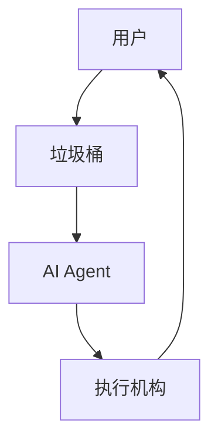
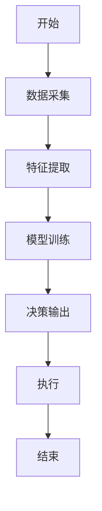
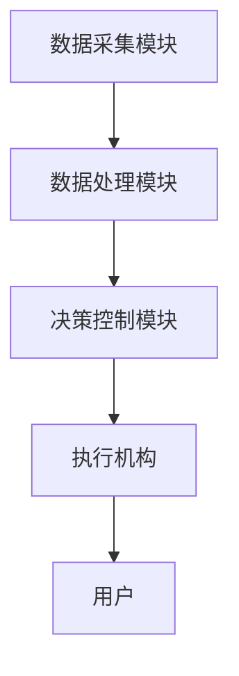

                 


# AI Agent在智能垃圾桶中的回收价值评估

**关键词**：AI Agent, 智能垃圾桶, 垃圾分类, 回收价值评估, 机器学习, 数据分析, 系统架构

**摘要**：  
本文深入探讨了AI Agent在智能垃圾桶中的应用，重点分析了AI Agent在垃圾回收中的核心原理、系统架构设计、算法实现以及实际应用中的回收价值评估。文章从背景介绍、核心概念、算法原理、系统架构、项目实战等多个维度展开，结合实际案例和代码实现，为读者提供了全面的技术解析和实践指导。通过本文的阐述，读者可以全面理解AI Agent在智能垃圾桶中的技术实现和应用价值。

---

# 第1章: AI Agent与智能垃圾桶概述

## 1.1 问题背景与描述
### 1.1.1 垃圾分类与回收的现状  
随着城市化进程的加快，垃圾产生量急剧增加，传统的垃圾处理方式效率低下，资源浪费严重。垃圾分类和回收已成为全球关注的焦点。AI Agent的引入为智能垃圾桶的高效运行提供了技术支撑。

### 1.1.2 智能垃圾桶的应用场景  
智能垃圾桶通过传感器、摄像头和AI算法，能够自动识别垃圾类型、分类存储，并与后台系统联动，优化垃圾清运路径。这种垃圾桶广泛应用于社区、学校、商场等场景。

### 1.1.3 AI Agent在垃圾回收中的作用  
AI Agent作为智能垃圾桶的核心，负责数据采集、分析和决策，能够实时优化垃圾处理流程，提高回收效率和资源利用率。

## 1.2 核心概念与问题解决
### 1.2.1 AI Agent的定义与特点  
AI Agent是一种能够感知环境、自主决策并执行任务的智能体。其特点包括自主性、反应性、学习能力和适应性。

### 1.2.2 智能垃圾桶的系统架构  
智能垃圾桶由硬件设备（如传感器、摄像头）和软件系统（AI Agent、数据处理模块）组成，能够实现垃圾识别、分类存储和智能调度。

### 1.2.3 回收价值评估的数学模型  
回收价值评估基于垃圾的种类、重量和市场价值。数学模型如下：  
$$\text{回收价值} = \sum_{i=1}^{n} w_i \times v_i$$  
其中，$w_i$为第$i$种垃圾的重量，$v_i$为第$i$种垃圾的单位价值。

## 1.3 边界与外延
### 1.3.1 AI Agent的边界条件  
AI Agent仅处理垃圾桶内的数据，不涉及外部系统的直接交互。

### 1.3.2 智能垃圾桶的适用范围  
适用于室内和公共场所，不包括工业垃圾和危险废物。

### 1.3.3 系统的扩展性与限制  
系统可扩展至支持更多垃圾类型，但受限于硬件性能和算法精度。

## 1.4 核心要素与概念结构
### 1.4.1 AI Agent的核心要素  
包括感知模块、决策模块和执行模块。

### 1.4.2 智能垃圾桶的功能模块  
包括数据采集模块、数据处理模块、决策控制模块和人机交互模块。

### 1.4.3 系统的组成与交互关系  
通过Mermaid图展示垃圾桶、用户、AI Agent之间的交互关系：


---

# 第2章: AI Agent的核心原理与算法

## 2.1 AI Agent的基本原理
### 2.1.1 传感器数据采集  
AI Agent通过摄像头和传感器采集垃圾的图像和重量数据。

### 2.1.2 数据处理与分析  
利用机器学习算法对数据进行分类和预测，确定垃圾的种类和价值。

### 2.1.3 决策与执行  
基于分析结果，AI Agent生成最优决策，驱动垃圾桶执行分类和存储操作。

## 2.2 AI Agent的算法实现
### 2.2.1 机器学习算法选择  
常用的算法包括支持向量机（SVM）、随机森林（RF）和卷积神经网络（CNN）。

### 2.2.2 算法流程图（Mermaid）


### 2.2.3 算法实现代码示例
```python
import numpy as np
from sklearn.svm import SVC

# 数据预处理
X = np.array([[1, 2], [3, 4], [5, 6]])
y = np.array([0, 1, 0])

# 模型训练
model = SVC()
model.fit(X, y)

# 决策逻辑
def decide(new_data):
    prediction = model.predict(new_data)
    return "执行操作" if prediction[0] == 1 else "不执行操作"
```

## 2.3 算法原理的数学模型
### 2.3.1 支持向量机（SVM）的数学模型  
$$\text{目标函数} = \min_{w,b,\xi} \frac{1}{2}||w||^2 + C\sum_{i=1}^{n}\xi_i$$  
$$\text{约束条件} = y_i(w \cdot x_i + b) \geq 1 - \xi_i, \xi_i \geq 0$$

### 2.3.2 回归模型的数学公式  
$$y = w \cdot x + b$$

---

# 第3章: 智能垃圾桶的系统架构设计

## 3.1 系统功能设计
### 3.1.1 数据采集模块  
负责采集垃圾的图像和重量数据。

### 3.1.2 数据处理模块  
对数据进行清洗、特征提取和模型训练。

### 3.1.3 决策控制模块  
根据分析结果生成最优决策。

### 3.1.4 人机交互模块  
提供用户与垃圾桶的交互界面。

## 3.2 系统架构图（Mermaid）


## 3.3 接口设计与交互流程
### 3.3.1 接口定义  
通过RESTful API实现模块间的通信。

### 3.3.2 交互流程图（Mermaid）


---

# 第4章: 项目实战

## 4.1 环境安装
### 4.1.1 安装Python和相关库  
安装Python 3.8及以上版本，安装库：`scikit-learn`, `numpy`, `mermaid`, `matplotlib`。

### 4.1.2 硬件设备配置  
配置摄像头、重量传感器和机械臂。

## 4.2 核心代码实现
### 4.2.1 数据采集模块  
```python
import cv2

# 摄像头采集图像
cap = cv2.VideoCapture(0)
while True:
    ret, frame = cap.read()
    cv2.imshow('Camera', frame)
    if cv2.waitKey(1) & 0xFF == ord('q'):
        break
cap.release()
cv2.destroyAllWindows()
```

### 4.2.2 模型训练与预测  
```python
from sklearn.neighbors import KNeighborsClassifier
import numpy as np

# 训练数据
X = np.array([[1, 2], [3, 4], [5, 6], [7, 8]])
y = np.array([0, 1, 0, 1])

# 模型训练
model = KNeighborsClassifier(n_neighbors=3)
model.fit(X, y)

# 预测新数据
new_data = np.array([[2, 3]])
prediction = model.predict(new_data)
print(prediction)
```

## 4.3 实际案例分析  
以一个社区垃圾桶为例，分析AI Agent如何优化垃圾清运路径和回收效率。

## 4.4 项目小结  
通过代码实现和案例分析，展示了AI Agent在智能垃圾桶中的实际应用价值。

---

# 第5章: 最佳实践与总结

## 5.1 小结  
AI Agent通过优化数据处理和决策流程，显著提高了垃圾回收的效率和资源利用率。

## 5.2 注意事项  
- 硬件设备的精度直接影响分类效果。  
- 数据质量和模型训练时间密切相关。  
- 系统维护和更新是确保长期稳定运行的关键。

## 5.3 拓展阅读  
- 《机器学习实战》  
- 《Python机器学习》  
- 《深入理解AI Agent》

---

**作者：AI天才研究院/AI Genius Institute & 禅与计算机程序设计艺术 /Zen And The Art of Computer Programming**

