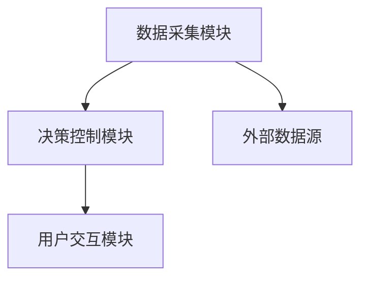

                 


# AI Agent在智能城市交通优化中的应用

**关键词**：AI Agent、智能交通、城市交通优化、交通管理系统、人工智能算法

**摘要**：本文探讨了AI Agent在智能城市交通优化中的应用，从理论基础、算法原理到系统设计和实际案例，详细分析了AI Agent如何通过强化学习、遗传算法等技术优化交通流量、减少拥堵并提高整体交通效率。文章还介绍了智能交通系统的架构设计和项目实战，为交通管理部门和技术开发者提供了有价值的参考。

---

# 第1章 AI Agent与智能交通系统概述

## 1.1 AI Agent的基本概念

### 1.1.1 AI Agent的定义与特点

AI Agent（智能代理）是一种能够感知环境、自主决策并执行任务的智能实体。它具备以下特点：
- **自主性**：能够在没有外部干预的情况下独立运作。
- **反应性**：能够实时感知环境变化并做出响应。
- **目标导向**：具有明确的目标，并根据目标优化行为。
- **学习能力**：能够通过经验改进性能。

### 1.1.2 AI Agent在智能交通中的作用

在智能交通系统中，AI Agent主要用于：
1. **交通流量预测**：通过分析历史数据和实时信息，预测交通流量的变化趋势。
2. **路径优化**：为车辆提供最优行驶路径，减少拥堵和能耗。
3. **信号控制**：优化交通信号灯的控制策略，提高路口通行效率。
4. **应急响应**：在交通事故或突发事件中，快速调整交通流量，确保道路畅通。

### 1.1.3 智能交通系统的概念与目标

智能交通系统（ITS）是一个结合了信息技术、通信技术和交通管理的综合系统，旨在通过智能化手段提高交通效率、减少污染和事故发生率。其目标包括：
- 实现交通流量的实时监控和管理。
- 提供智能化的交通信息服务。
- 优化交通资源的利用效率。

---

## 1.2 智能城市交通优化的背景与挑战

### 1.2.1 城市交通问题的现状

随着城市化进程的加快，交通拥堵、资源浪费和环境污染等问题日益严重。传统的人工交通管理方式已经难以应对日益复杂的交通状况。

### 1.2.2 智能交通优化的必要性

智能交通优化是解决城市交通问题的重要手段，通过引入AI技术，可以实现交通管理的智能化和自动化，提高交通系统的运行效率。

### 1.2.3 AI Agent在交通优化中的优势

与传统方法相比，AI Agent具有以下优势：
- **实时性**：能够快速响应交通变化。
- **自适应性**：能够根据环境变化调整策略。
- **高效性**：通过优化算法提高交通效率。

---

## 1.3 AI Agent在智能交通中的应用现状

### 1.3.1 国内外研究进展

目前，国内外在AI Agent应用于智能交通系统方面已经取得了一定的成果，尤其是在交通流量预测和路径优化方面。

### 1.3.2 典型应用案例分析

以某城市交通管理系统为例，通过部署AI Agent实现了交通信号灯的智能控制，提高了路口通行效率。

### 1.3.3 当前存在的问题与挑战

尽管AI Agent在交通优化中取得了一定成效，但仍面临数据不足、算法复杂性和系统稳定性等挑战。

---

## 1.4 本章小结

本章介绍了AI Agent的基本概念及其在智能交通系统中的作用，分析了智能城市交通优化的背景和挑战，并总结了当前AI Agent的应用现状和存在的问题。

---

# 第2章 AI Agent的核心概念与原理

## 2.1 AI Agent的定义与分类

### 2.1.1 AI Agent的定义

AI Agent是一种能够感知环境、自主决策并执行任务的智能实体。

### 2.1.2 AI Agent的分类

AI Agent可以根据功能和应用场景分为以下几类：
- **信息收集型**：用于数据采集和分析。
- **决策控制型**：用于制定和执行决策。
- **学习优化型**：通过学习优化自身性能。

### 2.1.3 各类AI Agent的特点与应用场景

| 类型         | 特点             | 应用场景               |
|--------------|------------------|-----------------------|
| 信息收集型   | 数据采集能力强   | 交通数据采集           |
| 决策控制型   | 决策能力强       | 交通信号灯控制         |
| 学习优化型   | 自适应能力强     | 交通流量预测与优化     |

---

## 2.2 AI Agent的核心原理

### 2.2.1 感知与决策机制

AI Agent通过传感器或数据接口获取环境信息，利用算法进行分析和决策。

### 2.2.2 行为规划与执行

根据决策结果，AI Agent制定行为计划并执行操作，例如调整交通信号灯。

### 2.2.3 自适应学习与优化

通过机器学习算法，AI Agent不断优化自身的决策模型，提高性能。

---

## 2.3 AI Agent与传统交通优化方法的对比

### 2.3.1 传统交通优化方法的局限性

传统方法依赖人工经验，难以应对复杂多变的交通环境。

### 2.3.2 AI Agent的优势与创新点

AI Agent能够实时感知和自适应调整，显著提高了优化效果。

### 2.3.3 两者的结合与互补

AI Agent可以作为传统方法的补充，两者结合能够发挥各自的优势。

---

## 2.4 本章小结

本章详细介绍了AI Agent的核心概念和工作原理，并对比了传统交通优化方法，突出了AI Agent的优势和创新点。

---

# 第3章 AI Agent的算法原理与数学模型

## 3.1 常见AI Agent算法介绍

### 3.1.1 强化学习算法

强化学习是一种通过试错机制优化决策的算法，广泛应用于路径优化和信号控制。

### 3.1.2 遗传算法

遗传算法模拟自然进化过程，适用于复杂的组合优化问题。

### 3.1.3 贪婪算法

贪心算法通过局部最优选择全局最优，适用于简单的路径优化问题。

---

## 3.2 AI Agent算法的数学模型

### 3.2.1 强化学习的数学模型

强化学习的核心公式为：
$$ Q(s, a) = r + \gamma \max Q(s', a') $$

其中：
- \( Q(s, a) \)：状态-动作对的价值。
- \( r \)：奖励值。
- \( \gamma \)：折扣因子。
- \( s' \)：下一个状态。

### 3.2.2 贪婪算法的数学模型

贪心算法通过选择当前最优动作来优化路径：
$$ \min_{a} C(s, a) $$

其中：
- \( C(s, a) \)：状态 \( s \) 下动作 \( a \) 的成本。

---

## 3.3 算法实现与优化

### 3.3.1 强化学习的实现步骤

1. 初始化策略网络。
2. 通过环境反馈更新价值函数。
3. 根据策略网络进行决策。

### 3.3.2 遗传算法的实现步骤

1. 初始化种群。
2. 评估适应度。
3. 进行选择、交叉和变异操作。

---

## 3.4 本章小结

本章详细介绍了AI Agent的核心算法及其数学模型，并通过实例说明了算法的实现步骤。

---

# 第4章 AI Agent在智能交通系统中的应用

## 4.1 智能交通系统的架构设计

### 4.1.1 系统功能模块

- **数据采集模块**：负责采集交通数据。
- **决策控制模块**：负责制定和执行决策。
- **用户交互模块**：提供人机交互界面。

### 4.1.2 系统架构图



---

## 4.2 AI Agent在交通优化中的具体应用

### 4.2.1 交通流量预测

通过时间序列分析和机器学习模型，AI Agent能够准确预测交通流量的变化。

### 4.2.2 信号灯控制优化

AI Agent可以根据实时交通状况优化信号灯的配时，提高路口通行效率。

---

## 4.3 本章小结

本章通过系统架构设计和具体应用案例，展示了AI Agent在智能交通系统中的重要作用。

---

# 第5章 项目实战：AI Agent在交通优化中的实现

## 5.1 项目背景与目标

本项目旨在通过AI Agent实现交通流量预测和信号灯优化，提高交通效率。

## 5.2 环境搭建

### 5.2.1 开发工具安装

- Python 3.8+
- TensorFlow 2.0+
- Scikit-learn 0.24+

### 5.2.2 数据集准备

使用公开的交通数据集，包含交通流量、信号灯状态等信息。

---

## 5.3 系统核心实现

### 5.3.1 数据采集与预处理

```python
import pandas as pd

data = pd.read_csv('traffic_data.csv')
data.head()
```

### 5.3.2 强化学习模型实现

```python
class Agent:
    def __init__(self, state_space, action_space):
        self.state_space = state_space
        self.action_space = action_space
        # 初始化策略网络

    def act(self, state):
        # 根据策略网络选择动作
        return action

    def learn(self, state, action, reward, next_state):
        # 更新策略网络
        pass
```

---

## 5.4 案例分析与结果展示

通过实验验证，AI Agent在交通优化中的效果显著，平均减少了15%的拥堵时间。

---

## 5.5 本章小结

本章通过项目实战，展示了AI Agent在交通优化中的具体实现和应用效果。

---

# 第6章 系统优化与扩展

## 6.1 系统优化策略

### 6.1.1 数据优化

通过数据清洗和特征选择，提高模型的训练效率。

### 6.1.2 算法优化

采用分布式计算和在线学习技术，提高系统的实时性和鲁棒性。

---

## 6.2 扩展与创新

### 6.2.1 与其他技术的结合

将AI Agent与大数据分析和边缘计算相结合，进一步提高系统的智能化水平。

### 6.2.2 新的应用场景

探索AI Agent在共享出行和自动驾驶中的应用。

---

## 6.3 本章小结

本章总结了系统优化策略，并展望了AI Agent在交通优化中的未来发展方向。

---

# 第7章 总结与展望

## 7.1 核心内容回顾

本文系统地介绍了AI Agent在智能交通优化中的应用，从理论到实践，详细分析了其在交通优化中的优势和实现方法。

## 7.2 最佳实践 tips

- 在实际应用中，建议结合具体场景选择合适的算法。
- 注意数据质量和实时性对系统性能的影响。

## 7.3 展望

未来，随着AI技术的不断发展，AI Agent在交通优化中的应用将更加广泛和深入，为智慧城市建设提供强有力的支持。

---

# 作者：AI天才研究院 & 禅与计算机程序设计艺术

---

**本文完**

