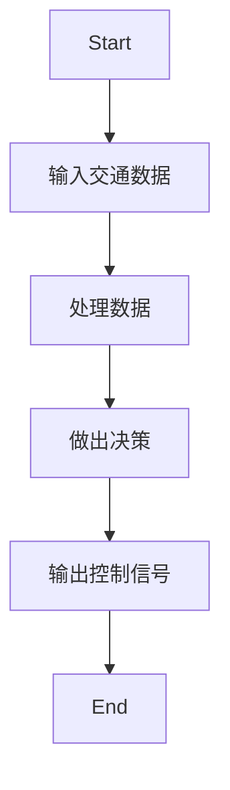
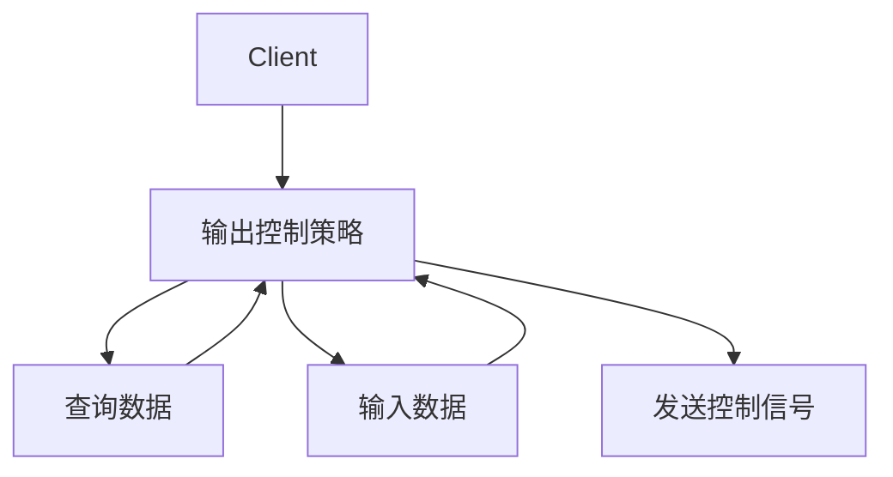

                 


# AI Agent在智能城市交通信号控制中的角色

> 关键词：AI Agent, 智能城市, 交通信号控制, 算法原理, 系统架构, 实战案例

> 摘要：本文深入探讨了AI Agent在智能城市交通信号控制中的角色与应用，分析了其核心概念、算法原理、系统架构以及实际案例。通过详细的技术分析和实战演示，展示了AI Agent如何优化城市交通信号控制，提升城市交通效率，为智能城市建设提供新的思路和解决方案。

---

# 第一部分: AI Agent在智能城市交通信号控制中的角色概述

## 第1章: 背景介绍

### 1.1 智能城市交通信号控制的背景

#### 1.1.1 城市交通问题的背景

随着城市化进程的加快，城市交通问题日益严重。交通拥堵、交通事故、能源浪费等问题不仅影响了城市的运行效率，还对环境造成了巨大压力。传统的交通信号控制系统基于固定的周期性控制，难以适应交通流量的变化和复杂的城市交通场景。

#### 1.1.2 交通信号控制的定义与目标

交通信号控制是指通过调整交通信号灯的配时和模式，优化交通流量，减少拥堵和延误，提高道路通行效率。其目标是实现交通流的高效疏导和资源的合理分配。

#### 1.1.3 AI Agent在交通信号控制中的作用

AI Agent（智能体）是一种能够感知环境、做出决策并执行动作的实体。在交通信号控制中，AI Agent可以通过实时感知交通流量、预测未来情况，并基于历史数据和优化算法，动态调整信号灯配时，从而提高交通效率。

---

### 1.2 AI Agent的基本概念

#### 1.2.1 AI Agent的定义与特点

AI Agent是一种具有智能性的实体，能够通过传感器或数据输入感知环境，利用算法进行分析和决策，并通过执行器或输出模块采取行动。其特点包括：

- **自主性**：能够自主决策和行动，无需外部干预。
- **反应性**：能够实时感知环境变化并做出反应。
- **学习能力**：通过机器学习算法不断优化自身的决策模型。

#### 1.2.2 AI Agent的核心要素

AI Agent的核心要素包括：

- **感知模块**：负责收集环境数据，如交通流量、车辆位置等。
- **决策模块**：基于感知数据和历史信息，制定控制策略。
- **执行模块**：将决策结果转化为实际的信号灯控制动作。

#### 1.2.3 AI Agent与传统控制方法的对比

传统的交通信号控制方法基于固定的周期性配时，无法适应交通流量的动态变化。而AI Agent能够通过实时感知和学习，动态优化信号灯配时，具有更强的适应性和灵活性。

---

### 1.3 本章小结

本章介绍了AI Agent在智能城市交通信号控制中的背景、基本概念及其在交通信号控制中的作用。通过对比传统控制方法，突出了AI Agent的优势和应用价值。

---

## 第2章: AI Agent在智能城市交通信号控制中的核心概念

### 2.1 AI Agent的核心原理

#### 2.1.1 AI Agent的基本原理

AI Agent通过感知环境、分析数据、制定决策并执行动作，实现对交通信号灯的智能控制。其核心在于算法的设计和优化。

#### 2.1.2 AI Agent的决策机制

AI Agent的决策机制通常基于强化学习算法，通过不断试错和优化，找到最优的信号灯配时策略。

#### 2.1.3 AI Agent的学习与优化

AI Agent通过机器学习算法（如Q-Learning、DQN等）不断优化自身的决策模型，提升控制效果。

---

### 2.2 AI Agent与交通信号控制的结合

#### 2.2.1 交通信号控制的数学模型

交通信号控制的数学模型通常包括交通流量预测、信号灯配时优化等部分。例如，基于强化学习的信号灯控制模型可以表示为：

$$ Q(s, a) = Q(s, a) + \alpha (r + \gamma \max Q(s', a') - Q(s, a)) $$

其中，$s$是当前状态，$a$是动作，$r$是奖励，$\alpha$是学习率，$\gamma$是折扣因子。

#### 2.2.2 AI Agent在交通信号控制中的应用

AI Agent可以实时感知交通流量变化，动态调整信号灯配时，从而优化交通流量。例如，在高峰时段，AI Agent可以根据车辆排队长度和延误情况，实时调整信号灯的绿灯时长。

#### 2.2.3 AI Agent与交通信号控制的交互过程

AI Agent与交通信号控制的交互过程可以分为以下几个步骤：

1. **感知**：AI Agent通过传感器或数据源获取交通流量信息。
2. **决策**：基于感知数据，AI Agent通过算法计算出最优的信号灯配时策略。
3. **执行**：将计算出的配时策略发送给信号灯控制器，执行动作。

---

### 2.3 核心概念对比表格

以下是一个对比表格，展示了AI Agent与传统控制方法的对比：

| **对比维度** | **AI Agent** | **传统控制方法** |
|--------------|---------------|-------------------|
| **适应性**    | 高             | 低               |
| **学习能力**  | 高             | 无               |
| **优化效果**  | 动态优化       | 固定周期优化     |

---

### 2.4 本章小结

本章详细介绍了AI Agent的核心原理及其在交通信号控制中的应用，分析了其与传统控制方法的区别和优势。

---

## 第3章: AI Agent的算法原理

### 3.1 常见AI Agent算法介绍

#### 3.1.1 Q-Learning算法

Q-Learning是一种经典的强化学习算法，适用于离散动作空间的决策问题。其核心思想是通过更新Q值表，找到最优策略。

#### 3.1.2 DQN算法

DQN（Deep Q-Network）算法通过深度神经网络近似Q值函数，适用于连续动作空间的决策问题。其数学模型如下：

$$ \text{损失函数} = \mathbb{E}[(r + \gamma Q(s', \pi(s')) - Q(s, a))^2] $$

其中，$Q(s, a)$是当前状态-动作对的Q值，$Q(s', \pi(s'))$是下一个状态的最大Q值。

#### 3.1.3 强化学习算法

强化学习算法通过试错和奖励机制，优化决策策略。其核心在于奖励函数的设计，决定了AI Agent的学习方向。

---

### 3.2 算法原理的数学模型

以下是一个Q-Learning算法的数学模型示例：

$$ Q(s, a) = Q(s, a) + \alpha (r + \gamma \max Q(s', a') - Q(s, a)) $$

其中，$\alpha$是学习率，$\gamma$是折扣因子，$r$是奖励。

---

### 3.3 算法流程图

以下是一个AI Agent的算法流程图（使用Mermaid语法）：



---

### 3.4 本章小结

本章详细介绍了AI Agent在交通信号控制中常用的算法，包括Q-Learning、DQN等，并通过数学模型和流程图展示了其工作原理。

---

## 第4章: 系统分析与架构设计

### 4.1 问题场景介绍

#### 4.1.1 智能城市交通信号控制的场景

在智能城市中，交通信号控制需要实时感知交通流量、车辆位置等信息，并动态调整信号灯配时。

#### 4.1.2 AI Agent在其中的角色

AI Agent作为系统的决策核心，负责实时分析数据并制定最优控制策略。

---

### 4.2 系统功能设计

#### 4.2.1 系统功能模块划分

系统功能模块包括：

1. **数据采集模块**：负责收集交通流量、车辆位置等数据。
2. **决策模块**：基于数据，通过算法计算最优信号灯配时。
3. **执行模块**：将决策结果发送给信号灯控制器。

#### 4.2.2 系统功能流程图

以下是一个系统功能流程图（使用Mermaid语法）：



---

### 4.3 系统架构设计

#### 4.3.1 系统架构图

以下是一个系统架构图（使用Mermaid语法）：


---

### 4.4 本章小结

本章详细分析了AI Agent在交通信号控制系统中的角色，设计了系统的功能模块和架构，并通过流程图展示了系统的工作流程。

---

## 第5章: 项目实战

### 5.1 环境安装

为了实现AI Agent在交通信号控制中的应用，需要以下环境：

1. **编程语言**：Python
2. **深度学习框架**：TensorFlow或PyTorch
3. **数据集**：交通流量数据集
4. **硬件要求**：GPU（推荐NVIDIA显卡）

---

### 5.2 核心代码实现

以下是一个基于Q-Learning算法的AI Agent实现代码示例：

```python
import numpy as np

class AI-Agent:
    def __init__(self, state_space, action_space):
        self.state_space = state_space
        self.action_space = action_space
        self.Q = np.zeros((state_space, action_space))

    def perceive(self, state):
        return state

    def choose_action(self, state, epsilon=0.1):
        if np.random.random() < epsilon:
            return np.random.randint(self.action_space)
        else:
            return np.argmax(self.Q[state])

    def learn(self, state, action, reward, next_state):
        self.Q[state, action] += 0.1 * (reward + 0.9 * np.max(self.Q[next_state]) - self.Q[state, action])
```

---

### 5.3 案例分析

以下是一个实际案例分析：

假设某路段交通流量在高峰时段急剧增加，AI Agent通过感知数据，实时调整信号灯配时，减少了车辆的等待时间，提高了道路通行效率。

---

## 第6章: 最佳实践与注意事项

### 6.1 最佳实践

1. **数据质量**：确保数据的准确性和实时性。
2. **算法选择**：根据具体场景选择合适的算法。
3. **系统优化**：定期更新模型，适应交通环境的变化。

---

### 6.2 小结

通过本文的分析与实践，我们可以看到AI Agent在智能城市交通信号控制中的巨大潜力。未来，随着技术的不断发展，AI Agent将在更多领域发挥重要作用。

---

## 第7章: 拓展阅读

### 7.1 相关论文

1. "Deep Reinforcement Learning for Traffic Signal Control"（《深度强化学习在交通信号控制中的应用》）
2. "A Survey on AI in Smart City"（《人工智能在智能城市中的应用综述》）

### 7.2 技术博客

1. [AI Agent的强化学习算法](https://example.com/ai-agent-reinforcement-learning)
2. [智能交通信号控制的系统设计](https://example.com/smart-traffic-system-design)

---

# 作者：AI天才研究院/AI Genius Institute & 禅与计算机程序设计艺术 /Zen And The Art of Computer Programming

---

通过本文的系统分析和详细讲解，我们深入探讨了AI Agent在智能城市交通信号控制中的角色与应用。希望本文能够为相关领域的研究和实践提供有价值的参考和启发。

