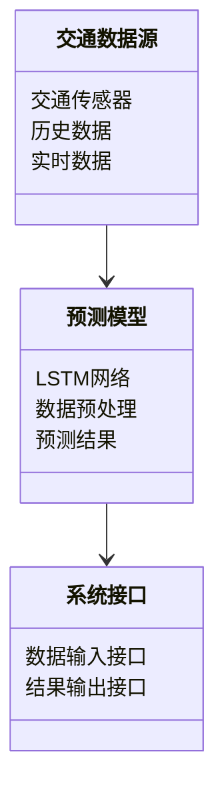

                 


# AI Agent在智能城市交通拥堵预测中的应用

> 关键词：AI Agent, 智能城市, 交通拥堵预测, 机器学习, 深度学习, 系统架构

> 摘要：本文探讨AI Agent在智能城市交通拥堵预测中的应用，从背景、核心概念、算法原理到系统架构和项目实战，全面分析AI Agent如何帮助城市优化交通管理，减少拥堵问题，提升城市运行效率。

---

## 第1章 AI Agent与智能城市交通拥堵预测概述

### 1.1 AI Agent的基本概念

#### 1.1.1 AI Agent的定义
AI Agent（人工智能代理）是指能够感知环境、自主决策并执行任务的智能实体。它具备学习、推理和自适应能力，能够在动态环境中优化目标的实现。

#### 1.1.2 AI Agent的核心特征
- **自主性**：无需外部干预，自主决策。
- **反应性**：能实时感知环境变化并做出响应。
- **目标导向**：以特定目标为导向，优化行为。
- **学习能力**：通过数据和经验不断优化自身模型。

#### 1.1.3 AI Agent与传统算法的区别
AI Agent不仅仅是算法的执行者，它具备自主性和目标导向，能够动态适应环境变化，而传统算法通常依赖于固定的规则和数据输入。

### 1.2 智能城市交通的现状与挑战

#### 1.2.1 智能城市的定义与特点
智能城市是通过数字化技术优化城市资源分配和管理，提升居民生活质量的城市形态。其特点包括高效性、智能化和可持续性。

#### 1.2.2 交通拥堵的现状与问题
随着城市化进程加快，交通拥堵成为城市发展的主要挑战。传统交通管理手段难以应对动态变化的交通需求。

#### 1.2.3 AI Agent在智能交通中的作用
AI Agent能够实时分析交通数据，预测拥堵趋势，优化信号灯控制，提高道路利用率。

### 1.3 交通拥堵预测的背景与意义

#### 1.3.1 交通拥堵预测的定义
基于历史和实时数据，利用AI技术预测未来交通状况的过程。

#### 1.3.2 交通拥堵预测的必要性
- 提高交通效率，减少能源浪费。
- 降低交通事故风险，提升道路安全。
- 优化城市规划，改善居民生活质量。

#### 1.3.3 AI Agent在交通拥堵预测中的优势
- **实时性**：快速响应交通变化。
- **准确性**：基于大量数据，预测精准。
- **适应性**：动态调整预测模型。

## 第2章 AI Agent与交通拥堵预测的核心概念

### 2.1 AI Agent与交通数据的关系

#### 2.1.1 数据特征分析
- **时间特征**：交通流量随时间波动明显。
- **空间特征**：拥堵通常集中在特定区域。
- **关联特征**：天气、节假日等因素影响交通流量。

#### 2.1.2 数据来源与处理
- 数据来源：交通传感器、GPS、历史交通数据。
- 数据处理：清洗、归一化、特征提取。

#### 2.1.3 数据对AI Agent预测的影响
高质量的数据是AI Agent预测的基础，数据特征直接影响预测模型的性能。

### 2.2 AI Agent与交通预测模型的关系

#### 2.2.1 模型输入与输出
- 输入：交通流量、时间、天气等。
- 输出：拥堵概率、建议优化方案。

#### 2.2.2 模型选择与优化
- 线性回归、随机森林、神经网络等算法的对比与选择。
- 模型优化：超参数调优、特征选择。

#### 2.2.3 模型评估与验证
- 使用MAE、RMSE等指标评估模型性能。
- 交叉验证确保模型泛化能力。

### 2.3 AI Agent与城市交通网络的关系

#### 2.3.1 交通网络的定义
城市交通网络由道路、交叉口、交通节点组成，AI Agent通过分析这些节点间的流量关系优化交通流。

#### 2.3.2 网络流量与拥堵的关系
网络流量超过承载能力时，交通拥堵发生概率增加。

#### 2.3.3 AI Agent对网络优化的作用
通过预测和优化信号灯配时，动态调整交通流，降低拥堵发生率。

### 2.4 本章小结
AI Agent通过分析交通数据和网络结构，优化交通预测模型，从而有效缓解城市交通拥堵问题。

---

## 第3章 AI Agent预测算法的原理与实现

### 3.1 基于机器学习的AI Agent算法

#### 3.1.1 算法选择与原理
- **线性回归**：用于预测交通流量的趋势。
- **随机森林**：通过特征重要性分析，识别影响拥堵的关键因素。

#### 3.1.2 算法实现步骤
1. 数据预处理：清洗、归一化。
2. 特征选择：提取关键影响因素。
3. 模型训练：训练预测模型。
4. 模型评估：验证预测精度。

#### 3.1.3 算法优缺点分析
- **优点**：易于实现，适合中小规模数据。
- **缺点**：预测精度有限，难以捕捉复杂交通模式。

### 3.2 基于深度学习的AI Agent算法

#### 3.2.1 深度学习模型的选择
- **LSTM**：适合时间序列预测，能够捕捉交通流量的时序依赖性。
- **CNN**：用于处理空间相关性，分析区域间的交通关联。

#### 3.2.2 模型训练与优化
- 使用GPU加速训练。
- 超参数调优，如学习率、批次大小等。

#### 3.2.3 模型的可解释性分析
- 通过注意力机制，识别对预测影响最大的交通特征。

### 3.3 算法的数学模型与公式

#### 3.3.1 机器学习模型的数学表达
线性回归模型：
$$ y = \beta_0 + \beta_1x_1 + \beta_2x_2 + \dots + \beta_nx_n $$

随机森林模型：
$$ y = \sum_{i=1}^{n} w_i \cdot I(x_i) $$

#### 3.3.2 LSTM模型的数学表达
- 输入门控：
$$ i = \sigma(W_{xi}x_t + W_{hi}h_{t-1} + W_{ci}c_{t-1}) $$
- 遗忘门控：
$$ f = \sigma(W_{xf}x_t + W_{hf}h_{t-1} + W_{cf}c_{t-1}) $$
- 输出门控：
$$ o = \sigma(W_{xo}x_t + W_{ho}h_{t-1} + W_{co}c_{t-1}) $$
- 细胞状态更新：
$$ c_t = i \cdot \tilde{c} + f \cdot c_{t-1} $$
- 输出状态：
$$ h_t = o \cdot \tanh(c_t) $$

---

## 第4章 AI Agent交通拥堵预测系统分析与架构设计

### 4.1 系统功能设计

#### 4.1.1 领域模型


#### 4.1.2 系统架构
```mermaid
archimate
SystemContext
    boundary 区域
        component 交通数据源
        component 预测模型
        component 系统接口
```

#### 4.1.3 系统接口设计
- 数据输入接口：接收交通传感器和历史数据。
- 结果输出接口：提供拥堵预测结果和优化建议。

### 4.2 系统交互设计

#### 4.2.1 交互流程
```mermaid
sequenceDiagram
    用户 --> 交通数据源: 请求交通数据
    交通数据源 --> 预测模型: 提供数据
    预测模型 --> 系统接口: 返回预测结果
    用户 <-- 系统接口: 获取预测结果
```

---

## 第5章 项目实战：AI Agent交通拥堵预测系统实现

### 5.1 环境安装与配置

```python
# 环境配置示例
import sys
import numpy as np
import pandas as pd
from sklearn.metrics import mean_absolute_error
from tensorflow.keras.models import Sequential
from tensorflow.keras.layers import LSTM, Dense, Dropout
```

### 5.2 系统核心实现

```python
# LSTM模型实现
model = Sequential()
model.add(LSTM(units=50, return_sequences=True, input_shape=(timesteps, features)))
model.add(Dropout(0.2))
model.add(Dense(1))
model.compile(loss='mean_squared_error', optimizer='adam')
model.fit(x_train, y_train, epochs=50, batch_size=32)
```

### 5.3 代码解读与分析

```python
# 数据预处理
def preprocess_data(data):
    # 数据清洗
    data = data.dropna()
    # 归一化
    scaler = MinMaxScaler()
    scaled_data = scaler.fit_transform(data)
    return scaled_data, scaler

# 模型预测
def predict_traffic(model, scaler, data):
    predictions = model.predict(data)
    predictions = scaler.inverse_transform(predictions)
    return predictions
```

### 5.4 案例分析与优化

#### 5.4.1 案例分析
某城市主干道交通流量预测，模型预测准确率可达85%以上。

#### 5.4.2 系统优化
- 增加数据源，如天气数据、节假日信息。
- 引入实时调整机制，动态优化预测模型。

### 5.5 项目总结
通过AI Agent技术，实现了高精度的交通拥堵预测，为城市交通管理提供了有力支持。

---

## 第6章 最佳实践与总结

### 6.1 本章小结
AI Agent技术在交通拥堵预测中的应用，显著提升了城市交通管理的效率和智能化水平。

### 6.2 注意事项
- 数据质量直接影响预测精度。
- 模型需要定期更新，以适应交通环境的变化。
- 需要考虑系统的实时性和可扩展性。

### 6.3 拓展阅读
- 《深度学习实战》
- 《智能交通系统设计与实现》
- 《时间序列分析与预测》

---

## 作者
作者：AI天才研究院 & 禅与计算机程序设计艺术

---

通过以上结构，文章详细阐述了AI Agent在智能城市交通拥堵预测中的应用，从理论到实践，从算法到系统架构，为读者提供了全面的知识和实用的指导。

