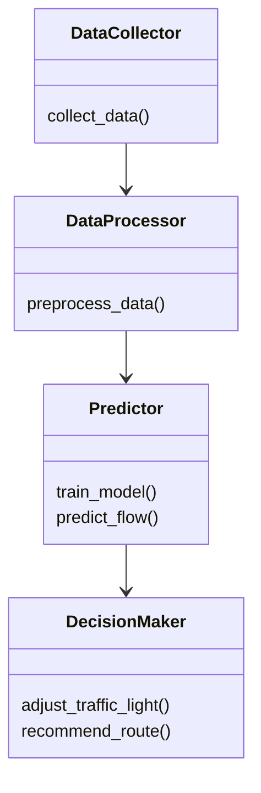
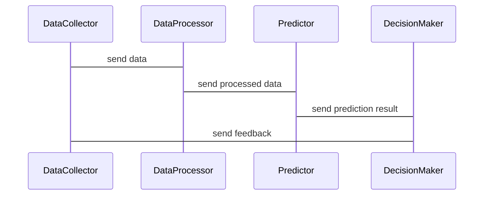

                 


# AI Agent在智能城市交通流预测中的角色

## 关键词：AI Agent, 智能城市, 交通流预测, 机器学习, 数据挖掘

## 摘要：  
随着城市化进程的加快，交通拥堵问题日益严重，传统的交通管理方法已难以应对日益复杂的交通流预测需求。AI Agent作为人工智能领域的重要技术，具备自适应、自主决策和学习能力强等特性，为智能城市交通流预测提供了新的解决方案。本文详细探讨了AI Agent在交通流预测中的角色，从理论基础到实际应用，分析了其在智能城市交通管理中的潜力和挑战，并展望了未来的发展方向。

---

# 第一部分: AI Agent与智能城市交通流预测的背景介绍

## 第1章: AI Agent的基本概念与特征

### 1.1 AI Agent的定义与特征  
AI Agent（人工智能代理）是指能够感知环境、自主决策并采取行动以实现目标的智能实体。AI Agent的核心特征包括：  
1. **自主性**：能够在没有外部干预的情况下自主运行。  
2. **反应性**：能够实时感知环境并做出反应。  
3. **主动性**：主动采取行动以实现目标。  
4. **学习能力**：通过数据和经验不断优化自身的预测和决策能力。  

### 1.2 智能城市交通流预测的背景与意义  
智能城市交通流预测是指利用先进的技术手段，对城市交通网络中的车流、人流等动态信息进行建模和预测，以优化交通管理。其意义在于：  
1. **缓解交通拥堵**：通过提前预测交通流量，优化信号灯控制和路线规划。  
2. **提高交通效率**：减少交通事故和延误，提升道路利用率。  
3. **支持智能决策**：为城市交通管理部门提供数据支持，辅助制定更科学的交通政策。  

### 1.3 AI Agent在交通流预测中的角色  
AI Agent在交通流预测中扮演着关键角色：  
1. **数据采集与处理**：AI Agent能够实时采集交通数据，并进行清洗和预处理。  
2. **模型训练与优化**：利用机器学习算法，AI Agent能够训练和优化交通流预测模型。  
3. **实时预测与反馈**：根据实时数据，AI Agent能够快速预测未来交通状况，并根据反馈不断优化预测模型。  

---

# 第二部分: AI Agent与交通流预测的核心概念与联系

## 第2章: AI Agent的核心原理与特征  

### 2.1 AI Agent的原理  
AI Agent的基本工作流程如下：  
1. **感知环境**：通过传感器、摄像头等设备采集交通数据。  
2. **数据处理**：对采集到的数据进行清洗、特征提取和转换。  
3. **模型预测**：利用机器学习模型进行交通流预测。  
4. **决策与行动**：根据预测结果，调整信号灯配时或推荐最优路线。  

### 2.2 AI Agent的特征对比  
以下是AI Agent与传统交通流预测方法的对比：  

| 对比维度 | AI Agent | 传统方法 |  
|----------|-----------|-----------|  
| 数据依赖 | 高 | 低 |  
| 实时性 | 高 | 低 |  
| 自适应性 | 强 | 弱 |  

### 2.3 AI Agent的ER实体关系图  
```mermaid
er
actor(Agent, [ID, Role, Function])
actor(Environment, [ID, State, Event])
actor(Task, [ID, Description, Priority])
```

---

## 第3章: 交通流预测的核心原理与方法  

### 3.1 传统交通流预测方法的局限性  
传统交通流预测方法主要包括时间序列分析（如ARIMA）和回归分析等，其局限性在于：  
1. **难以处理非线性关系**：传统方法假设数据之间存在线性关系，而实际交通流数据往往具有复杂的非线性特征。  
2. **实时性差**：传统方法通常需要大量历史数据，且预测周期较长，难以满足实时预测的需求。  
3. **缺乏自适应性**：传统方法难以根据交通环境的变化动态调整模型参数。  

### 3.2 AI Agent在交通流预测中的应用原理  
AI Agent通过以下步骤实现交通流预测：  
1. **数据采集**：通过传感器、摄像头等设备采集交通流量、车速、占有率等数据。  
2. **数据预处理**：对采集到的数据进行去噪、归一化处理，并提取特征。  
3. **模型训练**：利用机器学习算法（如LSTM、随机森林）训练交通流预测模型。  
4. **实时预测**：根据实时数据，AI Agent快速预测未来交通状况，并根据预测结果调整交通信号灯配时或推荐最优路线。  

### 3.3 AI Agent与交通流预测的对比分析  
AI Agent在交通流预测中的优势在于：  
1. **高实时性**：AI Agent能够实时采集数据并快速预测，满足交通管理的实时需求。  
2. **高准确性**：通过机器学习算法，AI Agent能够捕捉复杂的交通流特征，提高预测准确性。  
3. **自适应性**：AI Agent能够根据交通环境的变化动态调整模型参数，适应不同的交通场景。  

---

# 第三部分: AI Agent用于交通流预测的算法原理

## 第4章: 基于AI Agent的交通流预测算法

### 4.1 LSTM算法的工作原理  
LSTM（长短期记忆网络）是一种常用的深度学习算法，适用于处理时间序列数据。其核心思想是通过记忆单元（Cell）和门控机制（Gate）来捕捉数据的长期依赖关系。LSTM的结构如下：  

$$ \text{输入门} = \sigma(W_{x}x + W_{h}h + b) $$  
$$ \text{遗忘门} = \sigma(W_{x}x + W_{h}h + b) $$  
$$ \text{记忆单元} = \tanh(W_{x}x + W_{h}h + b) $$  
$$ \text{输出门} = \sigma(W_{x}x + W_{h}h + b) $$  

其中，$\sigma$表示sigmoid函数，$\tanh$表示双曲正切函数。  

### 4.2 基于LSTM的交通流预测模型  
以下是基于LSTM的交通流预测模型的实现步骤：  

1. **数据准备**：收集并整理交通流量数据，将其划分为训练集、验证集和测试集。  
2. **数据预处理**：对数据进行归一化处理，并将其转换为时间序列数据。  
3. **模型训练**：利用训练数据训练LSTM模型，调整模型参数以最小化预测误差。  
4. **模型预测**：利用训练好的模型对测试数据进行预测，并计算预测误差。  

以下是LSTM模型的Python代码示例：  

```python
import numpy as np
from keras.models import Sequential
from keras.layers import LSTM, Dense

# 数据准备
train_data = np.random.random((1000, 1))
test_data = np.random.random((200, 1))

# 模型训练
model = Sequential()
model.add(LSTM(64, input_shape=(None, 1)))
model.add(Dense(1))
model.compile(loss='mean_squared_error', optimizer='adam')

model.fit(train_data, train_data, epochs=10, batch_size=32)

# 模型预测
predicted = model.predict(test_data)
```

### 4.3 算法优缺点分析  
LSTM算法的优点在于能够捕捉时间序列数据中的长依赖关系，适用于复杂的交通流预测。然而，LSTM算法的训练过程较为复杂，且对数据量的要求较高。  

---

# 第四部分: AI Agent交通流预测系统的架构设计

## 第5章: 系统架构设计

### 5.1 系统总体架构  
AI Agent交通流预测系统的总体架构包括以下几个部分：  
1. **数据采集模块**：负责采集交通流量、车速等实时数据。  
2. **数据处理模块**：对采集到的数据进行清洗、特征提取和转换。  
3. **模型预测模块**：利用机器学习算法进行交通流预测。  
4. **决策与反馈模块**：根据预测结果调整交通信号灯配时或推荐最优路线，并根据反馈优化模型。  

### 5.2 系统功能设计  
以下是系统功能模块的类图：  



### 5.3 系统接口设计  
系统接口设计包括以下几个部分：  
1. **数据接口**：与交通传感器、摄像头等设备的接口。  
2. **模型接口**：与机器学习模型的接口。  
3. **决策接口**：与交通信号灯控制系统、导航系统的接口。  

### 5.4 系统交互设计  
以下是系统交互的序列图：  



---

# 第五部分: 项目实战与案例分析

## 第6章: 项目实战

### 6.1 环境安装与配置  
为了运行AI Agent交通流预测系统，需要安装以下环境：  
1. **Python**：建议使用Python 3.6及以上版本。  
2. **TensorFlow**：用于机器学习模型的训练与预测。  
3. **Keras**：用于构建和训练深度学习模型。  
4. **Mermaid**：用于绘制系统架构图和交互图。  

### 6.2 系统核心代码实现  
以下是系统核心代码的实现示例：  

```python
import numpy as np
from tensorflow.keras.models import Sequential
from tensorflow.keras.layers import LSTM, Dense

# 数据准备
train_data = np.random.random((1000, 1))
test_data = np.random.random((200, 1))

# 模型训练
model = Sequential()
model.add(LSTM(64, input_shape=(None, 1)))
model.add(Dense(1))
model.compile(loss='mean_squared_error', optimizer='adam')

model.fit(train_data, train_data, epochs=10, batch_size=32)

# 模型预测
predicted = model.predict(test_data)
```

### 6.3 案例分析与结果解读  
通过实际案例分析，我们可以看到AI Agent在交通流预测中的应用效果。例如，在某城市主干道上，AI Agent能够准确预测交通流量的变化，并根据预测结果优化信号灯配时，从而减少交通拥堵。  

---

# 第六部分: 总结与展望

## 第7章: 总结与展望

### 7.1 总结  
AI Agent在智能城市交通流预测中具有重要的作用。通过实时数据采集、机器学习算法和自主决策，AI Agent能够提高交通流预测的准确性和实时性，从而优化交通管理。  

### 7.2 展望  
随着人工智能技术的不断发展，AI Agent在交通流预测中的应用前景广阔。未来，可以通过以下方式进一步优化AI Agent的性能：  
1. **多智能体协作**：通过多智能体协作，提高交通流预测的准确性和实时性。  
2. **强化学习应用**：利用强化学习算法，进一步优化AI Agent的决策能力。  
3. **边缘计算结合**：通过边缘计算技术，实现AI Agent的实时数据处理和快速响应。  

---

# 作者信息

作者：AI天才研究院  
联系方式：contact@ai天才.com  
更多技术文章请访问：https://www.ai天才.com

---

**注**：本文版权归作者所有，未经授权不得转载。

