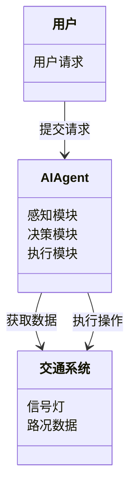

                 


# AI Agent在智能城市交通规划中的角色

> 关键词：AI Agent，智能城市，交通规划，强化学习，多智能体协作，系统架构

> 摘要：本文探讨了AI Agent在智能城市交通规划中的核心作用，分析了其在数据采集、交通预测、路径优化等方面的应用，并详细讲解了其算法原理与系统架构。通过实际案例分析，展示了AI Agent如何提升城市交通效率，并提供了最佳实践建议。

---

## 第一章: AI Agent的基本概念与作用

### 1.1 AI Agent的定义与特点

#### 1.1.1 AI Agent的基本定义
AI Agent（人工智能代理）是一种能够感知环境、自主决策并采取行动的智能实体。它能够通过传感器获取数据，利用算法进行分析，并根据结果执行操作，以实现特定目标。

#### 1.1.2 AI Agent的核心特点
- **自主性**：AI Agent能够在没有外部干预的情况下自主运行。
- **反应性**：能够实时感知环境变化并做出反应。
- **学习能力**：通过机器学习算法不断优化自身行为。
- **协作性**：能够与其他AI Agent或系统协同工作，完成复杂任务。

#### 1.1.3 AI Agent与传统交通规划的区别
传统的交通规划主要依赖人工分析和静态数据，而AI Agent能够实时处理动态数据，快速调整规划方案。

---

### 1.2 智能城市交通规划的现状与挑战

#### 1.2.1 智能城市交通规划的背景
随着城市化进程的加快，交通拥堵、资源浪费等问题日益突出。AI Agent的引入为解决这些问题提供了新的思路。

#### 1.2.2 当前交通规划中的主要问题
- **交通拥堵**：道路资源利用不均，高峰期交通压力大。
- **资源浪费**：车辆空驶率高，能源浪费严重。
- **信息滞后**：传统交通规划依赖于历史数据，难以应对实时变化。

#### 1.2.3 AI Agent在智能交通中的潜在价值
- 提高交通系统的实时响应能力。
- 优化资源配置，降低能源消耗。
- 提升用户体验，减少出行时间。

---

## 第二章: AI Agent在智能交通中的角色与应用

### 2.1 AI Agent在交通规划中的核心作用

#### 2.1.1 数据采集与分析
AI Agent通过传感器、摄像头等设备实时采集交通数据，利用大数据技术进行分析，为决策提供支持。

#### 2.1.2 交通预测与优化
基于历史数据和实时信息，AI Agent能够预测交通流量变化，优化信号灯配时，减少拥堵。

#### 2.1.3 路径规划与导航
AI Agent可以根据实时路况为用户规划最优路径，避免拥堵路段，提高出行效率。

---

### 2.2 AI Agent与其他技术的协同

#### 2.2.1 与大数据技术的协同
大数据技术为AI Agent提供了海量的交通数据，AI Agent则通过分析这些数据优化交通规划。

#### 2.2.2 与云计算的结合
云计算为AI Agent提供了强大的计算能力，支持实时数据分析和决策。

#### 2.2.3 与物联网的集成
物联网技术为AI Agent提供了实时的环境感知能力，使其能够更精准地进行交通规划。

---

### 2.3 智能交通规划中的AI Agent应用案例

#### 2.3.1 智能交通信号灯控制
通过AI Agent实时分析交通流量，动态调整信号灯配时，减少等待时间。

#### 2.3.2 智能停车管理
AI Agent通过实时监控停车场 occupancy，引导车辆快速找到空闲停车位。

#### 2.3.3 智能交通路径优化
根据实时路况为用户提供最优路径，避免拥堵路段。

---

## 第三章: AI Agent的核心概念与原理

### 3.1 AI Agent的结构与组成

#### 3.1.1 知识库
知识库存储AI Agent所需的所有信息，包括交通规则、地图数据等。

#### 3.1.2 感知模块
感知模块通过传感器获取环境信息，如交通流量、天气状况等。

#### 3.1.3 决策模块
决策模块基于感知信息和知识库进行分析，生成决策方案。

#### 3.1.4 执行模块
执行模块将决策方案转化为具体行动，如调整信号灯配时。

---

### 3.2 AI Agent的决策机制

#### 3.2.1 基于规则的决策
基于预设规则进行决策，适用于简单场景。

#### 3.2.2 基于机器学习的决策
通过机器学习模型进行预测和决策，适用于复杂场景。

#### 3.2.3 基于强化学习的决策
通过强化学习不断优化决策策略，提升整体性能。

---

### 3.3 多AI Agent协作机制

#### 3.3.1 分层协作
不同层次的AI Agent协同工作，如高层负责整体规划，低层负责具体执行。

#### 3.3.2

---

## 第四章: AI Agent的算法原理

### 4.1 强化学习算法

#### 4.1.1 强化学习的基本原理
强化学习通过试错机制不断优化决策策略，适用于动态环境下的交通规划。

#### 4.1.2 强化学习的应用场景
- 交通信号灯控制
- 路径规划
- 车流优化

#### 4.1.3 强化学习的数学模型
$$ Q-learning 算法的数学表达式为：Q(s, a) = Q(s, a) + \alpha [r + \gamma \max Q(s', a') - Q(s, a)] $$

---

### 4.2 遗传算法

#### 4.2.1 遗传算法的基本原理
遗传算法通过模拟自然选择和遗传机制，优化解空间中的解。

#### 4.2.2 遗传算法的应用场景
- 路径优化
- 车流分配

#### 4.2.3 遗传算法的实现步骤
1. 初始化种群
2. 计算适应度
3. 选择
4. 交叉
5. 变异

---

## 第五章: AI Agent的系统分析与架构设计

### 5.1 问题场景介绍

#### 5.1.1 交通拥堵问题
某城市中心区域交通流量大，信号灯配时不合理，导致拥堵。

#### 5.1.2 停车难问题
市中心停车场资源紧张，用户停车困难。

#### 5.1.3 出行效率问题
用户出行时间长，路径规划不合理。

---

### 5.2 系统功能设计

#### 5.2.1 领域模型


#### 5.2.2 系统架构


---

## 第六章: AI Agent的项目实战

### 6.1 环境安装

#### 6.1.1 安装Python
```bash
python --version
pip install --upgrade pip
```

#### 6.1.2 安装依赖库
```bash
pip install numpy
pip install scikit-learn
pip install matplotlib
```

---

### 6.2 核心代码实现

#### 6.2.1 强化学习实现
```python
import numpy as np
import random

class AI-Agent:
    def __init__(self, state_space, action_space):
        self.state_space = state_space
        self.action_space = action_space
        self.Q = np.zeros((state_space, action_space))

    def act(self, state):
        if random.random() < 0.1:
            return random.randint(0, self.action_space-1)
        else:
            return np.argmax(self.Q[state, :])

    def learn(self, state, action, reward, next_state):
        self.Q[state, action] = self.Q[state, action] + 0.1 * (reward + 0.9 * np.max(self.Q[next_state, :]) - self.Q[state, action])
```

#### 6.2.2 应用解读
上述代码实现了一个简单的Q-learning算法，用于交通信号灯控制。AI Agent根据当前状态选择动作，并通过强化学习不断优化策略。

---

## 第七章: 最佳实践

### 7.1 小结
AI Agent在智能城市交通规划中的应用前景广阔，能够显著提升交通效率，降低资源浪费。

### 7.2 注意事项
- 数据质量是关键，确保实时数据的准确性和及时性。
- 系统安全性必须重视，防止恶意攻击。
- 算法优化需要持续投入，应对复杂的交通场景。

### 7.3 拓展阅读
- 《强化学习导论》
- 《分布式系统：概念与设计》

---

作者：AI天才研究院 & 禅与计算机程序设计艺术

