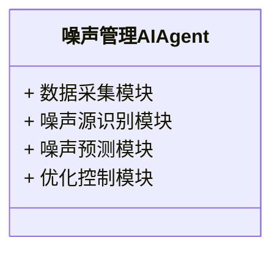
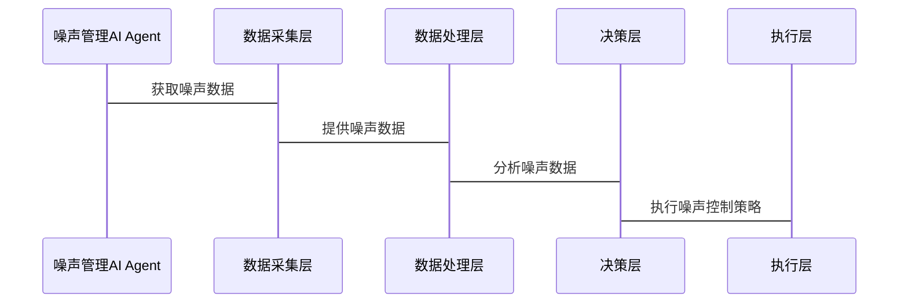

                 


# AI Agent在智能城市噪声管理中的实践

> 关键词：AI Agent，智能城市，噪声管理，强化学习，深度学习，系统架构

> 摘要：随着智能城市的快速发展，噪声污染问题日益严重，传统的噪声管理方法已难以应对复杂的环境挑战。本文将详细探讨AI Agent在智能城市噪声管理中的实践应用，从背景、核心概念、算法原理到系统架构设计、项目实战，系统地分析AI Agent如何帮助城市实现更高效的噪声管理。通过本文的讲解，读者将能够深入了解AI Agent在噪声管理中的核心原理和实际应用，为未来的智能化城市环境管理提供参考。

---

# 第一部分: AI Agent在智能城市噪声管理中的背景与基础

## 第1章: 智能城市噪声管理的背景与挑战

### 1.1 智能城市的定义与发展
智能城市是指通过利用信息和通信技术（ICT）来优化城市资源的利用效率，提升城市居民的生活质量，同时减少对环境的负担。智能城市的核心目标是实现城市的可持续发展，包括交通、能源、环境、公共安全等多个方面。

智能城市的发展可以追溯到20世纪末，但真正的大规模发展始于21世纪初。随着物联网（IoT）、大数据、人工智能（AI）等技术的快速发展，智能城市的建设进入了快车道。城市管理者通过智能化的手段，可以更高效地处理城市中的各种问题，包括噪声污染。

### 1.2 城市噪声管理的现状与挑战
城市噪声污染是智能城市建设中一个不可忽视的问题。随着城市化进程的加快，交通、工业、建筑等领域的噪声源不断增加，噪声污染对居民的生活质量、健康甚至心理健康都产生了负面影响。

#### 当前城市噪声管理的主要问题
1. **噪声源复杂多样**：城市中的噪声来源包括交通噪声、工业噪声、建筑噪声等，且这些噪声源分布广泛、难以集中管理。
2. **传统管理手段的局限性**：传统的噪声管理方法主要依赖于人工监测和简单的物理手段，效率低、覆盖范围有限。
3. **数据孤岛问题**：不同部门、不同系统之间的数据难以共享和整合，导致噪声管理缺乏全局性。

#### 噪声污染的来源分析
1. **交通噪声**：汽车、公交车、地铁等交通工具在运行过程中产生的噪声。
2. **工业噪声**：工厂生产线、机械设备运行等产生的噪声。
3. **建筑噪声**：建筑施工、装修等过程中产生的噪声。
4. **生活噪声**：居民生活中的娱乐活动、宠物叫声等。

#### 噪声管理的技术与政策难点
1. **技术难点**：如何高效采集、处理和分析噪声数据，如何实现噪声源的智能识别与定位。
2. **政策难点**：噪声管理涉及多个部门和政策法规，如何协调各方利益，制定有效的噪声管理政策是一个挑战。

### 1.3 AI Agent在城市噪声管理中的应用背景
AI Agent（人工智能代理）是一种能够感知环境、自主决策并采取行动的智能实体。AI Agent在智能城市中的应用可以显著提升城市资源的利用效率和城市管理的智能化水平。

#### AI Agent的定义与分类
AI Agent可以根据智能水平、应用场景等进行分类：
1. **简单反射型Agent**：基于固定的规则对输入做出反应，适用于简单的决策任务。
2. **基于模型的反射型Agent**：通过构建环境模型来实现更复杂的决策。
3. **目标驱动型Agent**：基于明确的目标采取行动，适用于需要优化的任务。
4. **效用驱动型Agent**：通过最大化效用函数来实现目标，适用于复杂的优化问题。

#### AI Agent在智能城市中的应用领域
AI Agent在智能城市中的应用领域非常广泛，包括交通管理、能源优化、公共安全、环境保护等。在噪声管理中，AI Agent可以用于噪声源识别、噪声预测、噪声优化等多个方面。

#### 噪声管理中引入AI Agent的意义
引入AI Agent可以显著提升噪声管理的效率和效果：
1. **实时监测与分析**：通过AI Agent实时采集、分析噪声数据，实现对噪声源的快速识别与定位。
2. **智能决策与优化**：基于AI Agent的智能决策能力，可以实现噪声源的最优控制策略。
3. **全局优化**：通过AI Agent的全局视角，实现城市范围内噪声的综合管理。

### 1.4 本章小结
本章主要介绍了智能城市的定义与发展、城市噪声管理的现状与挑战，以及AI Agent在城市噪声管理中的应用背景。通过本章的讲解，读者可以了解噪声管理在智能城市建设中的重要性，以及AI Agent在其中的独特优势。

---

## 第2章: AI Agent与智能城市噪声管理的核心概念

### 2.1 AI Agent的基本原理
AI Agent的核心原理是通过感知环境、自主决策并采取行动来实现特定目标。AI Agent的智能水平取决于其感知能力、推理能力、学习能力和执行能力。

#### AI Agent的核心特征
1. **自主性**：AI Agent能够在没有外部干预的情况下自主运行。
2. **反应性**：AI Agent能够实时感知环境并做出反应。
3. **目标驱动**：AI Agent的行为通常是为了实现特定目标。
4. **学习能力**：AI Agent可以通过学习不断优化自身的决策能力。

#### AI Agent与传统自动化的区别
| 特性 | AI Agent | 传统自动化 |
|------|----------|------------|
| 智能水平 | 高 | 低 |
| 决策能力 | 强 | 弱 |
| 自适应能力 | 强 | 较弱 |

### 2.2 AI Agent在噪声管理中的系统架构
AI Agent在噪声管理中的系统架构包括以下几个关键部分：
1. **数据采集模块**：负责采集城市中的噪声数据。
2. **噪声源识别模块**：通过对噪声数据的分析，识别噪声源的位置和类型。
3. **噪声预测模块**：基于历史数据和当前数据，预测未来的噪声水平。
4. **优化控制模块**：根据预测结果，制定噪声控制策略并执行。

#### 系统的输入输出与数据流
- **输入**：噪声传感器数据、环境数据、历史数据等。
- **输出**：噪声源位置、噪声预测结果、噪声控制策略等。

### 2.3 AI Agent在噪声管理中的核心功能
#### 数据采集与处理
AI Agent通过部署在城市各处的噪声传感器，实时采集噪声数据。数据采集模块需要具备高精度、低延迟的特点，以确保数据的实时性和准确性。

#### 噪声源识别与定位
AI Agent通过对采集到的噪声数据进行分析，可以实现噪声源的识别与定位。这需要结合噪声特征、环境数据等信息，采用机器学习算法（如支持向量机、随机森林）进行分类和回归分析。

#### 噪声预测与优化
基于历史数据和当前数据，AI Agent可以预测未来的噪声水平，并制定最优的噪声控制策略。这通常涉及到强化学习算法的应用，通过不断试错和优化，找到噪声控制的最佳方案。

### 2.4 核心概念对比分析
#### AI Agent与传统控制系统的对比
| 特性 | AI Agent | 传统控制系统 |
|------|----------|--------------|
| 数据处理能力 | 强 | 较弱 |
| 决策能力 | 强 | 较弱 |
| 自适应能力 | 强 | 较弱 |

#### 核心概念的ER实体关系图
```mermaid
er
actor: 噪声管理AI Agent
role: 负责处理城市噪声数据和优化管理
```

### 2.5 本章小结
本章主要介绍了AI Agent的基本原理、核心特征以及在噪声管理中的系统架构。通过对比分析，读者可以更清晰地理解AI Agent在噪声管理中的独特优势和应用价值。

---

## 第3章: AI Agent在噪声管理中的算法原理

### 3.1 基于强化学习的噪声优化算法
#### 强化学习的基本原理
强化学习是一种通过试错机制来优化决策的算法。强化学习的核心是通过智能体与环境的交互，不断优化策略以最大化累积奖励。

#### 在噪声管理中的应用
强化学习可以应用于噪声优化控制，通过不断调整控制策略，找到噪声最小化的最优解。

#### 算法的数学模型与公式
强化学习的数学模型可以表示为：
$$ Q(s, a) = Q(s, a) + \alpha \cdot (r + \gamma \cdot \max Q(s', a') - Q(s, a)) $$
其中：
- \( Q(s, a) \) 表示在状态 \( s \) 下采取动作 \( a \) 的价值。
- \( \alpha \) 表示学习率。
- \( r \) 表示奖励。
- \( \gamma \) 表示折扣因子。

### 3.2 基于监督学习的噪声源识别算法
#### 监督学习的基本原理
监督学习是一种通过训练数据学习输入与输出之间的映射关系的算法。监督学习的核心是通过大量标注数据的训练，建立模型来预测新的输入。

#### 数据标注与训练
噪声源识别需要大量的噪声数据和标注信息。标注信息可以包括噪声类型、噪声源位置等。

#### 算法的实现与优化
监督学习算法（如随机森林、支持向量机）可以用于噪声源的分类和定位。通过交叉验证和超参数优化，可以提升模型的性能。

### 3.3 基于深度学习的噪声预测模型
#### 深度学习的基本原理
深度学习是一种通过多层神经网络来学习数据特征的算法。深度学习的核心是通过多层非线性变换，自动提取数据中的深层特征。

#### 神经网络结构设计
噪声预测模型可以采用卷积神经网络（CNN）或长短时记忆网络（LSTM）进行设计。CNN适用于空间特征的提取，LSTM适用于时间序列数据的预测。

#### 算法的数学模型与公式
深度学习的数学模型可以表示为：
$$ y = \sigma(Wx + b) $$
其中：
- \( W \) 表示权重矩阵。
- \( b \) 表示偏置。
- \( \sigma \) 表示激活函数。

### 3.4 本章小结
本章主要介绍了AI Agent在噪声管理中的算法原理，包括强化学习、监督学习和深度学习的应用。通过数学模型和公式，读者可以更深入地理解这些算法在噪声管理中的具体实现。

---

## 第4章: 系统分析与架构设计方案

### 4.1 问题场景介绍
城市噪声管理的场景复杂多样，包括交通噪声、工业噪声、建筑噪声等。传统的噪声管理方法效率低下，难以应对复杂的噪声源。

### 4.2 项目介绍
本项目旨在通过AI Agent技术实现城市噪声的智能化管理，包括噪声数据采集、噪声源识别、噪声预测和噪声优化。

### 4.3 系统功能设计
系统功能设计包括以下几个模块：
1. **数据采集模块**：负责采集城市中的噪声数据。
2. **噪声源识别模块**：通过对噪声数据的分析，识别噪声源的位置和类型。
3. **噪声预测模块**：基于历史数据和当前数据，预测未来的噪声水平。
4. **优化控制模块**：根据预测结果，制定噪声控制策略并执行。

#### 领域模型mermaid类图


### 4.4 系统架构设计
系统架构设计采用分层架构，包括数据采集层、数据处理层、决策层和执行层。

#### 系统架构mermaid架构图


### 4.5 系统接口设计
系统接口设计包括以下几个部分：
1. **数据采集接口**：与噪声传感器的接口。
2. **数据处理接口**：与数据处理模块的接口。
3. **决策接口**：与优化控制模块的接口。
4. **执行接口**：与噪声控制设备的接口。

#### 系统交互mermaid序列图


### 4.6 本章小结
本章主要介绍了系统分析与架构设计方案，包括问题场景介绍、项目介绍、系统功能设计、系统架构设计和系统交互设计。通过本章的讲解，读者可以清晰地理解AI Agent在噪声管理中的系统架构和实现方式。

---

## 第5章: 项目实战

### 5.1 环境安装
项目实战需要以下环境：
1. **Python 3.8及以上版本**
2. **TensorFlow或PyTorch框架**
3. **噪声传感器数据集**
4. **数据处理库（如Pandas、NumPy）**

### 5.2 系统核心实现源代码
以下是噪声预测模块的核心代码示例：

```python
import numpy as np
import pandas as pd
from sklearn.model_selection import train_test_split
from sklearn.ensemble import RandomForestRegressor

# 加载数据
data = pd.read_csv('noise_data.csv')
X = data[['location', 'time', 'frequency']]
y = data['noise_level']

# 数据划分
X_train, X_test, y_train, y_test = train_test_split(X, y, test_size=0.2, random_state=42)

# 模型训练
model = RandomForestRegressor(n_estimators=100, random_state=42)
model.fit(X_train, y_train)

# 模型预测
y_pred = model.predict(X_test)
```

### 5.3 代码应用解读与分析
1. **数据加载**：使用Pandas加载噪声数据集。
2. **数据划分**：将数据划分为训练集和测试集。
3. **模型训练**：使用随机森林回归模型进行训练。
4. **模型预测**：基于测试集进行噪声预测。

### 5.4 实际案例分析
以某城市交通噪声为例，通过AI Agent实现噪声源识别和噪声优化控制。案例分析包括数据采集、噪声源识别、噪声预测和噪声优化四个阶段。

### 5.5 项目小结
本章通过实际案例展示了AI Agent在噪声管理中的具体应用，包括环境安装、代码实现、案例分析和项目总结。通过本章的讲解，读者可以更好地理解AI Agent在噪声管理中的实际应用。

---

## 第6章: 总结与展望

### 6.1 总结
通过本文的讲解，读者可以深入了解AI Agent在智能城市噪声管理中的实践应用。从背景、核心概念、算法原理到系统架构设计、项目实战，本文系统地分析了AI Agent在噪声管理中的各个方面。

### 6.2 展望
未来，随着人工智能技术的不断发展，AI Agent在智能城市噪声管理中的应用将更加广泛和深入。可能的研究方向包括：
1. **多目标优化**：在噪声管理中实现多个目标的优化。
2. **强化学习的应用**：进一步探索强化学习在噪声管理中的应用。
3. **边缘计算的结合**：将AI Agent与边缘计算相结合，提升噪声管理的实时性和效率。

### 6.3 注意事项
1. **数据隐私**：在噪声管理中需要关注数据隐私问题。
2. **系统稳定性**：确保系统的稳定性和可靠性。
3. **法律法规**：遵守相关法律法规，确保噪声管理的合法性。

### 6.4 拓展阅读
1. 《强化学习入门》
2. 《深度学习实战》
3. 《智能城市的设计与实现》

---

## 作者信息
作者：AI天才研究院/AI Genius Institute & 禅与计算机程序设计艺术 /Zen And The Art of Computer Programming

---

通过本文的详细讲解，读者可以系统地了解AI Agent在智能城市噪声管理中的实践应用，为未来的智能化城市环境管理提供参考。

