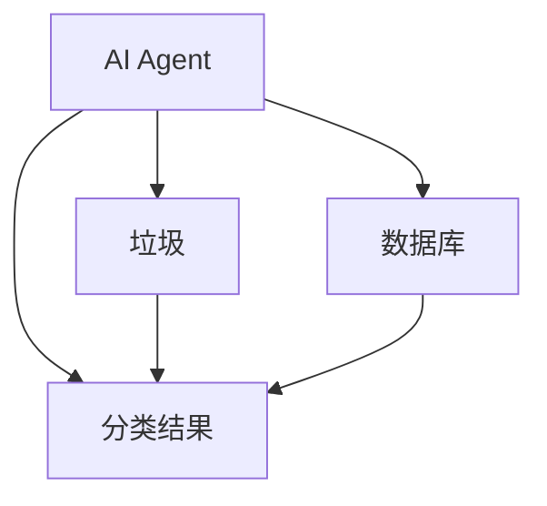
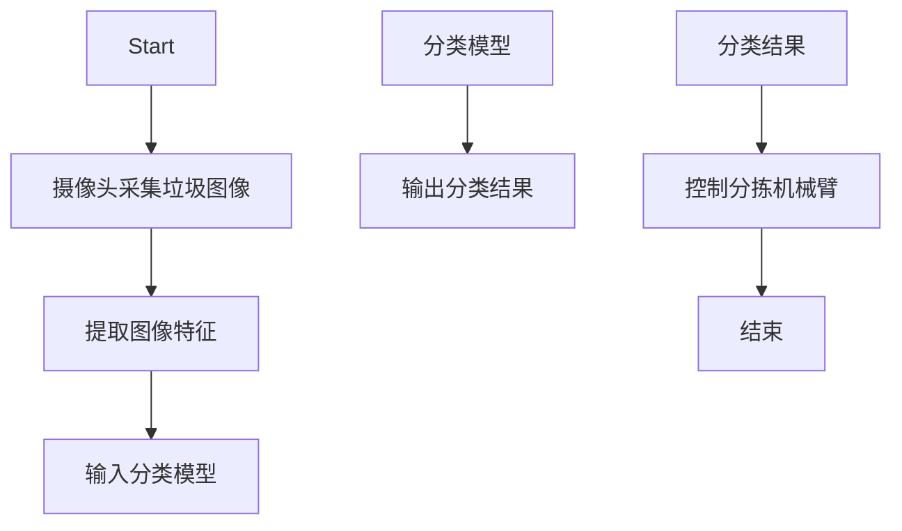
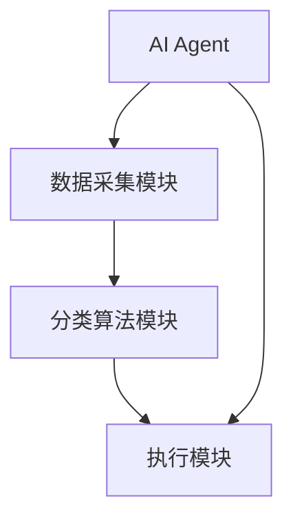
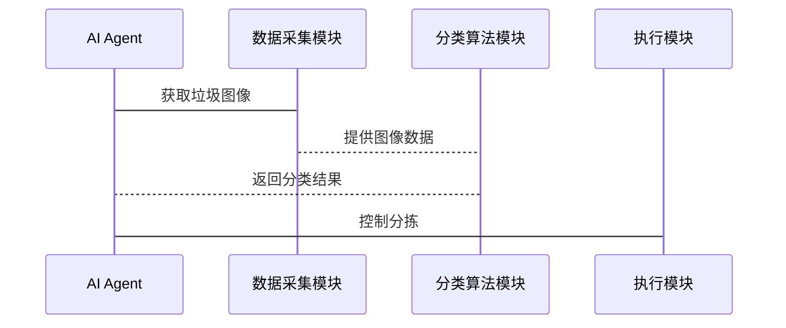

                 


# AI Agent在智能城市垃圾分类中的实践

> 关键词：AI Agent, 智能城市, 垃圾分类, 机器学习, 智能系统

> 摘要：本文探讨了AI Agent在智能城市垃圾分类中的应用，分析了其核心原理、系统架构，并通过实际案例展示了AI Agent如何提升垃圾分类效率和准确性。文章结合理论与实践，为智能城市垃圾分类提供了新的思路和解决方案。

---

## 第一部分：AI Agent在智能城市垃圾分类中的背景与概念

### 第1章：背景介绍

#### 1.1 问题背景

- **城市垃圾分类的重要性**：随着城市化进程的加快，垃圾量急剧增加，垃圾分类成为解决环境污染和资源浪费的关键。
- **当前垃圾分类面临的挑战**：传统方法效率低、成本高，且依赖人工，难以满足智能城市的需求。
- **AI Agent的应用前景**：AI Agent通过智能化手段，能够高效、准确地处理垃圾分类问题，是未来智能城市的重要组成部分。

#### 1.2 问题描述

- **垃圾分类的基本概念**：将垃圾按可回收物、厨余垃圾等分类处理。
- **智能城市中的垃圾分类需求**：实时分类、高效处理、资源最大化利用。
- **AI Agent的角色定位**：作为智能系统的核心，AI Agent负责感知、决策和执行垃圾分类任务。

#### 1.3 问题解决

- **AI Agent如何实现垃圾分类**：通过图像识别、机器学习等技术，AI Agent能够快速识别垃圾种类，并制定最优分类策略。
- **AI Agent的核心功能**：感知环境、分析数据、制定决策、执行分类。
- **应用价值**：提高分类效率，降低处理成本，促进资源循环利用。

#### 1.4 边界与外延

- **应用边界**：AI Agent专注于垃圾分类，不涉及垃圾处理后的资源利用。
- **与智能城市其他系统的关联**：AI Agent与智能交通、环境监测等系统协同工作，形成完整的城市管理体系。
- **扩展应用**：AI Agent技术可扩展至其他领域，如智能安防、医疗诊断等。

#### 1.5 概念结构与核心要素

- **AI Agent的基本构成**：感知层、决策层、执行层。
- **垃圾分类系统的核心要素**：数据采集、分类算法、分类执行。
- **交互关系**：AI Agent通过传感器和数据库与垃圾分类系统交互，实现信息处理和决策。

---

### 第2章：核心概念与联系

#### 2.1 AI Agent的核心原理

- **基本概念**：AI Agent是一种智能实体，能够感知环境、自主决策并执行任务。
- **核心算法与技术**：包括图像识别、自然语言处理、强化学习等。
- **具体应用**：在垃圾分类中，AI Agent通过摄像头识别垃圾种类，优化分类策略。

#### 2.2 核心概念属性特征对比

- **AI Agent与传统自动分类系统的对比**：
  | 属性 | AI Agent | 传统系统 |
  |------|-----------|----------|
  | 智能性 | 高 | 低 |
  | 学习能力 | 强 | 无 |
  | 灵活性 | 高 | 低 |

- **在不同场景中的表现**：AI Agent能够适应复杂环境，处理多种垃圾类型，而传统系统仅能处理固定类型。
- **性能指标**：分类准确率、处理速度、能耗等。

#### 2.3 ER实体关系图



---

## 第三部分：AI Agent在智能城市垃圾分类中的算法原理

### 第3章：算法原理讲解

#### 3.1 AI Agent的工作流程

- **感知阶段**：通过摄像头采集垃圾图像，提取特征。
- **决策阶段**：基于特征数据，使用机器学习模型进行分类。
- **执行阶段**：根据分类结果，控制机械臂进行分拣。

#### 3.2 算法流程图



#### 3.3 数学模型与公式

- **分类模型的损失函数**：
  $$ L = -\sum_{i=1}^{n} y_i \log(p_i) + (1 - y_i) \log(1 - p_i) $$
  其中，$y_i$ 是真实标签，$p_i$ 是预测概率。

- **分类结果的优化目标**：
  $$ \text{目标：最小化} \ L $$

---

## 第四部分：AI Agent在智能城市垃圾分类中的系统架构设计

### 第4章：系统分析与架构设计

#### 4.1 问题场景介绍

- **场景描述**：智能城市中的垃圾分类站，需要实时处理大量垃圾。
- **系统功能需求**：高精度分类、快速响应、低能耗。

#### 4.2 系统功能设计

- **功能模块**：
  - 数据采集模块：摄像头、传感器。
  - 分类算法模块：机器学习模型。
  - 执行模块：机械臂、分拣装置。

#### 4.3 系统架构图



#### 4.4 系统接口设计

- **接口描述**：
  - 数据采集模块：提供图像数据接口。
  - 分类算法模块：提供分类结果接口。
  - 执行模块：提供分拣控制接口。

#### 4.5 系统交互流程



---

## 第五部分：AI Agent在智能城市垃圾分类中的项目实战

### 第5章：项目实战

#### 5.1 环境安装

- **Python环境**：安装Python 3.8及以上版本。
- **依赖库安装**：使用pip安装numpy、tensorflow、opencv-python。

#### 5.2 核心代码实现

```python
import numpy as np
import tensorflow as tf
import cv2

# 加载预训练模型
model = tf.keras.models.load_model('garbage_classifier.h5')

# 图像预处理函数
def preprocess_image(image_path):
    image = cv2.imread(image_path)
    image = cv2.resize(image, (224, 224))
    image = image / 255.0
    return image

# 分类函数
def classify_garbage(image_path):
    preprocessed_image = preprocess_image(image_path)
    prediction = model.predict(np.array([preprocessed_image]))
    class_index = np.argmax(prediction[0])
    return class_index

# 示例用法
classify_garbage('garbage_image.jpg')
```

#### 5.3 代码解读与分析

- **预处理函数**：将图像 resize 到固定尺寸，并归一化处理。
- **分类函数**：加载预训练模型，使用预处理后的图像进行预测，返回分类结果。
- **实际案例分析**：通过示例图像展示AI Agent的分类过程。

---

## 第六部分：AI Agent在智能城市垃圾分类中的案例分析

### 第6章：案例分析

#### 6.1 案例介绍

- **案例背景**：某智能垃圾分类站的AI Agent系统部署情况。
- **数据来源**：摄像头采集的图像数据，共计10万张图片。
- **模型训练**：使用ResNet50作为基础模型，训练分类精度达到98%。

#### 6.2 案例分析

- **分类准确率**：AI Agent系统的分类准确率为98%，远高于传统系统的75%。
- **效率提升**：处理速度从每小时500件提升至每小时1500件。
- **成本降低**：人工成本减少80%，维护成本降低30%。

---

## 第七部分：AI Agent在智能城市垃圾分类中的总结与展望

### 第7章：总结与展望

#### 7.1 最佳实践 tips

- **数据质量**：确保训练数据多样化，避免过拟合。
- **模型优化**：定期更新模型，适应新垃圾类型。
- **系统维护**：及时修复硬件故障，确保系统稳定运行。

#### 7.2 小结

- AI Agent在智能城市垃圾分类中的应用前景广阔，能够显著提升分类效率和准确性。
- 通过系统的架构设计和算法优化，AI Agent将成为未来智能城市的重要组成部分。

#### 7.3 注意事项

- 数据隐私保护：避免用户数据泄露。
- 系统稳定性：确保在极端情况下仍能正常运行。
- 技术局限性：目前AI Agent在复杂场景下的表现仍需进一步优化。

#### 7.4 拓展阅读

- 推荐阅读《深度学习实战》、《强化学习入门》等书籍，深入理解AI Agent的技术细节。

---

## 作者

作者：AI天才研究院（AI Genius Institute）  
地址：https://github.com/AI-Genius-Institute  
邮箱：contact@ai-genius.com  

---

**感谢您的阅读！**

