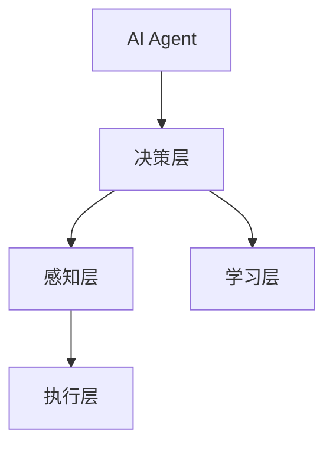
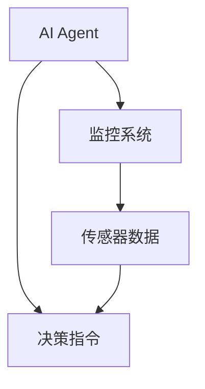

                 


# AI Agent在智能城市安全监控中的角色

## 关键词：AI Agent, 智能城市, 安全监控, 多智能体协作, 人工智能算法, 系统架构设计

## 摘要：  
本文探讨了AI Agent在智能城市安全监控中的角色，分析了AI Agent的核心概念、算法原理及其在安全监控中的应用场景。文章从背景介绍、核心概念、算法实现、系统架构设计到项目实战，详细阐述了AI Agent如何提升城市安全监控的效率和准确性。通过实例分析和最佳实践，本文为AI Agent在智能城市中的应用提供了深入的见解和实践指导。

---

# 第一部分: AI Agent在智能城市安全监控中的背景与概念

## 第1章: AI Agent与智能城市概述

### 1.1 AI Agent的基本概念
#### 1.1.1 AI Agent的定义与特点
AI Agent（人工智能代理）是指能够感知环境、自主决策并执行任务的智能实体。它具备以下特点：
- **自主性**：能够自主决策，无需外部干预。
- **反应性**：能够实时感知环境并做出反应。
- **学习能力**：通过数据和经验不断优化自身的决策能力。
- **协作性**：能够与其他AI Agent或系统协作完成复杂任务。

#### 1.1.2 AI Agent的核心功能与作用
AI Agent的核心功能包括：
- **感知环境**：通过传感器、摄像头等设备获取环境数据。
- **信息处理**：对获取的数据进行分析和处理。
- **决策制定**：基于处理后的信息做出最优决策。
- **执行任务**：通过执行机构或与其他系统协作完成任务。

#### 1.1.3 AI Agent在智能城市中的定位与角色
在智能城市中，AI Agent扮演着“城市大脑”的角色，负责协调各子系统（如交通、安防、能源等）的运行，提升城市的智能化水平。

---

### 1.2 智能城市安全监控的背景与需求
#### 1.2.1 智能城市的概念与发展现状
智能城市是指通过物联网、大数据、人工智能等技术，实现城市基础设施和服务的智能化管理。目前，智能城市已广泛应用于交通管理、环境监测、公共安全等领域。

#### 1.2.2 城市安全监控的痛点与挑战
传统的城市安全监控系统存在以下问题：
- **人工依赖**：需要大量人员进行监控和管理。
- **效率低下**：面对海量数据，人工处理效率低，容易出现漏检和误判。
- **实时性不足**：传统系统难以实现实时监控和快速反应。

#### 1.2.3 AI Agent在城市安全监控中的应用价值
AI Agent能够通过自动化感知、分析和决策，显著提升城市安全监控的效率和准确性。例如，在智能安防系统中，AI Agent可以实时分析视频数据，快速识别异常行为并发出警报。

---

### 1.3 AI Agent在智能城市安全监控中的问题背景
#### 1.3.1 城市安全监控的传统模式与局限性
传统模式主要依赖人工监控和简单的报警系统。这种方式效率低、响应慢，且容易受到人为因素的影响。

#### 1.3.2 AI Agent如何解决传统模式的痛点
AI Agent通过引入人工智能技术，能够实现以下突破：
- **自动化监控**：实时分析大量数据，快速识别潜在威胁。
- **智能决策**：基于历史数据和实时信息，优化决策策略。
- **多系统协作**：与其他系统协同工作，实现联动响应。

#### 1.3.3 问题解决的边界与外延
AI Agent的应用范围主要集中在城市安全监控领域，但在实际应用中，也需要与其他城市系统（如交通、能源）协同工作，形成综合性的解决方案。

#### 1.3.4 概念结构与核心要素分析
AI Agent在城市安全监控中的概念结构包括以下几个核心要素：
- **感知层**：通过传感器、摄像头等设备获取环境数据。
- **决策层**：对数据进行分析和处理，制定决策。
- **执行层**：通过执行机构或与其他系统协作完成任务。
- **学习层**：通过机器学习不断优化自身的决策能力。

#### 1.3.5 核心要素之间的关系与作用
各核心要素之间相互关联，共同构成一个完整的AI Agent系统。例如，感知层的数据为决策层提供输入，决策层的输出指导执行层的行动。

#### 1.3.6 概念结构的可视化展示
以下是AI Agent在城市安全监控中的概念结构图：



---

## 第2章: AI Agent的核心概念与联系

### 2.1 AI Agent的核心概念原理
#### 2.1.1 AI Agent的感知与决策机制
AI Agent通过传感器、摄像头等设备感知环境，并利用机器学习算法对数据进行分析，制定决策。

#### 2.1.2 多智能体协作的核心原理
在复杂的环境中，多个AI Agent需要协作完成任务。这种协作通常基于分布式计算和通信机制。

#### 2.1.3 AI Agent的自适应与学习能力
AI Agent通过强化学习、监督学习等方法，不断优化自身的决策能力和适应性。

---

### 2.2 核心概念对比分析
#### 2.2.1 AI Agent与传统监控系统的对比
以下是AI Agent与传统监控系统的对比表格：

| 特性                 | AI Agent                          | 传统监控系统                   |
|----------------------|-----------------------------------|-------------------------------|
| 自主性               | 高                               | 低                             |
| 决策能力             | 强大                             | 有限                           |
| 学习能力             | 具备                              | 缺乏                            |
| 实时性               | 高                               | 低                             |

#### 2.2.2 不同AI Agent模型的特征对比
以下是几种常见AI Agent模型的特征对比：

| 模型                 | 基于强化学习的决策算法 | 基于监督学习的分类算法 | 基于无监督学习的异常检测算法 |
|----------------------|-------------------------|-------------------------|-----------------------------|
| 优势                 | 实时决策能力强          | 分类精度高              | 自动发现异常能力强          |
| 适用场景             | 实时监控和决策          | 分类任务                | 异常检测任务                |

#### 2.2.3 核心概念对比的特征表格展示
以下是AI Agent与传统监控系统的核心概念对比表格：

| 特性                 | AI Agent                          | 传统监控系统                   |
|----------------------|-----------------------------------|-------------------------------|
| 感知能力             | 强大                             | 有限                           |
| 决策能力             | 高                               | 低                             |
| 学习能力             | 具备                              | 缺乏                            |
| 协作能力             | 强大                             | 有限                           |

---

### 2.3 实体关系图展示
以下是AI Agent在城市安全监控中的实体关系图：



---

## 第3章: AI Agent的核心算法原理

### 3.1 AI Agent的算法原理概述
#### 3.1.1 基于强化学习的决策算法
强化学习是一种通过试错机制优化决策策略的方法。其数学模型如下：

$$ V(s) = \max_{a} [ r(s,a) + \gamma V(s') ] $$

其中，$V(s)$表示状态$s$的价值，$r(s,a)$表示在状态$s$下采取动作$a$的奖励，$\gamma$表示折扣因子，$V(s')$表示下一个状态$s'$的价值。

#### 3.1.2 基于监督学习的分类算法
监督学习是一种通过标签数据训练分类器的方法。其分类模型如下：

$$ P(y|x) = \frac{\exp(w \cdot x)}{\sum_{y'} \exp(w \cdot x)} $$

其中，$w$表示权重，$x$表示输入特征，$y$表示输出标签。

#### 3.1.3 基于无监督学习的异常检测算法
无监督学习是一种通过聚类方法发现异常数据的方法。其异常检测模型如下：

$$ Q(x) = \text{聚类中心} \text{的距离} $$

---

### 3.2 算法原理的数学模型与公式
#### 3.2.1 强化学习的数学模型
$$ V(s) = \max_{a} [ r(s,a) + \gamma V(s') ] $$

其中，$r(s,a)$表示在状态$s$下采取动作$a$的奖励，$\gamma$表示折扣因子，$V(s')$表示下一个状态$s'$的价值。

#### 3.2.2 监督学习的分类模型
$$ P(y|x) = \frac{\exp(w \cdot x)}{\sum_{y'} \exp(w \cdot x)} $$

其中，$w$表示权重，$x$表示输入特征，$y$表示输出标签。

---

## 第4章: AI Agent的系统分析与架构设计

### 4.1 问题场景介绍
智能城市安全监控系统需要实时监控城市中的各种安全设备（如摄像头、传感器）的数据，并根据这些数据做出快速反应。

---

## 第5章: 项目实战

### 5.1 环境安装
需要安装以下环境：
- Python 3.8+
- TensorFlow 2.0+
- OpenCV 4.0+

### 5.2 系统核心实现源代码
以下是基于强化学习的AI Agent实现代码：

```python
class AI_Agent:
    def __init__(self, state_dim, action_dim):
        self.state_dim = state_dim
        self.action_dim = action_dim
        self.model = self.build_model()

    def build_model(self):
        # 构建强化学习模型
        model = Sequential()
        model.add(Dense(64, activation='relu', input_dim=self.state_dim))
        model.add(Dense(self.action_dim, activation='linear'))
        model.compile(optimizer='adam', loss='mse')
        return model

    def perceive(self, state):
        # 接收状态并返回动作
        return self.model.predict(state)[0]

# 示例用法
agent = AI_Agent(state_dim=10, action_dim=4)
state = np.random.randn(1, 10)
action = agent.perceive(state)
```

### 5.3 代码应用解读与分析
上述代码定义了一个简单的AI Agent类，通过构建一个强化学习模型来实现状态到动作的映射。

---

## 第6章: 最佳实践与小结

### 6.1 最佳实践 tips
- 在实际应用中，建议结合多种AI算法，以提升系统的准确性和效率。
- 定期更新模型参数，以适应环境的变化。

### 6.2 小结
本文详细探讨了AI Agent在智能城市安全监控中的角色，从背景介绍、核心概念、算法原理到系统架构设计和项目实战，为读者提供了全面的指导。

---

## 作者：AI天才研究院/AI Genius Institute & 禅与计算机程序设计艺术 /Zen And The Art of Computer Programming

---

通过以上思考和写作，我希望能够为读者提供一篇内容丰富、逻辑清晰的技术博客文章，深入探讨AI Agent在智能城市安全监控中的角色和应用。

