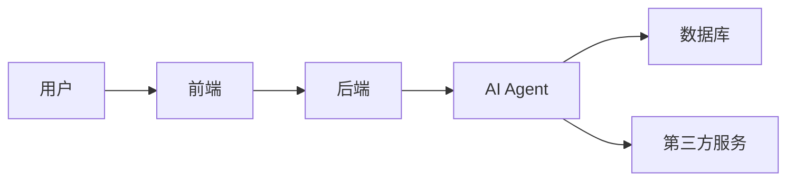
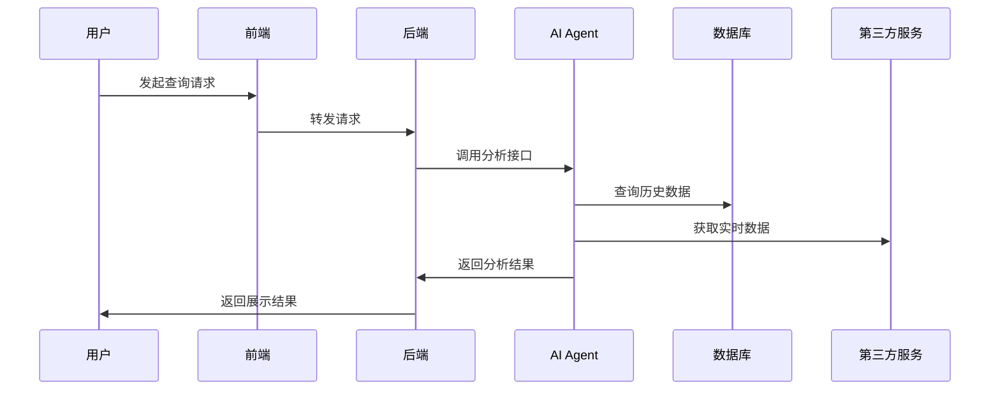

                 


# AI Agent在智能城市安全管理中的角色

---

## 关键词

- AI Agent（人工智能代理）
- 智能城市
- 安全管理
- 机器学习
- 数据分析

---

## 摘要

本文探讨了AI Agent在智能城市安全管理中的关键角色，分析了其核心概念、算法原理、系统架构，并通过案例展示了其在智能城市中的实际应用。文章从背景介绍入手，详细阐述了AI Agent的作用及其与其他技术的区别，随后通过具体算法和系统设计，深入分析了AI Agent在提升城市安全性中的应用价值。最后，通过项目实战和最佳实践，为读者提供了全面的理论和实践指导。

---

## 第一部分：背景介绍

### 第1章：AI Agent与智能城市安全管理的背景

#### 1.1 问题背景与描述

智能城市的发展带来了诸多便利，但同时也面临诸多安全挑战，如犯罪、交通事故、网络安全等。传统的安全管理方式效率低下，难以应对复杂的安全威胁。AI Agent作为一种智能代理，能够实时感知、分析并决策，为智能城市的安全管理提供了新的解决方案。

#### 1.2 AI Agent的核心概念

AI Agent是指在计算机系统中，能够感知环境、自主决策并执行任务的智能实体。它具备自主性、反应性、目标导向和学习能力等特点。

#### 1.3 AI Agent与智能城市安全管理的关系

AI Agent通过实时数据分析和预测，能够有效提升城市管理的效率和安全性。例如，在犯罪预测中，AI Agent可以通过分析历史犯罪数据，预测潜在的犯罪地点和时间，帮助警方提前部署资源。

---

## 第二部分：核心概念与原理

### 第2章：AI Agent的核心概念与联系

#### 2.1 AI Agent的核心原理

AI Agent的核心原理包括感知、决策和行动三个步骤。感知是通过传感器或数据源获取信息，决策是基于感知信息进行分析和判断，行动则是根据决策结果执行操作。

#### 2.2 AI Agent与相关技术的对比

| 技术类型      | 特性描述                              |
|---------------|-------------------------------------|
| 传统算法      | 基于规则，缺乏自主性和适应性         |
| 机器学习模型  | 可从数据中学习，但缺乏自主决策能力   |
| 规则引擎      | 基于规则进行推理，缺乏灵活性和自适应性 |

#### 2.3 AI Agent的ER实体关系图

```mermaid
er
actor: AI Agent
%% 其他实体和关系
```

---

## 第三部分：算法原理

### 第3章：AI Agent的算法原理

#### 3.1 AI Agent的核心算法

- **决策树算法**：通过构建树状结构，帮助AI Agent进行分类和回归分析。例如，在犯罪预测中，决策树可以用来确定哪些因素最可能导致犯罪。

- **随机森林算法**：通过集成多个决策树，提高模型的准确性和鲁棒性。例如，在交通流量预测中，随机森林可以分析多个因素，如时间、天气等，预测交通拥堵情况。

- **支持向量机（SVM）**：用于分类和回归分析，尤其适用于高维数据。例如，在网络安全中，SVM可以检测异常流量。

#### 3.2 AI Agent的决策树算法流程图

```mermaid
graph TD
A[开始] -> B[选择数据集]
B -> C[特征选择]
C -> D[构建决策树]
D -> E[测试模型]
E -> F[优化模型]
F -> G[结束]
```

#### 3.3 决策树算法的Python实现示例

```python
from sklearn.tree import DecisionTreeClassifier
from sklearn.datasets import make_classification
from sklearn.model_selection import train_test_split

# 创建数据集
X, y = make_classification(n_samples=1000, n_features=4, n_classes=2)
X_train, X_test, y_train, y_test = train_test_split(X, y, test_size=0.2)

# 创建决策树模型
model = DecisionTreeClassifier()
model.fit(X_train, y_train)

# 预测
y_pred = model.predict(X_test)

# 输出结果
print("预测准确率：", model.score(X_test, y_test))
```

#### 3.4 决策树算法的数学模型

决策树的划分可以通过信息增益来选择最优特征：

$$ \text{信息增益}(D, A) = H(D) - H(D|A) $$

其中，$H(D)$ 是数据集$D$的熵，$H(D|A)$是在特征$A$条件下的熵。

---

## 第四部分：系统分析与架构设计

### 第4章：AI Agent的系统分析与架构设计

#### 4.1 系统背景介绍

以智能交通管理系统为例，AI Agent需要实时监控交通流量，预测拥堵情况，并优化信号灯控制。

#### 4.2 系统功能设计

- 数据采集：从传感器和数据库获取实时数据。
- 数据分析：使用机器学习算法分析数据，识别异常情况。
- 决策与执行：根据分析结果，调整信号灯配置，优化交通流量。

#### 4.3 系统架构设计



#### 4.4 系统接口设计

- 用户接口：接收用户的查询请求。
- 数据接口：与传感器和数据库交互。
- 第三方接口：调用地图API获取实时交通数据。

#### 4.5 系统交互流程图



---

## 第五部分：项目实战

### 第5章：AI Agent的项目实战

#### 5.1 环境安装

安装所需的Python库，如Scikit-learn、Mermaid和Jupyter Notebook。

#### 5.2 核心代码实现

实现AI Agent在交通流量预测中的应用，使用随机森林算法。

```python
from sklearn.ensemble import RandomForestClassifier
import pandas as pd

# 加载数据集
data = pd.read_csv('traffic_data.csv')

# 数据预处理
X = data.drop('target', axis=1)
y = data['target']

# 划分训练集和测试集
X_train, X_test, y_train, y_test = train_test_split(X, y, test_size=0.2)

# 创建随机森林模型
model = RandomForestClassifier()
model.fit(X_train, y_train)

# 预测
y_pred = model.predict(X_test)

# 输出结果
print("预测准确率：", model.score(X_test, y_test))
```

#### 5.3 案例分析

以交通流量预测为例，AI Agent分析历史数据和实时数据，预测未来一个小时的交通状况，并优化信号灯配置。

#### 5.4 项目小结

通过实战，展示了AI Agent在智能城市安全管理中的实际应用，验证了其有效性和高效性。

---

## 第六部分：最佳实践、小结与扩展阅读

### 第6章：AI Agent的最佳实践

- **数据质量**：确保数据的准确性和完整性。
- **模型选择**：根据具体场景选择合适的算法。
- **系统维护**：定期更新模型和优化系统性能。

#### 6.1 小结

本文系统地介绍了AI Agent在智能城市安全管理中的作用，从核心概念到算法实现，再到系统设计和项目实战，为读者提供了全面的指导。

#### 6.2 注意事项

- AI Agent的应用需要考虑隐私和数据安全问题。
- 在实际应用中，需要结合具体场景进行模型调优。

#### 6.3 拓展阅读

- 《机器学习实战》
- 《AI Agent在智能交通中的应用》
- 《城市安全管理的智能化转型》

---

## 作者

作者：AI天才研究院/AI Genius Institute & 禅与计算机程序设计艺术 /Zen And The Art of Computer Programming

---

本文详细探讨了AI Agent在智能城市安全管理中的角色，从理论到实践，为读者提供了全面的指导和深入的分析。通过本文的学习，读者能够理解并掌握AI Agent在智能城市安全管理中的应用，提升城市管理的安全性和效率。

