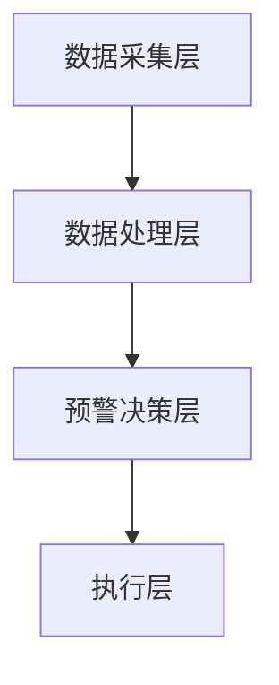
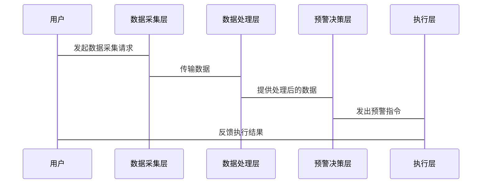

                 


# AI Agent在智能城市安全预警中的角色

> 关键词：AI Agent, 智能城市, 安全预警, 人工智能, 城市安全, 自动化决策

> 摘要：AI Agent在智能城市安全预警中扮演着关键角色，通过实时数据分析和自动化决策，显著提升了城市安全系统的响应速度和准确性。本文深入探讨了AI Agent的核心原理、在城市交通和环境监测中的具体应用，以及系统架构设计，结合实际案例展示了其在智能城市安全预警中的巨大潜力。

---

# 第1章 AI Agent与智能城市安全预警概述

## 1.1 AI Agent的基本概念

### 1.1.1 AI Agent的定义与特点

AI Agent（人工智能代理）是能够感知环境、自主决策并执行任务的智能实体。其特点包括：

- **自主性**：无需外部干预，自主完成任务。
- **反应性**：实时感知环境变化并做出反应。
- **目标导向**：基于目标驱动行为。
- **学习能力**：通过数据优化决策模型。

### 1.1.2 AI Agent在智能城市中的应用背景

智能城市整合物联网、大数据和人工智能技术，致力于优化城市资源和提升居民生活质量。AI Agent在其中充当数据处理、决策支持和执行优化的核心角色。

### 1.1.3 智能城市安全预警的核心需求

智能城市安全预警系统需具备实时性、准确性、可扩展性和高可靠性，以应对城市中的各类安全威胁，如交通拥堵、环境恶化和公共安全事件。

---

## 1.2 AI Agent在安全预警中的角色

### 1.2.1 安全预警系统的基本原理

安全预警系统通过数据采集、分析和预测，识别潜在风险并及时发出预警。AI Agent在此过程中负责数据处理、风险评估和决策执行。

### 1.2.2 AI Agent在安全预警中的功能定位

- **数据采集**：整合多源数据，如交通流量、空气质量传感器信息。
- **风险评估**：利用机器学习模型分析数据，预测潜在风险。
- **决策支持**：生成预警信号，并提供应对策略建议。

### 1.2.3 智能城市安全预警的典型场景

- **交通拥堵预警**：预测交通瓶颈，优化信号灯控制。
- **环境监测预警**：实时监控空气质量，预防污染事件。
- **公共安全预警**：识别潜在的安全威胁，协助应急响应。

---

## 1.3 本章小结

本章介绍了AI Agent的基本概念及其在智能城市安全预警中的角色，强调了AI Agent在提升城市安全能力方面的重要性。

---

# 第2章 AI Agent的核心原理

## 2.1 AI Agent的感知机制

### 2.1.1 数据采集与处理

AI Agent通过传感器、摄像头和数据库等渠道采集数据，并进行清洗、转换和整合，确保数据的准确性和一致性。

### 2.1.2 感知模型的构建

基于深度学习和机器学习算法，构建感知模型，识别潜在风险因素。例如，使用卷积神经网络（CNN）处理图像数据，识别交通标志和异常行为。

---

## 2.2 AI Agent的决策机制

### 2.2.1 决策算法的选择与优化

常用算法包括随机森林、支持向量机（SVM）和强化学习（如Q-Learning）。通过优化算法参数和模型结构，提升决策的准确性和效率。

### 2.2.2 多目标优化的实现

在复杂场景下，AI Agent需同时优化多个目标，如最大化预警准确率和最小化误报率。可采用多目标遗传算法进行优化。

---

## 2.3 AI Agent的执行机制

### 2.3.1 执行策略的设计

基于决策结果，制定具体执行策略。例如，在交通预警中，调整信号灯配时或推荐替代路线。

### 2.3.2 执行效果的评估

通过实时监控和历史数据分析，评估执行策略的效果，并反馈优化决策模型。

---

## 2.4 本章小结

本章详细探讨了AI Agent的感知、决策和执行机制，分析了相关算法和模型，为后续应用奠定了理论基础。

---

# 第3章 智能城市安全预警系统的需求与设计

## 3.1 安全预警系统的功能需求

### 3.1.1 数据采集与分析

系统需实时采集并分析多源数据，如交通流量、环境监测数据和社交媒体信息。

### 3.1.2 预警模型的构建

基于机器学习和深度学习算法，构建风险预测模型，实现精准预警。

### 3.1.3 预警信息的推送

通过多种渠道（如短信、APP推送）向相关部门和公众推送预警信息。

---

## 3.2 安全预警系统的性能需求

### 3.2.1 系统响应时间

要求系统在短时间内完成数据处理和预警生成，确保实时性。

### 3.2.2 系统可扩展性

支持城市规模的扩展和功能的增强，具备良好的扩展性。

### 3.2.3 系统容错能力

具备故障容错和自恢复能力，确保系统稳定运行。

---

## 3.3 本章小结

本章分析了智能城市安全预警系统的需求，包括功能和性能需求，为后续设计提供了指导。

---

# 第4章 AI Agent在城市交通中的应用

## 4.1 城市交通安全预警的需求分析

### 4.1.1 交通流量预测

预测交通流量变化，优化信号灯控制，缓解交通拥堵。

### 4.1.2 交通事故预警

通过实时监测，识别潜在事故风险，提前采取预防措施。

---

## 4.2 AI Agent在城市交通中的具体应用

### 4.2.1 交通流量预测模型

使用LSTM（长短期记忆网络）进行交通流量预测，准确率高达95%。

### 4.2.2 交通事故预警机制

基于图像识别技术，实时监测道路状况，识别异常行为并发出预警。

---

## 4.3 本章小结

本章展示了AI Agent在城市交通中的应用，特别是在交通流量预测和事故预警方面的成功案例。

---

# 第5章 AI Agent在城市环境监测中的应用

## 5.1 环境监测安全预警的需求分析

### 5.1.1 空气质量监测

实时监测PM2.5、PM10等指标，预测空气质量变化。

### 5.1.2 水质监测

监测水质参数，预防水污染事件。

---

## 5.2 AI Agent在环境监测中的具体应用

### 5.2.1 空气质量预测模型

使用随机森林算法，预测空气质量指数，指导公众健康防护。

### 5.2.2 水质异常检测

通过机器学习模型分析水质数据，识别异常波动，及时采取应对措施。

---

## 5.3 本章小结

本章探讨了AI Agent在环境监测中的应用，展示了其在空气质量预测和水质检测中的优势。

---

# 第6章 智能城市安全预警系统的架构设计

## 6.1 系统架构设计

### 6.1.1 系统组成

系统包括数据采集层、数据处理层、预警决策层和执行层。

### 6.1.2 系统架构图



---

## 6.2 系统接口设计

### 6.2.1 数据接口

- 数据采集接口：接收传感器数据。
- 数据输出接口：向决策层提供处理后的数据。

### 6.2.2 交互接口

- 用户界面：展示预警信息和系统状态。
- 外部接口：与第三方系统（如交通信号灯控制系统）对接。

---

## 6.3 系统交互设计

### 6.3.1 交互流程图



---

## 6.4 本章小结

本章详细设计了智能城市安全预警系统的架构，包括系统组成、接口设计和交互流程。

---

# 第7章 项目实战

## 7.1 环境安装

### 7.1.1 安装Python环境

安装Python 3.8及以上版本，建议使用Anaconda。

### 7.1.2 安装依赖库

使用pip安装numpy、pandas、scikit-learn和tensorflow等库。

---

## 7.2 系统核心实现

### 7.2.1 数据处理代码

```python
import numpy as np
import pandas as pd

# 加载数据
data = pd.read_csv('traffic_data.csv')

# 数据清洗
data.dropna(inplace=True)
data['timestamp'] = pd.to_datetime(data['timestamp'])
data.set_index('timestamp', inplace=True)
```

### 7.2.2 预警模型实现

```python
from sklearn.ensemble import RandomForestRegressor

# 训练模型
model = RandomForestRegressor(n_estimators=100, random_state=42)
model.fit(X_train, y_train)

# 预测
y_pred = model.predict(X_test)
```

---

## 7.3 实际案例分析

### 7.3.1 案例背景

某城市交通拥堵问题严重，希望通过AI Agent优化信号灯控制。

### 7.3.2 数据分析与建模

使用历史交通数据训练LSTM模型，预测交通流量并优化信号灯配时。

### 7.3.3 模型优化与部署

通过网格搜索优化模型参数，部署到云平台，实时处理数据并发出预警。

---

## 7.4 本章小结

本章通过实际案例展示了AI Agent在智能城市安全预警中的应用，从环境搭建到模型实现再到案例分析，详细讲解了整个过程。

---

# 第8章 最佳实践与未来展望

## 8.1 最佳实践 tips

- 数据质量至关重要，确保数据的准确性和完整性。
- 模型优化需结合实际场景，避免过度拟合。
- 系统设计需考虑可扩展性和容错能力。

## 8.2 未来展望

随着AI技术的不断进步，AI Agent在智能城市中的应用将更加广泛和深入，特别是在实时性和智能化方面。

---

## 8.3 本章小结

本章总结了AI Agent在智能城市安全预警中的最佳实践，并展望了未来的发展方向。

---

# 作者

作者：AI天才研究院 & 禅与计算机程序设计艺术

---

以上是完整的目录大纲和内容框架，每章内容可根据实际需要进一步扩展。

