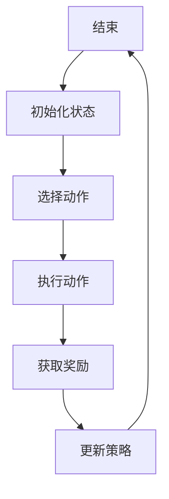
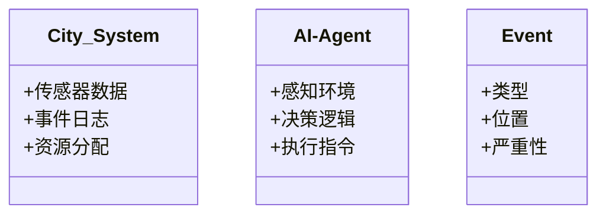
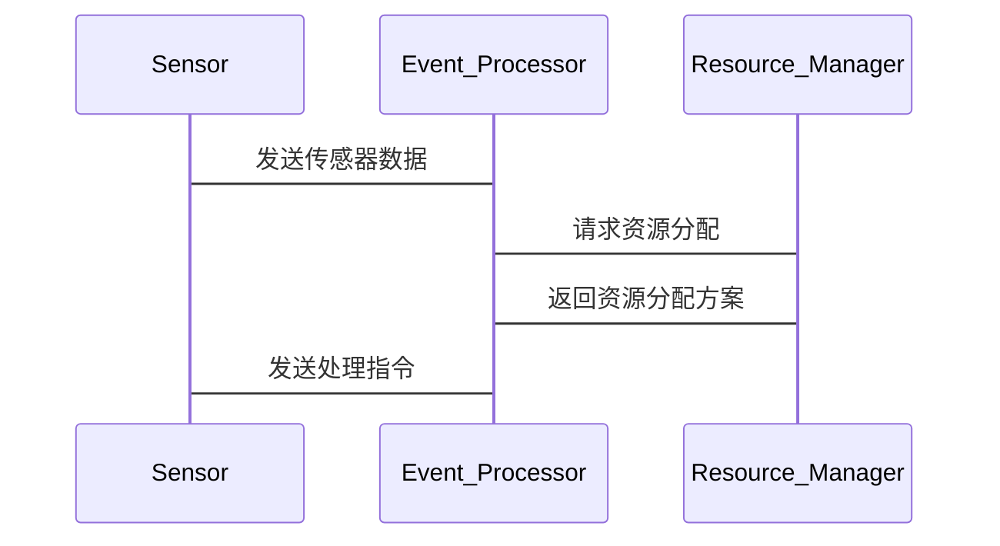
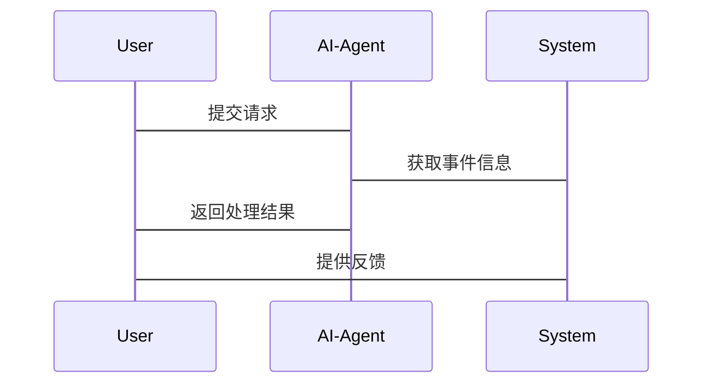

                 


# AI Agent在智能城市应急响应中的角色

> 关键词：AI Agent，智能城市，应急响应，算法原理，系统架构

> 摘要：本文探讨AI Agent在智能城市应急响应中的角色，从背景介绍、核心概念到算法原理、系统架构设计，再到项目实战和最佳实践，全面分析AI Agent在智能城市应急响应中的应用与实现。

---

## 第1章 智能城市应急响应的背景与问题

### 1.1 智能城市的定义与特点

智能城市是指通过广泛应用信息技术，整合城市资源，优化城市运行效率，提升居民生活质量的城市形态。其特点包括智能化、数据驱动、实时响应和可持续性。

### 1.2 应急响应在智能城市中的重要性

应急响应是智能城市中不可或缺的一部分，涉及火灾、地震、交通事故等多种突发事件的快速响应与处理。智能城市通过AI Agent实现应急响应的自动化和智能化，显著提升应对效率。

### 1.3 AI Agent的定义与特点

AI Agent是一种智能代理，能够感知环境、自主决策并执行任务。其特点包括智能性、自主性、反应性和协作性。

### 1.4 AI Agent在智能城市应急响应中的应用前景

AI Agent在智能城市中的应用场景广泛，包括灾害预警、交通管理、医疗急救等领域。其优势在于快速响应和高效决策，但也面临数据安全和算法优化的挑战。

---

## 第2章 AI Agent的核心概念与联系

### 2.1 AI Agent的核心概念

AI Agent通过感知环境、分析数据并执行任务，实现智能化决策。其核心要素包括感知、推理、决策和执行。

### 2.2 AI Agent的实体关系图

使用Mermaid绘制的ER图展示了AI Agent、城市系统和事件之间的关系：

```mermaid
er
  city_system
  AI-Agent
  event
  relation one:many - "参与"
  city_system -[参与]-> AI-Agent
  AI-Agent -[处理]-> event
```

### 2.3 AI Agent的算法原理

AI Agent的算法基于强化学习，通过状态、动作和奖励的循环优化决策过程。其数学模型如下：

$$ V(s) = \max_a Q(s, a) $$

其中，$s$为状态，$a$为动作，$Q$为价值函数。

---

## 第3章 AI Agent的算法原理与实现

### 3.1 算法原理

AI Agent采用改进的强化学习算法，通过构建状态空间和动作空间，优化决策策略。其流程图如下：



### 3.2 算法实现

以下是Python实现代码：

```python
class AIAgent:
    def __init__(self, state_space, action_space):
        self.state_space = state_space
        self.action_space = action_space
        self.Q = {}
    
    def get_Q(self, state, action):
        return self.Q.get((state, action), 0)
    
    def update_Q(self, state, action, new_value):
        self.Q[(state, action)] = new_value
    
    def choose_action(self, state):
        max_action = None
        max_value = -float('inf')
        for action in self.action_space:
            value = self.get_Q(state, action)
            if value > max_value:
                max_value = value
                max_action = action
        return max_action
    
    def learn(self, state, action, reward):
        current_Q = self.get_Q(state, action)
        new_Q = current_Q + alpha * (reward + gamma * max(self.get_Q(state, a) for a in self.action_space) - current_Q)
        self.update_Q(state, action, new_Q)
```

### 3.3 算法优化

通过调整学习率$\alpha$和折扣因子$\gamma$，优化算法性能，提升AI Agent的决策准确性。

---

## 第4章 系统分析与架构设计

### 4.1 问题场景介绍

智能城市应急响应系统需要实时处理多种突发事件，通过AI Agent实现快速响应和资源优化配置。

### 4.2 系统功能设计

系统功能包括事件检测、任务分配、决策支持和反馈优化。使用Mermaid绘制的领域模型图如下：



### 4.3 系统架构设计

系统架构采用分层设计，包括数据层、逻辑层和应用层。使用Mermaid绘制的架构图如下：

```mermaid
container Data_Layer {
    数据存储
    数据处理
}
container Logic_Layer {
    AI-Agent
    决策模块
}
container Application_Layer {
    应用程序
    用户界面
}
```

### 4.4 系统接口设计

系统接口包括传感器数据接口、事件处理接口和资源分配接口。使用Mermaid绘制的接口设计图如下：



### 4.5 系统交互设计

系统交互流程包括事件检测、任务分配、执行指令和反馈优化。使用Mermaid绘制的交互图如下：



---

## 第5章 项目实战

### 5.1 环境安装

安装Python和必要的库，如NumPy和Matplotlib。

### 5.2 核心代码实现

实现AI Agent的核心功能，包括感知、决策和执行。

### 5.3 案例分析

以火灾应急响应为例，展示AI Agent如何优化资源分配和救援路径。

### 5.4 项目小结

总结项目成果，分析经验教训，展望未来改进方向。

---

## 第6章 最佳实践

### 6.1 项目小结

回顾项目实施过程，总结关键点和经验教训。

### 6.2 注意事项

强调数据安全、算法优化和系统维护的重要性。

### 6.3 拓展阅读

推荐相关领域的书籍和论文，供读者深入学习。

---

## 作者

作者：AI天才研究院/AI Genius Institute & 禅与计算机程序设计艺术 /Zen And The Art of Computer Programming

