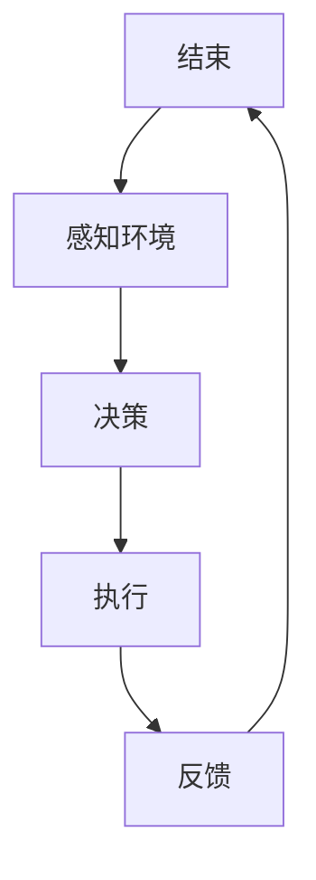
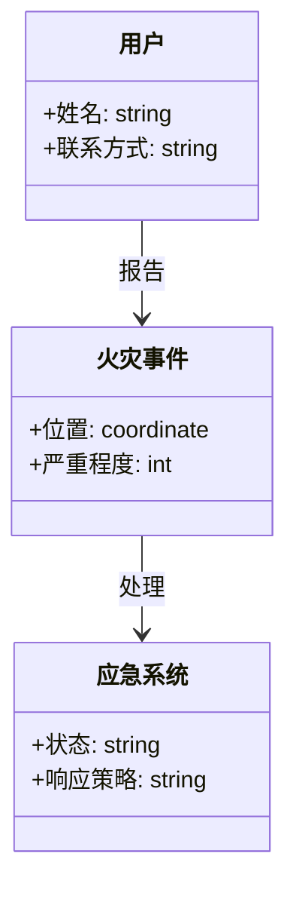
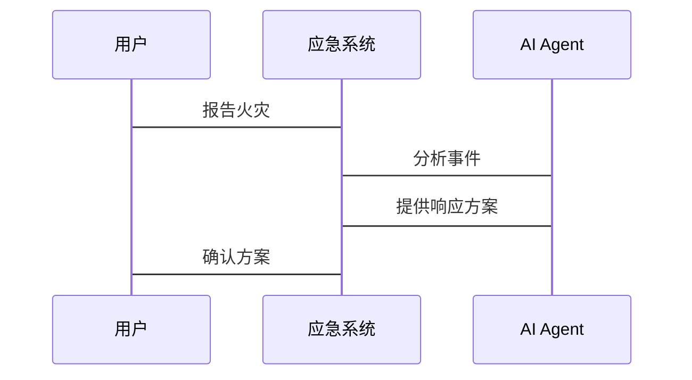

                 


# AI Agent在智能城市应急响应中的角色

**关键词：** AI Agent, 智能城市, 应急响应, 多智能体协作, 强化学习, 系统架构设计

**摘要：** 本文探讨了AI Agent在智能城市应急响应中的应用，分析其核心原理、系统架构，并通过案例展示其实战应用。文章详细阐述了AI Agent的算法原理和系统设计，为智能城市应急响应提供了新的思路和解决方案。

---

## 第一部分: AI Agent在智能城市应急响应中的角色概述

### 第1章: 背景介绍

#### 1.1 AI Agent的基本概念
- **定义：** AI Agent是能够感知环境、自主决策并执行任务的智能体。
- **核心特征：** 智能性、反应性、社会性。
- **区别：** 传统软件依赖固定逻辑，AI Agent具备自适应能力。

#### 1.2 智能城市应急响应的背景
- **定义：** 利用技术手段提升城市应对突发事件的能力。
- **重要性：** 提高响应效率，减少损失。
- **挑战：** 复杂场景处理、信息实时性、系统可靠性。

#### 1.3 AI Agent的角色定位
- **作用：** 协调资源、优化决策、实时响应。
- **协同：** 与物联网、大数据等技术结合。
- **前景：** 成为智能城市的关键技术。

---

### 第2章: AI Agent的核心概念与联系

#### 2.1 AI Agent的核心原理
- **感知与决策：** 通过传感器获取数据，利用算法做出决策。
- **学习与自适应：** 使用机器学习提升性能。
- **通信与协作：** 实现多智能体间的高效协作。

#### 2.2 AI Agent的属性特征对比
| 属性 | AI Agent | 传统系统 |
|------|----------|----------|
| 智能性 | 高 | 低 |
| 反应性 | 强 | 弱 |
| 社会性 | 强 | 无 |

#### 2.3 AI Agent的ER实体关系图
```mermaid
erDiagram
    actor 用户
    actor 系统
    actor 应急机构
    actor 数据源
    actor 第三方服务
    用户 --> 应急机构: 报告事件
    应急机构 --> 系统: 发布指令
    系统 --> 数据源: 获取实时数据
    系统 --> 第三方服务: 调用服务
```

---

## 第二部分: AI Agent的算法原理

### 第3章: AI Agent的算法原理

#### 3.1 AI Agent的核心算法
- **多智能体协作：** 各智能体协同完成任务。
- **强化学习：** 通过奖励机制优化决策。
- **聚类与分类：** 识别和分类事件。

#### 3.2 多智能体协作算法流程图


#### 3.3 强化学习算法
- **公式：** 
  $$ Q(s, a) = Q(s, a) + \alpha (r + \max Q(s', a') - Q(s, a)) $$
- **解释：** 更新Q值以优化决策策略。

---

## 第三部分: 系统分析与架构设计

### 第4章: 系统分析与架构设计

#### 4.1 问题场景介绍
- **场景：** 智能城市中的火灾应急响应。
- **需求：** 实时监控、快速响应。

#### 4.2 领域模型


#### 4.3 系统架构设计


#### 4.4 接口设计与交互流程图


---

## 第四部分: 项目实战

### 第5章: 项目实战

#### 5.1 环境安装
- **工具：** Python, TensorFlow, Mermaid
- **库：** numpy, matplotlib, scikit-learn

#### 5.2 核心代码实现
```python
import numpy as np
import tensorflow as tf

# 定义强化学习模型
class AI_Agent:
    def __init__(self):
        self.model = tf.keras.Sequential([
            tf.keras.layers.Dense(32, activation='relu'),
            tf.keras.layers.Dense(1, activation='linear')
        ])
        self.model.compile(optimizer='adam', loss='mse')

    def perceive(self, state):
        return self.model.predict(state)

    def decide(self, state):
        return np.argmax(self.perceive(state))
```

#### 5.3 代码解读与分析
- **模型定义：** 两层神经网络，用于状态感知和决策。
- **训练过程：** 使用强化学习更新权重。

#### 5.4 案例分析
- **案例：** 火灾应急响应。
- **步骤：** 用户报告，系统分析，AI Agent决策，执行响应。

#### 5.5 项目小结
- **成果：** 提供高效的应急响应方案。
- **经验：** 系统设计需考虑实时性和可靠性。

---

## 第五部分: 总结与展望

### 第6章: 总结与展望

#### 6.1 小结
- AI Agent在智能城市应急响应中起关键作用。
- 系统设计需结合多种技术，确保高效协作。

#### 6.2 展望
- **技术提升：** 更复杂的多智能体协作。
- **应用拓展：** 智能交通、公共安全等更多领域。

---

**作者：** AI天才研究院 & 禅与计算机程序设计艺术

