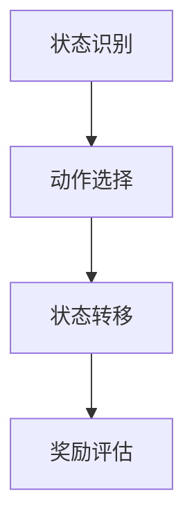
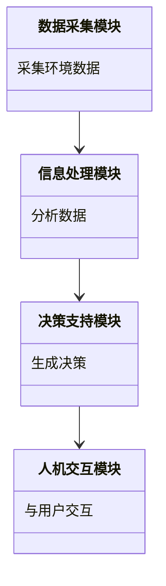
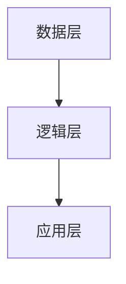
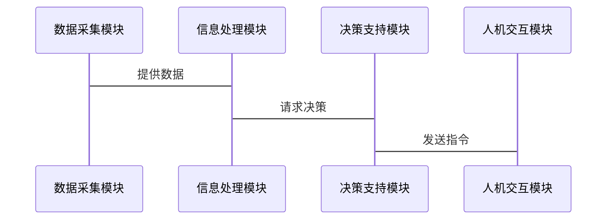

                 


# AI Agent在智能城市应急指挥中的角色

> 关键词：AI Agent, 智能城市, 应急指挥, 任务规划, 自然语言处理, 知识图谱

> 摘要：本文探讨AI Agent在智能城市应急指挥中的角色，分析其核心原理、算法实现、系统架构，并结合实际案例进行深入解读。通过本篇文章，读者将全面了解AI Agent在智能城市应急指挥中的应用价值和实现路径。

---

## 第1章: AI Agent与智能城市概述

### 1.1 AI Agent的基本概念

AI Agent（人工智能代理）是指能够感知环境、自主决策并执行任务的智能体。它具备以下核心特征：
- **自主性**：无需外部干预，自主完成任务。
- **反应性**：能够实时感知环境并做出反应。
- **目标导向**：基于目标驱动行为。
- **学习能力**：通过数据和经验不断优化自身性能。

### 1.2 智能城市的定义与特点

智能城市是通过数字化技术将城市各领域（交通、能源、医疗等）进行深度融合的新型城市形态。其主要特点包括：
- **数据驱动**：依赖海量数据进行决策。
- **实时性**：强调快速响应和实时处理。
- **智能化**：借助AI、大数据等技术实现智能化管理。

### 1.3 智能城市应急指挥的挑战与需求

智能城市应急指挥的核心问题在于如何高效应对突发事件。传统应急指挥系统存在以下问题：
- **信息孤岛**：各部门间数据难以共享。
- **决策滞后**：依赖人工分析，响应速度慢。
- **资源分配不均**：缺乏智能化的资源调度能力。

引入AI Agent可以有效解决这些问题，实现智能化、自动化的应急指挥。

---

## 第2章: AI Agent的核心原理

### 2.1 AI Agent的任务规划与决策

AI Agent的任务规划基于概率论和图论模型，通过以下步骤实现：
1. **目标识别**：明确任务目标。
2. **环境感知**：收集环境数据。
3. **决策制定**：基于数据生成最优决策。
4. **任务执行**：执行决策并反馈结果。

#### 基于概率论的任务规划模型
任务规划模型通过概率分布评估各任务的优先级。例如，假设城市发生火灾，AI Agent会根据火势蔓延速度、人员疏散情况等因素计算最优救援路径。

$$ P(task) = \frac{1}{1 + e^{-x}} $$
其中，\( x \) 表示任务优先级的评估值。

### 2.2 自然语言处理在AI Agent中的应用

自然语言处理（NLP）使AI Agent能够理解并生成人类语言。在应急指挥中，NLP主要用于以下场景：
- **信息抽取**：从新闻报道中提取关键信息。
- **对话交互**：与人类用户进行自然对话。
- **文本生成**：生成应急指挥指令。

### 2.3 知识图谱与推理

知识图谱是AI Agent的知识基础，包含城市结构、应急预案等信息。通过图推理技术，AI Agent可以快速找到最优解决方案。例如，在地震救援中，AI Agent可以通过知识图谱确定最佳救援路径。

---

## 第3章: AI Agent的算法实现与数学模型

### 3.1 基于马尔可夫决策过程的算法

马尔可夫决策过程（MDP）是任务规划的核心算法。其基本步骤如下：
1. **状态识别**：识别当前状态。
2. **动作选择**：基于状态选择最优动作。
3. **状态转移**：根据动作执行状态转移。
4. **奖励评估**：评估动作的奖励值。

#### MDP算法流程图


### 3.2 基于强化学习的算法

强化学习通过试错机制优化决策策略。例如，在交通调度中，AI Agent通过不断尝试不同的调度方案，找到最优解。

$$ R = \sum_{t=1}^{n} \gamma^{t-1} r_t $$
其中，\( R \) 表示总奖励，\( r_t \) 表示第 \( t \) 步的奖励，\( \gamma \) 表示折扣因子。

---

## 第4章: 智能城市应急指挥系统的设计与实现

### 4.1 系统功能模块划分

应急指挥系统主要包括以下功能模块：
- **数据采集模块**：收集环境数据。
- **信息处理模块**：分析数据并生成决策。
- **决策支持模块**：提供决策支持。
- **人机交互模块**：与用户进行交互。

#### 系统功能模块类图


### 4.2 系统架构设计

系统采用分层架构，主要包括数据层、逻辑层和应用层。各层通过接口进行通信。

#### 系统架构图


### 4.3 系统交互设计

系统交互基于序列图，展示各模块之间的协作流程。

#### 系统交互序列图


---

## 第5章: 项目实战

### 5.1 环境配置

安装必要的库：
```bash
pip install numpy matplotlib
```

### 5.2 核心代码实现

任务规划算法实现：
```python
def mdp_decision(current_state, actions):
    # 计算每个动作的优先级
    priorities = {action: calculate_priority(action) for action in actions}
    # 选择优先级最高的动作
    return max(priorities, key=priorities.get)
```

### 5.3 案例分析

以城市火灾为例，AI Agent通过任务规划算法确定最优救援路径，并通过NLP生成救援指令。

---

## 第6章: 总结与展望

### 6.1 最佳实践 Tips

- 在实际应用中，建议结合具体场景优化算法。
- 数据质量对系统性能影响重大，需确保数据的实时性和准确性。

### 6.2 小结

本文详细探讨了AI Agent在智能城市应急指挥中的角色，分析了其核心原理和实现方法，并结合实际案例进行了深入解读。

### 6.3 注意事项

- 系统设计需考虑高可用性和安全性。
- 数据隐私保护是重要课题。

### 6.4 拓展阅读

推荐阅读《强化学习入门》和《知识图谱构建与应用》。

---

作者：AI天才研究院 & 禅与计算机程序设计艺术

