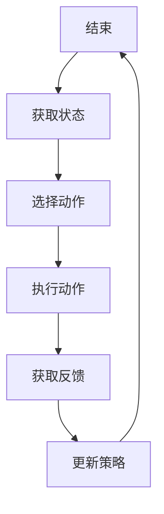
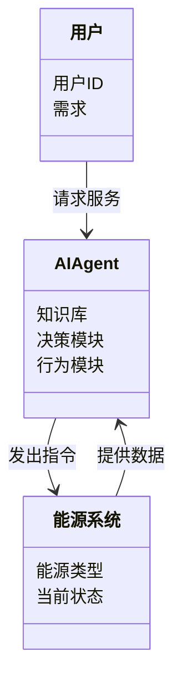
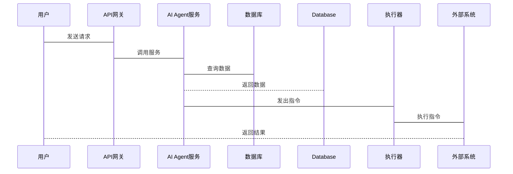

                 


# AI Agent在智能城市能源管理中的实践

> 关键词：AI Agent, 智能城市, 能源管理, 强化学习, 系统架构, 能源优化

> 摘要：本文深入探讨了AI Agent在智能城市能源管理中的应用，从理论到实践，详细分析了AI Agent的核心概念、算法原理、系统架构设计以及实际项目案例。通过具体的实现和案例分析，展示了AI Agent在优化能源分配、预测能源消耗以及应急响应中的巨大潜力。

---

## 第一部分: AI Agent与智能城市能源管理概述

### 第1章: AI Agent的基本概念与背景

#### 1.1 AI Agent的定义与核心原理

**1.1.1 AI Agent的基本概念**

AI Agent（人工智能代理）是指能够感知环境、做出决策并执行操作的智能实体。它能够根据输入的信息（如传感器数据、用户请求等）采取相应的行为，以实现特定的目标。AI Agent的核心特征包括：

1. **自主性**：能够在没有外部干预的情况下自主运行。
2. **反应性**：能够实时感知环境并做出反应。
3. **目标导向性**：通过优化目标函数来实现特定目标。

**1.1.2 AI Agent的核心特征**

- **知识表示**：AI Agent通过知识库表示对环境的理解，包括规则、模型和数据。
- **感知与决策**：通过传感器获取数据，结合知识库进行推理和决策。
- **行为执行**：通过执行器将决策转化为实际操作。

**1.1.3 AI Agent在智能城市中的应用潜力**

AI Agent在智能城市中的应用非常广泛，尤其是在能源管理领域。通过AI Agent，可以实现能源的优化分配、预测能源消耗、应急响应等。

---

#### 1.2 智能城市能源管理的背景

**1.2.1 智能城市的发展现状**

智能城市是指通过物联网、大数据、人工智能等技术，实现城市基础设施的智能化管理。能源管理是智能城市的重要组成部分，涉及电力、燃气、热力等多种能源的优化管理。

**1.2.2 能源管理在智能城市中的重要性**

随着城市化进程的加快，能源消耗量急剧增加，能源管理的重要性日益凸显。智能城市能源管理的目标是通过优化能源分配、降低能源浪费，实现可持续发展。

**1.2.3 当前能源管理面临的挑战**

1. **能源消耗预测的准确性**：由于能源需求受多种因素影响（如天气、用户行为等），预测的准确性是一个重要挑战。
2. **能源分配的实时性**：需要快速响应能源需求的变化，确保能源供应的稳定性。
3. **能源应急响应能力**：在突发事件（如自然灾害）中，需要快速调整能源分配策略。

---

#### 1.3 AI Agent在智能城市能源管理中的作用

**1.3.1 AI Agent如何优化能源分配**

AI Agent可以通过实时感知能源需求，结合历史数据和预测模型，优化能源分配策略。

**1.3.2 AI Agent在能源预测中的应用**

通过机器学习算法，AI Agent可以预测未来的能源需求，帮助城市制定更合理的能源规划。

**1.3.3 AI Agent在能源应急响应中的价值**

在突发事件中，AI Agent可以快速调整能源分配策略，确保关键设施的能源供应。

---

### 第2章: AI Agent的核心概念与联系

#### 2.1 AI Agent的核心概念原理

**2.1.1 知识表示**

知识表示是AI Agent理解环境的基础。通过知识库，AI Agent可以存储和管理各种知识，如能源系统的运行规则、用户行为模式等。

**2.1.2 感知与决策**

感知是AI Agent获取环境信息的过程，通常通过传感器或数据接口实现。决策是基于感知信息和知识库进行推理，选择最优的行为策略。

**2.1.3 行为执行**

行为执行是AI Agent根据决策结果，通过执行器或接口将决策转化为实际操作。

---

#### 2.2 核心概念属性特征对比表

| 概念       | 知识表示 | 感知与决策 | 行为执行 |
|------------|----------|------------|----------|
| AI Agent   | 知识库   | 决策机制   | 行为接口 |
| 能源系统   | 数据模型 | 预测模型   | 调控接口 |

---

#### 2.3 ER实体关系图

```mermaid
er
  actor: 用户
  agent: AI Agent
  energy_system: 能源系统
  prediction: 预测数据
  action: 行为指令
  user -> agent: 请求服务
  agent -> prediction: 获取数据
  agent -> action: 执行指令
  action -> energy_system: 影响系统
```

---

### 第3章: AI Agent的算法原理

#### 3.1 算法原理概述

**3.1.1 基于强化学习的AI Agent**

强化学习是一种通过试错机制优化决策策略的方法。AI Agent通过与环境的交互，逐步优化自己的行为策略，以最大化奖励函数。

**3.1.2 基于马尔可夫决策过程的AI Agent**

马尔可夫决策过程（MDP）是一种描述决策过程的数学模型，广泛应用于AI Agent的决策优化。

**3.1.3 基于规则的AI Agent**

基于规则的AI Agent通过预定义的规则进行决策，适用于规则明确的场景。

---

#### 3.2 算法流程图



---

## 第二部分: 系统分析与架构设计

### 第4章: 系统分析与架构设计

#### 4.1 项目背景

本项目旨在通过AI Agent实现智能城市中的能源优化管理。通过实时感知能源需求，优化能源分配策略，降低能源浪费，提高能源利用效率。

---

#### 4.2 系统功能设计

**4.2.1 领域模型设计**



---

#### 4.3 系统架构设计


---

#### 4.4 系统接口设计

**4.4.1 接口描述**

1. **用户请求接口**：用户通过API网关向AI Agent发送请求。
2. **数据查询接口**：AI Agent通过数据库查询历史数据。
3. **指令执行接口**：AI Agent通过执行器执行指令。

---

#### 4.5 系统交互流程图



---

## 第三部分: 项目实战

### 第5章: 项目实战

#### 5.1 环境安装

**5.1.1 安装Python环境**

```bash
python --version
pip install --upgrade pip
pip install numpy
pip install scikit-learn
pip install matplotlib
```

---

#### 5.2 核心代码实现

**5.2.1 AI Agent实现**

```python
class AI-Agent:
    def __init__(self, knowledge_base):
        self.knowledge_base = knowledge_base

    def perceive(self, input_data):
        # 处理输入数据
        pass

    def decide(self, input_data):
        # 根据输入数据和知识库做出决策
        pass

    def act(self, action):
        # 执行动作
        pass
```

---

#### 5.3 代码解读与分析

**5.3.1 代码解读**

```python
class AI-Agent:
    def __init__(self, knowledge_base):
        self.knowledge_base = knowledge_base

    def perceive(self, input_data):
        # 处理输入数据
        return processed_data

    def decide(self, input_data):
        # 根据输入数据和知识库做出决策
        return action

    def act(self, action):
        # 执行动作
        return result
```

---

#### 5.4 案例分析与实现

**5.4.1 案例分析**

假设某城市电力系统面临负荷预测不准的问题，可以通过AI Agent实现负荷预测和优化。

---

## 第四部分: 最佳实践与总结

### 第6章: 最佳实践与总结

#### 6.1 小结

通过本文的分析与实践，我们可以看到AI Agent在智能城市能源管理中的巨大潜力。通过实时感知、智能决策和优化执行，AI Agent能够显著提高能源利用效率。

---

#### 6.2 注意事项

1. **数据隐私**：在实际应用中，需要确保用户数据的隐私和安全。
2. **算法优化**：需要不断优化AI Agent的算法，以提高预测和决策的准确性。
3. **系统稳定性**：需要确保系统的稳定性和可靠性，特别是在关键的能源管理领域。

---

#### 6.3 拓展阅读

1. 《强化学习：理论与应用》
2. 《智能城市：架构与实践》
3. 《能源管理系统的优化设计》

---

## 作者信息

作者：AI天才研究院/AI Genius Institute  
联系邮箱：contact@aiagent.com  
个人简介：专注于人工智能与智能城市领域的研究与实践，致力于通过技术创新推动能源管理的智能化发展。

---

以上是关于《AI Agent在智能城市能源管理中的实践》的技术博客文章的完整目录大纲和内容框架。

