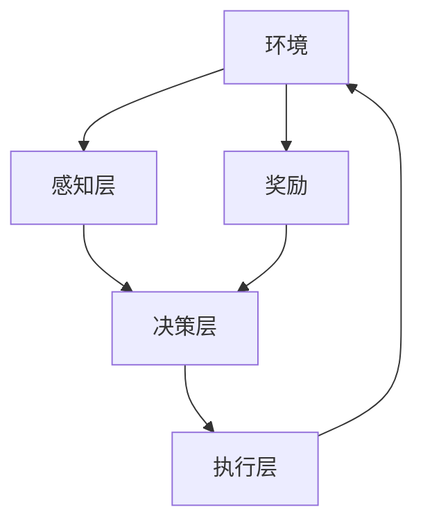
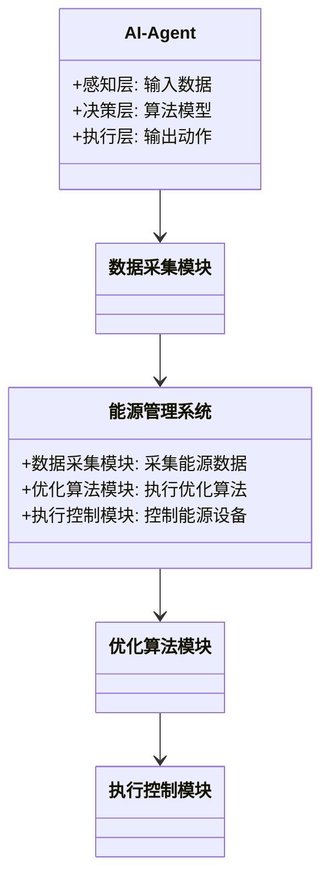
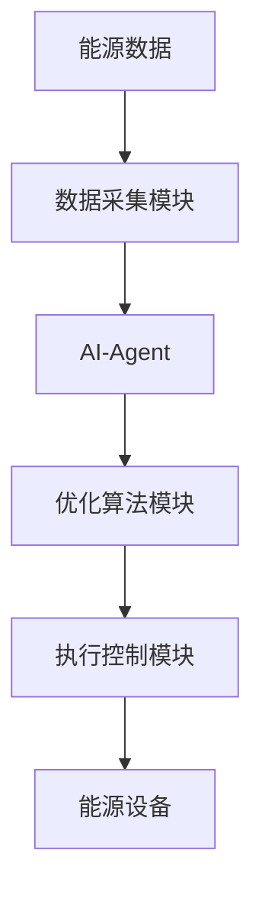

                 


# AI Agent在智能城市能源管理优化中的应用

> **关键词**：AI Agent, 智能城市, 能源管理, 优化算法, 系统架构, 强化学习, 遗传算法

> **摘要**：本文探讨AI Agent在智能城市能源管理中的应用，分析其优化算法、系统架构及实际案例，为智能城市能源管理的优化提供理论依据和实践指导。

---

## 第1章：AI Agent与智能城市能源管理概述

### 1.1 AI Agent的基本概念

AI Agent（人工智能代理）是指能够感知环境、做出决策并执行动作的智能体。它通过传感器获取信息，利用算法处理数据，做出最优决策，并通过执行器与环境交互。

- **AI Agent的特点**：
  - **自主性**：无需外部干预，自主决策。
  - **反应性**：实时感知环境变化并做出反应。
  - **学习性**：通过数据不断优化自身行为。
  - **协作性**：与其他Agent或系统协同工作。

- **AI Agent的分类**：
  - 单智能体：独立完成任务。
  - 多智能体：多个Agent协作完成复杂任务。

### 1.2 智能城市能源管理的背景

智能城市能源管理是指通过智能化技术优化能源的生产、分配和使用，以提高能源效率和减少环境影响。随着城市化进程的加快，能源需求急剧增加，传统能源管理方式已无法满足需求。

- **问题背景与描述**：
  - 能源浪费严重。
  - 能源分配不均。
  - 环境污染加剧。

- **AI Agent的应用前景**：
  - 提高能源利用效率。
  - 实现能源的智能分配。
  - 优化能源消费结构。

---

## 第2章：AI Agent的核心原理与特征

### 2.1 AI Agent的核心原理

AI Agent的核心原理在于其感知-决策-执行的闭环机制。通过传感器获取环境信息，利用算法处理信息并做出决策，最后通过执行器执行决策。

- **感知层**：
  - 传感器获取环境数据。
  - 数据预处理与特征提取。

- **决策层**：
  - 利用算法对数据进行分析，做出最优决策。
  - 决策过程依赖于算法模型，如强化学习、遗传算法等。

- **执行层**：
  - 根据决策结果，通过执行器与环境交互。
  - 执行结果反馈到感知层，形成闭环。

### 2.2 AI Agent的特征对比

通过表格对比AI Agent与其他技术（如传统算法）在能源管理中的表现。

| 特性               | AI Agent                          | 传统算法                          |
|--------------------|-----------------------------------|------------------------------------|
| **自主性**         | 高                                 | 低                                 |
| **实时性**         | 高                                 | 中                                 |
| **适应性**         | 强                                 | 弱                                 |
| **协作能力**       | 强                                 | 一般                               |
| **决策效率**       | 高                                 | 中                                 |
| **学习能力**       | 强                                 | 无                                 |

---

## 第3章：AI Agent的优化算法

### 3.1 强化学习算法

强化学习是一种通过试错方式优化决策的算法。AI Agent通过与环境交互，不断调整策略，以最大化累积奖励。

- **算法流程图**（Mermaid）：



- **Python代码实现**：

```python
import numpy as np
import gym

env = gym.make('CartPole-v0')
env.seed(1)

class AI_Agent:
    def __init__(self, env):
        self.env = env
        self.observation_space = env.observation_space.shape[0]
        self.action_space = env.action_space.n
        self.lr = 0.01
        self.gamma = 0.99
        self.model = self._build_model()

    def _build_model(self):
        # 简单的神经网络模型（此处省略详细实现）
        pass

    def remember(self, state, action, reward, next_state, done):
        # 存储记忆（此处省略详细实现）
        pass

    def act(self, state):
        # 根据当前状态选择动作
        pass

    def replay(self, batch_size):
        # 回放记忆并训练模型
        pass

agent = AI_Agent(env)
for episode in range(100):
    state = env.reset()
    while True:
        action = agent.act(state)
        next_state, reward, done, _ = env.step(action)
        agent.remember(state, action, reward, next_state, done)
        agent.replay(32)
        if done:
            break
```

- **数学模型与公式**：

  - 状态值函数：$$V(s) = \max_a Q(s,a)$$
  - 动作值函数：$$Q(s,a) = r + \gamma \max_{a'} Q(s',a')$$

---

## 第4章：智能城市能源管理系统的架构

### 4.1 项目背景与目标

智能城市能源管理系统的目标是通过AI Agent优化能源的生产、分配和使用，实现能源的高效管理。

- **系统功能设计**（Mermaid领域模型类图）：



- **系统架构设计**（Mermaid系统架构图）：



---

## 第5章：项目实战

### 5.1 环境安装与代码实现

- **环境安装**：
  ```bash
  pip install gym numpy
  ```

- **核心代码实现**：

```python
import gym
import numpy as np

env = gym.make('CartPole-v0')
env.seed(1)

class AI_Agent:
    def __init__(self, env):
        self.env = env
        self.observation_space = env.observation_space.shape[0]
        self.action_space = env.action_space.n
        self.lr = 0.01
        self.gamma = 0.99
        self.model = self._build_model()

    def _build_model(self):
        # 简单的神经网络模型（此处省略详细实现）
        pass

    def remember(self, state, action, reward, next_state, done):
        # 存储记忆（此处省略详细实现）
        pass

    def act(self, state):
        # 根据当前状态选择动作
        pass

    def replay(self, batch_size):
        # 回放记忆并训练模型
        pass

agent = AI_Agent(env)
for episode in range(100):
    state = env.reset()
    while True:
        action = agent.act(state)
        next_state, reward, done, _ = env.step(action)
        agent.remember(state, action, reward, next_state, done)
        agent.replay(32)
        if done:
            break
```

### 5.2 案例分析与解读

通过实际案例分析AI Agent在智能城市能源管理中的应用效果，并总结经验教训。

---

## 第6章：最佳实践与总结

### 6.1 最佳实践

- **系统设计**：
  - 确保系统的实时性和稳定性。
  - 选择合适的算法模型。

- **算法优化**：
  - 根据实际需求调整超参数。
  - 定期更新模型以适应环境变化。

### 6.2 小结

本文详细探讨了AI Agent在智能城市能源管理中的应用，从核心原理到算法实现，再到系统架构，为智能城市能源管理的优化提供了理论依据和实践指导。

---

## 作者信息

作者：AI天才研究院/AI Genius Institute & 禅与计算机程序设计艺术 /Zen And The Art of Computer Programming

---

以上是文章的完整目录大纲，具体内容需要根据每个章节的详细内容进一步扩展。

