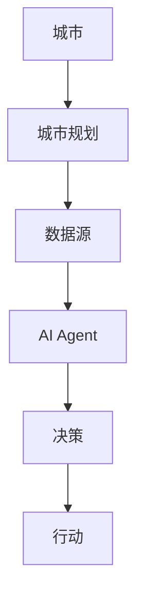
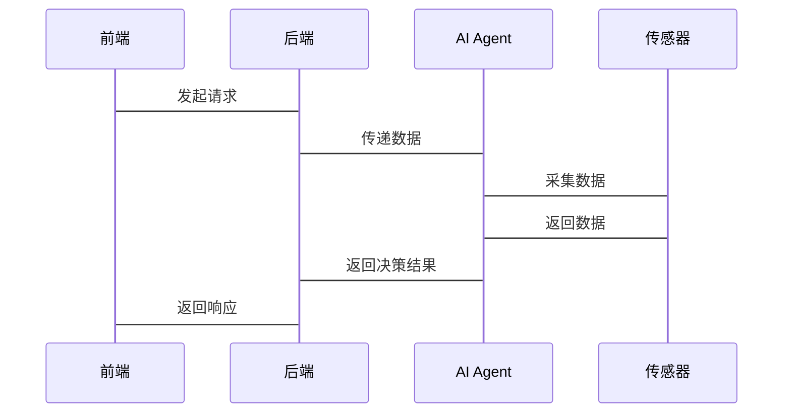

                 


# AI Agent在智能城市规划中的作用

> 关键词：AI Agent, 智能城市, 城市规划, 任务规划, 知识表示, 算法原理

> 摘要：本文探讨AI Agent在智能城市规划中的应用，分析其核心概念、算法原理、系统架构及实际案例，展示AI Agent如何提升城市智能化水平。

---

# 第一部分：引言

# 第1章：AI Agent在智能城市规划中的作用概述

## 1.1 AI Agent的基本概念

### 1.1.1 什么是AI Agent

AI Agent（人工智能代理）是能够感知环境、自主决策并执行任务的智能体。它通过传感器获取信息，利用算法处理数据，做出决策并执行动作，以实现特定目标。

**关键概念**：
- **自主性**：无需外部干预，自主完成任务。
- **反应性**：实时感知环境变化，动态调整行为。
- **目标导向性**：所有行为均以实现目标为导向。

### 1.1.2 AI Agent的核心特征

| 特征 | 描述 |
|------|------|
| 感知能力 | 通过传感器或数据接口获取环境信息。 |
| 决策能力 | 利用算法分析信息，做出最优决策。 |
| 执行能力 | 执行决策动作，影响环境状态。 |
| 学习能力 | 通过经验优化行为策略。 |

### 1.1.3 AI Agent与智能城市的关系

AI Agent是智能城市的执行者，负责城市交通、能源、公共安全等系统的优化与管理，帮助城市实现智能化、高效化运行。

## 1.2 智能城市规划的背景与挑战

### 1.2.1 智能城市的定义与目标

智能城市是利用信息技术优化城市资源，提升居民生活质量，降低运营成本的城市形态。其目标是实现资源高效利用、服务便捷高效、环境友好可持续。

### 1.2.2 智能城市规划中的主要问题

- **资源分配**：如何合理分配交通、能源等资源。
- **信息孤岛**：各部门数据分散，缺乏协同。
- **决策效率**：传统人工决策效率低，难以应对复杂情况。

### 1.2.3 AI Agent在智能城市规划中的作用

AI Agent能够实时感知城市运行状态，分析数据，优化资源配置，提高决策效率，推动城市智能化发展。

## 1.3 本章小结

本章介绍了AI Agent的基本概念及其在智能城市中的作用，强调了AI Agent在解决城市规划问题中的重要性。

---

# 第二部分：AI Agent的核心概念与原理

# 第2章：AI Agent的核心概念与联系

## 2.1 AI Agent的原理

### 2.1.1 任务规划

AI Agent通过任务规划算法，确定最优行动步骤。常用算法包括A*、Dijkstra等。

### 2.1.2 知识表示与推理

知识表示是将城市数据结构化的过程，推理则是基于知识进行逻辑推导。

### 2.1.3 行为选择

行为选择是基于当前状态和目标，选择最优行为的过程。

## 2.2 AI Agent的属性特征对比

| 属性 | 描述 |
|------|------|
| 分类 | 可分为简单反射型、基于模型的反射型等。 |
| 功能 | 包括感知、决策、执行等功能。 |
| 性能 | 表现为反应速度、决策准确率等指标。 |

## 2.3 ER实体关系图



## 2.4 本章小结

本章详细讲解了AI Agent的核心原理及其在智能城市中的应用。

---

# 第三部分：AI Agent的算法原理

# 第3章：AI Agent的核心算法

## 3.1 任务规划算法

### 3.1.1 A*算法

A*算法是一种基于启发式搜索的最短路径算法，常用于任务规划。

#### 3.1.1.1 算法步骤

1. 初始化开放列表和关闭列表。
2. 将起点加入开放列表。
3. 取开放列表中f值最小的节点。
4. 检查是否到达终点。
5. 展开当前节点的邻居节点。
6. 计算每个邻居的f值，加入开放列表。
7. 重复步骤3-6，直到找到终点。

#### 3.1.1.2 代码实现

```python
import heapq

def a_star_search(graph, start, goal):
    open_list = []
    heapq.heappush(open_list, (0, start))
    g_score = {node: float('inf') for node in graph.nodes}
    g_score[start] = 0
    f_score = {node: float('inf') for node in graph.nodes}
    f_score[start] = heuristic(start, goal)

    while open_list:
        current = heapq.heappop(open_list)
        current_node = current[1]

        if current_node == goal:
            return current

        for neighbor in graph.neighbors(current_node):
            tentative_g = g_score[current_node] + graph.weight(current_node, neighbor)
            if tentative_g < g_score[neighbor]:
                g_score[neighbor] = tentative_g
                f_score[neighbor] = g_score[neighbor] + heuristic(neighbor, goal)
                heapq.heappush(open_list, (f_score[neighbor], neighbor))
    return None
```

#### 3.1.1.3 举例说明

假设在智能城市中，AI Agent需要规划一条从A到B的最短路径，使用A*算法，结合启发式函数，能够快速找到最优路径。

### 3.1.2 Dijkstra算法

Dijkstra算法用于解决单源最短路径问题，适用于权重相同的任务规划。

#### 3.1.2.1 算法步骤

1. 初始化距离数组，所有节点距离设为无穷大。
2. 将起点距离设为0，加入优先队列。
3. 取出队列中距离最小的节点。
4. 更新其邻居节点的距离。
5. 重复步骤3-4，直到队列为空。

#### 3.1.2.2 代码实现

```python
import heapq

def dijkstra(graph, start):
    dist = {node: float('inf') for node in graph.nodes}
    dist[start] = 0
    heap = []
    heapq.heappush(heap, (0, start))

    while heap:
        current_dist, current_node = heapq.heappop(heap)
        if current_dist > dist[current_node]:
            continue
        for neighbor, weight in graph.edges[current_node]:
            if dist[neighbor] > current_dist + weight:
                dist[neighbor] = current_dist + weight
                heapq.heappush(heap, (dist[neighbor], neighbor))
    return dist
```

### 3.2 知识表示与推理

#### 3.2.1 知识表示

知识表示是将城市数据结构化的过程，通常使用逻辑符号或概率模型。

#### 3.2.2 推理算法

常用推理算法包括逻辑推理、 Bayesian推理等。

### 3.3 系统设计

#### 3.3.1 系统架构

系统由感知层、决策层、执行层组成，分别负责数据采集、策略制定、指令执行。

#### 3.3.2 数学模型

状态空间：S = {s1, s2, ..., sn}

动作空间：A = {a1, a2, ..., am}

奖励函数：R: S × A → ℝ

#### 3.3.3 优化方法

使用强化学习优化AI Agent的决策策略，通过不断试错，提升奖励值。

---

# 第四部分：系统分析与架构设计

# 第4章：智能城市AI Agent系统分析与架构设计

## 4.1 问题场景介绍

智能城市AI Agent系统用于优化城市交通、能源管理等关键领域。

## 4.2 项目介绍

本项目旨在开发一个基于AI Agent的城市管理系统，实现城市资源的智能化调配。

## 4.3 系统功能设计

### 4.3.1 领域模型

```mermaid
classDiagram
    class 城市管理 {
        +数据源：传感器、数据库
        +决策模块：任务规划、知识表示
        +执行模块：指令输出
    }
   城市管理 --> 传感器：数据采集
    城市管理 --> 数据库：数据存储
    城市管理 --> 执行模块：指令输出
```

### 4.3.2 系统架构


### 4.3.3 接口设计

- 数据接口：传感器数据采集
- 交互接口：用户操作界面
- 执行接口：指令输出

### 4.3.4 交互流程



## 4.4 本章小结

本章详细描述了智能城市AI Agent系统的架构设计和实现方案。

---

# 第五部分：项目实战

# 第5章：AI Agent系统项目实战

## 5.1 环境安装

安装Python、numpy、pandas、scikit-learn、mermaid等工具。

## 5.2 系统核心实现

### 5.2.1 任务规划模块

```python
import heapq

class TaskPlanner:
    def __init__(self, graph):
        self.graph = graph

    def plan(self, start, goal):
        open_list = []
        heapq.heappush(open_list, (0, start))
        g_score = {node: float('inf') for node in self.graph.nodes}
        g_score[start] = 0
        f_score = {node: float('inf') for node in self.graph.nodes}
        f_score[start] = self.graph.heuristic(start, goal)

        while open_list:
            current = heapq.heappop(open_list)
            current_node = current[1]

            if current_node == goal:
                return current

            for neighbor in self.graph.neighbors(current_node):
                tentative_g = g_score[current_node] + self.graph.weight(current_node, neighbor)
                if tentative_g < g_score[neighbor]:
                    g_score[neighbor] = tentative_g
                    f_score[neighbor] = g_score[neighbor] + self.graph.heuristic(neighbor, goal)
                    heapq.heappush(open_list, (f_score[neighbor], neighbor))
        return None
```

### 5.2.2 知识表示模块

```python
from sklearn.naive_bayes import GaussianNB

class KnowledgeBase:
    def __init__(self, data):
        self.model = GaussianNB()
        self.model.fit(data.features, data.labels)

    def infer(self, input_features):
        return self.model.predict(input_features)
```

### 5.2.3 执行模块

```python
class Executor:
    def execute(self, action):
        # 执行具体操作
        pass
```

## 5.3 代码应用解读与分析

详细分析上述代码的功能实现，结合实际案例，说明AI Agent在智能城市中的具体应用。

## 5.4 实际案例分析

以城市交通优化为例，展示AI Agent如何通过任务规划算法，优化交通信号灯控制，缓解交通拥堵。

## 5.5 项目小结

总结项目实现过程中的关键点和经验教训。

---

# 第六部分：总结与展望

# 第6章：总结与展望

## 6.1 本章小结

总结AI Agent在智能城市规划中的应用价值和实现方法。

## 6.2 未来展望

探讨AI Agent在智能城市中的未来发展方向，如多 Agent协作、强化学习优化等。

---

# 作者

作者：AI天才研究院/AI Genius Institute & 禅与计算机程序设计艺术 /Zen And The Art of Computer Programming

