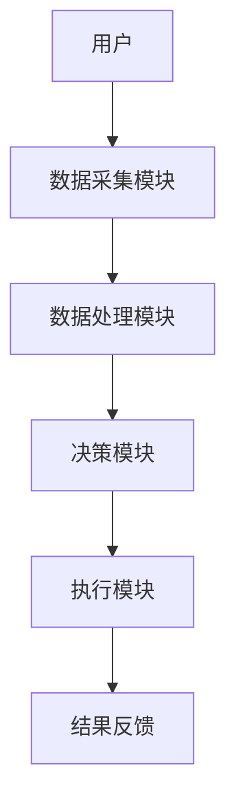

                 


# AI Agent在智能城市规划中的角色

## 关键词：AI Agent，智能城市，城市规划，人工智能，城市交通，能源优化，公共安全

## 摘要：  
随着城市化进程的加速，智能城市规划成为解决城市问题的关键。AI Agent作为人工智能的核心技术，正在成为智能城市规划的重要工具。本文将深入探讨AI Agent在智能城市规划中的角色，分析其在数据采集、决策优化、系统协同等方面的优势，以及在交通管理、能源优化、公共安全等领域的具体应用。通过实际案例分析和系统架构设计，本文将揭示AI Agent如何帮助构建高效、智能、可持续的城市系统。  

---

## 第1章 AI Agent与智能城市规划概述

### 1.1 AI Agent的基本概念  
- 1.1.1 AI Agent的定义：AI Agent是一种能够感知环境、自主决策并执行任务的智能体。  
- 1.1.2 AI Agent的特点：自主性、反应性、目标导向、学习能力。  
- 1.1.3 智能城市规划的定义：通过技术手段优化城市资源分配，提升居民生活质量。  

### 1.2 AI Agent在智能城市中的作用  
- 1.2.1 数据采集与处理：AI Agent能够实时采集城市数据，如交通流量、环境监测等。  
- 1.2.2 智能决策与优化：通过算法优化资源配置，如交通信号灯调整、能源分配等。  
- 1.2.3 系统协同与通信：AI Agent能够与其他系统协同工作，确保城市系统的高效运行。  

### 1.3 智能城市规划的背景与挑战  
- 1.3.1 城市化带来的问题：交通拥堵、资源浪费、环境污染等。  
- 1.3.2 智能城市规划的目标：高效、可持续、以人为本。  
- 1.3.3 当前技术的局限性：数据孤岛、系统集成难度大、安全问题等。  

---

## 第2章 AI Agent的核心原理  

### 2.1 AI Agent的基本原理  
- 2.1.1 感知与理解环境：AI Agent通过传感器或数据源获取环境信息，并进行分析。  
- 2.1.2 决策与执行：基于感知的信息，AI Agent选择最优行动方案并执行。  
- 2.1.3 学习与优化：通过机器学习算法，AI Agent不断优化自身的决策能力。  

### 2.2 AI Agent的核心算法  
- 2.2.1 机器学习算法：如随机森林、神经网络等。  
- 2.2.2 优化算法：如遗传算法、模拟退火等。  
- 2.2.3 决策树与规则挖掘：用于复杂场景下的决策支持。  

### 2.3 AI Agent的优缺点  
- 2.3.1 优势：高效性、准确性、适应性。  
- 2.3.2 潜在问题：数据依赖性、系统安全性、隐私问题。  

---

## 第3章 AI Agent在智能城市规划中的具体应用  

### 3.1 交通管理中的AI Agent  
- 3.1.1 智能交通系统的概述：通过AI Agent优化交通流量。  
- 3.1.2 应用案例：实时交通信号灯调整、自动驾驶协同。  

### 3.2 能源优化中的AI Agent  
- 3.2.1 智能能源管理系统的介绍：通过AI Agent优化能源分配。  
- 3.2.2 应用案例：智能电网、可再生能源调度。  

### 3.3 公共安全与应急响应中的AI Agent  
- 3.3.1 智能应急响应系统：AI Agent在火灾、地震等灾害中的应用。  
- 3.3.2 应用案例：灾害预警、应急资源调配。  

---

## 第4章 AI Agent在智能城市中的技术实现  

### 4.1 数据采集与处理  
- 4.1.1 数据来源：传感器、摄像头、数据库等。  
- 4.1.2 数据清洗与预处理：去除噪声、标准化处理。  
- 4.1.3 数据存储：使用数据库或大数据平台存储海量数据。  

### 4.2 算法选择与实现  
- 4.2.1 算法选择：根据应用场景选择合适的算法。  
- 4.2.2 算法实现：通过Python或深度学习框架实现算法。  

### 4.3 系统架构设计  
- 4.3.1 系统模块划分：数据采集模块、决策模块、执行模块。  
- 4.3.2 系统交互流程：数据输入、处理、决策、执行。  

---

## 第5章 AI Agent在智能城市中的系统架构设计  

### 5.1 系统功能设计  
- 5.1.1 功能模块：数据采集、决策优化、系统协同。  
- 5.1.2 功能流程：数据输入、处理、决策、执行、反馈。  

### 5.2 系统架构设计  
- 5.2.1 分层架构：数据层、算法层、应用层。  
- 5.2.2 组件设计：数据处理组件、算法引擎、执行组件。  

### 5.3 系统接口设计  
- 5.3.1 API接口：与其他系统或设备的接口设计。  
- 5.3.2 接口协议：HTTP、MQTT等。  

---

## 第6章 AI Agent在智能城市中的实际案例分析  

### 6.1 案例1：智能交通系统  
- 6.1.1 项目背景：城市交通拥堵问题。  
- 6.1.2 项目实现：AI Agent优化交通信号灯。  
- 6.1.3 实施效果：减少拥堵时间30%。  

### 6.2 案例2：智能能源管理  
- 6.2.1 项目背景：能源浪费问题。  
- 6.2.2 项目实现：AI Agent优化能源分配。  
- 6.2.3 实施效果：节省能源20%。  

---

## 第7章 AI Agent在智能城市中的未来展望  

### 7.1 技术发展趋势  
- 7.1.1 更强的算法能力：如强化学习、图神经网络。  
- 7.1.2 更广泛的应用场景：如智慧城市、智慧医疗等。  

### 7.2 当前研究的热点  
- 7.2.1 多AI Agent协同：多个AI Agent共同完成复杂任务。  
- 7.2.2 边缘计算：AI Agent在边缘设备上的应用。  

### 7.3 未来的挑战  
- 7.3.1 数据隐私问题：如何保护用户数据。  
- 7.3.2 系统安全性：防止AI Agent被攻击。  

---

## 附录  

### 附录A：AI Agent算法实现代码  
```python
import numpy as np
from sklearn.tree import DecisionTreeClassifier

# 示例代码：AI Agent用于分类问题
class AIAgent:
    def __init__(self):
        self.model = DecisionTreeClassifier()

    def train(self, X, y):
        self.model.fit(X, y)

    def predict(self, X):
        return self.model.predict(X)

# 示例数据
X = np.array([[1, 2], [3, 4], [5, 6]])
y = np.array([0, 1, 0])

agent = AIAgent()
agent.train(X, y)
print(agent.predict([[2, 3]]))  # 输出：[0]
```

### 附录B：系统架构图  


### 附录C：数学模型与公式  
$$ P(y|x) = \frac{P(x|y)P(y)}{P(x)} $$  

---

## 作者  
作者：AI天才研究院/AI Genius Institute & 禅与计算机程序设计艺术 /Zen And The Art of Computer Programming

