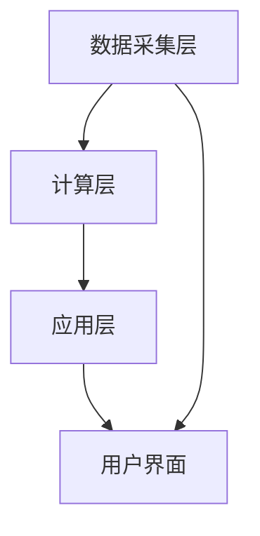

                 


# AI Agent在智能城市规划决策中的角色

## 关键词
AI Agent, 智能城市, 决策支持, 城市规划, 强化学习, 贝叶斯网络, 系统架构

## 摘要
随着城市化进程的加快和城市规模的不断扩大，传统的城市规划和决策方法面临着效率低下、资源浪费和决策不准确等问题。AI Agent作为一种智能化的决策支持工具，正在逐步应用于智能城市规划中。本文详细探讨了AI Agent在智能城市规划决策中的角色，分析了其核心概念、算法原理、系统架构设计以及实际应用场景。通过案例分析和项目实战，展示了AI Agent如何有效提升城市规划的效率和准确性。本文还总结了AI Agent在智能城市规划中的最佳实践和未来发展方向。

---

## 第1章: AI Agent的基本概念与背景

### 1.1 AI Agent的定义与特征
#### 1.1.1 AI Agent的定义
AI Agent（人工智能代理）是指能够感知环境并采取行动以实现特定目标的智能系统。与传统软件不同，AI Agent具有自主性、反应性和目标导向性，能够根据环境变化动态调整行为。

#### 1.1.2 AI Agent的核心特征
- **自主性**：AI Agent能够独立决策，无需外部干预。
- **反应性**：AI Agent能够实时感知环境并做出反应。
- **目标导向性**：AI Agent的行为以实现特定目标为导向。
- **学习能力**：AI Agent可以通过经验不断优化自身的决策能力。

#### 1.1.3 AI Agent与传统决策系统的区别
传统的决策系统通常是基于规则的静态系统，而AI Agent能够动态学习和适应环境变化，具有更强的灵活性和适应性。

### 1.2 智能城市规划的背景与挑战
#### 1.2.1 智能城市的定义与发展
智能城市是指通过物联网、大数据、人工智能等技术手段，将城市中的各个系统和资源进行智能化管理和优化，以提高城市运行效率和居民生活质量。

#### 1.2.2 城市规划中的传统方法与局限性
传统的城市规划方法通常依赖于人工经验和静态数据，难以应对城市动态变化带来的复杂问题。例如，交通拥堵、资源浪费、环境污染等问题难以通过传统方法有效解决。

#### 1.2.3 AI技术在城市规划中的应用前景
AI技术的应用能够显著提升城市规划的效率和准确性。通过AI Agent，城市规划者可以更好地应对复杂的城市问题，优化资源配置，提升城市运行效率。

### 1.3 AI Agent在智能城市中的角色
#### 1.3.1 AI Agent在城市规划中的功能定位
AI Agent在城市规划中主要负责数据采集、分析、决策和优化。它可以实时监测城市运行状态，分析数据，提出最优解决方案，并动态调整规划策略。

#### 1.3.2 AI Agent与其他技术的协同作用
AI Agent可以与物联网、大数据、云计算等技术协同工作，形成一个完整的智能城市生态系统。例如，AI Agent可以结合物联网数据，实时优化交通流量。

#### 1.3.3 AI Agent对城市决策效率的提升
通过AI Agent，城市规划者可以快速获取实时数据，进行精准分析和预测，从而提高决策效率和准确性。

---

## 第2章: AI Agent的核心概念与原理

### 2.1 AI Agent的核心概念
#### 2.1.1 状态空间与动作空间
- **状态空间**：表示系统可能处于的所有状态的集合。
- **动作空间**：表示系统在每个状态下可能采取的所有行动的集合。

#### 2.1.2 AI Agent的感知与行动
- **感知**：AI Agent通过传感器或其他数据源获取环境信息。
- **行动**：AI Agent基于感知信息采取相应的行动，以实现目标。

#### 2.1.3 多智能体系统与协作
多智能体系统是指多个AI Agent协同工作的系统。在智能城市中，多个AI Agent可以协作完成复杂的任务，例如交通管理、资源分配等。

### 2.2 AI Agent的决策机制
#### 2.2.1 基于规则的决策
基于规则的决策是通过预定义的规则来指导AI Agent的行动。这种方法简单易懂，但在复杂环境下可能缺乏灵活性。

#### 2.2.2 基于学习的决策
基于学习的决策是通过机器学习算法（如强化学习、深度学习）来训练AI Agent，使其能够从经验中学习并优化决策策略。

#### 2.2.3 基于优化的决策
基于优化的决策是通过数学优化方法（如线性规划、动态规划）来求解最优决策方案。

### 2.3 AI Agent的算法原理
#### 2.3.1 强化学习算法
强化学习是一种通过试错学习来优化决策策略的方法。AI Agent通过与环境交互，不断调整动作以最大化累计奖励。

- **Q-learning算法**：一种经典的强化学习算法，通过更新Q值表来学习最优策略。
- **DQN算法**：深度Q网络（Deep Q-Network）结合了深度学习和强化学习，能够处理高维状态空间。

#### 2.3.2 深度学习算法
深度学习通过多层神经网络来学习数据的特征表示，常用于处理复杂的非结构化数据，如图像、文本等。

#### 2.3.3 贝叶斯网络
贝叶斯网络是一种概率推理模型，能够根据先验概率和观测数据，计算后验概率并做出决策。

---

## 第3章: AI Agent在智能城市规划中的应用

### 3.1 智能城市规划的场景分析
#### 3.1.1 交通流量优化
通过AI Agent实时监测交通流量，优化信号灯控制，减少拥堵和等待时间。

#### 3.1.2 城市资源分配
AI Agent可以根据实时需求，优化资源配置，例如电力、水资源的分配。

#### 3.1.3 城市扩展与布局
AI Agent可以模拟城市扩展过程，评估不同布局方案的优劣，选择最优方案。

### 3.2 AI Agent在城市规划中的具体应用
#### 3.2.1 交通网络优化
通过AI Agent优化交通网络结构，减少交通拥堵，提高交通效率。

#### 3.2.2 城市基础设施规划
AI Agent可以评估不同基础设施布局的优劣，优化城市基础设施建设。

#### 3.2.3 公共服务资源配置
AI Agent可以根据人口分布和需求，优化公共服务资源的分配，例如学校、医院的布局。

### 3.3 AI Agent在城市决策中的优势
#### 3.3.1 提高决策效率
AI Agent能够快速处理大量数据，提供实时决策支持。

#### 3.3.2 增强决策的准确性
通过机器学习和大数据分析，AI Agent能够做出更准确的预测和决策。

#### 3.3.3 支持动态调整与优化
AI Agent能够根据环境变化动态调整决策策略，实现持续优化。

---

## 第4章: AI Agent的算法实现与数学模型

### 4.1 强化学习算法
#### 4.1.1 Q-learning算法
Q-learning算法通过更新Q值表来学习最优策略。其数学公式如下：

$$ Q(s, a) \leftarrow Q(s, a) + \alpha \left[r + \max_{a'} Q(s', a') - Q(s, a)\right] $$

其中，$\alpha$是学习率，$r$是奖励，$s$是当前状态，$a$是当前动作，$s'$是下一个状态。

#### 4.1.2 DQN算法
DQN算法结合了深度学习和强化学习，通过神经网络近似Q值函数。其核心思想是通过经验回放和目标网络来稳定训练过程。

#### 4.1.3 算法实现的代码示例
以下是一个简单的Q-learning算法的Python代码示例：

```python
import numpy as np

class QAgent:
    def __init__(self, state_size, action_size, learning_rate=0.1):
        self.state_size = state_size
        self.action_size = action_size
        self.learning_rate = learning_rate
        self.q_table = np.zeros((state_size, action_size))
    
    def take_action(self, state):
        return np.argmax(self.q_table[state])
    
    def update_q_table(self, state, action, reward, next_state):
        target = reward + np.max(self.q_table[next_state])
        self.q_table[state, action] += self.learning_rate * (target - self.q_table[state, action])
```

### 4.2 贝叶斯网络模型
#### 4.2.1 贝叶斯网络的定义
贝叶斯网络是一种有向无环图（DAG），表示随机变量之间的条件概率关系。

#### 4.2.2 贝叶斯网络的构建
贝叶斯网络的构建需要确定变量之间的依赖关系，并估计相应的条件概率。

#### 4.2.3 贝叶斯网络的应用
贝叶斯网络可以用于风险评估、诊断推理等领域。例如，在智能城市中，可以通过贝叶斯网络预测交通拥堵的概率。

### 4.3 数学模型与公式
#### 4.3.1 概率论基础
概率论是贝叶斯网络的基础。概率的基本公式包括：

- 条件概率公式：$$ P(A|B) = \frac{P(A \cap B)}{P(B)} $$
- 贝叶斯公式：$$ P(A|B) = \frac{P(B|A)P(A)}{P(B)} $$

#### 4.3.2 贝叶斯公式
贝叶斯公式用于根据观测数据更新概率分布，其数学表达式为：

$$ P(\theta|D) = \frac{P(D|\theta)P(\theta)}{P(D)} $$

其中，$\theta$是模型参数，$D$是观测数据。

#### 4.3.3 强化学习中的数学模型
强化学习的核心是通过与环境交互，学习最优策略。其数学模型包括状态、动作、奖励和策略等概念。

---

## 第5章: 智能城市规划的系统架构设计

### 5.1 系统架构概述
智能城市规划系统通常包括数据采集层、计算层和应用层。数据采集层负责收集城市运行数据，计算层负责处理数据并生成决策支持，应用层负责展示结果和执行决策。

### 5.2 系统功能设计
#### 5.2.1 数据采集与处理
通过传感器、摄像头等设备采集城市运行数据，并进行清洗和预处理。

#### 5.2.2 数据分析与建模
利用机器学习算法对数据进行建模，生成预测结果和决策建议。

#### 5.2.3 决策支持与优化
基于模型结果，生成最优决策方案，并动态调整规划策略。

### 5.3 系统架构设计
#### 5.3.1 系统整体架构
以下是一个智能城市规划系统的整体架构图：



#### 5.3.2 系统接口设计
系统接口设计需要考虑数据输入输出、算法调用和结果展示等部分。

#### 5.3.3 系统交互设计
系统交互设计需要考虑用户与系统的交互流程，例如用户输入需求、系统生成方案、用户确认方案等。

---

## 第6章: 项目实战

### 6.1 项目背景与目标
本项目旨在通过AI Agent优化城市交通流量，减少拥堵和等待时间。

### 6.2 环境安装与配置
需要安装Python、NumPy、Matplotlib等库，并配置深度学习框架（如TensorFlow或PyTorch）。

### 6.3 核心代码实现
以下是一个简单的AI Agent实现代码：

```python
import numpy as np

class TrafficAgent:
    def __init__(self, num_states, num_actions, learning_rate=0.1):
        self.num_states = num_states
        self.num_actions = num_actions
        self.learning_rate = learning_rate
        self.q_table = np.zeros((num_states, num_actions))
    
    def take_action(self, state):
        return np.argmax(self.q_table[state])
    
    def update_q_table(self, state, action, reward, next_state):
        target = reward + np.max(self.q_table[next_state])
        self.q_table[state, action] += self.learning_rate * (target - self.q_table[state, action])
```

### 6.4 代码应用解读与分析
通过训练Q-learning算法，AI Agent可以学习到最优的信号灯控制策略，从而优化交通流量。

### 6.5 案例分析与结果解读
通过实际案例分析，展示了AI Agent在交通优化中的应用效果，验证了算法的有效性。

### 6.6 项目小结
本项目通过AI Agent实现了城市交通流量的优化，验证了AI技术在智能城市规划中的潜力。

---

## 第7章: 最佳实践与未来展望

### 7.1 最佳实践
- **数据质量**：确保数据的准确性和完整性。
- **算法选择**：根据具体问题选择合适的算法。
- **系统集成**：注重系统的可扩展性和可维护性。

### 7.2 小结
本文详细探讨了AI Agent在智能城市规划决策中的角色，分析了其核心概念、算法原理和系统架构设计，并通过实际案例展示了其应用效果。

### 7.3 注意事项
在实际应用中，需要注意算法的可解释性、数据隐私和系统安全等问题。

### 7.4 拓展阅读
推荐读者阅读《强化学习入门》、《贝叶斯网络原理与应用》等相关书籍，以深入了解AI Agent的核心技术。

---

## 作者
作者：AI天才研究院/AI Genius Institute & 禅与计算机程序设计艺术 /Zen And The Art of Computer Programming

