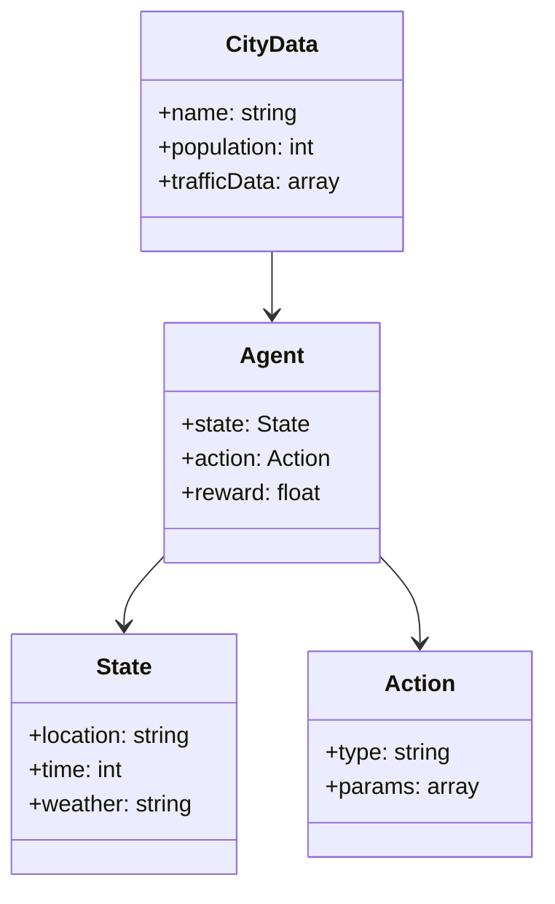
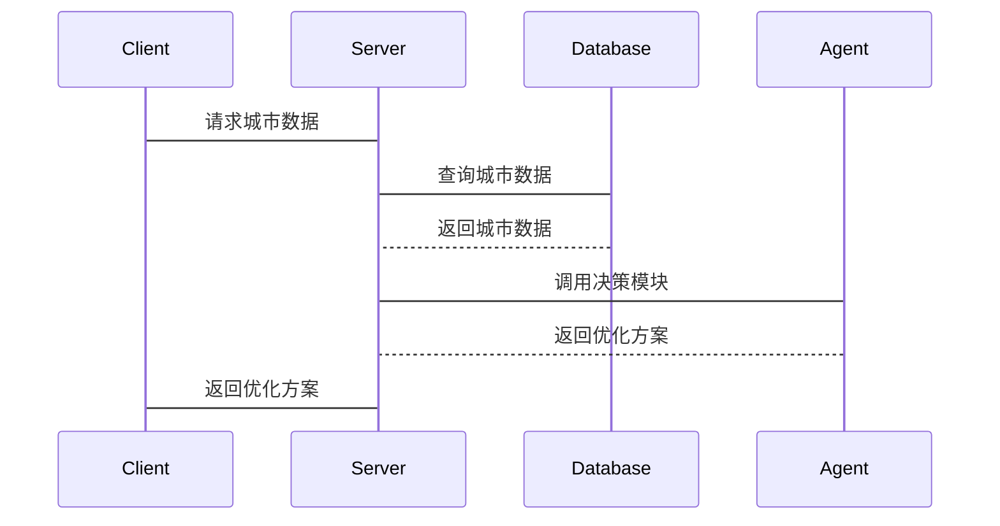

                 

# AI Agent在智能城市规划模拟中的角色

> 关键词：AI Agent, 智能城市, 城市规划, 强化学习, 多智能体协作, 城市模拟

> 摘要：本文探讨了AI Agent在智能城市规划模拟中的角色，分析了其核心原理、应用场景及算法实现。通过案例分析，展示了AI Agent如何提升城市规划的效率和效果。本文旨在为城市规划者和AI技术开发者提供理论支持和实践指导。

---

# 第1章 AI Agent与智能城市规划概述

## 1.1 AI Agent的基本概念

### 1.1.1 AI Agent的定义与特点

AI Agent（人工智能代理）是指能够感知环境、自主决策并执行任务的智能体。它具备以下特点：
- **自主性**：能够独立决策，无需外部干预。
- **反应性**：能实时感知环境并做出反应。
- **学习能力**：通过数据和经验优化决策策略。
- **协作性**：能在多智能体环境中协同工作。

### 1.1.2 AI Agent的核心功能与类型

AI Agent的核心功能包括：
- **感知环境**：通过传感器或数据输入获取信息。
- **信息处理**：对信息进行分析和处理。
- **决策制定**：基于信息生成最优决策。
- **行为执行**：根据决策执行具体操作。

AI Agent的类型：
- **简单反射型**：基于当前状态做出反应。
- **基于模型的反射型**：结合内部模型和环境信息进行决策。
- **目标驱动型**：根据目标制定行动计划。
- **效用驱动型**：通过最大化效用函数进行决策。

### 1.1.3 智能城市规划的定义与目标

智能城市规划是指利用AI、大数据、物联网等技术，优化城市空间布局、交通系统、资源分配等。其目标是提高城市的运行效率、居民生活质量，并实现可持续发展。

---

## 1.2 AI Agent在智能城市中的作用

### 1.2.1 AI Agent在城市规划中的应用场景

AI Agent在城市规划中的应用场景包括：
- **城市空间布局优化**：通过模拟不同布局方案，选择最优解。
- **交通流模拟与优化**：实时调整交通信号灯，缓解拥堵。
- **资源分配与调度**：优化能源、水资源等的分配。

### 1.2.2 AI Agent如何提升城市规划效率

AI Agent通过以下方式提升城市规划效率：
- **自动化决策**：快速处理大量数据，生成优化方案。
- **实时反馈**：根据实时数据动态调整规划。
- **多目标优化**：在多个目标之间找到平衡点。

### 1.2.3 AI Agent在城市模拟中的优势

AI Agent在城市模拟中的优势：
- **高效性**：能够快速处理复杂问题。
- **适应性**：能够根据环境变化自适应调整。
- **协作性**：多个AI Agent可以协同工作，完成复杂任务。

---

## 1.3 本章小结

本章介绍了AI Agent的基本概念、核心功能及其在智能城市规划中的作用。通过分析AI Agent的特点和应用场景，我们看到它在城市规划模拟中的潜力和优势。

---

# 第2章 AI Agent的核心原理

## 2.1 AI Agent的感知与决策机制

### 2.1.1 环境感知的实现方式

AI Agent的环境感知可以通过以下方式实现：
- **传感器输入**：如摄像头、激光雷达等。
- **数据输入**：如城市交通数据、气象数据等。
- **知识库查询**：基于已有知识库进行推理。

### 2.1.2 信息处理与状态识别

信息处理包括数据清洗、特征提取、模型训练等。状态识别则通过分类、聚类等技术实现。

### 2.1.3 决策算法的原理

决策算法是AI Agent的核心，常用算法包括：
- **基于规则的决策**：根据预设规则做出决策。
- **基于模型的决策**：通过模型预测最佳决策。
- **强化学习决策**：通过试错学习优化决策策略。

---

## 2.2 AI Agent的行为规划与执行

### 2.2.1 行为规划的策略选择

行为规划策略包括：
- **贪心策略**：每一步选择局部最优解。
- **规划算法**：如A*算法、Dijkstra算法等。
- **强化学习策略**：通过试错学习最优策略。

### 2.2.2 动作执行的实现方式

动作执行可以通过以下方式实现：
- **直接执行**：AI Agent直接控制执行机构。
- **间接执行**：通过中间媒介（如API）实现。

### 2.2.3 状态反馈与调整机制

AI Agent通过反馈机制不断调整自身行为，以达到最优状态。

---

## 2.3 AI Agent的通信与协作

### 2.3.1 多智能体协作的基本原理

多智能体协作通过通信协议实现信息共享和任务分配。

### 2.3.2 通信协议与信息共享

常用的通信协议包括：
- **HTTP/HTTPS**：用于Web服务通信。
- **WebSocket**：用于实时通信。
- **消息队列**：如Kafka、RabbitMQ等。

### 2.3.3 协作任务的分配与协调

协作任务的分配可以通过负载均衡算法实现，协调则通过协商机制完成。

---

## 2.4 本章小结

本章详细讲解了AI Agent的核心原理，包括感知与决策、行为规划与执行、通信与协作等部分。这些原理为后续的应用提供了理论基础。

---

# 第3章 AI Agent在城市规划模拟中的应用

## 3.1 城市空间布局优化

### 3.1.1 空间布局的数学模型

空间布局优化可以通过数学模型（如遗传算法）实现。

### 3.1.2 AI Agent在空间优化中的应用

AI Agent可以通过模拟不同布局方案，选择最优解。

### 3.1.3 案例分析：某城市空间优化方案

通过具体案例展示AI Agent在空间优化中的应用效果。

---

## 3.2 交通流模拟与优化

### 3.2.1 交通流模拟的基本原理

交通流模拟可以通过交通流模型实现。

### 3.2.2 AI Agent在交通优化中的应用

AI Agent可以通过实时调整交通信号灯，缓解拥堵。

### 3.2.3 案例分析：智能交通系统优化

通过具体案例展示AI Agent在交通优化中的应用效果。

---

## 3.3 城市资源分配与调度

### 3.3.1 资源分配的数学模型

资源分配可以通过优化模型（如线性规划）实现。

### 3.3.2 AI Agent在资源调度中的应用

AI Agent可以通过实时监测资源使用情况，优化调度方案。

### 3.3.3 案例分析：城市应急资源调度

通过具体案例展示AI Agent在应急资源调度中的应用效果。

---

## 3.4 本章小结

本章通过具体案例展示了AI Agent在城市空间布局优化、交通流模拟与优化、资源分配与调度中的应用。

---

# 第4章 AI Agent的算法实现与数学模型

## 4.1 强化学习算法

### 4.1.1 Q-learning算法原理

Q-learning算法通过试错学习，更新Q值函数。

### 4.1.2 DQN算法的实现

DQN（Deep Q-Network）算法通过深度神经网络实现Q值函数。

### 4.1.3 算法实现的数学模型

Q-learning的数学模型如下：

$$ Q(s,a) = Q(s,a) + \alpha [r + \gamma \max Q(s',a') - Q(s,a)] $$

---

## 4.2 蒙特卡洛树搜索

### 4.2.1 蒙特卡洛树搜索的基本原理

蒙特卡洛树搜索通过模拟大量可能的决策路径，选择最优解。

### 4.2.2 蒙特卡洛树搜索在AI Agent中的应用

蒙特卡洛树搜索常用于游戏AI、路径规划等领域。

### 4.2.3 算法实现的数学模型

蒙特卡洛树搜索的数学模型较为复杂，通常涉及概率计算。

---

## 4.3 多智能体协作算法

### 4.3.1 多智能体协作的基本原理

多智能体协作通过通信协议实现信息共享和任务分配。

### 4.3.2 多智能体协作的实现方式

多智能体协作可以通过分布式计算、消息传递等方式实现。

### 4.3.3 算法实现的数学模型

多智能体协作的数学模型通常涉及博弈论、分布式计算等领域。

---

## 4.4 本章小结

本章详细讲解了AI Agent的算法实现，包括强化学习、蒙特卡洛树搜索、多智能体协作等算法的原理和应用。

---

# 第5章 项目实战：智能城市规划模拟系统

## 5.1 项目介绍

### 5.1.1 项目背景

本项目旨在利用AI Agent技术，优化城市空间布局、交通流、资源分配等。

### 5.1.2 项目目标

通过模拟不同城市规划方案，选择最优解。

## 5.2 系统功能设计

### 5.2.1 系统功能模块

系统功能模块包括：
- **环境感知模块**：获取城市数据。
- **决策模块**：生成优化方案。
- **执行模块**：调整城市规划。

### 5.2.2 系统功能设计的mermaid类图

---

## 5.3 系统架构设计

### 5.3.1 系统架构设计的mermaid架构图

---

## 5.4 系统接口设计

### 5.4.1 API接口设计

API接口设计包括：
- **数据获取接口**：获取城市数据。
- **决策接口**：生成优化方案。
- **执行接口**：调整城市规划。

---

## 5.5 系统交互设计

### 5.5.1 系统交互的mermaid序列图

---

## 5.6 本章小结

本章通过一个实际项目展示了AI Agent在智能城市规划模拟中的应用，详细讲解了系统设计、接口设计和交互设计。

---

# 第6章 最佳实践与注意事项

## 6.1 最佳实践 tips

### 6.1.1 系统设计 tips

- 确保系统可扩展性。
- 采用模块化设计。
- 定期更新模型。

### 6.1.2 算法选择 tips

- 根据具体场景选择合适的算法。
- 优化算法参数。
- 定期评估算法效果。

### 6.1.3 数据管理 tips

- 确保数据质量。
- 保护数据隐私。
- 采用分布式存储。

## 6.2 注意事项

### 6.2.1 系统设计中的注意事项

- 避免过度复杂化系统。
- 确保系统安全性。
- 考虑系统的可维护性。

### 6.2.2 算法实现中的注意事项

- 确保算法的可解释性。
- 避免算法过拟合。
- 定期监控算法性能。

### 6.2.3 数据使用中的注意事项

- 遵守数据隐私法规。
- 确保数据准确性。
- 定期更新数据。

---

## 6.3 本章小结

本章总结了AI Agent在智能城市规划模拟中的最佳实践和注意事项，帮助读者更好地设计和实现相关系统。

---

# 第7章 总结与展望

## 7.1 本章总结

AI Agent在智能城市规划模拟中发挥着重要作用，通过自动化决策、实时反馈和多智能体协作，显著提升了城市规划的效率和效果。

## 7.2 未来展望

未来，随着AI技术的不断发展，AI Agent在智能城市规划中的应用将更加广泛和深入。我们需要进一步研究和优化AI Agent的算法，探索更多应用场景。

---

# 作者：AI天才研究院 & 禅与计算机程序设计艺术

