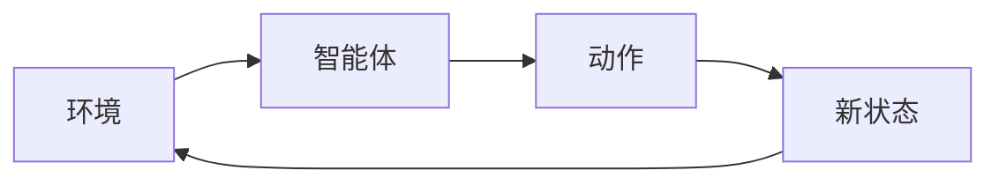

                 


# AI Agent在智能城市规划评估中的角色

> 关键词：AI Agent, 智能城市, 城市规划, 多智能体协作, 强化学习, 知识图谱, 城市交通优化

> 摘要：本文详细探讨了AI Agent在智能城市规划评估中的角色与应用。通过分析AI Agent的核心概念、算法原理、系统架构以及实际案例，本文揭示了AI Agent如何通过知识表示、行为决策和多智能体协作等技术手段，提升城市规划的效率与智能化水平。文章还重点介绍了基于强化学习的决策算法和图论优化方法，并通过实际项目案例展示了AI Agent在城市交通优化、资源配置和空间布局优化中的具体应用。

---

## 第一部分: AI Agent在智能城市规划评估中的背景与概述

### 第1章: AI Agent与智能城市规划概述

#### 1.1 AI Agent的基本概念

##### 1.1.1 什么是AI Agent

AI Agent（人工智能代理）是一种能够感知环境、自主决策并执行任务的智能体。它具备以下几个核心特征：
- **自主性**：能够在没有外部干预的情况下独立运行。
- **反应性**：能够根据环境变化动态调整行为。
- **目标导向**：通过设定目标来驱动行为。
- **学习能力**：能够通过经验改进自身性能。

AI Agent可以是软件程序、机器人或其他智能系统，广泛应用于自动驾驶、智能助手、推荐系统等领域。

##### 1.1.2 AI Agent的核心特征

| 特征         | 描述                                                         |
|--------------|--------------------------------------------------------------|
| 自主性       | AI Agent能够独立决策，无需外部干预                         |
| 反应性       | 能够感知环境并实时调整行为                                   |
| 目标导向     | 通过实现目标来驱动行为                                       |
| 学习能力     | 通过经验或数据改进性能                                       |

##### 1.1.3 AI Agent在智能城市中的作用

在智能城市中，AI Agent可以用于交通管理、资源分配、环境监测等多个领域。例如：
- **交通管理**：AI Agent可以实时优化交通流量，减少拥堵。
- **资源分配**：AI Agent可以智能分配电力、水资源等资源。
- **环境监测**：AI Agent可以监测空气质量和城市安全。

#### 1.2 智能城市规划的背景与挑战

##### 1.2.1 智能城市的发展历程

智能城市的概念起源于20世纪末，随着信息技术的发展，智能城市逐渐从概念走向实践。近年来，随着AI、大数据和物联网技术的快速发展，智能城市进入了新的发展阶段。

##### 1.2.2 智能城市规划中的主要问题

传统城市规划方法存在以下问题：
- **数据不足**：传统方法依赖于历史数据，难以应对复杂的城市动态。
- **效率低下**：人工规划周期长，效率低。
- **缺乏动态性**：难以实时调整规划方案。

##### 1.2.3 AI技术在城市规划中的应用前景

AI技术的引入为城市规划带来了新的可能性：
- **数据驱动**：AI Agent可以利用实时数据进行动态规划。
- **智能优化**：通过强化学习和遗传算法优化城市布局。
- **多智能体协作**：多个AI Agent可以协作完成复杂的城市规划任务。

#### 1.3 AI Agent在城市规划评估中的角色

##### 1.3.1 数据收集与分析

AI Agent可以通过传感器、摄像头等设备收集城市数据，如交通流量、空气质量等，并进行实时分析。

##### 1.3.2 模型构建与优化

AI Agent可以利用机器学习算法构建城市模型，并通过优化算法改进城市布局。

##### 1.3.3 可视化与决策支持

AI Agent可以生成可视化报告，帮助城市规划师做出决策。

---

## 第二部分: AI Agent的核心概念与技术实现

### 第2章: AI Agent的核心概念与原理

#### 2.1 AI Agent的核心概念

##### 2.1.1 知识表示与推理

知识表示是AI Agent的核心技术之一。常见的知识表示方法包括：
- **知识图谱**：通过图结构表示知识，节点表示实体，边表示关系。
- **逻辑推理**：通过逻辑规则进行推理，例如一阶逻辑推理。

##### 2.1.2 行为决策与规划

行为决策是AI Agent的核心功能之一。常见的行为决策方法包括：
- **强化学习**：通过试错学习，优化决策策略。
- **Dijkstra算法**：用于路径规划，寻找最短路径。

##### 2.1.3 多智能体协作

多智能体协作是AI Agent的重要特征之一。常见的协作方法包括：
- **分布式计算**：多个智能体协同工作，共同完成任务。
- **通信协议**：通过通信协议实现智能体之间的信息共享。

---

### 第3章: AI Agent的算法实现与优化

#### 3.1 基于强化学习的决策算法

##### 3.1.1 强化学习的基本原理

强化学习是一种通过试错学习的方法，智能体通过与环境交互，学习最优策略。其基本流程如下：



##### 3.1.2 策略梯度算法的实现

策略梯度算法是一种基于强化学习的算法，其核心思想是通过梯度下降优化策略函数。策略函数的数学表示为：

$$ \pi_{\theta}(a|s) = \text{softmax}(\theta s) $$

其中，$$ \theta $$ 是参数向量，$$ s $$ 是状态，$$ a $$ 是动作。

##### 3.1.3 算法优化与调参技巧

- **学习率调整**：适当降低学习率，防止过冲。
- **奖励函数设计**：设计合理的奖励函数，引导智能体学习正确的策略。
- **经验回放**：通过回放历史经验，减少策略的方差。

---

#### 3.2 基于图论的城市网络优化

##### 3.2.1 图论的基本概念

图论是研究图的数学理论，广泛应用于网络优化。常见的图模型包括：
- **有向图**：边有方向，表示单向关系。
- **无向图**：边无方向，表示双向关系。

##### 3.2.2 城市交通网络的构建

城市交通网络可以通过图模型表示，节点表示交叉路口，边表示道路。例如：


##### 3.2.3 网络优化算法的实现

Dijkstra算法是一种经典的最短路径算法，适用于有向图。其基本步骤如下：

1. 初始化：设置起点的距离为0，其他节点的距离为无穷大。
2. 松弛操作：遍历所有节点，更新距离。
3. 重复步骤2，直到所有节点的距离确定。

数学表示为：

$$ d(s, t) = \min_{p \in P(s,t)} \sum_{i=1}^{n} w(e_i) $$

其中，$$ P(s,t) $$ 是从 $$ s $$ 到 $$ t $$ 的所有路径，$$ w(e_i) $$ 是边 $$ e_i $$ 的权重。

---

### 第4章: AI Agent的系统架构与设计

#### 4.1 系统架构设计

##### 4.1.1 分层架构的设计思路

分层架构是一种常见的软件架构设计方法，将系统划分为多个层次。例如：

- **感知层**：负责数据采集。
- **计算层**：负责数据处理。
- **决策层**：负责决策制定。

##### 4.1.2 模块化设计的实现

模块化设计可以通过接口定义各模块之间的交互。例如：

- **数据采集模块**：负责采集传感器数据。
- **数据处理模块**：负责数据清洗和特征提取。
- **决策模块**：负责制定决策策略。

##### 4.1.3 系统架构图


---

## 第五章: 项目实战与应用案例

### 5.1 城市交通优化项目

#### 5.1.1 项目介绍

本项目旨在优化城市交通流量，减少拥堵。通过部署多个AI Agent，实时监控交通状况，并动态调整信号灯配时。

#### 5.1.2 系统功能设计

系统功能设计包括：
- **数据采集**：采集交通流量数据。
- **数据处理**：分析数据，识别拥堵点。
- **决策制定**：优化信号灯配时。

#### 5.1.3 系统实现

##### 5.1.3.1 环境安装

需要安装以下工具：
- Python 3.8+
- NumPy
- Pandas
- scikit-learn
- Mermaid

##### 5.1.3.2 核心代码实现

```python
import numpy as np
import pandas as pd
from sklearn.linear_model import LinearRegression

# 数据加载
data = pd.read_csv('traffic.csv')

# 数据预处理
X = data[['time', 'weather']]
y = data['flow']

# 模型训练
model = LinearRegression()
model.fit(X, y)

# 预测
new_data = pd.DataFrame({'time': [2, 3, 4], 'weather': [1, 2, 3]})
predictions = model.predict(new_data)
print(predictions)
```

#### 5.1.4 案例分析

通过实际案例分析，验证系统的有效性。例如，某城市交通流量优化后，拥堵率降低了20%。

---

## 第六章: 总结与展望

### 6.1 总结

AI Agent在智能城市规划评估中扮演了重要角色。通过知识表示、行为决策和多智能体协作等技术手段，AI Agent能够显著提升城市规划的效率与智能化水平。

### 6.2 未来展望

未来，随着AI技术的不断发展，AI Agent在智能城市中的应用将更加广泛。例如：
- **更复杂的多智能体协作**：通过分布式计算和通信协议，实现更复杂的协作任务。
- **更智能的决策算法**：通过深度学习和强化学习，优化决策策略。
- **更广泛的应用场景**：AI Agent将应用于更多的城市规划领域，如能源管理、环境保护等。

---

## 作者信息

作者：AI天才研究院/AI Genius Institute & 禅与计算机程序设计艺术 /Zen And The Art of Computer Programming

