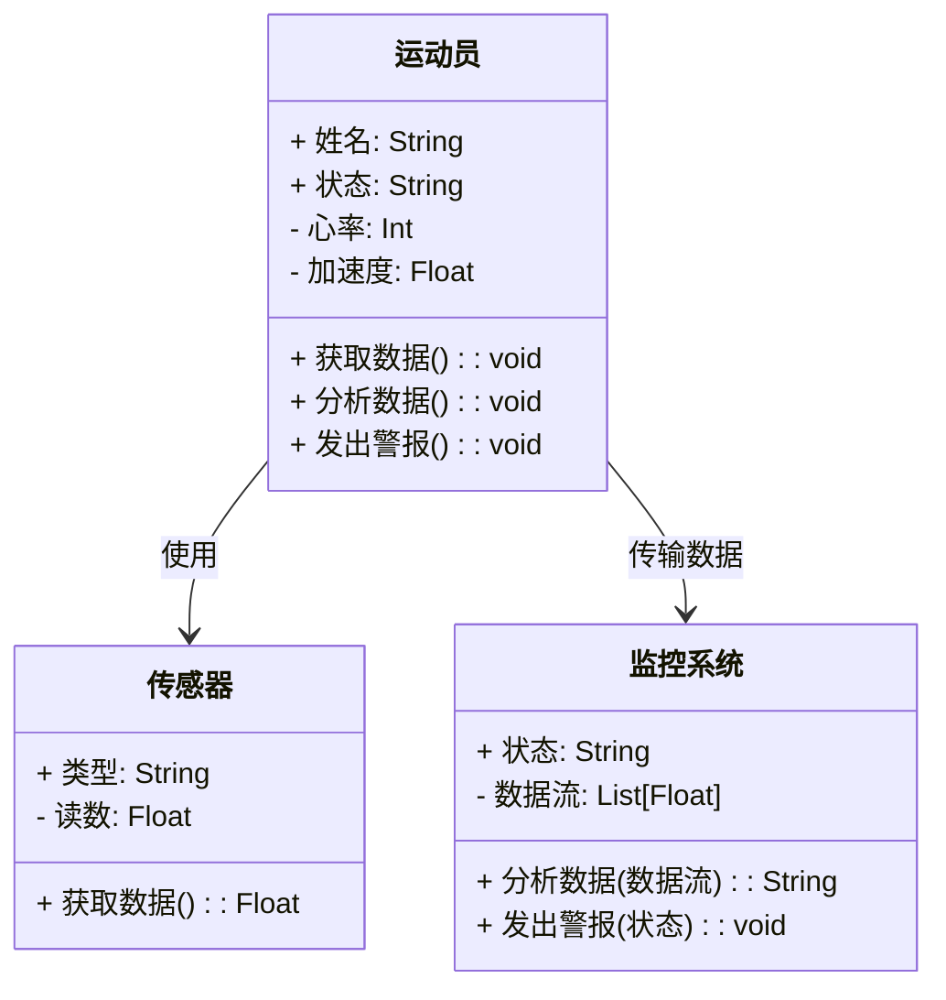
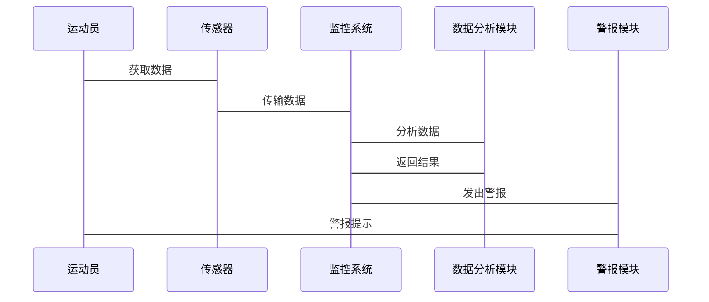

                 


# AI Agent在智能头盔中的运动安全监控

## 关键词
AI Agent, 智能头盔, 运动安全监控, 人工智能, 运动损伤预防

## 摘要
本文详细探讨AI Agent在智能头盔中的应用，特别是在运动安全监控方面的创新与实践。通过分析AI Agent的核心概念、算法原理及系统架构，结合实际案例，展示其在预防运动损伤、实时健康监测等方面的优势，为运动安全领域提供新的解决方案。

# 目录大纲

## 第一部分: AI Agent在智能头盔中的运动安全监控概述

### 第1章: AI Agent与运动安全监控的背景介绍
1.1 问题背景与描述
1.1.1 传统运动安全监控的局限性
1.1.2 运动损伤的高发问题
1.1.3 AI Agent在运动安全中的应用潜力

1.2 问题解决与边界
1.2.1 AI Agent如何解决运动安全问题
1.2.2 系统的边界与外延
1.2.3 核心概念的结构与组成

1.3 本章小结

### 第2章: AI Agent的核心概念与原理
2.1 AI Agent的基本原理
2.1.1 感知层: 数据采集与处理
2.1.2 决策层: 状态分析与判断
2.1.3 执行层: 警报与干预

2.2 核心概念的属性特征对比
2.2.1 感知层的特征对比
2.2.2 决策层的特征对比
2.2.3 执行层的特征对比

2.3 ER实体关系图
```mermaid
erDiagram
    athlete: 运动员
    sensor: 传感器
    monitor: 监控系统
    alert: 警报
    action: 干预措施
    athlete --> sensor: 使用
    sensor --> monitor: 传输数据
    monitor --> alert: 发出
    alert --> action: 触发
```

2.4 本章小结

### 第3章: AI Agent的算法原理与数学模型
3.1 算法原理
3.1.1 基于视觉的运动分析
3.1.2 基于生理数据的健康监测
3.1.3 数据融合技术

3.2 数学模型与公式
3.2.1 运动追踪的卡尔曼滤波公式
$$ \text{状态更新} = \text{预测状态} + \text{观测值} \times \text{观测噪声协方差} $$

3.2.2 健康状态评估的线性回归模型
$$ y = a_1x_1 + a_2x_2 + \dots + a_nx_n + b $$

3.3 算法流程

## 第二部分: 系统分析与架构设计

### 第4章: 系统分析与架构设计
4.1 问题场景介绍
4.1.1 运动员在运动中的各种状态
4.1.2 可能面临的危险情况

4.2 系统功能设计
4.2.1 数据采集模块
4.2.2 数据分析模块
4.2.3 警报与干预模块

4.3 领域模型


4.4 系统架构设计
4.4.1 分层架构
4.4.2 微服务架构

4.5 系统接口设计
4.5.1 数据接口
4.5.2 警报接口
4.5.3 用户接口

4.6 系统交互


## 第三部分: 项目实战

### 第5章: 项目实战
5.1 环境安装
5.1.1 Python安装与配置
5.1.2 依赖库安装
5.1.3 开发工具配置

5.2 核心代码实现
5.2.1 数据采集模块
5.2.2 数据分析模块
5.2.3 警报与干预模块

5.3 代码应用解读与分析
5.3.1 数据采集模块的实现细节
5.3.2 数据分析模块的算法实现
5.3.3 警报模块的触发条件

5.4 实际案例分析
5.4.1 预防膝盖受伤案例
5.4.2 监测疲劳状态案例
5.4.3 紧急情况下的快速反应

5.5 项目小结

## 第四部分: 最佳实践与注意事项

### 第6章: 最佳实践与注意事项
6.1 小贴士
6.1.1 数据质量的重要性
6.1.2 模型更新的频率
6.1.3 隐私保护的注意事项

6.2 本章小结

## 第五部分: 总结与展望

### 第7章: 总结与展望
7.1 各章重点回顾
7.2 本书总结
7.3 未来展望
7.3.1 更精准的运动分析
7.3.2 更智能的预防措施
7.3.3 更广泛的运动类型支持

## 参考文献与扩展阅读
- 参考文献列表
- 相关技术文档链接
- 进一步学习资源推荐

## 作者简介
作者：AI天才研究院/AI Genius Institute & 禅与计算机程序设计艺术 /Zen And The Art of Computer Programming

---

这个目录大纲确保了文章的逻辑清晰、结构紧凑，并涵盖了所有必要的内容，从背景介绍到系统设计，再到项目实战和最佳实践，帮助读者全面理解AI Agent在智能头盔中的运动安全监控应用。

