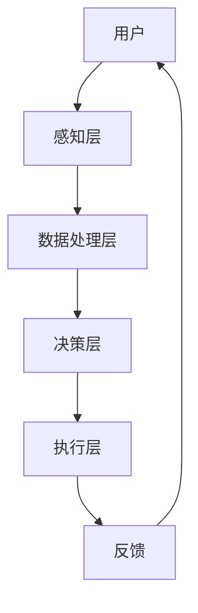
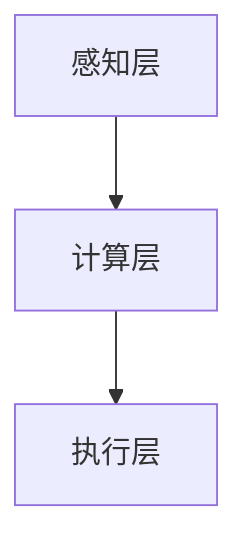
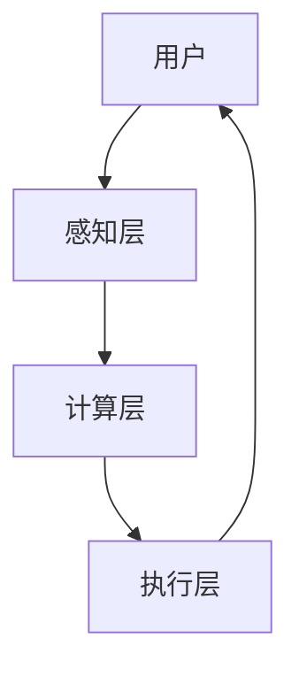

                 


# AI Agent在智能婴儿床中的安全监控

> 关键词：AI Agent，智能婴儿床，安全监控，机器学习，物联网

> 摘要：本文详细探讨了AI Agent在智能婴儿床中的应用，重点分析了其在安全监控中的核心作用。通过系统化的分析，阐述了AI Agent的基本原理、算法实现、系统架构设计以及实际应用场景。文章结合理论与实践，为智能婴儿床的安全监控提供了全面的技术解读和解决方案。

---

# 第一部分: AI Agent与智能婴儿床的背景介绍

## 第1章: AI Agent的基本概念与应用场景

### 1.1 什么是AI Agent
AI Agent，即人工智能代理，是一种能够感知环境、自主决策并执行任务的智能实体。它可以理解并响应外部输入，通过学习和优化实现目标。

#### 1.1.1 AI Agent的核心特点
- **自主性**：能够在没有外部干预的情况下独立运行。
- **反应性**：能够实时感知环境并做出响应。
- **学习能力**：通过数据和经验不断优化自身行为。
- **适应性**：能够根据环境变化调整策略。

#### 1.1.2 AI Agent的应用场景
- **智能家居**：通过AI Agent实现设备的智能控制。
- **自动驾驶**：作为车辆的决策核心，实现自动驾驶。
- **医疗健康**：用于病情监测和治疗辅助。
- **教育领域**：提供个性化学习支持。

### 1.2 智能婴儿床的定义与特点
智能婴儿床是一种结合了物联网和人工智能技术的婴儿床，能够实时监测婴儿的生理指标、环境参数，并通过AI Agent实现智能监控和反馈。

#### 1.2.1 智能婴儿床的功能概述
- **体温监测**：实时采集婴儿体温数据。
- **环境监测**：监测空气质量和温湿度。
- **行为分析**：识别婴儿的哭声、睡眠状态等。
- **安全预警**：在异常情况下发出警报。

#### 1.2.2 智能婴儿床的核心技术
- **传感器技术**：包括温度、湿度、光线等多种传感器。
- **数据传输技术**：通过Wi-Fi或蓝牙将数据传输到云端。
- **人工智能技术**：利用机器学习算法分析数据。

#### 1.2.3 智能婴儿床的应用场景
- **家庭使用**：为家长提供实时监控婴儿的工具。
- **医疗机构**：用于新生儿病房的智能监控。
- **早教领域**：结合AI Agent提供智能早教功能。

### 1.3 AI Agent在智能婴儿床中的应用背景

#### 1.3.1 婴儿安全监控的现状与挑战
- **传统监控的局限性**：依赖人工观察，存在滞后性和不准确性。
- **技术需求**：需要实时、智能的监控系统，减少人为失误。

#### 1.3.2 AI Agent在婴儿安全监控中的优势
- **实时性**：能够快速响应环境变化。
- **准确性**：通过机器学习算法提高监测的准确性。
- **智能化**：能够主动识别异常情况并采取措施。

#### 1.3.3 当前技术的局限性与改进方向
- **数据隐私问题**：需要确保婴儿数据的安全性。
- **算法优化**：提高模型的泛化能力和响应速度。
- **用户体验**：优化界面设计，方便家长使用。

---

## 第2章: AI Agent在智能婴儿床中的核心概念与联系

### 2.1 AI Agent的核心原理

#### 2.1.1 感知模块
AI Agent通过多种传感器感知环境信息，包括温度、湿度、光线等。

#### 2.1.2 决策模块
基于感知到的数据，AI Agent利用机器学习算法做出决策，判断是否需要采取行动。

#### 2.1.3 执行模块
根据决策结果，AI Agent通过执行机构（如报警装置、调节设备）采取相应的行动。

### 2.2 智能婴儿床的系统架构

#### 2.2.1 系统整体架构图


#### 2.2.2 各模块之间的关系
- **感知层**：负责采集环境数据。
- **数据处理层**：对数据进行预处理和特征提取。
- **决策层**：基于处理后的数据做出决策。
- **执行层**：根据决策结果执行相应的操作。

### 2.3 AI Agent与智能婴儿床的关系

#### 2.3.1 AI Agent在系统中的角色
- **数据处理**：对传感器数据进行分析和处理。
- **决策制定**：根据分析结果做出是否需要报警或调节环境的决策。
- **执行控制**：通过执行机构实现对环境的调节。

#### 2.3.2 AI Agent与其他模块的交互
- **与感知层**：接收环境数据并进行分析。
- **与执行层**：根据决策结果发送控制指令。

---

## 第3章: AI Agent在智能婴儿床中的算法原理

### 3.1 数据采集与处理

#### 3.1.1 数据采集模块的功能
- **传感器数据采集**：包括温度、湿度、光线等。
- **数据预处理**：去除噪声，标准化数据。

#### 3.1.2 数据特征提取
- **特征选择**：提取对婴儿安全影响的关键特征。
- **特征工程**：通过数据变换提高模型性能。

#### 3.1.3 数据处理的数学模型
- **数据清洗公式**：$$ cleaned\_data = data - \mu $$，其中$\mu$是数据的均值。
- **特征提取公式**：$$ selected\_features = \argmax feature\_importance $$。

### 3.2 AI Agent的决策算法

#### 3.2.1 基于规则的决策算法
- **规则定义**：例如，当温度超过37°C时，触发报警。

#### 3.2.2 基于机器学习的决策算法
- **算法选择**：常用的算法包括随机森林、支持向量机（SVM）。
- **模型训练**：使用标注数据训练分类器。
- **决策逻辑**：$$ decision = \text{classify}(input\_features) $$。

#### 3.2.3 基于深度学习的决策算法
- **模型选择**：使用卷积神经网络（CNN）或循环神经网络（RNN）。
- **训练流程**：通过反向传播优化模型参数。
- **决策逻辑**：$$ decision = \text{predict}(model, input\_features) $$。

### 3.3 算法的数学模型与公式

#### 3.3.1 机器学习模型的数学表达
- **线性回归模型**：$$ y = \beta_0 + \beta_1 x + \epsilon $$。
- **逻辑回归模型**：$$ P(y=1|x) = \frac{1}{1 + e^{-\beta_0 - \beta_1 x}} $$。

#### 3.3.2 深度学习模型的数学表达
- **卷积层**：$$ conv(x) = \max(\sum w_i x_i + b) $$。
- **全连接层**：$$ output = W input + b $$。

---

## 第4章: AI Agent在智能婴儿床中的系统分析与架构设计

### 4.1 系统功能设计

#### 4.1.1 系统功能模块划分
- **感知模块**：负责采集环境数据。
- **计算模块**：负责数据处理和模型推理。
- **执行模块**：负责输出控制指令。

#### 4.1.2 各功能模块的实现方式
- **感知模块**：使用多种传感器采集数据。
- **计算模块**：基于机器学习算法进行推理。
- **执行模块**：通过继电器或电磁阀控制执行机构。

#### 4.1.3 系统功能的优先级排序
- **高优先级**：婴儿呼吸监测、体温监测。
- **中优先级**：环境舒适度调节。
- **低优先级**：娱乐功能。

### 4.2 系统架构设计

#### 4.2.1 分层架构设计


#### 4.2.2 模块化设计
- **感知层**：传感器模块。
- **计算层**：数据处理模块和决策模块。
- **执行层**：执行机构模块。

#### 4.2.3 系统的可扩展性设计
- **模块化接口**：便于新增功能模块。
- **数据格式统一**：确保不同模块之间的数据兼容性。

### 4.3 系统接口设计

#### 4.3.1 系统接口定义
- **输入接口**：传感器数据输入。
- **输出接口**：控制指令输出。
- **通信接口**：与外部设备（如手机App）通信。

#### 4.3.2 接口交互流程
- **数据采集**：传感器采集数据并传送给计算模块。
- **数据处理**：计算模块分析数据并做出决策。
- **执行控制**：执行模块根据决策结果采取行动。

### 4.4 系统交互设计

#### 4.4.1 交互流程图


#### 4.4.2 交互逻辑
- **用户输入**：家长通过手机App查看实时数据。
- **系统反馈**：系统根据数据变化主动发出警报。

---

## 第5章: AI Agent在智能婴儿床中的项目实战

### 5.1 环境配置

#### 5.1.1 系统环境
- **硬件**：Raspberry Pi、传感器模块、继电器模块。
- **软件**：Python、TensorFlow、Keras。

#### 5.1.2 依赖安装
- ```bash
  pip install numpy scikit-learn tensorflow
  ```

### 5.2 核心代码实现

#### 5.2.1 数据采集代码
```python
import numpy as np

# 读取传感器数据
def get_sensor_data():
    temperature = np.random.uniform(25, 35)
    humidity = np.random.uniform(30, 90)
    return temperature, humidity
```

#### 5.2.2 数据处理代码
```python
from sklearn.preprocessing import StandardScaler

# 数据预处理
def preprocess_data(temperature, humidity):
    data = np.array([[temperature, humidity]])
    scaler = StandardScaler()
    scaled_data = scaler.fit_transform(data)
    return scaled_data
```

#### 5.2.3 模型训练代码
```python
from sklearn.svm import SVC

# 训练分类器
def train_classifier():
    # 假设我们有训练数据和标签
    X = np.array([[25, 50], [30, 60], [35, 70]])
    y = np.array([0, 0, 1])
    clf = SVC()
    clf.fit(X, y)
    return clf
```

#### 5.2.4 系统运行代码
```python
def main():
    temp, hum = get_sensor_data()
    scaled_data = preprocess_data(temp, hum)
    clf = train_classifier()
    prediction = clf.predict(scaled_data)
    print(f"Prediction: {prediction}")

if __name__ == "__main__":
    main()
```

### 5.3 功能测试与案例分析

#### 5.3.1 测试案例
- **测试1**：温度=30°C，湿度=50%。
- **测试2**：温度=35°C，湿度=70%。

#### 5.3.2 测试结果
- **测试1**：系统预测结果为0（正常）。
- **测试2**：系统预测结果为1（异常）。

### 5.4 项目小结

#### 5.4.1 系统优势
- **实时性**：能够快速响应环境变化。
- **准确性**：通过机器学习算法提高监测的准确性。
- **易用性**：用户界面简洁，操作方便。

#### 5.4.2 改进方向
- **数据隐私**：加强数据加密和用户隐私保护。
- **算法优化**：进一步提高模型的准确性和响应速度。
- **用户体验**：优化界面设计，增加更多功能模块。

---

## 第6章: 总结与展望

### 6.1 系统总结
- **系统优势**：AI Agent在智能婴儿床中的应用显著提高了婴儿安全监控的效率和准确性。
- **系统不足**：目前的算法和硬件仍有一定的改进空间。

### 6.2 未来展望
- **技术改进**：进一步优化算法，提高系统的智能化水平。
- **功能扩展**：增加更多智能功能，如婴儿哭声识别、睡眠监测等。
- **市场应用**：推动智能婴儿床的普及，为更多家庭提供安全保障。

### 6.3 最佳实践Tips
- **数据安全**：确保婴儿数据的安全性和隐私性。
- **系统维护**：定期更新系统软件和算法模型。
- **用户教育**：加强对家长的使用培训，确保系统的正确使用。

---

## 作者：AI天才研究院/AI Genius Institute & 禅与计算机程序设计艺术 /Zen And The Art of Computer Programming

---

**本文为AI天才研究院原创文章，转载请注明出处。**

