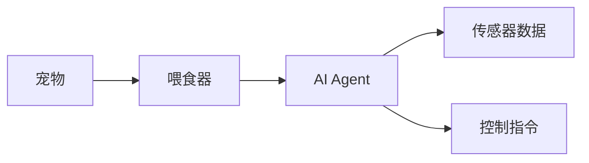
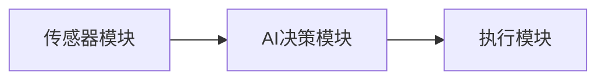
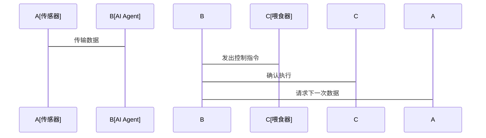

                 


# AI Agent在智能宠物喂食器中的定量控制

> 关键词：AI Agent, 智能宠物喂食器, 定量控制, 强化学习, 模糊逻辑, 系统架构设计

> 摘要：本文探讨了AI Agent在智能宠物喂食器中的应用，重点分析了定量控制的实现。通过强化学习和模糊逻辑算法，结合系统架构设计，详细讲解了AI Agent如何优化喂食过程，实现精准控制。

---

# 第一部分: AI Agent在智能宠物喂食器中的背景介绍

## 第1章: 问题背景与问题描述

### 1.1 问题背景

#### 1.1.1 智能宠物喂食器的发展现状

智能宠物喂食器近年来快速发展，通过自动化技术实现定时喂食。然而，现有产品多基于简单的定时控制，缺乏智能化和个性化。

#### 1.1.2 AI Agent技术的兴起与应用

AI Agent（人工智能代理）广泛应用于自动驾驶、智能家居等领域。其核心是通过感知环境并执行目标优化任务。

#### 1.1.3 宠物喂食器与AI Agent的结合需求

宠物健康受喂食方式影响，传统喂食器无法满足个性化需求。AI Agent可实现智能决策，优化喂食策略。

### 1.2 问题描述

#### 1.2.1 宠物喂食的常见问题

- 餐次固定，无法根据宠物活动调整。
- 喂食量不准确，易导致肥胖或营养不良。
- 无法实时感知宠物状态。

#### 1.2.2 定量控制的必要性

精准控制喂食量，根据宠物体重、活动量调整。

#### 1.2.3 AI Agent在喂食控制中的作用

通过环境感知和决策优化，实现智能喂食控制。

### 1.3 问题解决与边界

#### 1.3.1 AI Agent在喂食控制中的解决方案

利用传感器数据和AI算法，实时调整喂食策略。

#### 1.3.2 系统边界与功能范围

- 传感器：监测宠物活动和食量。
- 控制模块：执行喂食指令。
- 交互界面：用户配置参数。

#### 1.3.3 系统的外延与限制

- 传感器精度影响准确性。
- 网络延迟影响实时性。
- 算法复杂度影响性能。

### 1.4 概念结构与核心要素

#### 1.4.1 核心概念的组成

- AI Agent：感知环境，决策优化。
- 智能喂食器：硬件设备，执行喂食。
- 定量控制：精确控制喂食量。

#### 1.4.2 系统模块的划分

- 数据采集：传感器数据。
- 决策系统：AI算法。
- 执行机构：喂食器机械结构。

#### 1.4.3 核心要素的相互关系

AI Agent通过传感器数据优化决策，控制喂食器执行。

---

## 第2章: 核心概念与联系

### 2.1 AI Agent的核心原理

#### 2.1.1 AI Agent的定义与特点

AI Agent是智能主体，具备感知、推理和行动能力。

#### 2.1.2 AI Agent与智能喂食器的结合

AI Agent通过传感器数据优化喂食策略。

### 2.2 智能宠物喂食器的功能分析

#### 2.2.1 喂食器的基本功能

- 定时喂食。
- 定量控制。
- 传感器监测。

#### 2.2.2 定量控制的实现方式

- 根据传感器数据动态调整。
- 个性化喂食策略。

#### 2.2.3 喂食器与AI Agent的交互机制

- 数据输入：传感器信号。
- 决策输出：控制指令。

### 2.3 核心概念的对比分析

#### 2.3.1 AI Agent与传统控制算法的对比

| 特性       | AI Agent                          | 传统控制算法                  |
|------------|------------------------------------|------------------------------|
| 决策方式   | 基于环境数据动态调整              | 预设规则                      |
| 学习能力   | 具备学习能力                      | 无学习能力                    |
| 精度       | 高精度                            | 低精度                        |

#### 2.3.2 定量控制与定时控制的对比

| 特性       | 定量控制                          | 定时控制                      |
|------------|------------------------------------|------------------------------|
| 控制方式   | 根据传感器数据调整                | 固定时间触发                  |
| 精确性     | 高精度                            | 中低精度                      |
| 响应速度   | 快速响应                          | 固定响应                      |

#### 2.3.3 不同喂食器方案的优缺点对比

| 方案       | 优点                               | 缺点                               |
|------------|------------------------------------|------------------------------------|
| 定时喂食   | 实现简单                           | 无法根据宠物状态调整             |
| 定量喂食   | 精准控制                           | 传感器精度要求高                 |
| AI Agent控制 | 动态优化，个性化                   | 算法复杂度高，开发难度大         |

### 2.4 实体关系图



---

# 第三部分: 算法原理讲解

## 第3章: AI Agent的算法原理

### 3.1 强化学习算法

#### 3.1.1 强化学习的定义与特点

强化学习通过试错学习，利用奖励机制优化决策策略。

#### 3.1.2 强化学习在喂食控制中的应用

- 状态空间：宠物活动、食量等。
- 动作空间：喂食量调整。
- 奖励机制：宠物健康指标。

#### 3.1.3 强化学习算法的流程

1. 状态感知：获取传感器数据。
2. 决策：选择动作。
3. 执行：调整喂食量。
4. 反馈：获得奖励或惩罚。
5. 学习：更新策略。

#### 3.1.4 强化学习算法的数学模型

状态转移矩阵：
$$ P(s' | s, a) $$
奖励函数：
$$ R(s, a) $$

### 3.2 模糊逻辑算法

#### 3.2.1 模糊逻辑的定义与特点

模糊逻辑处理模糊信息，适合非线性、复杂问题。

#### 3.2.2 模糊逻辑在喂食控制中的应用

- 模糊化处理：将传感器数据转化为模糊集合。
- 推理：根据规则库生成控制指令。
- 解模糊：确定具体喂食量。

#### 3.2.3 模糊逻辑算法的流程

1. 数据模糊化：将传感器数据转化为模糊词。
2. 规则推理：根据模糊规则生成控制信号。
3. 解模糊：确定具体喂食量。

---

# 第四部分: 系统分析与架构设计

## 第4章: 系统分析与架构设计

### 4.1 系统功能设计

#### 4.1.1 系统功能模块

- 传感器模块：监测宠物状态。
- AI决策模块：优化喂食策略。
- 执行模块：控制喂食量。

#### 4.1.2 系统功能流程

1. 传感器采集数据。
2. AI Agent处理数据，生成控制指令。
3. 执行机构执行指令。

### 4.2 系统架构设计

#### 4.2.1 系统架构图



#### 4.2.2 系统接口设计

- 传感器接口：数据采集。
- AI决策接口：接收数据，输出指令。
- 执行机构接口：接收指令，调整喂食量。

#### 4.2.3 系统交互图



---

# 第五部分: 项目实战

## 第5章: 项目实战

### 5.1 环境搭建

#### 5.1.1 开发环境

- 系统：Linux或Windows。
- 工具：Python、TensorFlow、ROS。

#### 5.1.2 依赖安装

安装必要的库和工具，如：
```bash
pip install numpy tensorflow scikit-learn
```

### 5.2 核心代码实现

#### 5.2.1 强化学习代码示例

```python
import numpy as np

class AI-Agent:
    def __init__(self):
        self.states = [' hungry', 'not hungry']
        self.actions = [' feed 50g', ' feed 30g']
        self.Q = np.zeros(len(self.states), len(self.actions))

    def take_action(self, state, reward):
        # 策略函数
        action = np.argmax(self.Q[state, :])
        return self.actions[action]

    def update_Q(self, state, action, reward):
        self.Q[state, action] = self.Q[state, action] * 0.8 + reward
```

#### 5.2.2 模糊逻辑代码示例

```python
from fuzzywuzzy import process

class Fuzzy-Agent:
    def __init__(self):
        self.rules = {
            'hungry': {'feed': 50},
            'not hungry': {'feed': 30}
        }

    def take_action(self, input):
        best_match, score = process.best_match(input)
        return self.rules[best_match]
```

### 5.3 项目小结

通过实际案例分析，展示了AI Agent如何实现智能喂食控制。项目实战部分验证了算法的有效性和系统的可行性。

---

# 第六部分: 最佳实践

## 第6章: 最佳实践

### 6.1 总结与展望

本文详细探讨了AI Agent在智能宠物喂食器中的应用，展示了其在定量控制中的优势。

### 6.2 注意事项

- 确保传感器数据的准确性。
- 优化算法，提升响应速度。
- 考虑系统的实时性和稳定性。

### 6.3 拓展阅读

推荐相关领域的书籍和论文，如《强化学习入门》、《模糊逻辑与智能控制》等。

---

# 结语

AI Agent在智能宠物喂食器中的应用，展示了人工智能技术在日常生活中的巨大潜力。通过算法优化和系统设计，可以实现更加智能化、个性化的喂食控制。

---

**作者：AI天才研究院/AI Genius Institute & 禅与计算机程序设计艺术 /Zen And The Art of Computer Programming**

