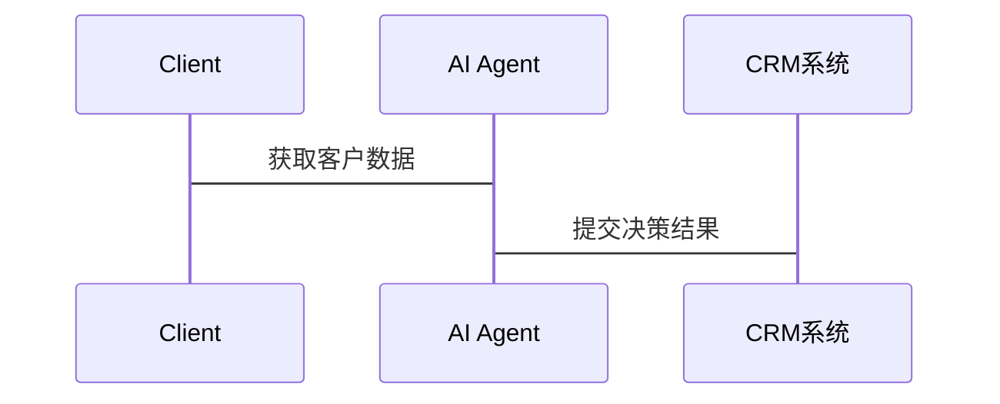

                 

# AI Agent在智能客户关系管理中的作用

## 关键词：AI Agent, 智能CRM, 人工智能, 客户关系管理, 算法原理, 系统设计, 项目实战

## 摘要：本文详细探讨了AI Agent在智能客户关系管理中的应用，从核心概念、算法原理到系统设计和项目实战，全面分析了AI Agent如何提升CRM的智能化水平。文章通过丰富的内容和详细的案例，帮助读者理解并掌握AI Agent在智能CRM中的作用与实现。

---

## 第1章 AI Agent与智能客户关系管理概述

### 1.1 AI Agent的基本概念

#### 1.1.1 什么是AI Agent
AI Agent（人工智能代理）是指能够感知环境、自主决策并执行任务的智能实体。它通过数据输入、分析和决策，帮助组织实现自动化和智能化的管理。

#### 1.1.2 AI Agent的核心特征
- **自主性**：能够独立决策和执行任务。
- **反应性**：能够实时感知环境并做出反应。
- **学习能力**：通过数据和经验不断优化自身行为。
- **社交能力**：能够与人类或其他系统进行有效交互。

#### 1.1.3 AI Agent与传统CRM的区别
传统CRM主要依赖人工操作和规则引擎，而AI Agent能够通过机器学习和自然语言处理等技术，实现更智能的客户分析和决策。

### 1.2 智能客户关系管理的背景

#### 1.2.1 客户关系管理的定义与作用
CRM（客户关系管理）是通过管理客户信息和交互，提高客户满意度和忠诚度的过程。其作用包括客户 retention、提升销售效率和优化客户体验。

#### 1.2.2 智能化CRM的发展趋势
随着大数据和人工智能技术的发展，智能化CRM通过AI技术实现客户行为预测、自动化营销和个性化服务，成为企业竞争力的重要来源。

#### 1.2.3 AI Agent在CRM中的定位与价值
AI Agent作为智能化CRM的核心技术，能够通过自动化处理客户数据、预测客户需求并优化客户互动，显著提升CRM的效率和效果。

---

## 第2章 AI Agent在智能CRM中的核心作用

### 2.1 AI Agent的功能模块分析

#### 2.1.1 数据采集与处理
AI Agent通过爬虫、API和传感器等手段采集客户数据，并进行清洗、转换和存储。

#### 2.1.2 智能分析与决策
利用机器学习算法对客户数据进行分析，预测客户行为并制定最优决策。

#### 2.1.3 自动化执行与反馈
根据决策结果，自动化执行营销活动或服务，并通过反馈机制优化自身行为。

### 2.2 AI Agent与CRM系统的整合

#### 2.2.1 系统集成的实现方式
通过API接口或中间件实现AI Agent与CRM系统的数据交互和功能集成。

#### 2.2.2 数据流的交互过程
数据从CRM系统流向AI Agent进行处理，处理结果再反馈到CRM系统中。

#### 2.2.3 系统协同工作的机制
AI Agent与CRM系统协同工作，实现客户行为预测、自动化营销和客户分层管理。

### 2.3 本章小结

---

## 第3章 AI Agent的核心概念与原理

### 3.1 AI Agent的核心概念

#### 3.1.1 状态空间与动作空间
- **状态空间**：AI Agent所处环境的所有可能状态的集合。
- **动作空间**：AI Agent在每个状态下可执行的所有动作的集合。

#### 3.1.2 环境模型与任务目标
- **环境模型**：描述环境的动态和不确定性。
- **任务目标**：AI Agent需要完成的具体任务和目标。

#### 3.1.3 奖励机制与策略优化
- **奖励机制**：通过奖励或惩罚来引导AI Agent的行为。
- **策略优化**：通过强化学习不断优化AI Agent的策略。

### 3.2 AI Agent的算法原理

#### 3.2.1 状态空间搜索算法
- **广度优先搜索（BFS）**：逐层探索所有可能状态。
- **深度优先搜索（DFS）**：深入探索某个路径。

#### 3.2.2 强化学习算法
- **Q-learning算法**：通过状态-动作对的奖励来更新Q值。
- **策略梯度方法**：通过优化策略参数来最大化奖励。

#### 3.2.3 监督学习与无监督学习在AI Agent中的应用
- **监督学习**：通过标注数据训练AI Agent进行分类和回归。
- **无监督学习**：通过聚类和降维技术发现数据中的潜在模式。

### 3.3 AI Agent的数学模型与公式

#### 3.3.1 马尔可夫决策过程（MDP）模型
$$
\text{MDP} = (S, A, P, R, \gamma)
$$
其中：
- $S$：状态空间
- $A$：动作空间
- $P$：转移概率
- $R$：奖励函数
- $\gamma$：折扣因子

#### 3.3.2 Q-learning算法公式
$$
Q(s, a) = Q(s, a) + \alpha \left[r + \gamma \max Q(s', a') - Q(s, a)\right]
$$
其中：
- $\alpha$：学习率
- $\gamma$：折扣因子

#### 3.3.3 策略梯度方法的数学表达
$$
\nabla \theta J(\theta) = \mathbb{E}_{s,a}[\nabla \log \pi_{\theta}(a|s) Q(s,a)]
$$

---

## 第4章 AI Agent的系统分析与架构设计

### 4.1 系统功能模块设计

#### 4.1.1 数据采集模块
- 通过API接口获取客户数据。
- 对数据进行清洗和预处理。

#### 4.1.2 智能分析模块
- 利用机器学习算法对客户数据进行分析。
- 预测客户行为并生成决策建议。

#### 4.1.3 自动化执行模块
- 根据决策结果执行营销活动或服务。
- 通过反馈机制优化自身行为。

### 4.2 系统架构设计

#### 4.2.1 分层架构设计
- **数据层**：负责数据的存储和管理。
- **算法层**：负责数据的分析和决策。
- **执行层**：负责任务的执行和反馈。

#### 4.2.2 微服务架构设计
- **数据服务**：提供数据接口和数据处理功能。
- **算法服务**：负责模型训练和预测。
- **执行服务**：负责任务执行和反馈。

#### 4.2.3 数据流的交互设计
- 数据从CRM系统流向AI Agent进行处理。
- 处理结果反馈到CRM系统中。

### 4.3 系统接口设计

#### 4.3.1 API接口定义
- **GET /api/customers**：获取客户数据。
- **POST /api/decisions**：提交决策结果。

#### 4.3.2 数据格式与协议
- 使用JSON格式传输数据。
- 使用HTTP协议进行数据交互。

#### 4.3.3 接口调用流程
1. 客户端调用GET接口获取客户数据。
2. 数据传输到AI Agent进行处理。
3. 处理结果通过POST接口反馈到CRM系统。

### 4.4 系统交互设计

#### 4.4.1 序列图

---

## 第5章 AI Agent在智能CRM中的项目实战

### 5.1 项目背景与目标

#### 5.1.1 项目背景介绍
本项目旨在通过AI Agent技术提升某电商企业的客户关系管理水平。

#### 5.1.2 项目目标设定
- 实现客户行为预测。
- 实现自动化营销。
- 提高客户满意度和忠诚度。

### 5.2 系统核心实现

#### 5.2.1 环境安装与配置
- 安装Python和相关库（如TensorFlow、Scikit-learn）。
- 配置API接口和数据库。

#### 5.2.2 核心算法实现
- 使用监督学习算法训练客户行为预测模型。
- 使用强化学习算法优化营销策略。

#### 5.2.3 系统功能实现
- 实现客户数据采集、分析和决策功能。
- 实现自动化营销活动和客户反馈功能。

### 5.3 案例分析与详细解读

#### 5.3.1 典型案例分析
某电商企业通过AI Agent技术实现了客户行为预测和自动化营销，显著提升了销售额和客户满意度。

#### 5.3.2 系统功能解读
- 数据采集模块：每天自动采集客户数据。
- 智能分析模块：预测客户购买概率并生成营销策略。
- 自动化执行模块：根据策略自动发送营销邮件和优惠券。

### 5.4 项目小结

---

## 第6章 总结与展望

### 6.1 本章总结
本文详细探讨了AI Agent在智能CRM中的应用，从核心概念、算法原理到系统设计和项目实战，全面分析了AI Agent如何提升CRM的智能化水平。

### 6.2 未来展望
随着人工智能技术的不断发展，AI Agent在智能CRM中的应用将更加广泛和深入。未来的研究方向包括更高效的算法、更强大的系统架构和更广泛的应用场景。

### 6.3 最佳实践 tips
- 数据隐私保护：确保客户数据的安全性和隐私性。
- 算法可解释性：确保AI Agent的决策过程透明可解释。
- 持续优化：定期更新模型和优化策略。

---

## 作者：AI天才研究院 & 禅与计算机程序设计艺术

---

以上是《AI Agent在智能客户关系管理中的作用》的完整目录和内容框架，确保每个部分都详细展开，涵盖理论、算法、系统设计和项目实战，帮助读者全面理解AI Agent在智能CRM中的作用。

