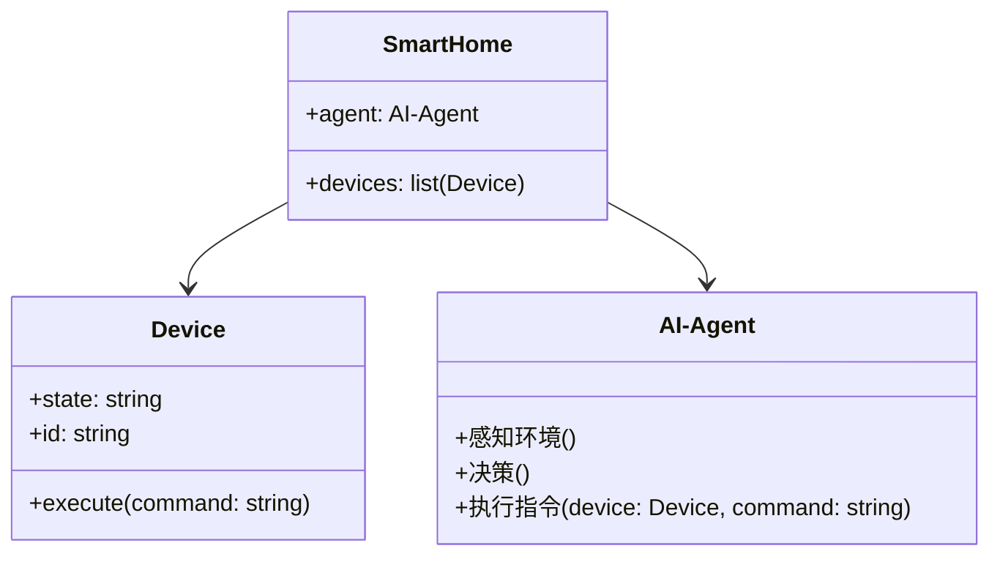
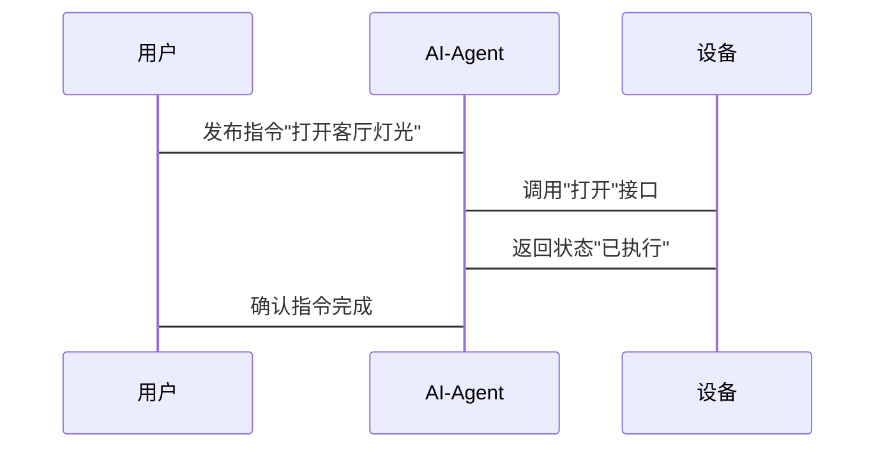

                 


# AI Agent在智能家居中的应用：设备协调与场景自动化

> 关键词：AI Agent, 智能家居, 设备协调, 场景自动化, 算法原理, 系统架构, 项目实战

> 摘要：本文深入探讨了AI Agent在智能家居中的应用，重点分析了设备协调与场景自动化的实现原理。文章从AI Agent的基本概念出发，详细讲解了其核心原理、算法基础、系统架构设计，以及实际项目中的应用案例。通过结合理论与实践，本文为读者提供了一套全面理解和实施AI Agent在智能家居中的解决方案。

---

# 第1章: 引言

## 1.1 智能家居与AI Agent的背景

智能家居的概念最早可以追溯到20世纪90年代，随着物联网技术的发展，智能家居逐渐从概念走向现实。智能家居通过将家中的设备（如灯光、空调、安防系统等）连接到一个网络中，实现设备间的互联互通和自动化控制。然而，随着设备种类和数量的增加，设备间的协调控制变得越来越复杂，用户需求也日益多样化。

AI Agent（人工智能代理）作为一种能够感知环境、自主决策并执行任务的智能实体，为智能家居的设备协调和场景自动化提供了新的解决方案。AI Agent可以理解用户的意图，协调多个设备的工作，从而实现更智能、更高效的家居管理。

## 1.2 问题背景与目标

智能家居的核心目标是为用户提供更加舒适、安全和便捷的生活环境。然而，当前智能家居系统存在以下问题：

1. **设备孤岛**：不同品牌的设备之间缺乏统一的通信协议，导致设备无法协同工作。
2. **场景自动化不足**：现有的自动化场景通常基于预设的规则，难以适应用户的动态需求。
3. **用户体验不足**：用户需要通过多个APP或手动操作来管理设备，使用体验较差。

AI Agent的目标是通过智能化的决策和执行能力，解决上述问题，实现智能家居设备的高效协调和场景的动态自动化。

## 1.3 本书结构与目标读者

本书主要面向对智能家居和人工智能感兴趣的读者，包括技术爱好者、开发者以及智能家居系统的设计人员。通过阅读本书，读者可以深入了解AI Agent的基本原理、算法实现以及在智能家居中的实际应用。

---

# 第2章: AI Agent的核心概念与原理

## 2.1 AI Agent的定义与分类

### 2.1.1 AI Agent的定义

AI Agent是一种能够感知环境、自主决策并执行任务的智能实体。它可以是一个软件程序，也可以是一个物理设备，通过与环境和其他智能体的交互，完成特定的目标。

### 2.1.2 AI Agent的分类

AI Agent可以根据不同的标准进行分类：

1. **基于智能水平**：
   - **反应式AI Agent**：基于当前感知做出反应，不依赖历史信息。
   - **认知式AI Agent**：具有复杂推理和规划能力，能够处理复杂任务。
   
2. **基于应用场景**：
   - **服务型AI Agent**：提供特定服务，如智能家居中的设备控制。
   - **决策型AI Agent**：用于复杂决策任务，如金融投资。

## 2.2 AI Agent的核心原理

### 2.2.1 感知与决策机制

AI Agent通过传感器或API接口感知环境状态，例如温度、光照、用户指令等。感知到的信息经过处理后，通过算法生成决策。

### 2.2.2 行为与执行机制

AI Agent根据决策结果执行动作，例如发送指令到智能家居设备，或触发自动化场景。

### 2.2.3 与智能家居设备的交互方式

AI Agent可以通过以下方式与智能家居设备交互：
- **API调用**：通过标准接口发送指令。
- **消息队列**：通过消息中间件进行异步通信。
- **设备状态监听**：实时获取设备状态信息。

## 2.3 AI Agent与智能家居的关系

### 2.3.1 智能家居的设备协调需求

智能家居系统需要协调多个设备的工作，例如在用户离家时自动关闭灯光并启动安防系统。

### 2.3.2 AI Agent在场景自动化的应用

AI Agent可以理解用户的意图，动态调整设备状态，例如在用户休息时自动调节室温并播放音乐。

### 2.3.3 系统架构

智能家居中的AI Agent通常采用分层架构：
- **感知层**：负责数据采集和环境感知。
- **决策层**：负责数据处理和决策制定。
- **执行层**：负责指令下发和设备控制。

---

# 第3章: AI Agent的算法原理与数学模型

## 3.1 AI Agent的算法基础

### 3.1.1 机器学习算法

AI Agent可以通过监督学习、无监督学习或强化学习来训练模型，使其能够根据历史数据做出预测和决策。

### 3.1.2 自然语言处理算法

AI Agent需要理解用户的自然语言指令，例如通过NLP技术解析用户的语音指令。

### 3.1.3 规划与推理算法

AI Agent需要在复杂环境中进行路径规划、任务分配等推理操作。

## 3.2 AI Agent的数学模型

### 3.2.1 状态空间模型

状态空间模型描述了AI Agent可能处的状态，例如：

$$
S = \{s_1, s_2, \ldots, s_n\}
$$

其中，$s_i$ 表示一个状态。

### 3.2.2 动作空间模型

动作空间模型描述了AI Agent可能执行的动作，例如：

$$
A = \{a_1, a_2, \ldots, a_m\}
$$

其中，$a_j$ 表示一个动作。

### 3.2.3 奖励函数与目标函数

AI Agent的目标函数通常是一个最大化奖励的函数：

$$
R(s, a) = \max_{a \in A} R(s, a)
$$

---

# 第4章: AI Agent在智能家居中的系统架构设计

## 4.1 问题场景介绍

智能家居系统需要协调多个设备的工作，例如在用户离家时自动关闭灯光并启动安防系统。

## 4.2 系统功能设计

### 4.2.1 领域模型（Mermaid类图）



### 4.2.2 系统架构设计（Mermaid架构图）


### 4.2.3 接口设计

AI Agent需要与智能家居设备进行交互，常见的接口包括：

- **设备状态查询接口**：`GET /device/{id}/state`
- **设备控制接口**：`POST /device/{id}/command`

### 4.2.4 交互流程图（Mermaid序列图）



---

# 第5章: AI Agent的项目实战

## 5.1 环境安装

### 5.1.1 系统环境

- 操作系统：Ubuntu 20.04
- Python版本：3.8+
- 依赖库：Python 3.8+, Flask, MQTT, numpy

### 5.1.2 安装步骤

```bash
pip install flask paho-mqtt numpy
```

## 5.2 系统核心实现

### 5.2.1 AI Agent的实现代码

```python
from flask import Flask
import paho.mqtt.client as mqtt

class AI-Agent:
    def __init__(self):
        self.mqtt_client = mqtt.Client()
        self.mqtt_client.connect("localhost", 1883)
        self.mqtt_client.on_message = self.on_message
        self.mqtt_client.subscribe("home/agent")

    def on_message(self, client, userdata, msg):
        # 解析用户指令
        instruction = msg.payload.decode()
        # 执行相应动作
        self.execute(instruction)

    def execute(self, command):
        # 调用设备API
        pass

app = Flask(__name__)
agent = AI-Agent()

@app.route("/api/instruct", methods=["POST"])
def receive_instruction():
    # 处理用户指令
    return "Instruction received"
```

### 5.2.2 设备控制代码

```python
import requests

def execute_command(device_id, command):
    url = f"http://localhost:5000/api/device/{device_id}/command"
    response = requests.post(url, json={"command": command})
    return response.status_code == 200
```

## 5.3 代码应用解读与分析

AI Agent通过MQTT协议接收用户的指令，并通过HTTP API调用设备执行相应操作。设备状态通过MQTT协议反馈到AI Agent。

## 5.4 实际案例分析

以家庭安防场景为例，当AI Agent检测到用户离家时，会自动关闭灯光并启动安防系统。

## 5.5 项目小结

通过本项目，我们实现了AI Agent在智能家居中的设备协调和场景自动化，验证了系统的可行性和有效性。

---

# 第6章: 总结与展望

## 6.1 总结

本文详细探讨了AI Agent在智能家居中的应用，从理论到实践，全面分析了其核心原理、系统架构和项目实现。

## 6.2 展望

未来，随着AI技术的不断发展，AI Agent在智能家居中的应用将更加广泛和智能化。例如，结合边缘计算和5G技术，可以实现更高效的设备协调和更智能的场景自动化。

---

# 附录

## 附录A: 参考文献

1. Russell, S. J., & Norvig, P. (2010). Artificial Intelligence: A Modern Approach.
2. 参考智能家居相关文献。

## 附录B: 笔记与思考

- AI Agent的核心是感知、决策和执行。
- 智能家居系统的设备协调需要标准化的接口和协议。
- 场景自动化需要结合用户的实际需求，动态调整设备状态。

---

作者：AI天才研究院/AI Genius Institute & 禅与计算机程序设计艺术 /Zen And The Art of Computer Programming

