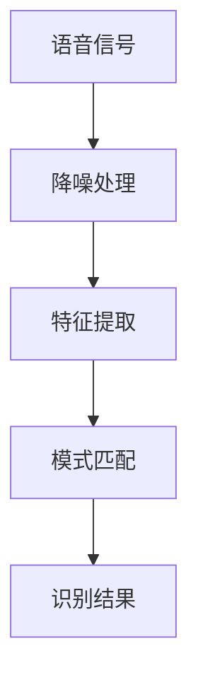
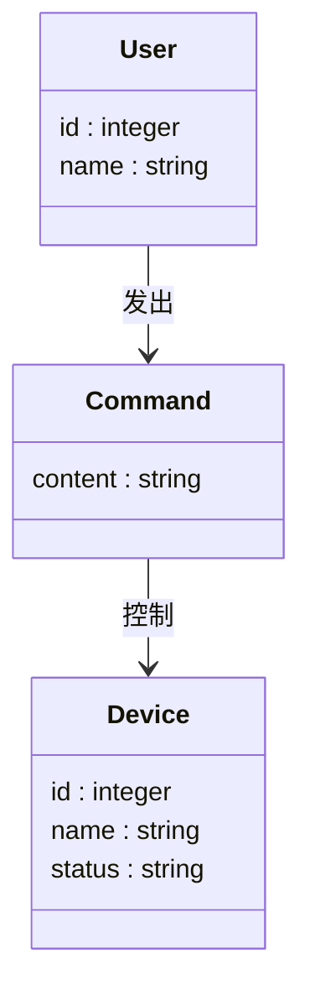
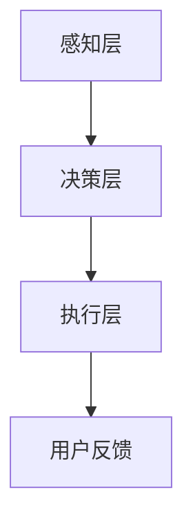

                 


# AI Agent在智能家居中的语音控制应用

> **关键词**: AI Agent, 智能家居, 语音控制, 人工智能, 自然语言处理

> **摘要**: 本文深入探讨了AI Agent在智能家居中的语音控制应用，分析了其核心原理、系统架构、算法实现及实际案例，结合技术背景、核心概念对比和系统设计，为读者提供了全面的技术解析和实践指导。

---

## 第1章: AI Agent与智能家居语音控制的背景介绍

### 1.1 问题背景
智能家居的快速发展使得家庭生活更加智能化，而语音控制作为最自然的人机交互方式之一，逐渐成为智能家居的核心控制手段。AI Agent（智能体）通过自然语言处理和机器学习技术，能够理解用户的意图并执行相应的操作，从而实现更加智能化的家居控制。

#### 1.1.1 智能家居的发展现状
智能家居通过物联网技术将家中的设备连接起来，用户可以通过手机APP、语音助手等方式进行控制。然而，现有的智能家居系统在用户体验、设备联动性和智能化水平方面仍有提升空间。

#### 1.1.2 语音控制技术的演变
语音控制技术从简单的关键词识别发展到复杂的自然语言理解，AI Agent的引入使得语音控制更加智能化和个性化。

#### 1.1.3 AI Agent在智能家居中的作用
AI Agent能够理解用户的意图，协调智能家居设备完成复杂的操作，提升用户体验和设备联动效率。

### 1.2 问题描述
智能家居语音控制的核心问题在于如何准确理解用户意图，并实现高效、可靠的设备控制。

#### 1.2.1 智能家居语音控制的核心问题
- 语音识别的准确性
- 自然语言理解的深度
- 设备联动的可靠性

#### 1.2.2 AI Agent在语音控制中的定位
AI Agent作为智能家居的“大脑”，负责接收用户的语音指令，解析意图，并协调各设备执行操作。

#### 1.2.3 当前技术的局限性与挑战
- 多设备协同控制的复杂性
- 语音识别在复杂环境下的准确率
- 用户隐私和数据安全问题

---

## 第2章: 核心概念与系统架构

### 2.1 核心概念
AI Agent在智能家居中的语音控制应用涉及多个核心概念，包括语音信号处理、自然语言理解、设备控制等。

#### 2.1.1 AI Agent的定义与属性
AI Agent是一种能够感知环境、理解用户意图并执行相应操作的智能实体，具有自主性、反应性、目标导向性和社会性等属性。

#### 2.1.2 语音控制的实现原理
语音控制通过语音信号采集、语音识别、自然语言理解和命令执行四个步骤实现。

#### 2.1.3 智能家居设备的分类
智能家居设备可以分为照明、安防、家电、环境控制等类别，不同设备具有不同的功能和控制接口。

### 2.2 核心概念对比表
以下是AI Agent与传统语音助手的对比：

| **对比维度** | **AI Agent**                     | **传统语音助手**                 |
|--------------|----------------------------------|----------------------------------|
| **智能性**    | 高，能够理解上下文和复杂意图    | 低，主要基于关键词匹配           |
| **设备联动**  | 强，能够协调多设备联动           | 弱，主要针对单一设备或简单场景   |
| **学习能力**  | 强，能够通过学习提升性能         | 无或弱，依赖预设指令             |

### 2.3 ER实体关系图
以下是智能家居语音控制系统的ER实体关系图：

```mermaid
erDiagram
    user {
        id : integer
        name : string
    }
    device {
        id : integer
        name : string
        type : string
    }
    command {
        id : integer
        content : string
    }
    "user" o- "command" : 发出指令
    "command" o- "device" : 控制设备
    "device" o- "status" : 设备状态
```

---

## 第3章: 算法原理与实现

### 3.1 语音识别算法
语音识别是语音控制的第一步，通过将语音信号转换为文本，为后续的自然语言理解提供输入。

#### 3.1.1 语音信号处理
语音信号处理包括声音采集、降噪、特征提取等步骤。

- **声音采集**: 使用麦克风采集用户的语音信号。
- **降噪处理**: 通过算法消除背景噪声，提升语音清晰度。
- **特征提取**: 提取语音信号的特征，如梅尔频率倒谱系数（MFCC）。

#### 3.1.2 语音识别流程


#### 3.1.3 语音识别的数学模型
语音识别通常使用隐马尔可夫模型（HMM）或深度神经网络（DNN）进行模式匹配。

- **HMM模型**: 通过状态转移概率和观测概率进行模式匹配。
- **DNN模型**: 使用深度神经网络进行特征学习和分类。

### 3.2 自然语言理解算法
自然语言理解是语音控制的核心，通过理解用户的意图生成相应的命令。

#### 3.2.1 语义解析
语义解析的目标是将用户的自然语言指令转换为机器可理解的命令。

- **意图识别**: 通过分析用户的语言结构，识别用户的意图。
- **实体识别**: 从用户的指令中提取关键实体，如设备名称、操作动作等。

#### 3.2.2 语义理解的数学模型
自然语言理解通常使用词袋模型（Bag-of-Words）或循环神经网络（RNN）进行意图分类。

- **词袋模型**: 将文本表示为词袋，用于分类和聚类。
- **RNN模型**: 通过序列建模捕捉语言的上下文信息。

---

## 第4章: 系统分析与架构设计

### 4.1 系统功能设计
智能家居语音控制系统的功能模块包括语音采集、指令解析、设备控制和用户反馈。

#### 4.1.1 功能模块对比
以下是功能模块的对比：

| **功能模块** | **功能描述**                     |
|--------------|----------------------------------|
| 语音采集    | 采集用户的语音信号               |
| 指令解析    | 解析用户的意图并生成控制指令     |
| 设备控制    | 控制智能家居设备                 |
| 用户反馈    | 给用户反馈设备的执行状态         |

#### 4.1.2 领域模型类图
以下是系统类图：



### 4.2 系统架构设计
智能家居语音控制系统的架构包括感知层、决策层和执行层。

#### 4.2.1 感知层
感知层负责采集用户的语音信号并进行初步处理。

#### 4.2.2 决策层
决策层负责解析用户的意图并生成控制指令。

#### 4.2.3 执行层
执行层负责控制智能家居设备并返回执行结果。

#### 4.2.4 系统架构图
以下是系统架构图：



---

## 第5章: 项目实战

### 5.1 环境配置
项目实战需要以下环境：

- **硬件**: 智能音箱、智能家居设备
- **软件**: Python、TensorFlow、Keras

### 5.2 核心代码实现
以下是核心代码实现：

```python
import tensorflow as tf
from tensorflow.keras import layers

# 模型定义
model = tf.keras.Sequential([
    layers.Conv2D(32, (3,3), activation='relu', input_shape=(128, 128, 1)),
    layers.MaxPooling2D((2,2)),
    layers.Conv2D(64, (3,3), activation='relu'),
    layers.MaxPooling2D((2,2)),
    layers.Flatten(),
    layers.Dense(64, activation='relu'),
    layers.Dense(10, activation='softmax')
])

# 模型编译
model.compile(optimizer='adam',
              loss='sparse_categorical_crossentropy',
              metrics=['accuracy'])
```

### 5.3 代码解读与分析
- **模型定义**: 使用卷积神经网络进行图像分类，提取语音信号的特征。
- **模型编译**: 使用Adam优化器和交叉熵损失函数进行训练。

### 5.4 实际案例分析
以下是一个实际案例的分析：

1. **用户指令**: “打开客厅的灯。”
2. **语音采集**: 采集用户的语音信号。
3. **指令解析**: 解析用户的意图，生成“打开客厅灯”的指令。
4. **设备控制**: 控制智能灯泡执行“打开”操作。
5. **用户反馈**: 返回“已打开客厅灯”的反馈。

---

## 第6章: 最佳实践与总结

### 6.1 小结
通过本文的分析，我们可以看到AI Agent在智能家居中的语音控制应用具有广阔的发展前景。

### 6.2 注意事项
- 设备联动的复杂性需要仔细设计。
- 用户隐私和数据安全需要严格保护。

### 6.3 拓展阅读
建议读者进一步阅读以下内容：

- 《深度学习入门：基于Python的CNN、RNN、GAN等机器学习算法原理与实现》
- 《智能系统设计：从原理到实践》

---

作者：AI天才研究院 & 禅与计算机程序设计艺术

