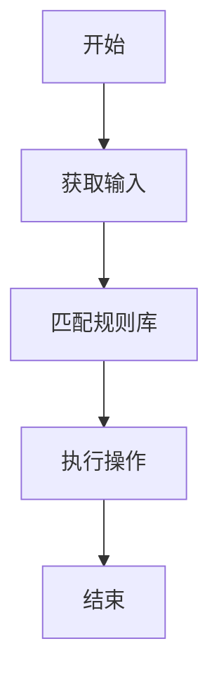
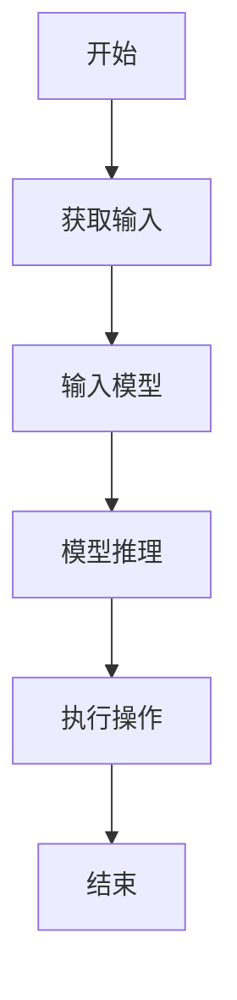
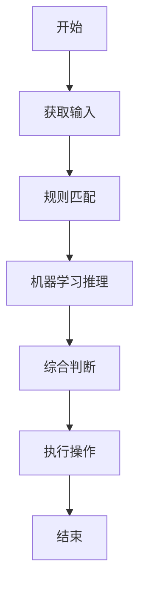
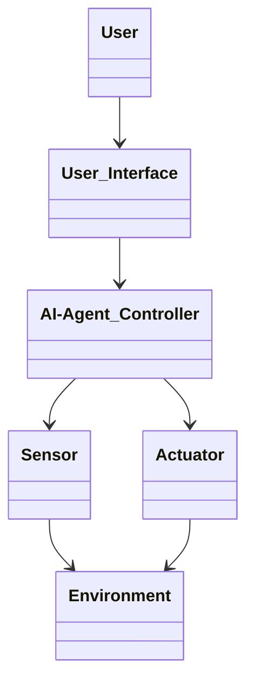
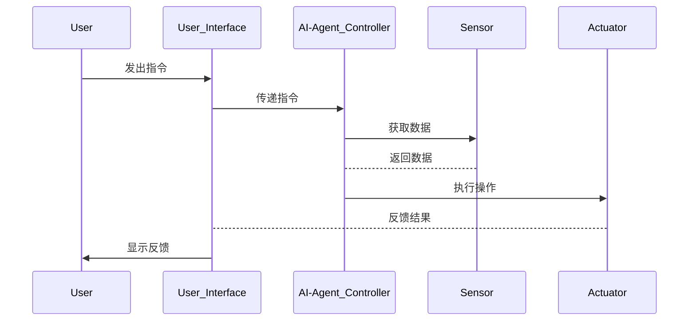

                 


# AI Agent在智能家居自动化中的应用

> 关键词：AI Agent, 智能家居, 自动化, 物联网, 人工智能, 机器学习

> 摘要：本文探讨AI Agent在智能家居自动化中的应用，从概念到算法、系统架构、项目实战，详细阐述其在智能家居中的核心作用和实际应用，提供深入的技术分析和实践指导。

---

## 第一部分: AI Agent与智能家居自动化概述

### 第1章: AI Agent与智能家居自动化概述

#### 1.1 智能家居的发展现状
- **1.1.1 智能家居的概念与特点**  
  智能家居是指通过物联网技术将家中的设备连接起来，实现远程控制和自动化管理。其特点包括智能化、网络化和高效率。

- **1.1.2 当前智能家居的主要应用场景**  
  当前智能家居主要应用于家庭安全监控、智能照明、智能家电控制等领域。

- **1.1.3 智能家居的未来发展趋势**  
  未来的智能家居将更加智能化和个性化，AI Agent将在其中发挥关键作用。

#### 1.2 AI Agent的基本概念
- **1.2.1 什么是AI Agent**  
  AI Agent是一种智能代理，能够感知环境、做出决策并执行操作。它能够理解用户的需求，并根据环境的变化自动调整行为。

- **1.2.2 AI Agent的核心特征**  
  AI Agent具有自主性、反应性、目标导向性和学习能力。这些特征使其能够在复杂环境中独立完成任务。

- **1.2.3 AI Agent与传统自动化的区别**  
  传统自动化依赖预设的规则，而AI Agent能够通过学习和推理适应新的情况。

#### 1.3 AI Agent在智能家居自动化中的作用
- **1.3.1 AI Agent的主要功能**  
  AI Agent能够实现设备的智能控制、用户行为分析和场景自适应。

- **1.3.2 AI Agent如何实现自动化**  
  通过感知环境、分析数据并执行操作，AI Agent能够实现智能家居的自动化管理。

- **1.3.3 AI Agent对用户生活的影响**  
  AI Agent使得智能家居更加智能化，能够根据用户的需求自动调整设备状态，提升生活质量。

#### 1.4 本章小结  
本章介绍了智能家居的发展现状、AI Agent的基本概念及其在智能家居自动化中的作用，为后续内容奠定了基础。

---

## 第二部分: AI Agent的核心概念与原理

### 第2章: AI Agent的核心概念与联系

#### 2.1 AI Agent的核心概念
- **2.1.1 实体识别与关系建模**  
  实体识别包括用户、设备、环境等，关系建模则展示它们之间的交互和依赖关系。

- **2.1.2 AI Agent的属性特征对比表**  
  下表展示了AI Agent与传统自动化的属性对比：

| 特性       | AI Agent              | 传统自动化          |
|------------|-----------------------|--------------------|
| 自主性      | 高                    | 低或无             |
| 反应性      | 高                    | 中或低             |
| 学习能力    | 高                    | 无或低             |

- **2.1.3 ER实体关系图**  
  下图展示了智能家居系统中的实体关系：

```mermaid
erd
    title 实体关系图
    User [用户]
    Device [设备]
    Environment [环境]
    Sensor [传感器]
    Actuator [执行器]
    
    User -|{管理}| Device
    Device --> Sensor
    Device --> Actuator
    Sensor --> Environment
    Actuator --> Environment
```

#### 2.2 AI Agent的原理分析
- **2.2.1 基于规则的推理**  
  通过预设规则进行判断和执行操作，适用于简单场景。

- **2.2.2 基于机器学习的推理**  
  利用数据训练模型，能够处理复杂场景。

- **2.2.3 综合推理模型**  
  结合规则和机器学习，实现更灵活和强大的推理能力。

#### 2.3 本章小结  
本章详细分析了AI Agent的核心概念和工作原理，为后续算法实现奠定了理论基础。

---

## 第三部分: AI Agent的算法原理

### 第3章: AI Agent的算法原理

#### 3.1 基于规则的推理算法
- **3.1.1 算法流程图**  
  下图展示了基于规则的推理流程：



- **3.1.2 算法实现代码**  
  ```python
  def rule_based_agent(input):
      for rule in rule_library:
          if matches_rule(input, rule):
              return execute_action(rule)
      return default_action()
  ```

- **3.1.3 算法优缺点分析**  
  优点是简单易懂，缺点是难以处理复杂场景。

#### 3.2 基于机器学习的推理算法
- **3.2.1 算法流程图**  
  下图展示了基于机器学习的推理流程：



- **3.2.2 算法实现代码**  
  ```python
  import tensorflow as tf
  model = tf.keras.Sequential([tf.keras.layers.Dense(1, activation='sigmoid')])
  predictions = model.predict(inputs)
  ```

- **3.2.3 算法优缺点分析**  
  优点是能够处理复杂场景，缺点是需要大量数据和计算资源。

#### 3.3 综合推理算法
- **3.3.1 算法流程图**  
  下图展示了综合推理算法的流程：



- **3.3.2 算法实现代码**  
  ```python
  def hybrid_agent(input):
      rule_result = rule_based_agent(input)
      ml_result = ml_model.predict(input)
      return combine_results(rule_result, ml_result)
  ```

- **3.3.3 算法优缺点分析**  
  优点是灵活性高，缺点是实现复杂。

#### 3.4 数学模型与公式
- **基于规则的模型**  
  $$ \text{如果条件满足，则执行操作} $$

- **基于机器学习的模型**  
  $$ y = \sigma(wx + b) $$

---

## 第四部分: 系统架构设计

### 第4章: 智能家居自动化系统的架构设计

#### 4.1 项目介绍
智能家居自动化系统旨在通过AI Agent实现设备的智能控制。

#### 4.2 系统功能设计
- 用户交互界面
- 设备管理模块
- AI Agent控制模块

#### 4.3 系统架构设计
下图展示了系统的架构设计：



#### 4.4 系统接口设计
- 用户与系统交互的接口
- 设备与系统交互的接口

#### 4.5 系统交互设计
下图展示了系统的交互流程：



---

## 第五部分: 项目实战

### 第5章: 智能家居自动化系统的实现

#### 5.1 环境配置
安装必要的库和工具，如Python、TensorFlow、Raspberry Pi等。

#### 5.2 系统核心实现
- AI Agent的核心代码实现
- 设备与系统的集成

#### 5.3 代码实现
```python
class AI-Agent:
    def __init__(self):
        self.rules = []
        self.ml_model = None

    def train_model(self, data):
        self.ml_model = train(data)

    def execute_action(self, action):
        # 执行操作的代码
```

#### 5.4 案例分析
- 灯光控制案例
- 安全监控案例

#### 5.5 项目小结  
详细总结项目的实现过程和经验教训。

---

## 第六部分: 最佳实践与总结

### 第6章: 最佳实践与总结

#### 6.1 本章总结
回顾文章的主要内容，强调AI Agent在智能家居中的重要性。

#### 6.2 实用建议
- 选择合适的算法
- 确保系统的安全性
- 定期更新模型

#### 6.3 小结
AI Agent将推动智能家居的发展，提升用户的生活质量。

#### 6.4 注意事项
- 数据隐私保护
- 系统的可扩展性

#### 6.5 拓展阅读
推荐相关书籍和资源，供读者深入学习。

---

## 作者信息

作者：AI天才研究院/AI Genius Institute & 禅与计算机程序设计艺术 /Zen And The Art of Computer Programming

---

通过以上结构，文章详细讲解了AI Agent在智能家居中的应用，从理论到实践，层层深入，为读者提供了全面的技术指导。

