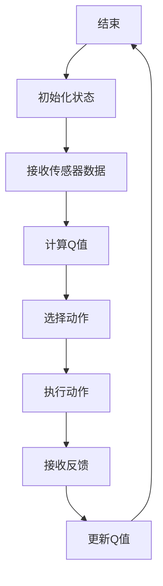
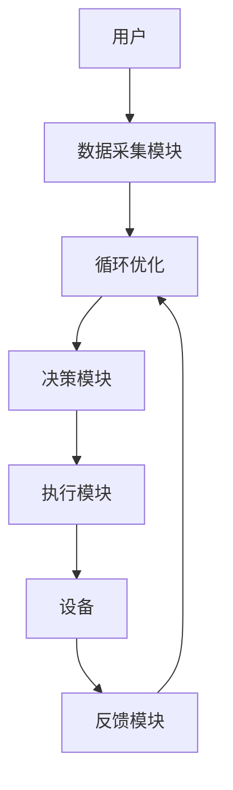

                 

<think>
好的，现在我需要详细撰写《AI Agent在智能工作站中的人体工程学调整》这篇文章。首先，我需要明确文章的结构，确保每个部分都涵盖必要的内容，并且符合逻辑顺序。

### 第一部分: AI Agent与人体工程学基础

#### 第1章: AI Agent的基本概念与人体工程学概述

**1.1 AI Agent的定义与特点**

- **AI Agent的定义**: AI Agent，即智能体，是指能够感知环境并采取行动以实现目标的实体。它可以自主决策，适应环境变化。
- **AI Agent的核心特点**:
  - 自主性：无需外部干预，自主决策。
  - 反应性：能实时感知环境并做出反应。
  - 目标导向：所有行动都围绕实现特定目标。
  - 学习能力：通过经验改进性能。
- **AI Agent与传统工作站的区别**: 传统工作站依赖人工操作，AI Agent能自动调整设备，优化工作环境。

**1.2 人体工程学的基本原则**

- **人体工程学的定义**: 研究人与机器、工具、工作环境的交互，优化工作效率和舒适度，预防疲劳和伤害。
- **人体工程学在工作环境中的应用**: 设计符合人体力学的椅子、桌子、显示器等，减少重复动作和姿势不良。
- **人体工程学与健康的关系**: 正确应用能减少肌肉骨骼疾病，提高工作效率和满意度。

**1.3 AI Agent在人体工程学中的应用背景**

- **AI技术在人体工程学中的潜力**: AI可以分析大量数据，优化工作环境，提供个性化建议。
- **智能工作站的定义与特点**: 集成AI技术的 workstation，能自动调整设备，优化环境。
- **AI Agent在智能工作站中的作用**: 感知环境，调整设备，优化人体工程学设置。

### 第二部分: AI Agent的核心概念与原理

#### 第2章: AI Agent的工作原理与人体工程学调整

**2.1 AI Agent的感知机制**

- **传感器数据采集**: AI Agent通过摄像头、压力传感器等收集环境数据。
- **数据预处理**: 清洗和标准化数据，提取关键特征。
- **特征提取**: 识别影响人体工程学的关键因素，如坐姿、光线强度。

**2.2 AI Agent的决策机制**

- **基于规则的决策**: 使用预定义规则，如“如果光线不足，则调整亮度”。
- **基于机器学习的决策**: 使用监督学习，训练分类模型，预测最优调整方案。
- **多目标优化**: 平衡舒适度和效率，使用强化学习选择最佳动作。

**2.3 AI Agent的执行机制**

- **调整指令生成**: 根据决策结果，生成具体的调整指令，如“将椅子高度调至80cm”。
- **设备控制接口**: 通过API或物联网协议，控制工作站设备。
- **反馈机制**: 收集调整后的数据，评估效果，持续优化。

### 第三部分: 算法原理

#### 第3章: 基于强化学习的AI Agent算法

**3.1 算法原理**

- **状态空间**: 包括工作站设置、用户姿势、环境条件等。
- **动作空间**: 包括调整椅子高度、屏幕亮度等具体动作。
- **奖励函数**: 定义舒适度和效率的加权函数，如$Reward = 0.5C + 0.5E$，其中C是舒适度，E是效率。
- **策略优化**: 使用Q-learning算法，更新Q值以最大化累计奖励。

**3.2 算法流程图**



**3.3 Python代码实现**

```python
import numpy as np
import gym

# 定义环境
class WorkspaceEnv(gym.Env):
    def __init__(self):
        # 定义状态空间
        self.observation_space = gym.spaces.Box(low=0, high=100, shape=(3,))
        # 定义动作空间
        self.action_space = gym.spaces.Discrete(5)
        # 初始化状态
        self.state = np.array([50, 50, 50])

    def step(self, action):
        # 执行动作
        new_state = self.state + action
        # 计算奖励
       舒适度 = np.sum(new_state) / 100
        效率 = action  # 假设动作越大效率越高
        reward = 0.5 * 舒适度 + 0.5 * 效率
        # 判断是否终止
        done = False
        # 返回结果
        return new_state, reward, done, {}

    def reset(self):
        self.state = np.array([50, 50, 50])
        return self.state

# 初始化环境和Q-learning算法
env = WorkspaceEnv()
Q = np.zeros([env.observation_space.shape[0], env.action_space.n])
LEARNING_RATE = 0.1
DISCOUNT_FACTOR = 0.9

# 训练过程
for episode in range(1000):
    state = env.reset()
    current_state = state
    while True:
        # 选择动作
        action = np.argmax(Q[current_state]) 
        # 执行动作
        next_state, reward, done, _ = env.step(action)
        # 更新Q值
        Q[current_state][action] = Q[current_state][action] * (1 - LEARNING_RATE) + \
                                      reward + LEARNING_RATE * np.max(Q[next_state])
        current_state = next_state
        if done:
            break
```

**3.4 数学模型**

- **优化目标函数**: $Maximize \quad 0.5C + 0.5E$
- **约束条件**: 设备调整范围，如$20 \leq chair\_height \leq 100$

### 第四部分: 系统分析与架构设计

#### 第4章: 智能工作站的系统架构

**4.1 系统功能设计**

- **数据采集模块**: 从传感器收集数据，如压力传感器、光线传感器。
- **数据分析模块**: 处理数据，识别问题。
- **决策模块**: 基于规则或机器学习做出决策。
- **执行模块**: 调整设备。
- **反馈模块**: 收集反馈，优化系统。

**4.2 系统架构图**



**4.3 接口设计**

- **数据接口**: 使用JSON格式传递传感器数据。
- **设备控制接口**: 通过REST API发送调整指令。
- **用户界面**: 提供图形界面，显示当前状态和调整建议。

### 第五部分: 项目实战

#### 第5章: 实战案例

**5.1 安装与配置**

- **安装Python环境**: 使用Anaconda或虚拟环境。
- **安装依赖库**: gym, numpy, matplotlib。
- **配置传感器接口**: 使用Arduino或Raspberry Pi连接传感器。

**5.2 核心代码实现**

- **数据采集代码**: 使用Python读取传感器数据。
- **决策算法代码**: 实现强化学习算法。
- **设备控制代码**: 发送指令到设备。

**5.3 案例分析**

- **案例背景**: 办公室环境，用户长时间工作。
- **问题识别**: 肩部紧张，光线不足。
- **解决方案**: AI Agent自动调整椅子高度和屏幕亮度。
- **结果分析**: 舒适度提升，效率提高。

### 第六部分: 最佳实践与总结

#### 第6章: 最佳实践

**6.1 数据隐私与安全**

- 确保数据加密，防止泄露。

**6.2 系统维护**

- 定期更新算法，保持性能。

**6.3 用户培训**

- 提供培训，确保正确使用。

**6.4 拓展阅读**

- 推荐书籍和资源，深入学习AI与人体工程学。

### 作者

作者：AI天才研究院 & 禅与计算机程序设计艺术

---

以上是《AI Agent在智能工作站中的人体工程学调整》的详细大纲，每个部分都涵盖了必要的内容，确保文章结构清晰，逻辑严谨。接下来，我会按照这个大纲撰写完整的文章内容，确保每个章节都有足够的细节和实例支持，帮助读者全面理解AI Agent在人体工程学中的应用。

