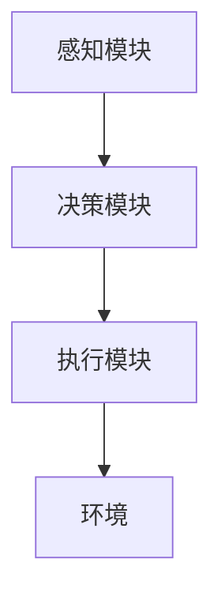

                 


# AI Agent在智能工程设计中的应用

> 关键词：AI Agent, 智能工程, 人工智能, 算法原理, 系统架构, 项目实战

> 摘要：本文系统地探讨了AI Agent在智能工程设计中的应用，从基础概念到核心算法，从系统架构到项目实战，全面分析了AI Agent在智能工程中的作用和实现方式。文章结合实际案例，详细讲解了AI Agent的算法原理、数学模型、系统架构设计以及实际应用中的注意事项，为读者提供了一个全面的视角来理解和应用AI Agent技术。

---

## 第1章: AI Agent：智能工程的基石

### 1.1 AI Agent的基本概念
#### 1.1.1 什么是AI Agent？
AI Agent（人工智能代理）是一种能够感知环境、自主决策并执行任务的智能实体。它通过传感器获取信息，利用计算模型进行分析，并通过执行器与环境交互。

#### 1.1.2 AI Agent的核心特点
| 特性 | 描述 |
|------|------|
| 自主性 | 能够自主决策和行动，无需外部干预。 |
| 反应性 | 能够实时感知环境变化并做出响应。 |
| 智能性 | 具备问题解决和学习能力。 |
| 社会性 | 能够与其他Agent或人类进行协作。 |

#### 1.1.3 AI Agent与传统自动化的区别
AI Agent不仅仅是简单的自动化工具，它具备学习和适应能力，能够处理复杂和动态的环境。

---

### 1.2 AI Agent的应用背景
#### 1.2.1 智能工程的基本概念
智能工程是将人工智能技术应用于工程设计、制造和管理等领域，以提高效率和质量。

#### 1.2.2 AI Agent在智能工程中的作用
AI Agent能够辅助工程师进行设计优化、故障诊断和过程控制，显著提高工程效率。

#### 1.2.3 AI Agent的应用场景
| 场景 | 描述 |
|------|------|
| 工程设计 | 协助设计师进行参数优化和方案选择。 |
| 制造过程 | 实时监控生产过程，预测和解决潜在问题。 |
| 维护管理 | 自动检测设备故障，优化维护计划。 |

---

## 第2章: AI Agent的核心概念与原理

### 2.1 知识表示与推理
#### 2.1.1 知识表示
知识表示是将现实世界中的信息转化为计算机可处理的形式，常用的方法包括逻辑表示、语义网络等。

#### 2.1.2 推理机制
推理是基于现有知识进行逻辑推导的过程，常见的推理方法有演绎推理和归纳推理。

#### 2.1.3 实例分析
假设我们有一个简单的知识库，表示为：
```
狗-有毛发
猫-有毛发
哺乳动物-有毛发
```
通过推理，我们可以得出“狗和猫都是哺乳动物”。

---

### 2.2 行为规划与决策
#### 2.2.1 行为规划
行为规划是AI Agent根据目标和环境状态，制定行动计划的过程。

#### 2.2.2 决策机制
决策机制通常包括状态评估、动作选择和结果预测三个步骤。

#### 2.2.3 实例分析
假设AI Agent的目标是避开障碍物，它会通过传感器感知障碍物的位置，并选择合适的路径。

---

## 第3章: AI Agent的算法原理与数学模型

### 3.1 强化学习算法
#### 3.1.1 算法原理
强化学习是一种通过试错学习来优化决策的算法，Agent通过与环境的交互获得奖励或惩罚。

#### 3.1.2 算法实现
以下是一个简单的强化学习算法的Python代码示例：
```python
import numpy as np

# 初始化参数
state_space = 10
action_space = 5
learning_rate = 0.01
gamma = 0.99

# 初始化Q值表
Q = np.zeros((state_space, action_space))

# 训练过程
for episode in range(1000):
    state = env.reset()
    while True:
        action = np.argmax(Q[state])
        next_state, reward, done = env.step(action)
        Q[state][action] += reward + gamma * np.max(Q[next_state])
        if done:
            break
```

#### 3.1.3 数学模型
强化学习的Q值更新公式为：
$$ Q(s, a) = Q(s, a) + \alpha [r + \gamma \max Q(s', a') - Q(s, a)] $$

---

### 3.2 监督学习算法
#### 3.2.1 算法原理
监督学习是一种通过训练数据学习输入与输出关系的算法。

#### 3.2.2 算法实现
以下是一个简单的线性回归算法的Python代码示例：
```python
import numpy as np

# 生成训练数据
X = np.array([[1], [2], [3], [4]])
y = np.array([2, 4, 6, 8])

# 初始化模型参数
theta = np.zeros(2)

# 训练过程
for epoch in range(1000):
    y_pred = theta[0] + theta[1] * X
    loss = np.mean((y - y_pred)**2)
    d_theta = (2 / len(X)) * (X.T @ (y_pred - y))
    theta -= learning_rate * d_theta
```

---

## 第4章: AI Agent的系统架构设计

### 4.1 系统功能设计
#### 4.1.1 功能模块划分
AI Agent系统通常包括感知模块、决策模块和执行模块。

#### 4.1.2 功能流程图


---

## 第5章: AI Agent的项目实战

### 5.1 项目需求分析
#### 5.1.1 项目背景
假设我们正在设计一个智能工厂的AI Agent，用于优化生产流程。

#### 5.1.2 项目目标
实现一个能够实时监控生产过程、预测和解决潜在问题的AI Agent。

---

### 5.2 项目实现
#### 5.2.1 环境安装
需要安装Python、TensorFlow和Keras库。

#### 5.2.2 核心代码实现
```python
import tensorflow as tf
from tensorflow.keras import layers

# 定义模型
model = tf.keras.Sequential([
    layers.Dense(64, activation='relu'),
    layers.Dense(1, activation='sigmoid')
])

# 编译模型
model.compile(optimizer='adam', loss='binary_crossentropy', metrics=['accuracy'])

# 训练模型
model.fit(X_train, y_train, epochs=10, batch_size=32)
```

---

## 第6章: 最佳实践与总结

### 6.1 最佳实践
- 确保数据质量，避免过拟合。
- 定期更新模型，适应环境变化。
- 优化算法参数，提高效率。

### 6.2 项目小结
通过本项目，我们了解了AI Agent在智能工程中的应用，掌握了核心算法的实现方法，并学会了如何设计和优化系统架构。

---

## 作者：AI天才研究院 & 禅与计算机程序设计艺术

--- 

以上是文章的完整目录和内容概述，您可以根据需要进一步扩展每个部分的内容。

