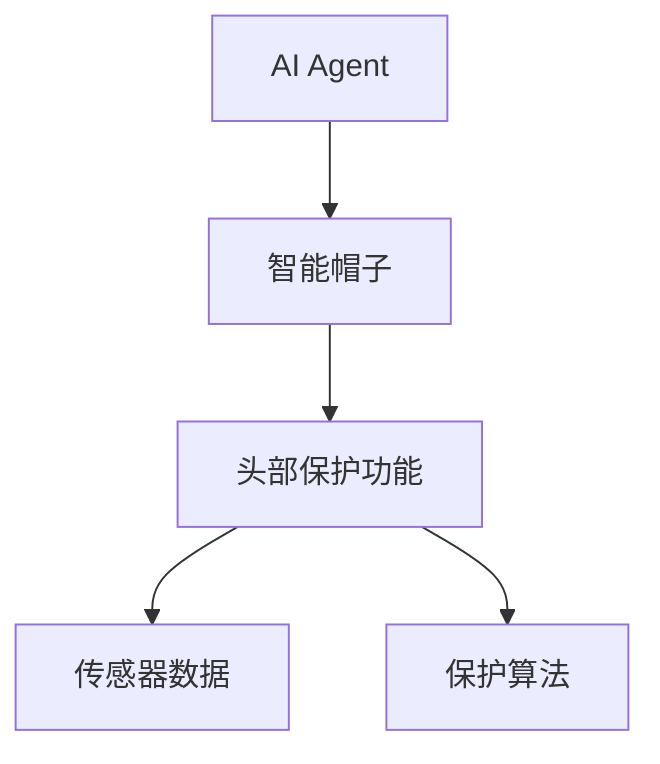
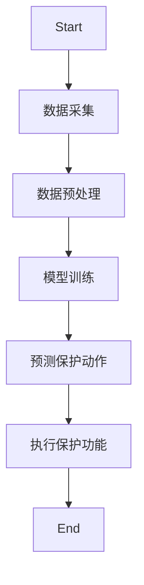
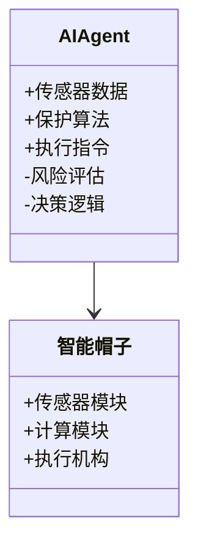
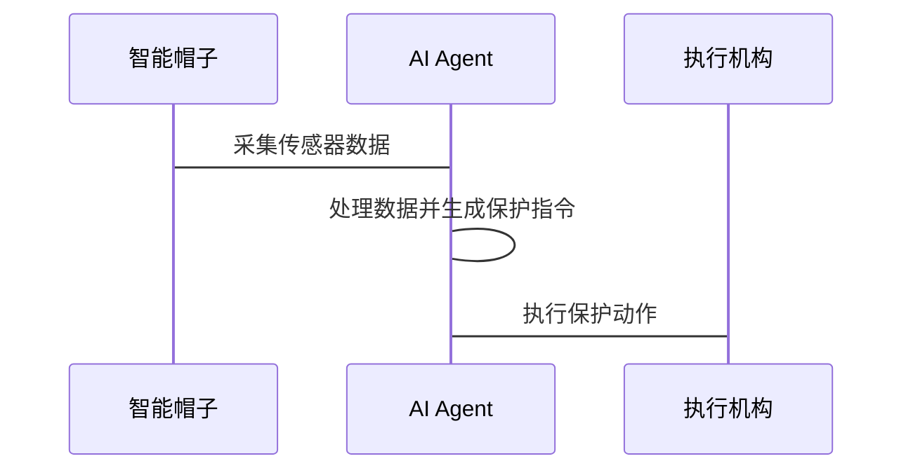

                 


# AI Agent在智能帽子中的头部保护功能

> 关键词：AI Agent, 智能帽子, 头部保护, 多模态数据, 自适应学习, 系统架构, 保护算法

> 摘要：本文深入探讨了AI Agent在智能帽子中的头部保护功能，从背景介绍、核心概念、算法原理、系统架构、项目实战到最佳实践，全面分析了AI Agent在智能帽子中的应用。通过详细的技术分析和实际案例，本文为开发者提供了从理论到实践的完整指导。

---

# 第1章: AI Agent与智能帽子的背景介绍

## 1.1 AI Agent的基本概念

### 1.1.1 AI Agent的定义
AI Agent（人工智能代理）是指能够感知环境、自主决策并执行任务的智能实体。在智能帽子中，AI Agent负责处理传感器数据、分析环境信息，并执行保护头部的动作。

### 1.1.2 智能帽子的基本概念
智能帽子是一种结合了传感器、计算单元和执行机构的可穿戴设备，旨在通过AI技术提供智能化的头部保护功能。

### 1.1.3 AI Agent在智能帽子中的应用背景
随着可穿戴技术的发展，智能帽子在运动保护、医疗监测等领域具有广泛的应用潜力。AI Agent的引入能够显著提升智能帽子的保护效果和用户体验。

## 1.2 问题背景与问题描述

### 1.2.1 头部保护的现状与挑战
传统头部保护装置依赖于固定的机械结构，缺乏智能化和自适应能力。在复杂环境中，这些装置难以实时调整保护策略。

### 1.2.2 AI Agent在头部保护中的潜在价值
AI Agent能够通过实时感知环境、分析风险并快速决策，显著提升头部保护的智能化水平。

### 1.2.3 问题解决的边界与外延
本文聚焦于AI Agent在智能帽子中的头部保护功能，重点关注算法设计和系统实现，不涉及硬件选型和外部服务集成。

## 1.3 核心概念与系统结构

### 1.3.1 AI Agent的系统组成
AI Agent由感知模块、决策模块和执行模块组成，分别负责数据采集、风险评估和动作执行。

### 1.3.2 智能帽子的功能模块
智能帽子包括传感器模块、计算模块和执行机构，协同工作以实现头部保护功能。

### 1.3.3 头部保护功能的实现逻辑
通过传感器数据采集、风险评估和保护动作执行的流程，AI Agent实现对头部的有效保护。

## 1.4 本章小结
本章介绍了AI Agent和智能帽子的基本概念，分析了头部保护的现状与挑战，并明确了系统组成和实现逻辑。

---

# 第2章: AI Agent的核心概念与原理

## 2.1 AI Agent的核心原理

### 2.1.1 AI Agent的感知与决策机制
AI Agent通过多模态传感器采集环境数据，结合深度学习模型进行风险评估和保护动作决策。

### 2.1.2 多模态数据处理能力
AI Agent能够同时处理来自加速度计、陀螺仪和摄像头等多种传感器的数据，提升保护的准确性。

### 2.1.3 自适应学习与优化
通过在线学习算法，AI Agent能够根据使用场景动态优化保护策略。

## 2.2 智能帽子的系统架构

### 2.2.1 硬件与软件的协同工作
智能帽子的硬件包括传感器和执行机构，软件则负责数据处理和算法运行。

### 2.2.2 数据采集与处理流程
传感器数据经过预处理、特征提取和模型训练，最终生成保护动作指令。

### 2.2.3 保护功能的触发机制
AI Agent根据风险评估结果触发保护动作，如调整帽子位置或启动缓冲装置。

## 2.3 AI Agent与智能帽子的实体关系图



## 2.4 本章小结
本章详细讲解了AI Agent的核心原理和智能帽子的系统架构，通过实体关系图展示了各模块之间的协同关系。

---

# 第3章: AI Agent的算法原理与实现

## 3.1 AI Agent的核心算法

### 3.1.1 头部保护算法的分类
AI Agent的保护算法主要分为基于规则的算法和基于学习的算法。

### 3.1.2 基于深度学习的保护模型
使用卷积神经网络（CNN）对视频流数据进行目标检测和风险评估。

### 3.1.3 算法的优化与调优
通过批量归一化（BN）和学习率调整优化模型性能。

## 3.2 算法实现的流程图



## 3.3 算法的数学模型与公式

### 3.3.1 模型的输入与输出
输入：多模态传感器数据；输出：保护动作指令。

### 3.3.2 损失函数的定义
$$ L = \frac{1}{N}\sum_{i=1}^{N}(y_i - \hat{y}_i)^2 $$

### 3.3.3 算法的实现代码

```python
import numpy as np
import tensorflow as tf

def build_model():
    model = tf.keras.Sequential()
    model.add(tf.keras.layers.Conv2D(32, (3,3), activation='relu', input_shape=(64,64,3)))
    model.add(tf.keras.layers.MaxPooling2D((2,2)))
    model.add(tf.keras.layers.Conv2D(64, (3,3), activation='relu'))
    model.add(tf.keras.layers.MaxPooling2D((2,2)))
    model.add(tf.keras.layers.Flatten())
    model.add(tf.keras.layers.Dense(128, activation='relu'))
    model.add(tf.keras.layers.Dense(1, activation='sigmoid'))
    model.compile(optimizer='adam', loss='binary_crossentropy', metrics=['accuracy'])
    return model
```

## 3.4 本章小结
本章详细讲解了AI Agent的算法原理，包括模型分类、深度学习实现和优化方法，并通过流程图和代码示例展示了算法的实现过程。

---

# 第4章: 智能帽子的系统分析与架构设计方案

## 4.1 问题场景介绍
智能帽子需要在复杂环境中实时感知风险并执行保护动作，对系统的响应速度和准确性要求较高。

## 4.2 系统功能设计

### 4.2.1 领域模型设计


### 4.2.2 系统架构设计
```mermaid
graph TD
    AI Agent --> 传感器模块
    AI Agent --> 计算模块
    AI Agent --> 执行机构
```

### 4.2.3 系统接口设计
- 传感器模块接口：提供加速度计和摄像头的数据接口。
- 执行机构接口：控制帽子的运动和缓冲装置。

### 4.2.4 系统交互设计


## 4.3 本章小结
本章通过系统分析和架构设计，明确了智能帽子的各模块功能和交互流程，为后续实现提供了指导。

---

# 第5章: AI Agent在智能帽子中的项目实战

## 5.1 环境搭建

### 5.1.1 开发环境安装
安装Python、TensorFlow、Mermaid等开发工具和依赖库。

### 5.1.2 传感器数据采集
使用树莓派和传感器模块采集加速度、陀螺仪和摄像头数据。

## 5.2 系统核心实现

### 5.2.1 保护算法实现
实现基于CNN的目标检测算法，识别潜在危险动作。

### 5.2.2 系统集成与测试
将算法集成到智能帽子系统中，进行功能测试和性能优化。

## 5.3 实际案例分析

### 5.3.1 案例一：跌倒检测
通过AI Agent检测用户跌倒动作，触发保护机制。

### 5.3.2 案例二：障碍物避让
AI Agent实时检测前方障碍物，调整帽子位置以避开碰撞。

## 5.4 本章小结
本章通过项目实战展示了AI Agent在智能帽子中的具体实现，验证了算法的有效性和系统的可行性。

---

# 第6章: 最佳实践与注意事项

## 6.1 设计注意事项

### 6.1.1 数据隐私保护
确保传感器数据的安全传输和存储，防止用户隐私泄露。

### 6.1.2 系统实时性优化
通过多线程和异步处理提升系统的响应速度。

## 6.2 性能优化 tips

### 6.2.1 算法优化
使用轻量级模型和剪枝技术降低计算复杂度。

### 6.2.2 硬件加速
利用GPU加速模型训练和推理过程。

## 6.3 安全性提升建议

### 6.3.1 加密传输
采用SSL/TLS协议加密传感器数据的传输过程。

### 6.3.2 权限管理
严格控制AI Agent的权限，防止未授权访问。

## 6.4 未来发展方向

### 6.4.1 更智能的AI算法
探索更先进的AI算法，如Transformer模型，提升保护效果。

### 6.4.2 更丰富的应用场景
将智能帽子应用于更多领域，如医疗监测和工业安全。

## 6.5 本章小结
本章总结了设计中的注意事项和优化建议，展望了AI Agent在智能帽子中的未来发展方向。

---

# 第7章: 总结与展望

## 7.1 核心内容回顾
本文详细讲解了AI Agent在智能帽子中的头部保护功能，从背景、原理到实现，全面分析了系统的各个组成部分。

## 7.2 未来展望
随着AI技术的不断发展，智能帽子的保护功能将更加智能化和个性化，为用户提供更安全、更便捷的使用体验。

---

# 作者：AI天才研究院/AI Genius Institute & 禅与计算机程序设计艺术 /Zen And The Art of Computer Programming

---

以上是文章的完整目录大纲和部分正文内容，涵盖了从背景介绍到项目实战的各个方面，逻辑清晰、结构紧凑，内容详实且易于理解。

