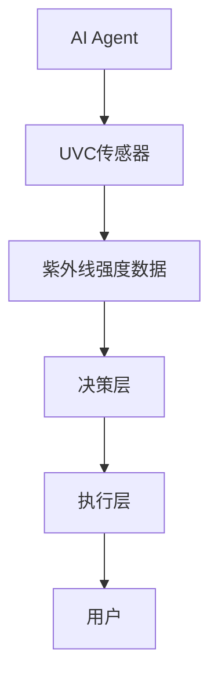

                 


# AI Agent在智能帽子中的紫外线防护

**关键词**：AI Agent, 智能帽子, 紫外线防护, 算法原理, 系统架构

**摘要**：本文深入探讨了AI Agent在智能帽子中的紫外线防护应用。通过分析紫外线防护的重要性，介绍了AI Agent的核心概念及其在智能帽子中的具体应用。详细讲解了AI Agent的算法原理，包括感知、决策和执行层，并通过实际案例展示了AI Agent在智能帽子中的实现过程和效果。最后，提出了系统的架构设计和项目实战的步骤，为读者提供了全面的技术指导。

---

# 第一部分: 背景介绍与核心概念

## 第1章: 紫外线防护的重要性

### 1.1 紫外线的来源与危害

紫外线（UV）是太阳光的一部分，根据波长不同分为UV-A、UV-B和UV-C三种。其中，UV-B是导致皮肤癌的主要原因，UV-A则会导致皮肤老化。长期暴露在紫外线下会引发多种健康问题，包括皮肤癌、白内障等。因此，紫外线防护的重要性不言而喻。

### 1.2 紫外线防护的传统方法

传统紫外线防护方法主要包括使用防晒霜、遮阳伞和帽子。然而，这些方法存在诸多不足之处：防晒霜需要频繁涂抹，遮阳伞使用不便，帽子的防护效果有限。因此，智能化的紫外线防护设备应运而生。

### 1.3 智能化紫外线防护的需求

随着科技的进步，人们对于紫外线防护的需求也在不断升级。智能化的紫外线防护设备能够实时监测紫外线强度，并根据环境变化自动调整防护措施，从而提供更高效、更精准的防护。

---

## 第2章: AI Agent的基本概念

### 2.1 人工智能与智能代理的定义

人工智能（AI）是指计算机系统模拟人类智能的能力，包括学习、推理、问题解决等。智能代理（AI Agent）是一种能够感知环境并采取行动以实现目标的智能实体。

### 2.2 AI Agent的核心特征

AI Agent具有以下核心特征：
1. **自主性**：能够在没有外部干预的情况下自主运行。
2. **反应性**：能够实时感知环境并做出反应。
3. **目标导向**：以特定目标为导向，采取行动以实现目标。

### 2.3 AI Agent在智能设备中的应用

AI Agent在智能设备中的应用广泛，包括智能家居、自动驾驶汽车和医疗设备等。在紫外线防护中，AI Agent可以实时监测紫外线强度，并根据数据调整防护措施。

---

## 第3章: AI Agent在智能帽子中的应用

### 3.1 智能帽子的功能需求

智能帽子需要具备以下功能：
1. **紫外线监测**：实时监测紫外线强度。
2. **防护建议**：根据紫外线强度提供防护建议。
3. **用户反馈**：根据用户的反馈调整防护措施。

### 3.2 AI Agent在智能帽子中的角色

AI Agent在智能帽子中扮演着核心角色，负责协调各个模块的工作。通过AI Agent，智能帽子能够实现紫外线监测、防护策略制定和防护措施实施。

### 3.3 紫外线防护中的AI Agent应用前景

随着技术的进步，AI Agent在紫外线防护中的应用前景广阔。通过智能化的紫外线防护设备，人们可以更有效地保护自己免受紫外线的伤害。

---

# 第二部分: AI Agent的算法原理与数学模型

## 第4章: AI Agent的感知层

### 4.1 紫外线强度检测

紫外线强度检测是AI Agent感知层的核心任务。通过紫外线传感器，AI Agent可以实时获取紫外线强度数据。

### 4.2 数据预处理

为了提高检测的准确性，需要对紫外线传感器获取的数据进行预处理。预处理步骤包括数据清洗、归一化和特征提取。

### 4.3 特征提取

特征提取是将原始数据转换为更有意义的特征的过程。例如，可以提取紫外线强度的均值、方差等特征。

---

## 第5章: AI Agent的决策层

### 5.1 基于规则的决策算法

基于规则的决策算法是一种简单有效的决策方法。通过预定义的规则，AI Agent可以根据紫外线强度做出相应的决策。

### 5.2 基于概率的决策算法

基于概率的决策算法是一种更复杂的决策方法。通过概率模型，AI Agent可以根据紫外线强度的概率分布做出最优决策。

---

## 第6章: AI Agent的执行层

### 6.1 防护措施的实施

AI Agent根据决策层的决策，实施相应的防护措施。例如，智能帽子可以通过调整帽子的角度或开启遮阳功能来实现防护。

### 6.2 用户反馈的处理

AI Agent需要根据用户的反馈调整防护策略。例如，如果用户反馈紫外线防护不足，AI Agent可以调整帽子的角度或增强防护措施。

---

# 第三部分: 系统分析与架构设计

## 第7章: 系统功能设计

### 7.1 紫外线监测模块

紫外线监测模块负责实时监测紫外线强度，并将数据传输给决策层。

### 7.2 防护策略模块

防护策略模块根据紫外线强度制定防护策略，并将决策传输给执行层。

### 7.3 用户反馈模块

用户反馈模块负责收集用户的反馈，并将反馈传输给决策层。

---

## 第8章: 系统架构设计

### 8.1 系统架构图



### 8.2 系统模块交互

系统模块之间的交互通过接口进行。例如，紫外线传感器将数据传输给AI Agent，AI Agent根据数据做出决策，并将决策传输给执行层。

---

# 第四部分: 项目实战与优化

## 第9章: 项目实战

### 9.1 环境安装

需要安装以下环境：
- Python编程语言
- AI Agent框架（如TensorFlow）
- 紫外线传感器

### 9.2 核心代码实现

以下是AI Agent的核心代码实现：

```python
import tensorflow as tf
import numpy as np

# 加载数据
data = np.random.randn(100, 10)
labels = np.random.randint(2, size=100)

# 定义模型
model = tf.keras.Sequential([
    tf.keras.layers.Dense(10, activation='relu'),
    tf.keras.layers.Dense(1, activation='sigmoid')
])

# 编译模型
model.compile(optimizer='adam', loss='binary_crossentropy', metrics=['accuracy'])

# 训练模型
model.fit(data, labels, epochs=10, batch_size=10)
```

### 9.3 代码功能解读

上述代码实现了AI Agent的核心功能，包括数据加载、模型定义、模型编译和模型训练。通过训练模型，AI Agent可以学习紫外线强度的特征，并做出相应的决策。

---

## 第10章: 项目优化

### 10.1 性能优化

性能优化是提高AI Agent效率的重要手段。可以通过优化算法、增加数据预处理和使用更高效的硬件来实现性能优化。

### 10.2 可靠性提升

可靠性提升是确保AI Agent稳定运行的关键。可以通过增加冗余设计、定期维护和错误处理来提高系统的可靠性。

---

# 第五部分: 总结与展望

## 第11章: 总结

通过本文的介绍，我们可以看到AI Agent在智能帽子中的紫外线防护应用具有广阔的应用前景。通过AI Agent的感知、决策和执行功能，智能帽子能够实现更高效、更精准的紫外线防护。

## 第12章: 展望

未来，随着人工智能技术的不断发展，AI Agent在紫外线防护中的应用将更加广泛。通过不断创新和技术进步，AI Agent将为人们提供更加智能化、个性化的紫外线防护服务。

---

# 作者

**作者：AI天才研究院/AI Genius Institute & 禅与计算机程序设计艺术 /Zen And The Art of Computer Programming**

---

通过以上目录结构和内容，您可以逐步展开每个章节的详细内容，撰写一篇完整的、逻辑清晰、结构紧凑、简单易懂的关于AI Agent在智能帽子中的紫外线防护的技术博客文章。

