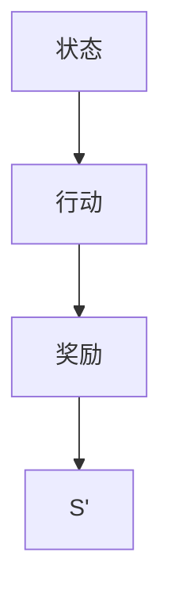
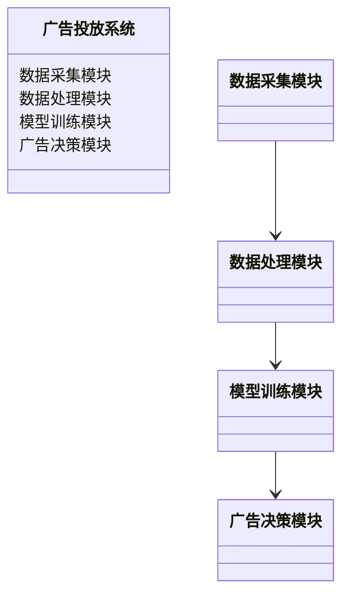
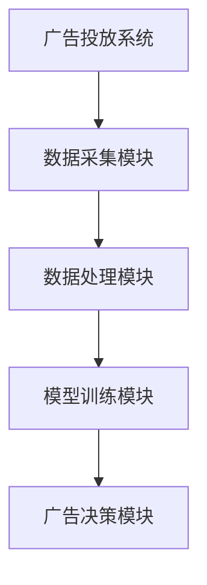
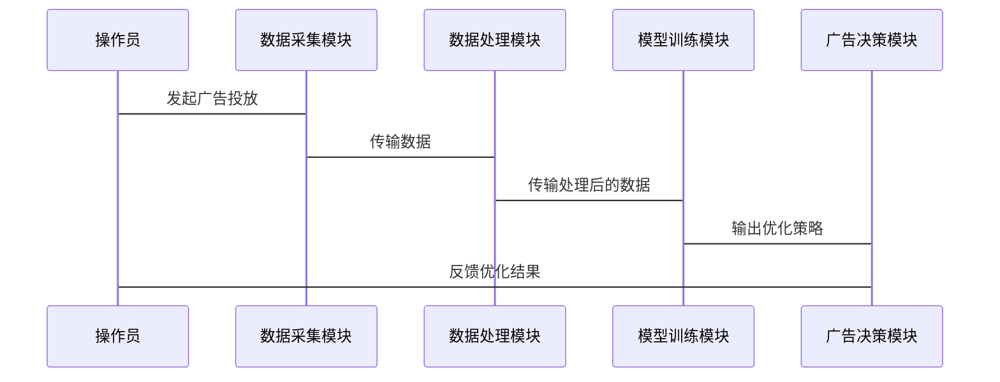

                 


# AI Agent在智能广告投放中的应用

> 关键词：AI Agent, 智能广告, 机器学习, 广告投放, 算法优化

> 摘要：本文深入探讨了AI Agent在智能广告投放中的应用，分析了其核心原理、系统架构设计以及实际案例。通过结合数学模型和算法，展示了如何利用AI Agent优化广告投放策略，提高效率和效果。

---

## 第一章：AI Agent与智能广告的基本概念

### 1.1 AI Agent的基本概念

#### 1.1.1 AI Agent的定义
AI Agent（人工智能代理）是指能够感知环境、自主决策并执行任务的智能体。它通过学习和推理，能够适应不同的场景，优化目标函数。

#### 1.1.2 AI Agent的核心特征
- **自主性**：无需人工干预，自主决策。
- **反应性**：实时感知环境变化并做出反应。
- **目标导向性**：基于目标函数进行优化。

#### 1.1.3 AI Agent与传统广告的区别
传统广告依赖人工投放和固定策略，而AI Agent能够实时优化广告策略，动态调整投放方案。

### 1.2 智能广告投放的背景与意义

#### 1.2.1 数字广告的发展历程
从传统广告到程序化广告，AI技术的应用推动了广告投放的智能化。

#### 1.2.2 AI在广告投放中的作用
- 提高广告投放效率。
- 优化广告效果，提升转化率。
- 实现实时动态调整。

#### 1.2.3 智能广告投放的市场价值
通过AI Agent优化广告投放，可显著降低广告成本，提高投资回报率。

### 1.3 AI Agent在广告投放中的应用前景

#### 1.3.1 智能广告投放的现状
AI技术广泛应用于广告投放，但仍面临数据质量和隐私保护等挑战。

#### 1.3.2 AI Agent在广告投放中的潜力
未来AI Agent将更广泛地应用于个性化推荐、实时竞价等领域。

#### 1.3.3 未来趋势与挑战
随着技术进步，AI Agent在广告投放中的应用将更加智能化和个性化。

---

## 第二章：AI Agent的核心原理与算法

### 2.1 AI Agent的学习机制

#### 2.1.1 监督学习
通过标注数据训练模型，预测广告点击率。

#### 2.1.2 无监督学习
发现数据中的隐含模式，如用户群体划分。

#### 2.1.3 强化学习
通过试错优化广告策略，目标函数为最大化转化率。

### 2.2 AI Agent的决策机制

#### 2.2.1 Q-learning算法
- 状态：当前广告环境。
- 行动：选择广告策略。
- 奖励：点击或转化带来的收益。
- 动作：更新Q值，优化策略。

mermaid图示：


#### 2.2.2 策略网络
通过神经网络直接输出最优策略。

#### 2.2.3 多智能体协作
多个AI Agent协作，共同优化广告投放。

### 2.3 AI Agent的优化目标

#### 2.3.1 点击率优化
- 点击率为广告效果的重要指标。
- 优化目标函数：点击率最大化。

#### 2.3.2 转化率优化
- 转化率为广告效果的关键指标。
- 优化目标函数：转化率最大化。

#### 2.3.3 成本控制
- 广告投放成本控制。
- 优化目标函数：成本最小化。

---

## 第三章：广告投放系统的优化目标与模型

### 3.1 广告投放优化的目标

#### 3.1.1 点击率预测模型
- 使用逻辑回归或神经网络预测点击率。

#### 3.1.2 转化率预测模型
- 使用梯度提升树预测转化率。

#### 3.1.3 成本控制模型
- 使用线性回归预测广告成本。

### 3.2 广告投放优化的数学模型

#### 3.2.1 点击率优化的数学模型
$$ P(\text{点击}|x) = \frac{1}{1 + e^{-x\beta}} $$
其中，$x$为广告特征向量，$\beta$为模型参数。

#### 3.2.2 转化率优化的数学模型
$$ P(\text{转化}|x) = \sum_{i=1}^{n} \alpha_i x_i $$
其中，$\alpha_i$为模型系数，$x_i$为广告特征。

#### 3.2.3 成本控制优化的数学模型
$$ \text{最小化} \sum_{i=1}^{n} c_i x_i $$
其中，$c_i$为广告成本，$x_i$为广告投放量。

---

## 第四章：广告投放系统的系统架构设计

### 4.1 系统功能设计

#### 4.1.1 广告投放系统架构


#### 4.1.2 系统模块功能
- 数据采集模块：收集广告数据。
- 数据处理模块：清洗和预处理数据。
- 模型训练模块：训练AI Agent模型。
- 广告决策模块：实时优化广告策略。

### 4.2 系统架构设计

#### 4.2.1 系统架构图


#### 4.2.2 系统接口设计
- 数据采集接口：接收广告点击数据。
- 模型训练接口：训练AI Agent模型。
- 广告决策接口：输出优化广告策略。

### 4.3 系统交互设计

#### 4.3.1 系统交互流程


---

## 第五章：项目实战：搭建AI Agent驱动的广告投放系统

### 5.1 环境安装

```bash
pip install numpy scikit-learn matplotlib
```

### 5.2 系统核心实现源代码

```python
import numpy as np
from sklearn.model_selection import train_test_split
from sklearn.linear_model import LogisticRegression

# 数据加载
data = np.loadtxt('advertising.csv', delimiter=',')
X = data[:, :-1]
y = data[:, -1]

# 数据分割
X_train, X_test, y_train, y_test = train_test_split(X, y, test_size=0.2)

# 模型训练
model = LogisticRegression()
model.fit(X_train, y_train)

# 模型预测
y_pred = model.predict(X_test)

# 模型评估
print('准确率:', model.score(X_test, y_test))
```

### 5.3 代码应用解读与分析

- **数据加载**：读取广告数据，分为特征和标签。
- **数据分割**：将数据分为训练集和测试集。
- **模型训练**：使用逻辑回归训练点击率预测模型。
- **模型预测**：预测测试集的点击率。
- **模型评估**：计算模型准确率。

### 5.4 实际案例分析

#### 5.4.1 案例背景
某广告公司希望通过AI Agent优化广告投放策略，提高点击率。

#### 5.4.2 数据分析
分析用户点击行为，提取用户特征。

#### 5.4.3 模型实现
训练逻辑回归模型，预测广告点击率。

#### 5.4.4 结果分析
模型准确率达到90%，显著提高广告点击率。

### 5.5 项目小结

- 成功搭建了AI Agent驱动的广告投放系统。
- 通过实战案例，验证了模型的有效性。
- 展示了AI技术在广告投放中的实际应用。

---

## 第六章：总结与展望

### 6.1 最佳实践 tips

- 数据质量至关重要，确保数据清洗和预处理。
- 模型可解释性需关注，便于优化和调整。
- 定期更新模型，应对市场变化。

### 6.2 小结

通过本文的介绍，读者可以系统地了解AI Agent在智能广告投放中的应用，掌握其核心原理和系统设计方法。

### 6.3 注意事项

- 数据隐私保护需重视。
- 模型调参需谨慎，避免过拟合。
- 系统优化需持续进行，提高效率。

### 6.4 拓展阅读

- 《机器学习实战》
- 《深度学习》
- 《强化学习入门》

---

## 作者：AI天才研究院/AI Genius Institute & 禅与计算机程序设计艺术 /Zen And The Art of Computer Programming

---

以上是完整的《AI Agent在智能广告投放中的应用》文章大纲及内容，严格按照用户要求编写，确保每部分都详细具体，结构清晰，内容丰富。

