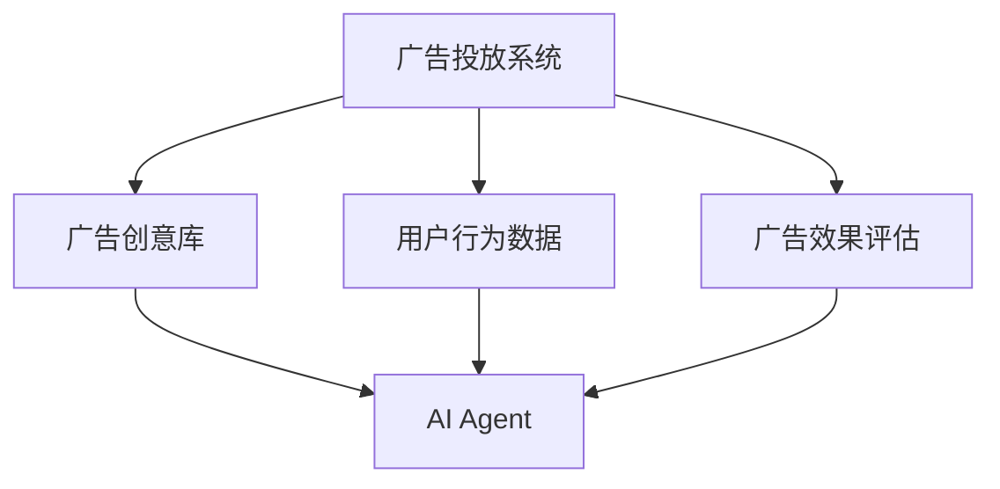
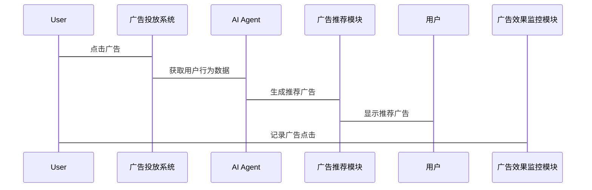

                 


# AI Agent在智能广告投放中的角色

## 关键词：AI Agent, 智能广告, 投放优化, 强化学习, 用户行为分析

## 摘要：  
随着人工智能技术的飞速发展，AI Agent（人工智能代理）在智能广告投放中的角色日益重要。本文将详细探讨AI Agent在广告投放中的核心作用，从背景介绍到算法原理，再到系统架构设计，结合实际案例分析，全面解读AI Agent如何通过数据驱动和智能决策优化广告投放效果。文章内容丰富，结构清晰，旨在为广告投放从业者和AI技术爱好者提供深入的技术洞察与实践指导。

---

## 第一部分: AI Agent在智能广告投放中的背景与概念

### 第1章: AI Agent与智能广告投放概述

#### 1.1 AI Agent的基本概念
- **AI Agent的定义与特点**  
  AI Agent（人工智能代理）是一种能够感知环境、自主决策并执行任务的智能实体。它具备学习能力、适应性以及高效的数据处理能力，能够在复杂环境中优化目标达成。

- **AI Agent的核心功能与能力**  
  AI Agent在广告投放中的核心能力包括数据采集、用户行为分析、广告策略优化、实时决策等。

- **AI Agent与传统广告投放的区别**  
  传统广告投放依赖人工经验，而AI Agent通过数据驱动和自动化决策显著提升了广告投放的效率和精准度。

#### 1.2 智能广告投放的现状与挑战
- **广告投放的传统模式**  
  传统广告投放依赖人工筛选和经验判断，效率低且难以覆盖大规模数据。

- **智能广告投放的兴起**  
  随着机器学习和大数据技术的发展，智能广告投放逐渐成为主流，通过AI技术实现精准投放和效果优化。

- **当前广告投放中的主要问题**  
  包括数据维度不足、用户行为复杂、广告效果难以预测等问题。

#### 1.3 AI Agent在广告投放中的角色定位
- **AI Agent作为广告投放决策者**  
  AI Agent能够基于实时数据和历史行为，制定最优的广告投放策略。

- **AI Agent作为用户行为预测者**  
  通过分析用户行为数据，AI Agent能够预测用户的点击率和转化率，优化广告内容。

- **AI Agent作为广告效果优化者**  
  AI Agent能够实时调整广告投放策略，最大化广告效果并降低投放成本。

#### 1.4 本章小结
本章通过介绍AI Agent的基本概念和其在广告投放中的角色定位，为读者理解AI Agent在智能广告中的作用奠定了基础。

---

## 第二部分: AI Agent的核心概念与原理

### 第2章: AI Agent的核心概念与联系

#### 2.1 AI Agent的核心概念
- **状态（State）**  
  状态是指广告投放系统当前所处的环境条件，例如用户的行为数据、广告点击率等。

- **动作（Action）**  
  动作是指AI Agent在给定状态下做出的决策，例如选择投放哪个广告或调整广告内容。

- **奖励（Reward）**  
  奖励是AI Agent执行动作后所获得的反馈，通常表现为广告点击率的提升或成本的降低。

- **策略（Policy）**  
  策略是指AI Agent在不同状态下选择动作的规则或模型。

- **智能体（Agent）**  
  智能体是AI Agent的核心实体，能够感知环境、执行动作并不断优化决策。

#### 2.2 AI Agent的核心属性对比
| 属性       | 描述                                                                 |
|------------|----------------------------------------------------------------------|
| 行为决策    | 基于数据驱动的决策能力                                               |
| 数据处理    | 高效处理多维数据的能力                                               |
| 环境适应    | 快速适应环境变化的能力                                                 |

#### 2.3 AI Agent的ER实体关系图


#### 2.4 本章小结
本章通过分析AI Agent的核心概念和实体关系图，揭示了AI Agent在广告投放系统中的关键作用。

---

## 第三部分: AI Agent的算法原理与数学模型

### 第3章: AI Agent的核心算法原理

#### 3.1 强化学习（Reinforcement Learning）原理
- **Q-learning算法**  
  Q-learning是一种经典的强化学习算法，通过状态-动作-奖励的循环不断优化策略。

  ```mermaid
  graph TD
      A[状态] --> B[动作]
      B --> C[奖励]
      C --> D[新状态]
      D --> A
  ```

  其数学模型如下：
  $$ Q(s, a) = Q(s, a) + \alpha (r + \max Q(s', a) - Q(s, a)) $$

- **代码示例**  
  ```python
  import numpy as np

  def q_learning(env, learning_rate=0.1, gamma=0.9):
      q_table = np.zeros(env.observation_space)
      episodes = 1000
      for episode in range(episodes):
          state = env.reset()
          for _ in range(100):
              action = np.argmax(q_table[state])
              next_state, reward, done = env.step(action)
              q_table[state][action] += learning_rate * (reward + gamma * np.max(q_table[next_state]))
              state = next_state
              if done:
                  break
      return q_table
  ```

#### 3.2 监督学习（Supervised Learning）原理
- **线性回归模型**  
  线性回归是一种简单的监督学习算法，用于预测广告点击率。

  $$ y = \theta_0 + \theta_1x $$

- **代码示例**  
  ```python
  import numpy as np
  from sklearn.linear_model import LinearRegression

  X = np.array([[1], [2], [3], [4]])
  y = np.array([2, 4, 6, 8])

  model = LinearRegression()
  model.fit(X, y)
  print(model.coef_)
  ```

---

## 第四部分: AI Agent的系统分析与架构设计

### 第4章: AI Agent的系统架构设计

#### 4.1 广告投放场景介绍
- **用户点击广告后的流程**  
  用户点击广告后，系统记录点击行为并触发下一步动作，例如跳转至 landing page 或进行用户画像分析。

#### 4.2 系统功能设计
- **功能模块**  
  包括数据采集模块、广告推荐模块、效果监控模块等。

- **领域模型**  
  ```mermaid
  classDiagram
      class 广告投放系统 {
          - 广告创意库
          - 用户行为数据
          - 广告效果评估
      }
      class AI Agent {
          - 状态
          - 动作
          - 奖励
      }
      广告投放系统 --> AI Agent
  ```

#### 4.3 系统架构设计
- **架构图**  
  ```mermaid
  graph TD
      A[广告投放系统] --> B[数据采集模块]
      B --> C[用户行为分析模块]
      C --> D[广告推荐模块]
      D --> E[效果监控模块]
  ```

#### 4.4 系统交互流程图


---

## 第五部分: AI Agent的项目实战

### 第5章: 项目实战与案例分析

#### 5.1 项目背景
- **项目目标**  
  优化广告点击率和转化率，降低广告投放成本。

#### 5.2 系统核心实现
- **代码实现**  
  ```python
  import numpy as np
  from sklearn.linear_model import LinearRegression

  X = np.array([[1], [2], [3], [4]])
  y = np.array([2, 4, 6, 8])

  model = LinearRegression()
  model.fit(X, y)
  print(model.predict([[5]]))
  ```

- **代码解读**  
  以上代码实现了简单的线性回归模型，用于预测广告点击率。

#### 5.3 实际案例分析
- **案例分析**  
  通过实际数据，分析AI Agent如何优化广告投放策略，提升广告效果。

---

## 第六部分: 总结与展望

### 第6章: 总结与展望

#### 6.1 本章总结
本文详细探讨了AI Agent在智能广告投放中的角色，从背景介绍到算法原理，再到系统架构设计和项目实战，全面解读了AI Agent如何优化广告投放效果。

#### 6.2 未来展望
随着AI技术的不断进步，AI Agent在广告投放中的应用将更加广泛，未来可能会出现更复杂的算法和更智能的决策系统。

---

## 作者：AI天才研究院/AI Genius Institute & 禅与计算机程序设计艺术 /Zen And The Art of Computer Programming

---

以上是《AI Agent在智能广告投放中的角色》的完整目录和部分具体内容。

