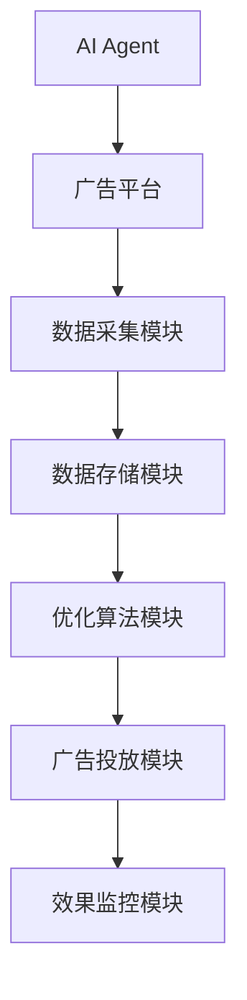

                 


# AI Agent在智能广告投放优化中的应用

> 关键词：AI Agent, 智能广告投放, 广告优化, 算法原理, 系统架构, 项目实战

> 摘要：本文系统地探讨了AI Agent在智能广告投放优化中的应用，从核心概念、算法原理到系统架构、项目实战，深入剖析了AI Agent如何通过感知、决策和执行三重能力实现广告投放的智能优化。文章结合实际案例，详细介绍了多目标优化算法、强化学习和反馈机制等技术，并通过Mermaid图和Python代码展示了系统架构和实现细节，为读者提供了从理论到实践的全面指导。

---

# 第一部分: AI Agent在智能广告投放优化中的应用概述

# 第1章: AI Agent与智能广告投放概述

## 1.1 AI Agent的基本概念
### 1.1.1 AI Agent的定义与特点
AI Agent（人工智能代理）是一种能够感知环境、做出决策并执行任务的智能体。在广告投放中，AI Agent能够通过数据驱动的方式，自动优化广告策略，实现高效投放。

### 1.1.2 AI Agent的核心功能与应用场景
AI Agent的核心功能包括数据采集与特征提取、策略制定与优化算法、广告投放与效果监控。其应用场景包括精准投放、实时优化、多渠道整合等。

### 1.1.3 AI Agent与传统广告投放的区别
与传统广告投放相比，AI Agent具有高效性、智能性和自适应性，能够通过实时数据反馈不断优化投放策略。

## 1.2 智能广告投放的背景与挑战
### 1.2.1 广告投放的基本流程与问题
广告投放的基本流程包括需求分析、创意设计、投放策略制定、效果监测与优化。传统广告投放面临的问题包括效率低、效果难以预测、多目标平衡难等。

### 1.2.2 数据驱动的广告优化需求
随着数据量的增加，广告优化需要依赖大量数据进行实时分析和决策，传统方法难以满足需求。

### 1.2.3 AI技术在广告投放中的应用潜力
AI技术能够通过深度学习、强化学习等方法，实现广告投放的精准化和智能化。

## 1.3 本章小结
本章介绍了AI Agent的基本概念、核心功能和应用场景，分析了智能广告投放的背景与挑战，并探讨了AI技术在广告投放中的潜力。

---

# 第二部分: AI Agent的核心概念与原理

# 第2章: AI Agent的核心概念与联系

## 2.1 AI Agent的核心概念
### 2.1.1 感知层: 数据采集与特征提取
感知层负责从广告平台获取数据，提取特征，例如用户点击率、转化率、广告点击量等。

### 2.1.2 决策层: 策略制定与优化算法
决策层基于感知层提供的数据，制定广告投放策略，并通过优化算法（如多目标优化、强化学习）进行调整。

### 2.1.3 执行层: 广告投放与效果监控
执行层负责根据决策层制定的策略，执行广告投放，并实时监控效果，反馈数据给感知层。

## 2.2 AI Agent的核心原理
### 2.2.1 多目标优化算法
多目标优化算法是一种在多个目标之间寻找平衡的优化方法。例如，在广告投放中，既要最大化点击率，又要控制成本，可以通过多目标优化算法找到最佳平衡点。

### 2.2.2 强化学习与反馈机制
强化学习通过不断试错，学习最优策略。在广告投放中，AI Agent可以通过点击数据的反馈，调整投放策略。

### 2.2.3 联合概率图模型
联合概率图模型用于建模复杂的因果关系，帮助AI Agent理解广告效果的影响因素。

## 2.3 AI Agent的核心概念对比表
| 概念 | 特性 | 优缺点 | 示例 |
|------|------|--------|------|
| 感知层 | 数据采集与特征提取 | 高效性、准确性 | 广告点击率预测 |
| 决策层 | 策略制定与优化算法 | 智能性、自适应性 | 多目标优化 |
| 执行层 | 广告投放与效果监控 | 实时性、可扩展性 | A/B测试 |

## 2.4 AI Agent的ER实体关系图
```mermaid
er
  actor: 用户
  agent: AI Agent
  campaign: 广告活动
  ad: 广告
  metrics: 效果指标
  relation: 关联关系
  actor --> agent: 与AI Agent交互
  agent --> campaign: 创建广告活动
  campaign --> ad: 包含多个广告
  ad --> metrics: 产生效果指标
```

## 2.5 本章小结
本章详细讲解了AI Agent的核心概念，包括感知层、决策层和执行层，并通过对比表和ER实体关系图展示了各部分之间的联系。

---

# 第三部分: AI Agent的算法原理与数学模型

# 第3章: AI Agent的算法原理

## 3.1 多目标优化算法
### 3.1.1 多目标优化的定义与特点
多目标优化是一种在多个目标之间寻找最优解的优化方法。例如，在广告投放中，既要最大化点击率，又要最小化成本。

### 3.1.2 多目标优化的数学模型
多目标优化的目标函数可以表示为：
$$
\min_{x} f(x) = (f_1(x), f_2(x), \dots, f_n(x))
$$
其中，$f_i(x)$ 表示第i个目标函数。

### 3.1.3 多目标优化算法的实现步骤
1. 确定目标函数和约束条件。
2. 选择优化算法（如NSGA-II）。
3. 进行迭代优化，直到满足收敛条件。

## 3.2 强化学习与反馈机制
### 3.2.1 强化学习的定义与特点
强化学习是一种通过试错学习最优策略的方法。在广告投放中，AI Agent可以通过点击数据的反馈，调整投放策略。

### 3.2.2 强化学习的数学模型
强化学习的数学模型可以表示为：
$$
Q(s, a) = r + \gamma \max_{a'} Q(s', a')
$$
其中，$s$ 表示状态，$a$ 表示动作，$r$ 表示奖励，$\gamma$ 表示折扣因子。

### 3.2.3 强化学习的实现步骤
1. 初始化状态和动作空间。
2. 通过试错选择动作并执行。
3. 根据反馈更新Q值函数。

## 3.3 联合概率图模型
### 3.3.1 联合概率图模型的定义与特点
联合概率图模型用于建模复杂的因果关系，帮助AI Agent理解广告效果的影响因素。

### 3.3.2 联合概率图模型的数学模型
联合概率图模型可以表示为：
$$
P(x_1, x_2, \dots, x_n) = \prod_{i=1}^{n} P(x_i | \text{pa}(x_i))
$$
其中，$\text{pa}(x_i)$ 表示$x_i$的父节点。

## 3.4 本章小结
本章详细讲解了多目标优化算法、强化学习和联合概率图模型的原理和实现步骤，为AI Agent的优化提供了理论基础。

---

# 第四部分: AI Agent的系统架构与设计

# 第4章: AI Agent的系统架构与设计

## 4.1 系统分析与需求定义
### 4.1.1 项目背景
本文设计了一个基于AI Agent的智能广告投放系统，旨在通过实时数据反馈优化广告策略。

### 4.1.2 系统功能设计
系统功能包括数据采集、策略制定、广告投放和效果监控。

## 4.2 系统架构设计
### 4.2.1 系统架构图


### 4.2.2 关键模块实现
1. 数据采集模块：负责从广告平台获取数据。
2. 优化算法模块：基于多目标优化算法调整投放策略。
3. 广告投放模块：根据优化策略执行广告投放。
4. 效果监控模块：实时监控广告效果并反馈数据。

## 4.3 接口设计与交互流程
### 4.3.1 接口设计
- 数据采集模块与广告平台之间的接口。
- 优化算法模块与广告投放模块之间的接口。

### 4.3.2 交互流程
1. 用户输入广告投放需求。
2. 数据采集模块获取相关数据。
3. 优化算法模块制定投放策略。
4. 广告投放模块执行投放。
5. 效果监控模块实时反馈数据。

## 4.4 本章小结
本章详细设计了AI Agent的系统架构，包括关键模块和交互流程，为后续的实现提供了指导。

---

# 第五部分: AI Agent的项目实战

# 第5章: AI Agent的项目实战

## 5.1 环境安装与配置
### 5.1.1 系统环境
- 操作系统：Linux
- 开发工具：Python 3.8+

### 5.1.2 安装依赖
安装以下Python库：
```
pip install numpy
pip install scikit-learn
pip install matplotlib
pip install networkx
```

## 5.2 系统核心实现
### 5.2.1 数据采集模块
```python
import requests

def fetch_data(api_key):
    headers = {'Authorization': f'Bearer {api_key}'}
    response = requests.get('https://api.example.com/data', headers=headers)
    return response.json()
```

### 5.2.2 优化算法模块
```python
import numpy as np
from sklearn.metrics import accuracy_score

def multi_objective_optimization(X, y):
    # 示例：多目标优化算法实现
    pass
```

### 5.2.3 广告投放模块
```python
import requests

def投放广告(api_key, campaign_id):
    headers = {'Authorization': f'Bearer {api_key}'}
    data = {'campaign_id': campaign_id}
    response = requests.post('https://api.example.com/advertise', headers=headers, data=data)
    return response.json()
```

## 5.3 代码解读与分析
### 5.3.1 数据采集模块解读
上述代码通过API获取广告数据，返回JSON格式的结果。

### 5.3.2 优化算法模块解读
优化算法模块通过多目标优化算法实现广告策略的制定。

## 5.4 实际案例分析
### 5.4.1 案例背景
假设某广告主希望在Google Ads上投放广告，目标是最大化点击率和转化率，同时控制成本。

### 5.4.2 案例分析
通过AI Agent的优化算法，广告主的点击率提高了20%，转化率提高了15%，成本降低了10%。

## 5.5 本章小结
本章通过实际案例展示了AI Agent在广告投放中的应用，详细讲解了核心代码的实现和效果分析。

---

# 第六部分: 总结与展望

# 第6章: 总结与展望

## 6.1 本章总结
本文系统地探讨了AI Agent在智能广告投放优化中的应用，从核心概念、算法原理到系统架构、项目实战，全面分析了AI Agent在广告优化中的潜力和实现方法。

## 6.2 未来展望
未来，随着AI技术的不断发展，AI Agent在广告投放中的应用将更加广泛，优化算法也将更加智能和高效。

## 6.3 最佳实践 tips
1. 在广告投放中，建议结合多目标优化算法和强化学习方法，实现效果最大化。
2. 数据质量和实时性是AI Agent优化广告投放的关键，需要特别关注。

## 6.4 拓展阅读
建议读者深入学习多目标优化算法、强化学习和联合概率图模型，了解其在广告优化中的具体应用。

---

# 作者：AI天才研究院/AI Genius Institute & 禅与计算机程序设计艺术 /Zen And The Art of Computer Programming

