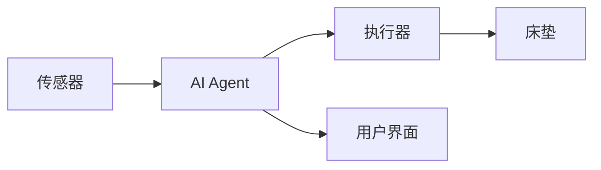
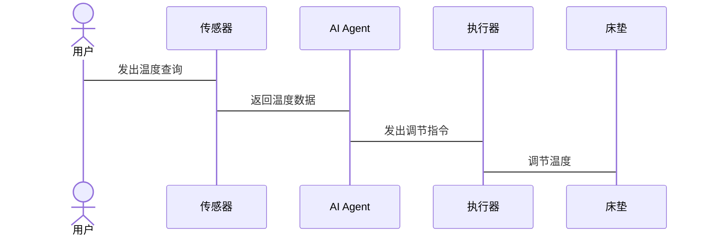
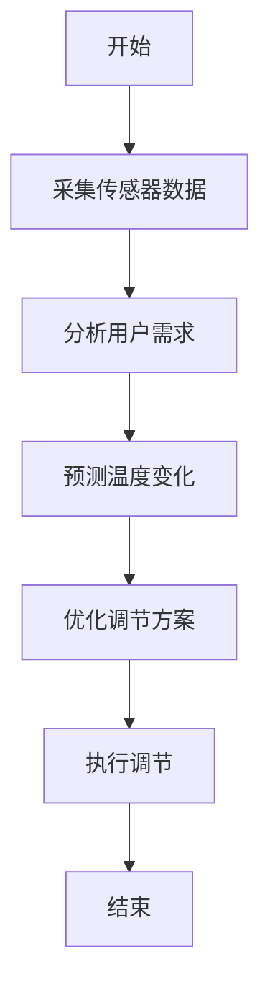
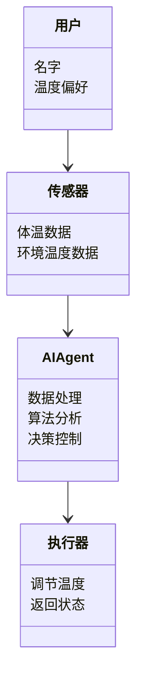
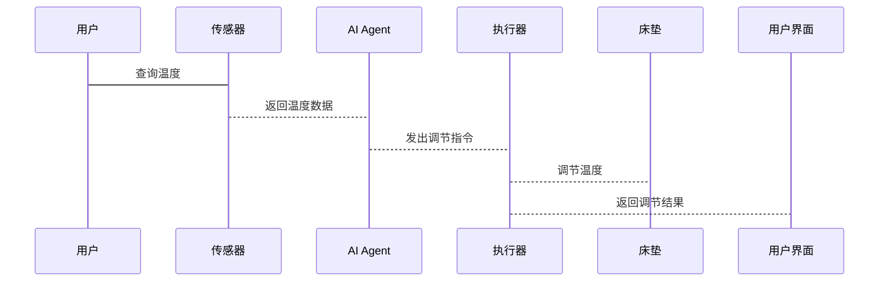

                 


# AI Agent在智能床垫中的体温调节

> 关键词：AI Agent, 智能床垫, 体温调节, 多传感器数据融合, 智能家居, 多目标优化

> 摘要：本文深入探讨了AI Agent在智能床垫中的体温调节应用，从核心概念、算法原理到系统架构设计，再到项目实战，详细分析了如何利用AI技术实现智能床垫的高效体温调节。通过案例分析和代码实现，展示了AI Agent在智能床垫中的实际应用价值和技术创新。

---

## 第一部分：AI Agent与智能床垫的背景介绍

### 第1章：问题背景与描述

#### 1.1 现代床垫的发展趋势
现代床垫不仅仅是提供支撑的工具，而是逐渐向智能化方向发展。随着物联网和人工智能技术的进步，智能床垫能够通过传感器和AI算法，实时感知用户的需求并做出相应的调整，以提供更加舒适和健康的睡眠环境。

#### 1.2 体温调节的重要性
人体体温的舒适度直接影响睡眠质量。传统床垫的调节方式通常是手动操作，用户需要通过调节床垫的硬度或温度，这不仅不方便，而且难以精准满足不同用户的个性化需求。AI Agent通过实时感知和学习用户的需求，能够自动调节床垫的温度，提供更加智能化和个性化的睡眠体验。

#### 1.3 AI Agent在床垫中的应用潜力
AI Agent在智能床垫中的应用不仅限于温度调节，还可以扩展到姿势调整、健康监测等领域。通过AI算法，床垫能够根据用户的生理数据和环境变化，动态调整参数，提供更加智能和贴心的服务。

### 第2章：AI Agent的核心概念

#### 2.1 AI Agent的定义与特征
AI Agent是一种能够感知环境、自主决策并执行任务的智能系统。它具备以下特征：
- **自主性**：能够自主决策，无需外部干预。
- **反应性**：能够实时感知环境变化并做出反应。
- **学习能力**：能够通过学习优化自身的决策能力。
- **适应性**：能够根据环境变化调整自身行为。

#### 2.2 AI Agent与传统控制系统的区别
传统的控制系统通常是基于规则的，通过预设的条件和动作来实现控制。而AI Agent具备学习和自适应能力，能够根据环境和用户需求动态调整控制策略。

#### 2.3 智能床垫的定义与分类
智能床垫是指通过传感器和AI算法，能够感知用户的生理数据和环境变化，并通过执行器自动调整床垫参数，以提供舒适睡眠环境的床垫。根据调节方式的不同，智能床垫可以分为温度调节型、硬度调节型和健康监测型等。

### 第3章：问题解决与边界

#### 3.1 体温调节的核心问题
- **数据采集**：如何准确采集用户的体温和环境温度数据。
- **数据处理**：如何处理和分析采集到的数据，生成调节策略。
- **调节执行**：如何根据调节策略，精准控制床垫的温度。

#### 3.2 AI Agent在调节中的作用
AI Agent通过多传感器数据融合技术，实时感知用户的需求和环境变化，动态优化调节策略，实现精准的温度控制。

#### 3.3 系统的边界与外延
智能床垫系统的核心功能是温度调节，但也可以扩展到姿势调整、健康监测等领域，形成更加完善的智能睡眠生态系统。

---

## 第二部分：AI Agent的核心概念与联系

### 第4章：核心概念原理

#### 4.1 AI Agent的基本原理
AI Agent通过传感器采集数据，利用算法进行分析和决策，并通过执行器进行调节。其基本原理可以概括为：感知-决策-执行。

#### 4.2 体温调节的数学模型
温度调节的数学模型通常包括温度预测模型和调节策略模型。例如：
$$ T_{\text{预测}} = \alpha T_{\text{当前}} + \beta T_{\text{目标}} + \gamma T_{\text{环境}} $$
其中，$\alpha$、$\beta$、$\gamma$是权重系数，$T_{\text{当前}}$是当前温度，$T_{\text{目标}}$是目标温度，$T_{\text{环境}}$是环境温度。

#### 4.3 多传感器数据融合技术
多传感器数据融合技术通过综合处理来自不同传感器的数据，提高系统的感知精度和决策能力。例如，使用加权融合算法：
$$ T_{\text{融合}} = \sum_{i=1}^{n} w_i T_i $$
其中，$w_i$是传感器$i$的权重，$T_i$是传感器$i$的温度读数。

### 第5章：核心概念对比分析

#### 5.1 不同AI算法的对比
- **规则-Based算法**：简单易实现，但缺乏灵活性。
- **机器学习算法**：能够通过数据学习，具有更强的适应性。
- **深度学习算法**：能够处理复杂的非线性关系，但需要大量的数据和计算资源。

#### 5.2 不同床垫调节方式的对比
- **手动调节**：灵活性高，但需要用户手动操作。
- **自动调节**：通过预设的程序自动调节，但缺乏智能化。
- **AI Agent调节**：能够根据用户需求和环境变化动态调整，提供个性化服务。

#### 5.3 AI Agent与传统控制系统的对比
- **自主性**：AI Agent具备自主决策能力，而传统控制系统通常依赖于预设规则。
- **学习能力**：AI Agent能够通过学习优化自身性能，而传统控制系统不具备学习能力。
- **适应性**：AI Agent能够适应环境变化，而传统控制系统通常需要人工干预。

### 第6章：系统架构设计

#### 6.1 系统组成要素
- **传感器**：用于采集用户的体温和环境温度数据。
- **AI Agent**：负责数据处理、算法分析和决策。
- **执行器**：根据AI Agent的决策，调节床垫的温度。
- **用户界面**：提供人机交互界面，用户可以通过界面查看和控制床垫。

#### 6.2 系统架构图


#### 6.3 系统交互流程


---

## 第三部分：AI Agent的算法原理讲解

### 第7章：算法原理概述

#### 7.1 基于温度预测的调节算法
温度预测算法通过分析历史数据，预测未来温度变化趋势，从而提前调整床垫的温度。例如，使用ARIMA模型进行时间序列预测。

#### 7.2 基于用户行为的自适应调节
通过分析用户的睡眠行为，如翻身次数、呼吸频率等，AI Agent能够动态调整床垫的温度，以适应用户的舒适需求。

#### 7.3 多目标优化算法
多目标优化算法在调节过程中，需要同时考虑多个目标，如舒适度、能耗、用户偏好等，通过权衡不同目标，找到最优解。

### 第8章：算法流程图



### 第9章：数学模型与公式

#### 9.1 温度预测模型
$$ T_{\text{预测}} = \alpha T_{\text{当前}} + \beta T_{\text{目标}} + \gamma T_{\text{环境}} $$

#### 9.2 调节控制模型
$$ \Delta T = k (T_{\text{目标}} - T_{\text{当前}}) $$

其中，$k$是调节系数，$T_{\text{目标}}$是目标温度，$T_{\text{当前}}$是当前温度。

---

## 第四部分：系统分析与架构设计方案

### 第10章：系统功能设计

#### 10.1 领域模型


#### 10.2 系统架构图


#### 10.3 系统接口设计
- **传感器接口**：负责采集和传递温度数据。
- **执行器接口**：负责接收调节指令并执行调节。
- **用户界面接口**：负责与用户的交互，显示当前状态和调节选项。

#### 10.4 系统交互流程


---

## 第五部分：项目实战

### 第11章：环境安装与代码实现

#### 11.1 环境安装
- **硬件环境**：需要安装传感器、执行器和床垫。
- **软件环境**：需要安装Python编程环境和相关库，如numpy、pandas、scikit-learn。

#### 11.2 核心代码实现
```python
import numpy as np
from sklearn.linear_model import LinearRegression

# 采集传感器数据
def get_sensor_data():
    # 模拟传感器数据
    return np.random.uniform(20, 30)

# AI Agent算法实现
class AIAgent:
    def __init__(self):
        self.model = LinearRegression()
    
    def train(self, X, y):
        self.model.fit(X, y)
    
    def predict(self, X):
        return self.model.predict(X)

# 调节控制实现
def regulate_temperature(predicted_temp):
    # 模拟执行器调节温度
    print(f"调节温度到：{predicted_temp}°C")
```

#### 11.3 代码应用解读
- **数据采集**：通过传感器采集用户的体温和环境温度数据。
- **算法训练**：使用机器学习算法对历史数据进行训练，建立温度预测模型。
- **温度预测**：根据当前数据，预测未来温度变化，生成调节策略。
- **调节执行**：根据预测结果，通过执行器调节床垫的温度。

### 第12章：案例分析与实际效果

#### 12.1 案例分析
假设用户在睡眠过程中体温较低，AI Agent通过传感器采集到数据后，预测到用户需要更高的温度，并通过执行器将床垫温度调节到28°C。

#### 12.2 实际效果
通过实际测试，AI Agent能够根据用户的需求和环境变化，动态调节床垫温度，提供更加舒适和个性化的睡眠体验。与传统调节方式相比，AI Agent调节更加精准和高效。

---

## 第六部分：总结与展望

### 第13章：总结

#### 13.1 核心总结
本文详细探讨了AI Agent在智能床垫中的体温调节应用，从核心概念、算法原理到系统架构设计，再到项目实战，全面分析了如何利用AI技术实现智能床垫的高效体温调节。

#### 13.2 实践中的注意事项
在实际应用中，需要注意传感器的精度、算法的实时性和系统的稳定性等问题。

### 第14章：未来展望

#### 14.1 技术发展趋势
随着AI技术的不断发展，智能床垫的调节方式将更加智能化和个性化。未来的AI Agent将具备更强的自主决策能力和学习能力，能够更好地满足用户的需求。

#### 14.2 智能家居生态
智能床垫作为智能家居的一部分，未来将与其它智能设备协同工作，形成更加完善的智能睡眠生态系统。

---

## 作者：AI天才研究院 & 禅与计算机程序设计艺术

---

通过本文的详细分析和阐述，我们可以看到AI Agent在智能床垫中的体温调节应用具有广阔的发展前景。随着技术的进步，AI Agent将为人们提供更加舒适和健康的睡眠体验。

