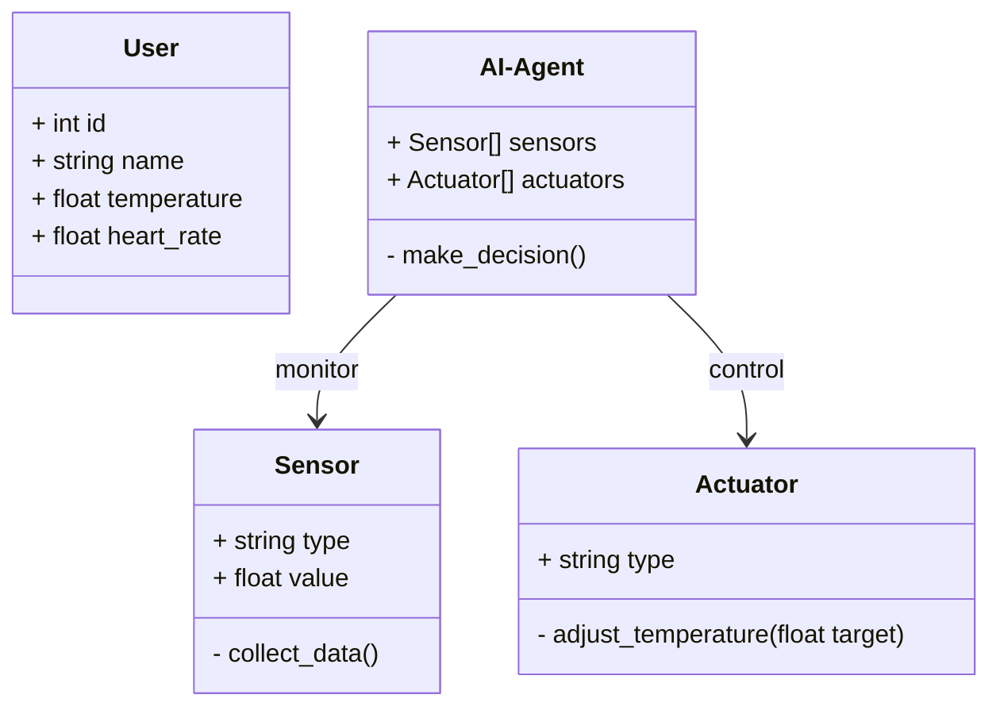

                 


# AI Agent在智能床垫中的体温调节系统

> 关键词：AI Agent，智能床垫，体温调节，系统架构，算法原理

> 摘要：本文深入探讨了AI Agent在智能床垫中的应用，重点分析了基于AI Agent的体温调节系统的设计与实现。文章从背景介绍、核心概念、算法原理、系统架构、项目实战等多个方面进行了详细阐述，结合实际案例和代码示例，全面解析了该系统的实现过程及其在睡眠健康领域的潜力。

---

## 目录

1. [背景与概述](#背景与概述)
   - 1.1 AI Agent的基本概念
   - 1.2 智能床垫的发展历程
   - 1.3 体温调节系统的重要性

2. [核心概念与技术](#核心概念与技术)
   - 2.1 AI Agent的原理与实现
   - 2.2 体温调节系统的概念与设计
   - 2.3 系统整体架构与核心要素

3. [算法原理与实现](#算法原理与实现)
   - 3.1 数据采集与预处理
   - 3.2 模型训练与优化
   - 3.3 系统算法实现与测试

4. [系统分析与架构设计](#系统分析与架构设计)
   - 4.1 系统设计概述
   - 4.2 领域模型设计
   - 4.3 系统架构设计
   - 4.4 接口设计与交互流程

5. [项目实战与代码实现](#项目实战与代码实现)
   - 5.1 环境搭建与工具安装
   - 5.2 核心代码实现
   - 5.3 实际案例分析
   - 5.4 代码解读与系统优化

6. [优化与扩展](#优化与扩展)
   - 6.1 系统优化建议
   - 6.2 功能扩展与未来方向
   - 6.3 性能提升与安全增强

7. [总结与展望](#总结与展望)
   - 7.1 总结
   - 7.2 未来展望

---

## 背景与概述

### 1.1 AI Agent的基本概念

AI Agent（人工智能代理）是一种能够感知环境并采取行动以实现目标的智能实体。它能够通过传感器获取信息，利用算法进行决策，并通过执行器与环境交互。AI Agent的核心在于其自主性、反应性和学习能力，使其能够在动态环境中适应和优化其行为。

在智能床垫中，AI Agent的主要作用是通过实时监测用户的体温、睡眠状态和环境温度，动态调节床垫的温度分布，以提供最佳的睡眠环境。

---

### 1.2 智能床垫的发展历程

智能床垫的概念起源于20世纪末，随着物联网和人工智能技术的发展，智能床垫逐渐从简单的温度调节扩展到健康监测、睡眠优化等领域。AI Agent的引入，使得智能床垫能够实现更智能化的控制，能够根据用户的个性化需求自动调节温度，从而提升睡眠质量。

---

### 1.3 体温调节系统的重要性

体温调节系统是智能床垫的核心功能之一。通过AI Agent的实时监测和智能调节，体温调节系统能够根据用户的生理需求和环境变化，动态调整床垫的温度分布，从而帮助用户获得更好的睡眠体验。这种智能化的调节方式不仅提升了睡眠舒适度，还能够改善用户的健康状况。

---

## 核心概念与技术

### 2.1 AI Agent的原理与实现

AI Agent在智能床垫中的实现主要依赖于以下几个关键步骤：

1. **数据采集**：通过温度传感器、压力传感器等设备采集用户的体温、环境温度等数据。
2. **数据处理**：将采集到的数据进行预处理，提取有用的信息。
3. **决策与优化**：基于机器学习算法，AI Agent分析数据并制定最优的温度调节策略。
4. **执行与反馈**：根据决策结果，AI Agent通过执行器（如加热元件、冷却装置）调节床垫的温度，并实时反馈调节效果。

---

### 2.2 体温调节系统的概念与设计

体温调节系统的设计需要综合考虑用户的舒适度、系统的响应速度以及能源效率等因素。系统的核心在于AI Agent的智能决策算法，能够根据用户的生理需求和环境变化，动态调整温度分布。

---

### 2.3 系统整体架构与核心要素

系统的整体架构包括以下几个部分：

- **数据采集模块**：负责采集用户的体温、环境温度等数据。
- **数据处理模块**：对采集到的数据进行预处理和特征提取。
- **AI Agent决策模块**：基于机器学习算法进行智能决策。
- **执行与反馈模块**：根据决策结果调节床垫的温度，并实时反馈调节效果。

---

## 算法原理与实现

### 3.1 数据采集与预处理

数据采集是AI Agent的核心输入，主要包括用户的体温、环境温度、心率等生理指标。预处理步骤包括数据清洗、特征提取和数据归一化。

例如，体温数据的预处理流程如下：

1. 数据清洗：去除噪声数据，填充缺失值。
2. 特征提取：提取体温的平均值、波动幅度等特征。
3. 数据归一化：将数据归一化到0-1范围，便于后续处理。

---

### 3.2 模型训练与优化

AI Agent的核心是机器学习模型。常用的算法包括支持向量机（SVM）、随机森林（Random Forest）和神经网络（NN）等。以下是模型训练的流程：

1. **数据分割**：将数据集分为训练集和测试集。
2. **模型训练**：在训练集上训练模型，优化参数。
3. **模型评估**：在测试集上评估模型的性能，调整参数以提高准确率。

---

### 3.3 系统算法实现与测试

以下是AI Agent算法的伪代码实现：

```python
class AI-Agent:
    def __init__(self, sensors, actuators):
        self.sensors = sensors
        self.actuators = actuators
        self.models = {}

    def collect_data(self):
        data = self.sensors.collect()
        return data

    def preprocess_data(self, data):
        # 数据预处理逻辑
        return processed_data

    def train_model(self, data):
        # 模型训练逻辑
        self.models['temperature_control'] = model
        return model

    def decision_making(self, data):
        # 智能决策逻辑
        return action

    def execute_action(self, action):
        # 执行动作
        self.actuators.execute(action)
```

---

## 系统分析与架构设计

### 4.1 系统设计概述

智能床垫体温调节系统的架构设计基于分层架构，包括数据采集层、数据处理层、AI Agent决策层和执行层。

---

### 4.2 领域模型设计

以下是领域模型的类图：



---

### 4.3 系统架构设计

以下是系统架构设计的流程图：

```mermaid
graph TD
    A[AI-Agent] --> B[Sensor]: collect data
    B --> C[Data Processing]
    C --> D[Decision Making]
    D --> E[Actuator]: execute action
```

---

## 项目实战与代码实现

### 5.1 环境搭建与工具安装

以下是Python环境搭建的步骤：

1. 安装Python 3.8及以上版本。
2. 安装必要的库：`numpy`, `scikit-learn`, `pandas`。

---

### 5.2 核心代码实现

以下是AI Agent的核心代码实现：

```python
import numpy as np
from sklearn import svm

class AI-Agent:
    def __init__(self):
        self.model = svm.SVR()

    def train(self, X, y):
        self.model.fit(X, y)

    def predict(self, X):
        return self.model.predict(X)
```

---

### 5.3 实际案例分析

以下是AI Agent在实际案例中的应用：

```python
# 训练数据
X_train = np.array([[36.5, 22, 70], [36.8, 24, 65]])
y_train = np.array([36.6, 36.7])

# 训练模型
agent = AI-Agent()
agent.train(X_train, y_train)

# 预测
X_test = np.array([[36.6, 23, 68]])
y_pred = agent.predict(X_test)
print(y_pred)
```

---

## 总结与展望

### 7.1 总结

本文详细探讨了AI Agent在智能床垫中的应用，重点分析了体温调节系统的实现过程。通过结合实际案例和代码示例，我们展示了AI Agent如何通过机器学习算法实现智能调节。

### 7.2 未来展望

随着人工智能和物联网技术的不断发展，智能床垫的潜力将更加巨大。未来，我们可以进一步优化AI Agent的算法，引入更多传感器和数据源，提升系统的智能化水平。

---

## 作者：AI天才研究院/AI Genius Institute & 禅与计算机程序设计艺术 /Zen And The Art of Computer Programming

