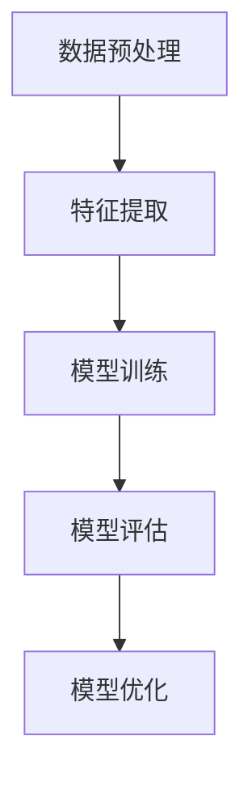
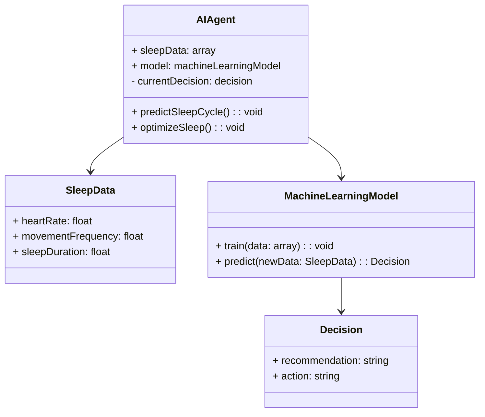

                 


# AI Agent在智能床垫中的睡眠周期分析

> **关键词**：AI Agent，智能床垫，睡眠周期分析，数据分析，人工智能，智能健康

> **摘要**：本文探讨了AI Agent在智能床垫中的应用，重点分析其如何通过睡眠周期数据优化用户的睡眠质量。文章从AI Agent的基本概念、睡眠周期分析的背景、AI Agent与智能床垫的交互机制等多方面展开，结合实际案例和系统设计，深入剖析其技术实现与应用价值。

---

# 第1章: AI Agent与睡眠周期分析概述

## 1.1 AI Agent的基本概念

### 1.1.1 AI Agent的定义
AI Agent（人工智能代理）是指能够感知环境、自主决策并执行任务的智能体。它通过传感器获取信息，利用算法处理数据，进而做出最优决策。

### 1.1.2 AI Agent的核心功能
1. **感知环境**：通过传感器或数据接口获取外部信息。
2. **推理与学习**：利用机器学习算法分析数据，发现模式。
3. **决策与执行**：根据分析结果制定策略并执行。

### 1.1.3 AI Agent与传统数据分析的区别
AI Agent不仅能够处理数据，还能根据数据做出决策，并通过执行器将决策转化为行动。传统数据分析仅限于数据处理和模式发现。

## 1.2 睡眠周期分析的背景

### 1.2.1 睡眠周期的基本概念
睡眠周期包括入睡期、浅睡期、深睡期和 REM 期，通常一个周期约90分钟，每晚重复4-5次。

### 1.2.2 睡眠周期对健康的影响
良好的睡眠周期有助于身体修复和记忆巩固，而紊乱的睡眠周期可能导致疲劳、注意力不集中等问题。

### 1.2.3 睡眠周期分析的挑战
1. **数据多样性**：睡眠数据包括心率、呼吸频率、体动次数等多种指标。
2. **个体差异**：每个人的睡眠周期都有所不同，需要个性化分析。
3. **实时性要求**：睡眠周期分析需要在用户睡觉时实时进行。

## 1.3 AI Agent在智能床垫中的应用背景

### 1.3.1 智能床垫的发展现状
智能床垫通过内置传感器，可以实时监测用户的睡眠数据，如心率、体动频率、呼吸节奏等。

### 1.3.2 AI Agent在智能床垫中的作用
AI Agent通过分析睡眠数据，识别用户的睡眠周期，并提出优化建议，如调整床垫硬度、改善睡眠环境等。

### 1.3.3 睡眠周期分析的实际应用案例
例如，某品牌智能床垫通过AI Agent分析用户的睡眠数据，发现用户经常在浅睡期惊醒，建议用户调整枕头高度以改善睡眠质量。

---

# 第2章: AI Agent的核心概念与原理

## 2.1 AI Agent的核心概念

### 2.1.1 知识表示
知识表示是AI Agent理解世界的基础。常用的表示方法包括符号逻辑、语义网络和概率图模型。

### 2.1.2 逻辑推理
逻辑推理是AI Agent从已知事实推导出新结论的过程。常用的推理方法包括演绎推理和归纳推理。

### 2.1.3 自然语言处理
自然语言处理（NLP）使AI Agent能够理解和生成人类语言，从而与用户进行交互。

## 2.2 智能床垫的数据采集与处理

### 2.2.1 数据采集方式
智能床垫通过压力传感器、加速度传感器等设备采集用户的睡眠数据。

### 2.2.2 数据预处理流程
数据预处理包括数据清洗、数据归一化和数据增强等步骤，以确保数据质量。

### 2.2.3 数据特征提取
从原始数据中提取有用的特征，如睡眠持续时间、体动频率等。

## 2.3 AI Agent与智能床垫的交互机制

### 2.3.1 用户需求分析
AI Agent通过分析用户的睡眠数据，了解用户的睡眠习惯和偏好。

### 2.3.2 系统反馈机制
AI Agent根据分析结果，向用户或床垫发出反馈指令，如调整床垫硬度或提醒用户改变睡姿。

### 2.3.3 个性化推荐算法
AI Agent利用机器学习算法，为用户提供个性化的睡眠改善建议。

---

# 第3章: AI Agent的算法原理

## 3.1 AI Agent的核心算法

### 3.1.1 机器学习模型
常用的机器学习模型包括支持向量机（SVM）、随机森林（Random Forest）和神经网络（NN）。

### 3.1.2 算法流程
1. 数据预处理：清洗数据、归一化。
2. 特征提取：选择重要的特征。
3. 模型训练：使用训练数据训练模型。
4. 模型评估：通过测试数据评估模型性能。
5. 模型优化：调整超参数，提高模型性能。

### 3.1.3 算法实现的mermaid流程图


## 3.2 数学模型与公式

### 3.2.1 线性回归模型
$$ y = \beta_0 + \beta_1 x + \epsilon $$

### 3.2.2 支持向量机模型
$$ \text{max} \quad \frac{1}{2} \| \beta \|^2 $$
$$ \text{subject to} \quad y_i (\beta_0 + \beta_1 x_i) \geq 1, \quad i=1,2,\dots,n $$

---

# 第4章: 系统分析与架构设计

## 4.1 问题场景介绍

### 4.1.1 睡眠周期分析的典型场景
用户在睡觉时，智能床垫实时采集睡眠数据，AI Agent分析数据并提出改善建议。

## 4.2 系统功能设计

### 4.2.1 领域模型设计


---

# 第5章: 项目实战

## 5.1 环境安装

### 5.1.1 安装Python环境
使用Anaconda安装Python 3.8及以上版本。

### 5.1.2 安装相关库
安装numpy、pandas、scikit-learn等库。

## 5.2 核心代码实现

### 5.2.1 数据预处理代码
```python
import numpy as np
import pandas as pd

# 加载数据
data = pd.read_csv('sleep_data.csv')

# 数据清洗
data = data.dropna()

# 数据归一化
data_norm = (data - data.min()) / (data.max() - data.min())
```

---

# 第6章: 最佳实践

## 6.1 小结
AI Agent在智能床垫中的应用为用户提供了个性化的睡眠改善方案，通过实时数据分析和智能决策，显著提升了睡眠质量。

## 6.2 注意事项
1. 数据隐私保护：确保用户的睡眠数据不被泄露。
2. 系统稳定性：保证AI Agent的稳定运行，避免因系统故障影响用户体验。
3. 模型更新：定期更新AI Agent的模型，以提高分析精度。

## 6.3 拓展阅读
推荐阅读《机器学习实战》和《人工智能：一种现代方法》等书籍，深入理解AI Agent的核心原理。

---

**作者：AI天才研究院/AI Genius Institute & 禅与计算机程序设计艺术 /Zen And The Art of Computer Programming**

