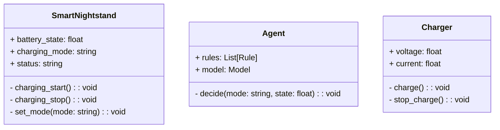

                 


# 《AI Agent在智能床头柜中的充电管理》

## 关键词：AI Agent, 智能床头柜, 充电管理, 系统架构, 算法实现

## 摘要：本文深入探讨了AI Agent在智能床头柜充电管理中的应用，分析了充电管理的核心需求与挑战，详细讲解了AI Agent的原理、算法实现以及系统架构设计，通过实际案例展示了如何利用AI Agent优化智能床头柜的充电管理流程，最后总结了AI Agent在智能床头柜充电管理中的最佳实践与未来发展方向。

---

# 第一部分: AI Agent与智能床头柜充电管理背景

# 第1章: AI Agent与智能床头柜充电管理的背景

## 1.1 AI Agent的基本概念
### 1.1.1 AI Agent的定义与特点
- **定义**: AI Agent是一种智能主体，能够感知环境、自主决策并执行任务。
- **特点**: 智能性、自主性、反应性、社会性。

### 1.1.2 AI Agent的核心技术与实现原理
- **核心技术**: 机器学习、自然语言处理、知识图谱。
- **实现原理**: 通过传感器获取数据，结合预设规则或模型进行决策。

### 1.1.3 AI Agent在智能设备中的应用现状
- **应用领域**: 智能家居、自动驾驶、机器人等。
- **现状分析**: AI Agent在智能设备中的应用逐渐普及，但仍面临技术挑战。

## 1.2 智能床头柜的背景与发展
### 1.2.1 智能床头柜的功能与特点
- **功能**: 充电、控制灯光、监测环境等。
- **特点**: 智能化、便捷性、集成化。

### 1.2.2 智能床头柜的市场现状与发展趋势
- **市场现状**: 市场需求增长，技术逐渐成熟。
- **发展趋势**: 更智能化、更环保、更人性化。

### 1.2.3 智能床头柜与智能家居的关联
- **关联**: 智能床头柜是智能家居的重要组成部分，可以通过物联网实现互联互通。

## 1.3 充电管理的背景与挑战
### 1.3.1 充电管理的基本概念与作用
- **概念**: 充电管理是指对设备充电过程的监控和优化。
- **作用**: 提高充电效率、延长电池寿命、确保充电安全。

### 1.3.2 智能设备充电管理的现状与问题
- **现状**: 手机、智能家居设备的充电需求激增。
- **问题**: 充电效率低、资源浪费、安全性问题。

### 1.3.3 AI Agent在充电管理中的应用前景
- **前景**: AI Agent可以通过智能调度资源，优化充电过程。

## 1.4 本章小结
- 本章介绍了AI Agent的基本概念、智能床头柜的发展背景以及充电管理的现状与挑战，为后续章节的深入分析奠定了基础。

---

# 第二部分: AI Agent在智能床头柜充电管理中的核心概念与联系

# 第2章: AI Agent的核心概念与原理

## 2.1 AI Agent的核心概念
### 2.1.1 AI Agent的定义与分类
- **定义**: AI Agent是一种能够感知环境并采取行动以实现目标的智能主体。
- **分类**: 反应式Agent、基于模型的Agent、效用导向的Agent。

### 2.1.2 AI Agent的核心要素与功能模块
- **核心要素**: 感知、推理、决策、执行。
- **功能模块**: 数据采集模块、决策模块、执行模块。

### 2.1.3 AI Agent的决策机制与行为模式
- **决策机制**: 基于规则的决策、基于模型的决策。
- **行为模式**: 单一行为、序列行为、协作行为。

## 2.2 AI Agent与智能床头柜的关联
### 2.2.1 智能床头柜充电管理的核心需求
- **需求**: 实时监测电池状态、智能调度充电时间、优化充电策略。

### 2.2.2 AI Agent在充电管理中的角色与功能
- **角色**: 充电管理的核心决策者。
- **功能**: 数据采集、状态分析、决策制定、执行控制。

### 2.2.3 AI Agent与智能床头柜的交互流程
1. 感知环境：AI Agent通过传感器获取床头柜的电池状态、用户需求等信息。
2. 数据处理：将获取的数据进行分析和处理。
3. 决策制定：基于分析结果，制定充电策略。
4. 执行控制：通过床头柜的执行机构完成充电任务。

## 2.3 AI Agent与充电管理的系统架构
### 2.3.1 系统整体架构概述
- **架构**: 分层架构，包括感知层、决策层、执行层。

### 2.3.2 AI Agent的模块划分与功能设计
- **模块**: 数据采集模块、决策模块、执行模块。
- **功能设计**: 数据采集模块负责采集电池状态、用户需求等信息；决策模块负责分析数据并制定充电策略；执行模块负责执行充电任务。

### 2.3.3 系统的输入输出接口与数据流
- **输入接口**: 电池状态、用户指令。
- **输出接口**: 充电指令、反馈信息。

## 2.4 核心概念关系图（ER图）
```mermaid
er
  actor: 用户
  smart_nightstand: 智能床头柜
  agent: AI Agent
  battery: 电池状态
  charging_request: 充电请求
  charging_strategy: 充电策略
  charging_operation: 充电操作
  

  actor --> smart_nightstand: 使用床头柜
  smart_nightstand --> agent: 提供电池状态
  agent --> smart_nightstand: 执行充电策略
  agent --> battery: 监测电池状态
  agent --> charging_strategy: 制定充电策略
  charging_strategy --> charging_operation: 指导充电操作
```

---

# 第三部分: AI Agent在智能床头柜充电管理中的算法实现

# 第3章: AI Agent的算法实现

## 3.1 AI Agent的决策算法
### 3.1.1 基于规则的决策算法
- **原理**: 通过预设规则进行决策，适用于简单场景。
- **实现步骤**: 1. 定义规则；2. 数据匹配规则；3. 执行决策。

### 3.1.2 基于模型的决策算法
- **原理**: 基于数学模型进行决策，适用于复杂场景。
- **实现步骤**: 1. 建立模型；2. 输入数据；3. 模型计算；4. 输出决策。

### 3.1.3 算法实现示例（基于规则）
```python
def charging_strategy(rule_set, battery_state):
    for rule in rule_set:
        if rule.condition(battery_state):
            return rule.action
    return default_action
```

### 3.1.4 算法实现示例（基于模型）
```python
import numpy as np

def charging_strategy(model, battery_state):
    input_vector = np.array([battery_state])
    prediction = model.predict(input_vector)
    return prediction[0]
```

## 3.2 数学模型与公式
### 3.2.1 充电效率优化的数学模型
$$ \text{目标函数} = \sum_{i=1}^{n} (E_i - C_i) $$
其中，$E_i$是第$i$次充电的能量，$C_i$是充电时间。

### 3.2.2 基于强化学习的充电策略
$$ R(s, a) = \gamma \cdot R(s', a') + (1 - \gamma) \cdot R(s, a) $$
其中，$R$是奖励函数，$s$是状态，$a$是动作，$\gamma$是折扣因子。

---

# 第四部分: 智能床头柜充电管理系统的分析与设计

# 第4章: 系统分析与架构设计

## 4.1 系统分析
### 4.1.1 项目背景介绍
- **背景**: 智能床头柜需要实现高效的充电管理。

### 4.1.2 系统功能需求
- **需求**: 实时监测电池状态、智能调度充电时间、优化充电策略。

## 4.2 系统架构设计
### 4.2.1 系统功能设计


### 4.2.2 系统架构设计


## 4.3 系统接口设计
### 4.3.1 系统接口描述
- **输入接口**: 电池状态、用户指令。
- **输出接口**: 充电指令、反馈信息。

### 4.3.2 系统交互流程
```mermaid
sequenceDiagram
    actor 用户 -> smart_nightstand: 发出充电请求
    smart_nightstand -> agent: 提供电池状态
    agent -> model: 分析电池状态
    model -> agent: 返回充电策略
    agent -> smart_nightstand: 执行充电策略
    smart_nightstand -> actor: 反馈充电状态
```

---

# 第五部分: 项目实战与总结

# 第5章: 项目实战

## 5.1 环境安装与配置
### 5.1.1 安装Python环境
- **工具**: Python 3.8及以上版本、pip。

### 5.1.2 安装依赖库
- **库**: numpy、scikit-learn。

## 5.2 系统核心实现
### 5.2.1 AI Agent的核心代码实现
```python
class AI-Agent:
    def __init__(self, model):
        self.model = model

    def decide(self, battery_state):
        return self.model.predict(battery_state)
```

### 5.2.2 充电管理系统的实现
```python
class Charger:
    def __init__(self):
        self.voltage = 5.0
        self.current = 1.0

    def charge(self):
        print("开始充电")
    
    def stop_charge(self):
        print("停止充电")
```

## 5.3 代码解读与分析
### 5.3.1 AI Agent的代码解读
- **功能**: 通过模型进行决策。
- **实现细节**: 使用scikit-learn中的回归模型进行预测。

### 5.3.2 充电管理系统的代码解读
- **功能**: 控制充电过程。
- **实现细节**: 通过电压和电流控制充电状态。

## 5.4 实际案例分析
### 5.4.1 案例背景
- **场景**: 用户在夜间使用床头柜充电。

### 5.4.2 案例实现
```python
agent = AI-Agent(model)
charger = Charger()
agent.decide(battery_state=0.8)
charger.charge()
```

## 5.5 项目小结
- **总结**: 通过AI Agent实现了智能床头柜的充电管理，提高了充电效率和安全性。

---

# 第六部分: 总结与展望

# 第6章: 总结与展望

## 6.1 本章总结
- **总结**: AI Agent在智能床头柜充电管理中的应用优化了充电过程，提高了用户体验。

## 6.2 未来展望
- **技术发展**: 更先进的AI算法、更高效的充电技术。
- **应用场景**: 更多智能设备的充电管理。

## 6.3 最佳实践 tips
- **建议**: 在实际应用中，结合具体场景优化AI Agent的算法。

## 6.4 小结
- **小结**: AI Agent在智能床头柜充电管理中的应用前景广阔，值得进一步研究和探索。

---

# 作者：AI天才研究院/AI Genius Institute & 禅与计算机程序设计艺术 /Zen And The Art of Computer Programming

---

希望这个目录大纲能满足您的需求。如果需要进一步扩展或调整，请随时告诉我！

