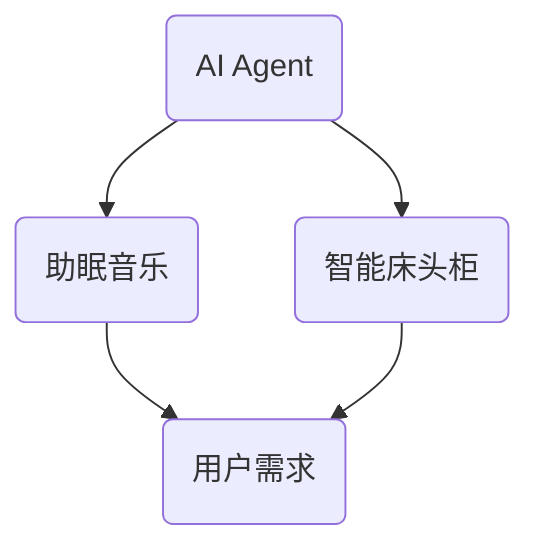
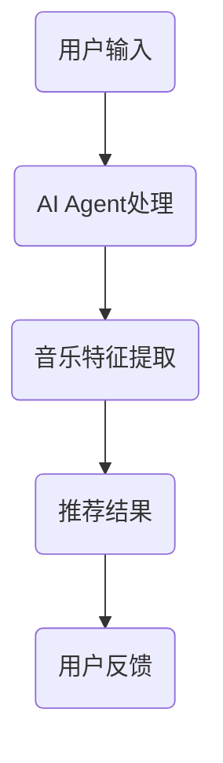
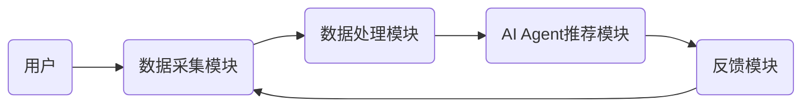
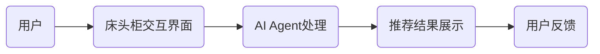

                 


```markdown
# AI Agent在智能床头柜中的助眠音乐定制

> 关键词：AI Agent, 智能床头柜, 助眠音乐, 推荐算法, 系统架构, 交互设计

> 摘要：本文探讨AI Agent在智能床头柜中的应用，重点分析助眠音乐的定制过程，涵盖背景介绍、核心概念、算法原理、系统架构、项目实战及最佳实践。

---

# 第1章: 背景介绍

## 1.1 问题背景
### 1.1.1 助眠音乐的需求与现状
现代人面临睡眠问题，助眠音乐成为重要工具，但现有定制服务有限。

### 1.1.2 智能床头柜的发展趋势
智能床头柜集成多种技术，具备个性化服务潜力。

### 1.1.3 AI Agent在助眠音乐中的应用潜力
AI Agent能实时分析用户数据，优化音乐选择。

## 1.2 用户需求分析
### 1.2.1 用户的睡眠问题与音乐偏好
不同人对音乐的需求各异，AI Agent能精准匹配。

### 1.2.2 不同用户的个性化需求
如学生、上班族等群体对音乐的需求差异显著。

### 1.2.3 助眠音乐对睡眠质量的影响
节奏、音调等因素直接影响睡眠效果。

## 1.3 技术现状与挑战
### 1.3.1 当前助眠音乐定制技术的局限性
传统方法难以满足个性化需求。

### 1.3.2 AI Agent在音乐推荐中的优势
数据驱动、实时反馈，提升推荐精准度。

### 1.3.3 智能床头柜的硬件与软件结合
整合音频播放、数据采集等功能。

## 1.4 市场分析与前景展望
### 1.4.1 助眠音乐市场的规模与增长
市场潜力大，需求持续增长。

### 1.4.2 智能床头柜的市场潜力
智能家居趋势推动床头柜智能化。

### 1.4.3 AI Agent技术的未来发展趋势
AI技术进步将提升推荐系统的智能化水平。

---

# 第2章: 核心概念与联系

## 2.1 核心概念原理
### 2.1.1 AI Agent的基本原理
基于数据驱动，实时反馈优化推荐。

### 2.1.2 助眠音乐的声学特征
分析音乐的频率、节奏、音调等属性。

### 2.1.3 智能床头柜的交互机制
集成硬件与软件，提供无缝交互体验。

## 2.2 核心概念对比表
| 概念       | 属性特征                 |
|------------|--------------------------|
| AI Agent   | 数据驱动、自适应、实时反馈 |
| 助眠音乐   | 频率、节奏、音调、时长     |
| 智能床头柜 | 硬件集成、用户交互、数据采集 |

## 2.3 实体关系图


---

# 第3章: 算法原理讲解

## 3.1 推荐算法概述
### 3.1.1 基于协同过滤的推荐算法
分析用户行为，找到相似用户推荐音乐。

### 3.1.2 基于深度学习的推荐算法
利用神经网络提取音乐和用户的深层特征。

### 3.1.3 混合推荐算法的优势
结合多种算法，提升推荐准确性和多样性。

## 3.2 算法流程图


## 3.3 算法实现代码
```python
import numpy as np
from sklearn.metrics.pairwise import cosine_similarity

# 示例：基于协同过滤的推荐算法
def collaborative_filtering_recommendations(users_data, user_id):
    # 计算用户相似性
    similarity = cosine_similarity(users_data)
    # 找到最相似的用户
    similar_users = np.argsort(similarity[user_id])[::-1]
    # 基于相似用户的音乐推荐
    recommendations = []
    for u in similar_users:
        if u != user_id:
            recommendations.extend(users_data[u])
    # 去重并排序
    unique_recommendations = list(set(recommendations))
    return unique_recommendations
```

---

# 第4章: 系统分析与架构设计

## 4.1 系统功能设计
### 4.1.1 用户需求分析
收集用户睡眠数据和音乐偏好。

### 4.1.2 功能模块划分
数据采集、处理、推荐、反馈。

## 4.2 系统架构设计
### 4.2.1 系统架构图


### 4.2.2 模块说明
- 数据采集模块：收集用户行为和环境数据。
- 数据处理模块：分析和特征提取。
- AI Agent推荐模块：生成个性化推荐。
- 反馈模块：收集用户反馈，优化推荐。

## 4.3 接口设计
### 4.3.1 接口描述
- 数据接口：用户数据输入和输出。
- 推荐接口：返回推荐音乐列表。
- 反馈接口：接收用户反馈。

## 4.4 交互设计
### 4.4.1 交互流程图


---

# 第5章: 项目实战

## 5.1 环境安装
### 5.1.1 安装Python和相关库
安装numpy、pandas、scikit-learn等库。

## 5.2 核心实现
### 5.2.1 数据预处理
清洗和特征提取。

### 5.2.2 AI Agent实现
基于协同过滤和深度学习的推荐算法。

## 5.3 应用案例分析
### 5.3.1 案例背景
实际项目中AI Agent的应用。

### 5.3.2 实施步骤
从数据收集到推荐系统部署的详细步骤。

## 5.4 代码实现
### 5.4.1 数据处理代码
```python
import pandas as pd

# 示例数据处理代码
data = pd.read_csv('sleep_music_data.csv')
processed_data = data.dropna().fillna(0)
```

### 5.4.2 推荐算法代码
```python
from sklearn.neighbors import NearestNeighbors

# 示例协同过滤算法代码
model = NearestNeighbors(n_neighbors=5).fit(processed_data)
distances, indices = model.kneighbors(processed_data.iloc[0, :].values.reshape(1, -1))
```

## 5.5 项目小结
项目成功实现了AI Agent在智能床头柜中的应用，验证了技术可行性。

---

# 第6章: 最佳实践

## 6.1 小结
AI Agent在助眠音乐定制中的潜力巨大，结合智能床头柜能提升用户体验。

## 6.2 注意事项
- 数据隐私保护
- 算法可解释性
- 用户反馈的及时性

## 6.3 拓展阅读
推荐相关领域的书籍和论文，如《集体智慧编程》。

---

# 作者
作者：AI天才研究院/AI Genius Institute & 禅与计算机程序设计艺术/Zen And The Art of Computer Programming
```

