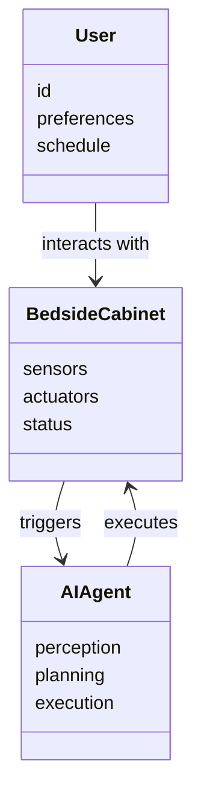
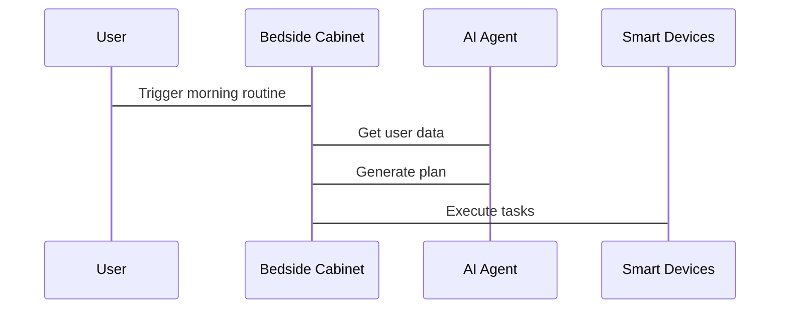

                 


# AI Agent在智能床头柜中的晨间仪式规划

## 关键词：AI Agent，智能床头柜，晨间仪式，任务规划，智能家居，系统架构

## 摘要：  
本文深入探讨了AI Agent在智能床头柜中的晨间仪式规划的应用。通过分析AI Agent的核心概念、算法原理、系统架构以及实际项目实现，本文详细展示了如何利用AI技术优化用户的早晨流程。文章从问题背景出发，逐步展开技术细节，最终通过实际案例验证了AI Agent在智能床头柜中的可行性与价值。

---

# 第1章: 问题背景与需求分析

## 1.1 晨间仪式规划的背景与挑战

### 1.1.1 晨间仪式的核心问题  
现代生活中，晨间时间往往被多种任务占据，如起床、洗漱、用餐、锻炼等。如何高效地规划这些任务，减少时间浪费，成为许多用户的痛点。AI Agent通过智能化的调度，可以显著提升用户的早晨效率。

### 1.1.2 智能床头柜的出现与意义  
智能床头柜作为一种智能家居设备，能够与用户的生活习惯相结合，提供个性化的服务。它不仅是家具，更是用户早晨生活的起点，通过AI Agent的支持，实现任务的自动化管理。

### 1.1.3 AI Agent在晨间规划中的作用  
AI Agent能够实时感知用户的作息习惯，结合智能家居设备的状态，动态调整任务顺序，优化用户的早晨体验。

## 1.2 问题描述与目标设定

### 1.2.1 智能床头柜的功能需求  
智能床头柜需要具备时间管理、任务调度、智能家居联动等功能。  
- 时间管理：记录用户的起床时间、习惯等数据。  
- 任务调度：根据时间安排，生成任务清单并执行。  
- 智能家居联动：与智能灯、智能音箱、智能咖啡机等设备联动。

### 1.2.2 用户行为分析与场景建模  
通过分析用户的早晨行为，构建用户模型。例如：  
- 用户A：喜欢在固定时间起床，喜欢听新闻广播。  
- 用户B：习惯在早晨锻炼，偏好清淡早餐。  
AI Agent需要根据用户的模型，提供个性化的服务。

### 1.2.3 系统边界与功能外延  
系统边界包括床头柜本身、智能家居设备、用户的手机App。功能外延则包括数据同步、健康数据分析等。

## 1.3 问题解决思路与技术路线

### 1.3.1 AI Agent的核心思想  
AI Agent通过感知用户行为和环境信息，生成最优的任务执行计划。

### 1.3.2 智能床头柜的系统架构  
系统架构分为感知层、决策层、执行层。感知层收集用户数据，决策层生成计划，执行层通过床头柜和其他设备执行任务。

### 1.3.3 技术选型与实现路径  
技术选型包括：  
- 传感器：用于采集用户行为数据。  
- 通信协议：如Wi-Fi、蓝牙，用于设备联动。  
- AI算法：如强化学习、任务规划算法。

## 1.4 本章小结  
本章从背景出发，分析了智能床头柜的需求，明确了AI Agent的作用，并提出了系统的整体架构和技术路线。

---

# 第2章: AI Agent的核心概念与系统架构

## 2.1 AI Agent的基本概念

### 2.1.1 AI Agent的定义与分类  
AI Agent是一种能够感知环境、执行任务的智能体。根据应用场景的不同，可以分为家务型、健康型、娱乐型等。

### 2.1.2 AI Agent的核心属性与特征  
- **自主性**：能够自主决策。  
- **反应性**：实时感知环境变化。  
- **目标导向性**：根据目标执行任务。  
- **可扩展性**：能够接入多种智能家居设备。

### 2.1.3 AI Agent与智能床头柜的结合  
床头柜作为AI Agent的载体，AI Agent为其提供智能化服务。

---

## 2.2 AI Agent的行为模型与决策机制

### 2.2.1 状态感知与环境建模  
AI Agent通过传感器和API获取环境数据，构建用户的作息模型。

### 2.2.2 行为规划与决策算法  
常用的算法包括：  
- **任务规划算法**：如A*算法，用于生成最优任务顺序。  
- **强化学习**：通过奖励机制优化决策策略。  

### 2.2.3 交互反馈与学习机制  
通过用户的反馈，AI Agent不断优化自己的决策模型。

---

## 2.3 AI Agent的系统架构

### 2.3.1 分层架构与功能模块划分  
- **感知层**：传感器、API接口。  
- **决策层**：任务规划模块、决策引擎。  
- **执行层**：床头柜硬件、智能家居设备。

### 2.3.2 各模块之间的交互关系  
通过消息队列或事件驱动的方式进行交互。

### 2.3.3 系统的可扩展性与灵活性  
支持添加新的设备和功能模块。

---

## 2.4 本章小结  
本章详细介绍了AI Agent的核心概念和系统架构，为后续的算法实现和系统设计奠定了基础。

---

# 第3章: 任务规划算法原理

## 3.1 任务规划的基本概念

### 3.1.1 任务分解与优先级排序  
任务分解：将复杂的任务拆解为简单步骤。  
优先级排序：根据时间、重要性等因素排序任务。

### 3.1.2 状态空间与动作空间的建模  
状态空间：所有可能的状态集合。  
动作空间：所有可能的动作集合。

### 3.1.3 确定性与不确定性任务的区别  
确定性任务：结果可预测。  
不确定性任务：结果不可预测，需要动态调整。

---

## 3.2 基于AI Agent的任务规划算法

### 3.2.1 算法原理与流程  
- **输入**：用户习惯数据、设备状态。  
- **处理**：生成任务列表并排序。  
- **输出**：执行指令。

### 3.2.2 基于强化学习的任务规划  
通过强化学习优化任务顺序，减少冲突。

---

## 3.3 算法实现与优化

### 3.3.1 算法实现  
以下是一个简单的任务规划算法示例：

```python
def generate_plan(user_data, device_status):
    tasks = parse(user_data, device_status)
    sorted_tasks = sort_tasks(tasks)
    return sorted_tasks
```

### 3.3.2 算法优化  
- 使用动态规划减少重复计算。  
- 增加上下文感知，提升任务的相关性。

---

## 3.4 本章小结  
本章详细讲解了任务规划算法的原理和实现，为后续的系统设计提供了技术支持。

---

# 第4章: 系统分析与架构设计方案

## 4.1 问题场景介绍

### 4.1.1 用户场景  
用户起床后，AI Agent根据用户的习惯生成任务列表。

### 4.1.2 系统场景  
系统需要协调床头柜、智能灯、智能音箱等设备，完成任务执行。

---

## 4.2 系统功能设计

### 4.2.1 领域模型设计  
使用Mermaid类图描述领域模型：



---

## 4.3 系统架构设计

### 4.3.1 系统架构图  
使用Mermaid架构图描述系统架构：


---

## 4.4 系统接口设计

### 4.4.1 接口设计  
- **感知接口**：获取用户数据。  
- **决策接口**：生成执行计划。  
- **执行接口**：控制设备。

### 4.4.2 交互序列图  
使用Mermaid序列图描述交互流程：



---

## 4.5 本章小结  
本章详细描述了系统的功能设计和架构设计，为后续的项目实施提供了明确的方向。

---

# 第5章: 项目实战

## 5.1 环境安装与配置

### 5.1.1 开发环境  
- Python 3.8+  
- Linux或Mac系统  
- 必要的开发库：如Flask、Paho-MQTT、numpy等。

### 5.1.2 传感器与设备接入  
- 使用Raspberry Pi采集传感器数据。  
- 接入智能家居设备，如 Philips Hue 灯泡。

---

## 5.2 核心代码实现

### 5.2.1 AI Agent的核心代码  
以下是AI Agent的核心代码示例：

```python
import mqtt

class AIAgent:
    def __init__(self):
        self.mqtt_client = mqtt.Client()

    def connect(self, host, port):
        self.mqtt_client.connect(host, port)
        self.mqtt_client.on_message = self.on_message
        self.mqtt_client.loop_start()

    def on_message(self, client, userdata, message):
        # 处理消息
        pass

    def generate_plan(self, user_data):
        # 生成任务计划
        pass

    def execute(self, plan):
        # 执行计划
        pass
```

### 5.2.2 任务规划算法实现  
以下是任务规划算法的实现：

```python
def plan_generator(user_data):
    tasks = []
    # 根据用户数据生成任务
    return tasks
```

---

## 5.3 代码解读与分析

### 5.3.1 代码功能解读  
- `AIAgent` 类负责与设备通信。  
- `plan_generator` 函数负责生成任务计划。

### 5.3.2 代码优化建议  
- 使用异步编程提升效率。  
- 增加异常处理机制。

---

## 5.4 实际案例分析

### 5.4.1 案例场景  
用户A习惯在早上6:30起床，之后听新闻，然后吃早餐。

### 5.4.2 系统执行流程  
1. 用户起床，触发传感器。  
2. AI Agent获取用户数据，生成任务计划。  
3. AI Agent通过MQTT协议发送指令，智能灯泡调至柔和光，智能音箱播放新闻。  
4. 完成任务后，系统记录数据，优化后续计划。

---

## 5.5 本章小结  
本章通过实际项目案例，详细展示了AI Agent在智能床头柜中的实现过程，验证了系统的可行性。

---

# 第6章: 总结与展望

## 6.1 总结

### 6.1.1 核心要点回顾  
- AI Agent在晨间仪式中的作用。  
- 任务规划算法的实现。  
- 系统架构设计的关键点。

### 6.1.2 实践意义与价值  
AI Agent的应用显著提升了用户的早晨效率，优化了智能家居的使用体验。

---

## 6.2 展望与建议

### 6.2.1 系统优化方向  
- 增强AI Agent的自适应能力。  
- 支持更多的智能家居设备。  

### 6.2.2 用户体验改进  
- 提供更个性化的服务。  
- 增加多语言支持。

### 6.2.3 技术发展趋势  
- 结合物联网技术，打造更智能的家居生态。

---

## 6.3 本章小结  
本章总结了全文内容，并对未来的发展提出了展望。

---

## 作者：AI天才研究院 & 禅与计算机程序设计艺术  
本文由AI天才研究院与禅与计算机程序设计艺术联合撰写，转载请注明出处。

