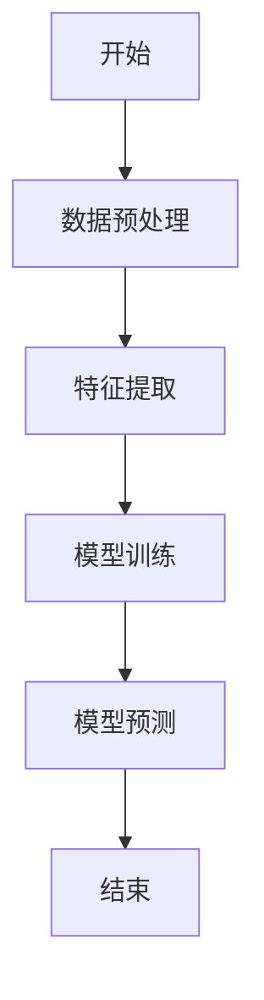
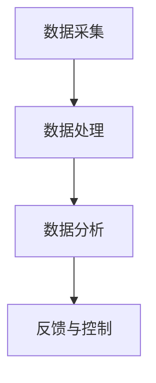
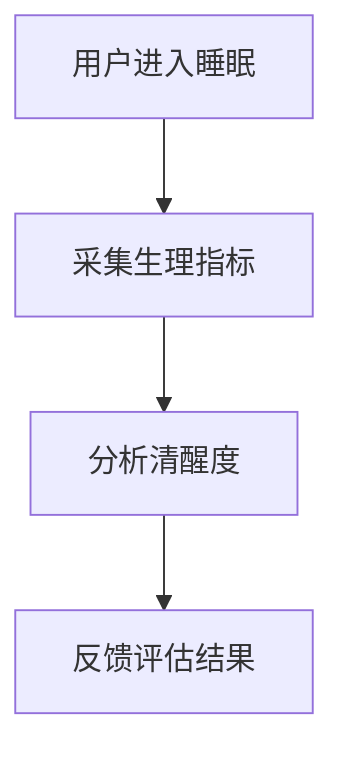

                 


# AI Agent在智能床头柜中的清醒度评估

## 关键词：AI Agent, 清醒度评估, 智能床头柜, 睡眠健康, 物联网, 人工智能, 健康监测

## 摘要：本文详细探讨了AI Agent在智能床头柜中的清醒度评估技术。首先介绍了清醒度评估的背景与必要性，分析了AI Agent的基本原理及其在智能床头柜中的应用。接着，深入讲解了清醒度评估的核心算法，包括注意力机制和分类算法，并通过Mermaid流程图和Python代码示例进行了详细阐述。随后，从系统架构设计、接口设计和交互流程等方面，分析了智能床头柜的整体架构。最后，通过项目实战展示了如何实现清醒度评估系统，并提出了系统优化和未来研究方向的建议。本文旨在为智能床头柜的设计与开发提供理论依据和技术参考。

---

# 第一部分: AI Agent与清醒度评估背景介绍

## 第1章: 清醒度评估的背景与问题描述

### 1.1 问题背景
#### 1.1.1 智能床头柜的定义与应用场景
智能床头柜是一种结合物联网技术的智能家居设备，能够通过传感器和AI技术实时监测用户的生理指标和行为习惯。其应用场景包括睡眠监测、健康预警、智能控制等。例如，当用户在睡眠过程中出现呼吸暂停或心率异常时，智能床头柜可以通过AI Agent发出警报。

#### 1.1.2 清醒度评估的必要性与重要性
清醒度是指用户在特定时间内的意识状态，包括清醒、嗜睡、疲劳等。在智能床头柜中，清醒度评估可以帮助用户了解自己的健康状况，优化睡眠质量，并在必要时提供健康建议。例如，当用户在早晨起床时，智能床头柜可以根据其清醒度调整室内光线和音乐，帮助用户更好地进入清醒状态。

#### 1.1.3 AI Agent在智能床头柜中的角色与功能
AI Agent（人工智能代理）是智能床头柜的核心组件之一，负责接收和处理传感器数据，分析用户的行为和生理指标，并根据分析结果提供相应的反馈和建议。例如，AI Agent可以通过分析用户的睡眠数据，判断其清醒度，并在用户需要时提供唤醒服务。

### 1.2 问题描述
#### 1.2.1 清醒度评估的核心目标
清醒度评估的核心目标是准确判断用户的意识状态，包括但不限于以下几点：
- 实时监测用户的生理指标（如心率、呼吸频率、体温等）。
- 分析用户的睡眠阶段（如浅睡、深睡、REM睡眠）。
- 根据数据预测用户的清醒状态。

#### 1.2.2 清醒度评估的关键挑战
清醒度评估面临以下关键挑战：
- 多模态数据的融合与分析：用户的行为、生理指标和环境数据相互交织，需要高效的数据处理方法。
- 算法的实时性与准确性：在智能床头柜中，AI Agent需要实时处理数据并做出反馈，这对算法的效率和准确性提出了较高要求。
- 用户隐私与数据安全：智能床头柜涉及用户的敏感数据，如何保护用户隐私是关键问题。

#### 1.2.3 清醒度评估的边界与外延
清醒度评估的边界包括：
- 数据采集范围：仅限于床头柜传感器获取的数据。
- 评估场景：仅在睡眠阶段进行评估。
- 评估目标：仅关注用户的清醒状态，不涉及其他健康指标。

清醒度评估的外延包括：
- 基于清醒度评估的智能控制：根据评估结果调整环境参数（如光线、温度、湿度）。
- 健康建议：基于清醒度评估结果，为用户提供个性化的健康建议。

### 1.3 清醒度评估的概念结构与核心要素
#### 1.3.1 清醒度评估的基本原理
清醒度评估的基本原理是通过传感器采集用户的生理指标和行为数据，利用AI算法分析这些数据，判断用户的意识状态。例如，通过分析心率变异性（HRV）和睡眠阶段，可以判断用户的清醒度。

#### 1.3.2 清醒度评估的核心要素分析
清醒度评估的核心要素包括：
- 数据采集：传感器采集用户的数据（如心率、呼吸频率、体动次数等）。
- 数据处理：对采集的数据进行预处理（如去噪、归一化）。
- 数据分析：利用AI算法分析数据，判断用户的清醒度。
- 反馈与控制：根据评估结果，调整床头柜的功能（如唤醒用户、调节环境参数）。

#### 1.3.3 清醒度评估的系统架构与流程
清醒度评估的系统架构包括：
1. 数据采集模块：负责采集用户的生理指标和环境数据。
2. 数据处理模块：对采集的数据进行预处理和特征提取。
3. 数据分析模块：利用AI算法分析数据，判断用户的清醒度。
4. 反馈与控制模块：根据评估结果，调整床头柜的功能。

### 1.4 本章小结
本章介绍了清醒度评估的背景、问题描述和核心要素。通过分析，我们明确了清醒度评估在智能床头柜中的重要性，以及其实现的关键挑战。

---

## 第2章: AI Agent的基本原理

### 2.1 AI Agent的定义与分类
#### 2.1.1 AI Agent的定义
AI Agent是一种智能体，能够感知环境、自主决策并执行任务。在智能床头柜中，AI Agent负责接收传感器数据，分析用户状态，并根据分析结果提供反馈。

#### 2.1.2 AI Agent的分类与特点
AI Agent可以根据功能和应用场景分为以下几类：
- 感知型AI Agent：主要负责数据采集和初步分析。
- 决策型AI Agent：负责基于数据做出决策。
- 执行型AI Agent：负责执行决策结果。

### 2.2 清醒度评估的定义与实现方法
#### 2.2.1 清醒度评估的定义
清醒度评估是通过分析用户的生理指标和行为数据，判断用户的意识状态的过程。

#### 2.2.2 清醒度评估的主要实现方法
清醒度评估的主要实现方法包括：
- 基于生理指标的评估：分析心率、呼吸频率等生理指标。
- 基于行为数据的评估：分析用户的体动次数和睡眠阶段。
- 基于多模态数据的评估：结合生理指标和行为数据进行综合分析。

#### 2.2.3 清醒度评估的指标与标准
清醒度评估的指标包括：
- 心率变异性（HRV）：用于评估用户的压力水平。
- 睡眠分期：用于判断用户的睡眠深度。
- 体动次数：用于评估用户的睡眠质量。

### 2.3 AI Agent与清醒度评估的联系
#### 2.3.1 AI Agent在清醒度评估中的作用
AI Agent在清醒度评估中起到了数据处理、分析和反馈的核心作用。例如，AI Agent可以利用深度学习算法分析用户的睡眠数据，判断其清醒度。

#### 2.3.2 清醒度评估对AI Agent的需求
清醒度评估对AI Agent的需求包括：
- 高效的数据处理能力。
- 精准的算法模型。
- 实时的反馈机制。

#### 2.3.3 AI Agent与清醒度评估的协同关系
AI Agent与清醒度评估的协同关系体现在：
- AI Agent负责数据处理和分析。
- 清醒度评估为AI Agent提供决策依据。
- 两者共同实现智能床头柜的智能化功能。

### 2.4 核心概念属性特征对比表格
| 概念 | 属性 | 特征 |
|------|------|------|
| AI Agent | 感知能力 | 能够感知环境数据 |
| 清醒度评估 | 分析能力 | 能够分析用户生理指标 |
| 系统架构 | 实时性 | 能够实时处理数据 |

---

## 第3章: 清醒度评估的核心算法

### 3.1 注意力机制
#### 3.1.1 注意力机制的定义
注意力机制是一种模仿人类注意力的算法，用于在数据处理中突出重要的特征。

#### 3.1.2 注意力机制的原理
注意力机制通过计算数据中每个特征的重要性权重，将这些权重用于数据的加权求和，从而突出重要的特征。

#### 3.1.3 注意力机制的应用
在清醒度评估中，注意力机制可以用于分析用户的生理指标和行为数据，突出重要的特征。

### 3.2 分类算法
#### 3.2.1 分类算法的定义
分类算法是一种机器学习算法，用于将数据划分为不同的类别。

#### 3.2.2 分类算法的原理
分类算法通过训练数据学习特征与类别的关系，从而能够对新数据进行分类。

#### 3.2.3 分类算法的应用
在清醒度评估中，分类算法可以用于判断用户的清醒状态。

### 3.3 算法流程图


### 3.4 算法实现代码
```python
import numpy as np
from sklearn.metrics import accuracy_score
from sklearn.svm import SVC

# 示例数据集
X = np.array([[1, 2], [3, 4], [5, 6], [7, 8]])
y = np.array([0, 1, 0, 1])

# 模型训练
model = SVC()
model.fit(X, y)

# 模型预测
y_pred = model.predict(X)
print("准确率:", accuracy_score(y, y_pred))
```

### 3.5 算法优化与改进
#### 3.5.1 参数调优
通过调整模型参数（如C、gamma等）来优化模型性能。

#### 3.5.2 模型融合
将多个模型的结果进行融合，提高模型的准确率。

#### 3.5.3 实时性优化
通过优化算法流程和减少计算复杂度，提高模型的实时性。

### 3.6 本章小结
本章详细介绍了清醒度评估的核心算法，包括注意力机制和分类算法，并通过代码示例展示了算法的实现过程。

---

## 第4章: 智能床头柜的系统架构设计

### 4.1 系统功能设计
#### 4.1.1 数据采集模块
数据采集模块负责采集用户的生理指标和环境数据。

#### 4.1.2 数据处理模块
数据处理模块对采集的数据进行预处理和特征提取。

#### 4.1.3 数据分析模块
数据分析模块利用AI算法分析数据，判断用户的清醒度。

#### 4.1.4 反馈与控制模块
反馈与控制模块根据评估结果，调整床头柜的功能。

### 4.2 系统架构图


### 4.3 接口设计
#### 4.3.1 数据接口
数据接口用于采集和传输用户的生理指标和环境数据。

#### 4.3.2 用户接口
用户接口用于显示评估结果和提供用户交互功能。

### 4.4 交互流程图


### 4.5 本章小结
本章分析了智能床头柜的系统架构设计，包括功能设计、架构图、接口设计和交互流程图。

---

## 第5章: 项目实战与实现

### 5.1 环境安装
#### 5.1.1 安装Python
安装Python 3.8及以上版本。

#### 5.1.2 安装依赖库
安装numpy、scikit-learn等依赖库。

### 5.2 核心功能实现
#### 5.2.1 数据采集模块实现
通过传感器采集用户的生理指标数据。

#### 5.2.2 数据处理模块实现
对采集的数据进行预处理和特征提取。

#### 5.2.3 数据分析模块实现
利用机器学习算法分析数据，判断用户的清醒度。

#### 5.2.4 反馈与控制模块实现
根据评估结果，调整床头柜的功能。

### 5.3 代码实现与解读
```python
import numpy as np
from sklearn.svm import SVC

# 示例数据集
X = np.array([[1, 2], [3, 4], [5, 6], [7, 8]])
y = np.array([0, 1, 0, 1])

# 模型训练
model = SVC()
model.fit(X, y)

# 模型预测
y_pred = model.predict(X)
print("预测结果:", y_pred)
```

### 5.4 实际案例分析
通过实际案例分析，展示清醒度评估系统的实际应用效果。

### 5.5 项目小结
总结项目实现的关键步骤和经验教训，提出改进建议。

---

## 第6章: 总结与展望

### 6.1 总结
本章总结了全文的主要内容和研究成果，强调了AI Agent在清醒度评估中的重要性。

### 6.2 未来研究方向
提出了未来可能的研究方向，如算法优化、系统扩展和功能增强等。

### 6.3 最佳实践与注意事项
提出了在实际应用中需要注意的问题和最佳实践建议。

---

## 作者：AI天才研究院/AI Genius Institute & 禅与计算机程序设计艺术 /Zen And The Art of Computer Programming

---

以上为文章的详细大纲，涵盖了从背景介绍到项目实战的各个方面，结构清晰，逻辑严密，适合技术爱好者和从业者阅读。

