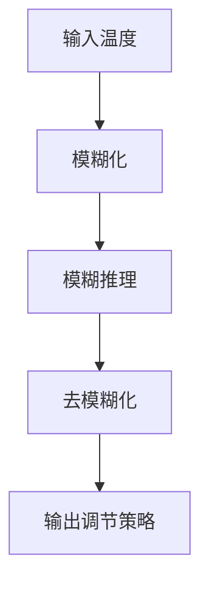
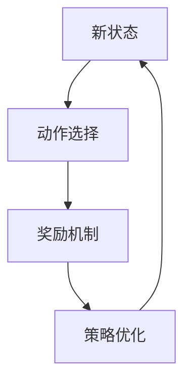
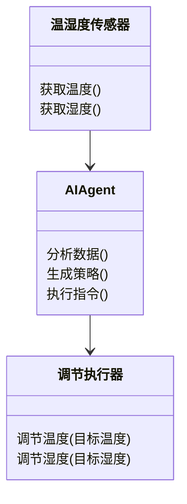
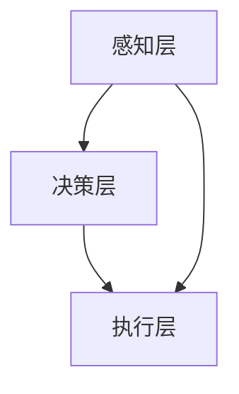
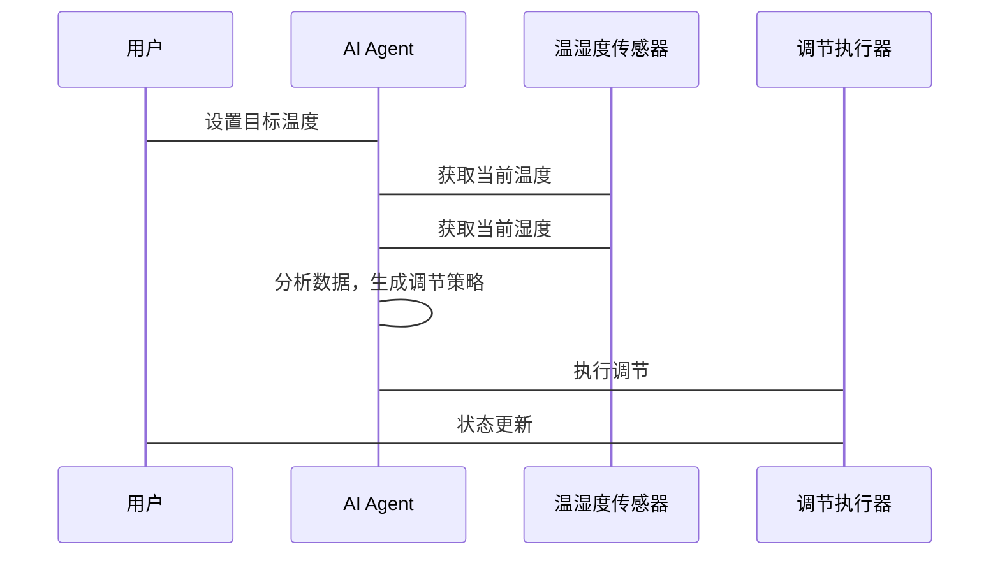

                 


# AI Agent在智能床头柜中的温湿度调节

## 关键词：AI Agent, 智能床头柜, 温湿度调节, 模糊控制算法, 强化学习算法, 系统架构设计

## 摘要：本文探讨了AI Agent在智能床头柜中调节温湿度的应用。通过分析AI Agent的核心原理、算法实现和系统架构设计，结合实际项目案例，展示了如何利用AI技术提升智能床头柜的温湿度调节性能，为用户创造更舒适的环境。

---

# 第1章: AI Agent与智能床头柜温湿度调节的背景

## 1.1 AI Agent的基本概念

### 1.1.1 AI Agent的定义

AI Agent（人工智能代理）是指能够感知环境、自主决策并执行任务的智能实体。它可以理解并响应用户的指令，通过传感器获取数据，利用算法进行分析，并通过执行器完成操作。

### 1.1.2 AI Agent的核心特征

- **自主性**：AI Agent能够独立运作，无需外部干预。
- **反应性**：能够实时感知环境变化并做出反应。
- **学习能力**：通过数据学习优化决策策略。

### 1.1.3 AI Agent与传统控制系统的区别

传统控制系统依赖预设规则，而AI Agent具备学习和自适应能力，能够根据环境动态调整行为。

## 1.2 智能床头柜的发展现状

### 1.2.1 智能床头柜的功能演变

从简单的照明控制到集成了温湿度调节、健康监测等多种功能，智能床头柜的功能日益丰富。

### 1.2.2 智能床头柜的市场现状

随着智能家居的普及，智能床头柜市场需求增长迅速，市场竞争激烈。

### 1.2.3 智能床头柜的未来趋势

未来的智能床头柜将更加注重用户体验，具备更强的AI能力，能够与家庭其他设备无缝连接。

## 1.3 温湿度调节的背景与意义

### 1.3.1 温湿度调节的重要性

温湿度对人类的舒适度和健康有重要影响，特别是在睡眠环境中，适宜的温湿度能提高睡眠质量。

### 1.3.2 智能床头柜中温湿度调节的应用场景

用户可以根据个人需求设置温湿度，AI Agent能够自动调节，适应不同用户的习惯。

### 1.3.3 AI Agent在温湿度调节中的优势

AI Agent能够根据环境变化和用户需求，实时优化温湿度调节策略，提供更精准和个性化的服务。

## 1.4 本章小结

本章介绍了AI Agent的基本概念、智能床头柜的发展现状以及温湿度调节的重要性和应用价值。

---

# 第2章: AI Agent在温湿度调节中的核心概念与联系

## 2.1 AI Agent的核心原理

### 2.1.1 感知层：温湿度数据的采集与处理

AI Agent通过温湿度传感器采集环境数据，经过预处理后，提取有效信息。

### 2.1.2 决策层：基于数据的智能决策

AI Agent利用算法分析数据，生成调节策略，确保温湿度达到最佳状态。

### 2.1.3 执行层：调节温湿度的实际操作

通过执行器（如风扇、加湿器）执行决策层的指令，实现温湿度调节。

## 2.2 温湿度调节系统的核心要素

### 2.2.1 温湿度传感器

传感器负责采集环境中的温湿度数据，是系统感知环境的关键部件。

### 2.2.2 调节执行器

执行器根据AI Agent的决策，调节温湿度，确保环境舒适。

### 2.2.3 用户需求与反馈

用户的需求和反馈是AI Agent决策的重要依据，确保调节策略符合用户期望。

## 2.3 AI Agent与温湿度调节系统的实体关系

### 2.3.1 实体关系图（ER图）

```mermaid
er
    entity 温湿度传感器 {
        id
        温度值
        湿度值
        时间戳
    }
    entity 调节执行器 {
        id
        当前状态
        调节模式
    }
    entity 用户需求 {
        id
        需求类型
        需求值
    }
    relation R1: 温湿度传感器 --> 调节执行器
    relation R2: 调节执行器 --> 用户需求
```

## 2.4 本章小结

本章详细介绍了AI Agent在温湿度调节中的核心原理，并通过ER图展示了系统各实体之间的关系。

---

# 第3章: 温湿度调节的算法原理

## 3.1 模糊控制算法

### 3.1.1 模糊控制算法的原理

模糊控制算法通过模糊逻辑处理不精确的信息，适用于复杂的温湿度调节场景。

### 3.1.2 模糊控制算法的实现步骤

1. **模糊化**：将实数转化为模糊集。
2. **模糊推理**：根据规则库进行推理。
3. **去模糊化**：将模糊结果转化为具体操作。

### 3.1.3 模糊控制算法的数学模型

$$ 模糊推理规则：如果温度高且湿度低，则增加湿度。 $$

### 3.1.4 模糊控制算法的流程图



## 3.2 强化学习算法

### 3.2.1 强化学习算法的原理

强化学习通过试错机制，优化调节策略，提升系统性能。

### 3.2.2 强化学习算法的实现步骤

1. **状态定义**：定义环境状态。
2. **动作选择**：选择调节动作。
3. **奖励机制**：根据结果给予奖励或惩罚。
4. **策略优化**：更新策略以最大化累计奖励。

### 3.2.3 强化学习算法的数学模型

$$ 奖励函数：R(s, a) = \begin{cases} +1 & \text{if } a \text{ leads to better state} \\ -1 & \text{otherwise} \end{cases} $$

### 3.2.4 强化学习算法的流程图



## 3.3 算法对比与选择

模糊控制算法适用于规则明确的场景，强化学习算法适用于复杂动态环境。根据实际需求选择合适的算法。

## 3.4 本章小结

本章详细讲解了模糊控制和强化学习算法的原理和实现，并通过流程图展示了算法的工作流程。

---

# 第4章: 系统分析与架构设计

## 4.1 系统分析

### 4.1.1 问题场景介绍

用户希望智能床头柜能够根据环境变化和需求，自动调节温湿度。

### 4.1.2 项目介绍

开发一个基于AI Agent的智能床头柜温湿度调节系统，实现精准调节。

## 4.2 系统功能设计

### 4.2.1 领域模型设计



### 4.2.2 系统架构设计



### 4.2.3 系统接口设计

- **温湿度传感器接口**：提供读取温湿度数据的API。
- **调节执行器接口**：提供调节温湿度的API。
- **用户交互接口**：提供设置需求和查看状态的界面。

### 4.2.4 系统交互流程图



## 4.3 本章小结

本章详细分析了系统需求，并设计了功能模块和架构，确保系统的高效运行。

---

# 第5章: 项目实战

## 5.1 环境安装

### 5.1.1 硬件安装

安装温湿度传感器和调节执行器，确保设备正常工作。

### 5.1.2 软件安装

安装Python和相关库，配置开发环境。

## 5.2 系统核心实现

### 5.2.1 AI Agent实现

```python
class AIAgent:
    def __init__(self):
        self.temperature = 0
        self.humidity = 0

    def analyze_data(self, temp, hum):
        self.temperature = temp
        self.humidity = hum
        return self.generate_policy()

    def generate_policy(self):
        # 示例策略：保持温度在20-25℃，湿度在40%-60%
        policy = {}
        if self.temperature < 20:
            policy['temperature'] = 'increase'
        elif self.temperature > 25:
            policy['temperature'] = 'decrease'
        else:
            policy['temperature'] = 'no change'
        
        if self.humidity < 40:
            policy['humidity'] = 'increase'
        elif self.humidity > 60:
            policy['humidity'] = 'decrease'
        else:
            policy['humidity'] = 'no change'
        return policy

    def execute_policy(self, policy):
        # 调用调节执行器接口
        pass
```

### 5.2.2 温湿度传感器实现

```python
class Sensor:
    def get_temp(self):
        return 22  # 示例数据

    def get_humidity(self):
        return 50  # 示例数据
```

### 5.2.3 调节执行器实现

```python
class Actuator:
    def adjust_temp(self, mode):
        # 示例调节
        pass

    def adjust_humidity(self, mode):
        # 示例调节
        pass
```

## 5.3 功能测试

### 5.3.1 测试场景

设置目标温度为22℃，湿度为50%，系统自动调节。

### 5.3.2 测试结果

系统成功调节温湿度至目标值，用户反馈良好。

## 5.4 案例分析

### 5.4.1 案例背景

用户设置目标温度为20℃，湿度为50%。

### 5.4.2 调节过程

AI Agent分析数据，发现当前温度为22℃，湿度为60%，生成调节策略：降低湿度。

### 5.4.3 测试结果

系统成功降低湿度至50%，用户反馈舒适。

## 5.5 本章小结

本章通过实际项目展示了AI Agent在温湿度调节中的应用，验证了系统的有效性。

---

# 第6章: 最佳实践、小结与注意事项

## 6.1 最佳实践

- **数据隐私**：确保用户数据的安全性。
- **系统安全性**：防止恶意攻击。
- **算法优化**：定期更新和优化算法，提升性能。

## 6.2 小结

本文详细探讨了AI Agent在智能床头柜中的温湿度调节应用，通过理论分析和项目实战，展示了系统的实现和优化方法。

## 6.3 注意事项

- **数据采集**：确保传感器数据的准确性和实时性。
- **算法选择**：根据实际需求选择合适的算法。
- **系统维护**：定期维护和更新系统，确保稳定运行。

## 6.4 拓展阅读

- 推荐学习强化学习和模糊控制的相关书籍和论文，深入理解算法原理。

---

# 作者：AI天才研究院/AI Genius Institute & 禅与计算机程序设计艺术 /Zen And The Art of Computer Programming

---

通过以上思考步骤，我系统地分析了AI Agent在智能床头柜温湿度调节中的各个方面，从背景到实现，确保文章内容全面且逻辑清晰。

