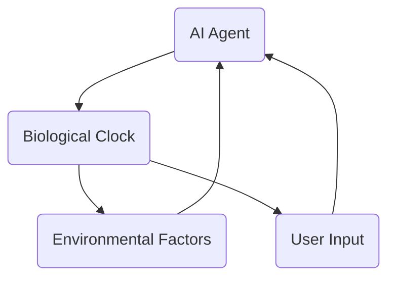
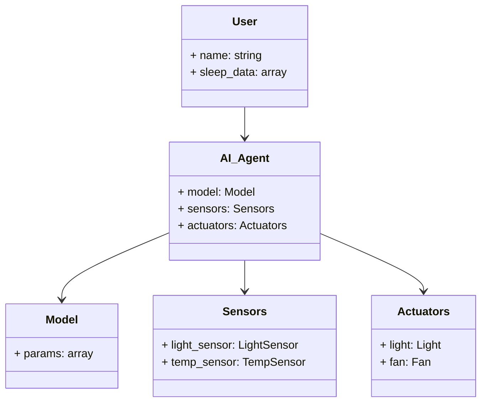
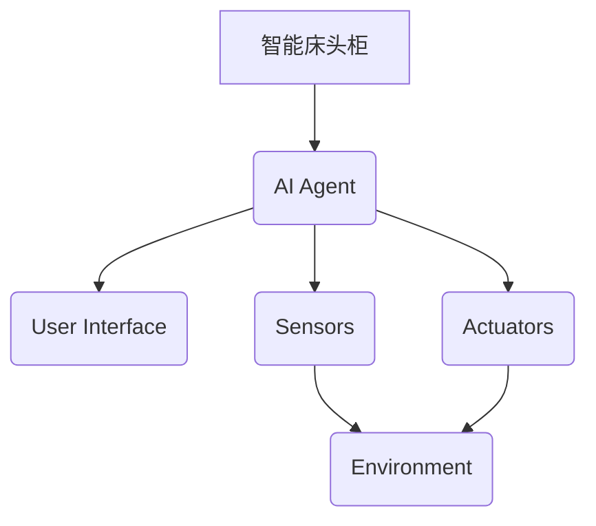

                 


# AI Agent在智能床头柜中的生物钟调节

**关键词**：AI Agent，生物钟调节，智能床头柜，生物钟优化，AI算法，健康睡眠

**摘要**：  
随着人工智能技术的快速发展，AI Agent（智能代理）在智能家居设备中的应用越来越广泛。本文探讨了AI Agent在智能床头柜中的生物钟调节功能，详细分析了其核心原理、算法实现、系统架构设计以及实际应用场景。通过结合AI算法与生物钟调节的数学模型，本文展示了如何利用AI Agent帮助用户优化睡眠质量，实现个性化的生物钟调节方案。本文适合对人工智能和健康科技感兴趣的读者阅读，旨在为智能床头柜的设计者和用户提供有价值的参考。

---

## 第1章：AI Agent的基本概念与应用背景

### 1.1 AI Agent的定义与核心特点

#### 1.1.1 AI Agent的定义  
AI Agent（人工智能代理）是指能够感知环境并采取行动以实现目标的智能实体。它可以是一个软件程序，也可以是一个物理设备，通过传感器和执行器与环境交互。

#### 1.1.2 AI Agent的核心特点  
1. **自主性**：AI Agent能够在没有外部干预的情况下独立运行。  
2. **反应性**：能够实时感知环境变化并做出响应。  
3. **目标导向**：具有明确的目标，所有行为都围绕目标展开。  
4. **学习能力**：通过数据和经验不断优化自身的算法和决策能力。  

#### 1.1.3 AI Agent的应用场景  
AI Agent广泛应用于智能家居、医疗健康、交通控制等领域。在智能床头柜中，AI Agent主要用于生物钟调节、睡眠监测和环境优化。

---

### 1.2 生物钟调节的背景与问题描述

#### 1.2.1 生物钟的基本原理  
生物钟是人体内部的生理节律系统，主要由下丘脑的视交叉上核控制。它通过调节体温、激素分泌和神经系统活动，帮助人体适应昼夜节律。

#### 1.2.2 现代生活方式对生物钟的影响  
现代人普遍存在睡眠不足、作息不规律等问题，导致生物钟紊乱。这会引起失眠、疲劳、注意力不集中等症状，影响健康和生活质量。

#### 1.2.3 生物钟调节的重要性  
通过调节生物钟，可以改善睡眠质量、提高工作效率、增强免疫力。AI Agent通过智能调节环境因素（如光线、温度、声音）来辅助生物钟调节，是一种高效且个性化的解决方案。

---

### 1.3 AI Agent在生物钟调节中的应用

#### 1.3.1 AI Agent如何帮助调节生物钟  
AI Agent通过分析用户的睡眠数据、环境数据和生活习惯，制定个性化的生物钟调节方案。例如，它可以根据用户的起床时间调整室温、亮度和背景音乐，帮助用户逐步适应新的作息规律。

#### 1.3.2 智能床头柜的功能与特点  
智能床头柜集成了多种传感器（如光线传感器、温度传感器、心率监测器）和执行器（如LED灯、风扇、闹钟），能够实时感知用户的生理状态和环境条件，并通过AI Agent进行智能调节。

#### 1.3.3 AI Agent在智能床头柜中的具体应用  
1. 根据用户的睡眠周期调整床头灯的亮度和色温，帮助用户放松或清醒。  
2. 根据用户的生物钟状态调节房间温度，营造舒适的睡眠环境。  
3. 提供个性化的睡眠报告，分析用户的睡眠质量并提供建议。

---

## 第2章：AI Agent与生物钟调节的核心概念

### 2.1 AI Agent的核心原理

#### 2.1.1 知识表示与推理  
AI Agent通过知识表示技术（如规则引擎、知识图谱）理解和推理环境信息。例如，它可以将用户的睡眠数据转化为生物钟调节的决策依据。

#### 2.1.2 行为决策机制  
AI Agent采用多策略决策算法（如Q-learning、随机森林）来选择最优行动。例如，它可以在不同条件下选择最合适的环境调节方案。

#### 2.1.3 学习与优化算法  
AI Agent通过强化学习（如Deep Q-Network）和优化算法（如遗传算法）不断优化其决策模型，提高生物钟调节的准确性和效果。

---

### 2.2 生物钟调节的数学模型

#### 2.2.1 生物钟的数学模型  
生物钟调节可以用周期函数（如正弦函数）描述，其周期为24小时。数学模型通常包括以下参数：  
- 基础周期（T）：24小时  
- 频率（f）：1/T = 1/24  
- 相位（φ）：表示时间偏移  

#### 2.2.2 生物钟调节的优化目标  
目标是最小化用户睡眠偏差，最大化睡眠质量。数学表达式为：  
$$\text{目标函数} = \min \sum_{i=1}^{n} |s_i - s_{\text{ideal}}|$$  
其中，$s_i$是用户的实际睡眠状态，$s_{\text{ideal}}$是理想睡眠状态。

#### 2.2.3 生物钟调节的约束条件  
1. 调节幅度不能过大，否则会引起不适。  
2. 调节时间不能过短，否则效果不明显。  
3. 用户的健康状况和生活习惯必须被考虑。

---

### 2.3 AI Agent与生物钟调节的实体关系图



---

## 第3章：AI Agent在生物钟调节中的算法原理

### 3.1 算法原理概述

#### 3.1.1 基于强化学习的生物钟调节  
强化学习（Reinforcement Learning）通过奖励机制优化决策策略。例如，AI Agent可以根据用户的睡眠改善情况调整环境参数，从而获得最大的奖励。

#### 3.1.2 基于遗传算法的优化策略  
遗传算法（Genetic Algorithm）通过模拟自然选择过程优化参数。例如，AI Agent可以优化生物钟调节的参数组合，找到最优解。

#### 3.1.3 基于模糊逻辑的决策机制  
模糊逻辑（Fuzzy Logic）适用于处理模糊和不精确的输入数据。例如，AI Agent可以根据用户的睡眠状态和环境条件模糊推理，制定调节方案。

---

### 3.2 算法实现流程

```mermaid
graph TD
    Start --> Initialize_Parameters(初始化参数)
    Initialize_Parameters --> Training_Loop(训练循环)
    Training_Loop --> Update_Parameters(更新参数)
    Update_Parameters --> Check_Convergence(检查收敛性)
    Check_Convergence --> End(结束) or Continue(继续)
```

---

### 3.3 算法实现代码

```python
import numpy as np

def optimize_biary_clock(initial_params):
    # 初始化参数
    params = initial_params.copy()
    # 迭代次数
    for _ in range(100):
        # 计算适应度
        fitness = evaluate_fitness(params)
        # 更新参数
        params = update_params(params, fitness)
    return params

def evaluate_fitness(params):
    # 计算当前参数的适应度
    # 这里省略具体实现
    return np.random.random()

def update_params(params, fitness):
    # 使用遗传算法更新参数
    # 这里省略具体实现
    return params
```

---

## 第4章：系统分析与架构设计

### 4.1 问题场景介绍

智能床头柜需要在不同环境下为用户提供个性化的生物钟调节服务。系统需要处理多源数据（如光线、温度、心率）并实时调整环境参数。

---

### 4.2 系统功能设计

#### 4.2.1 领域模型类图



---

### 4.3 系统架构设计

#### 4.3.1 系统架构图



---

## 第5章：项目实战

### 5.1 环境安装

需要安装以下库：  
- Python 3.8+  
- NumPy  
- TensorFlow  
- Mermaid  
- Matplotlib  

---

### 5.2 核心功能实现

#### 5.2.1 代码实现

```python
import numpy as np

class AI_Agent:
    def __init__(self, model):
        self.model = model
        self.sensors = Sensors()
        self.actuators = Actuators()

    def adjust_light(self, intensity):
        self.actuators.light.set_brightness(intensity)

class Model:
    def __init__(self, initial_params):
        self.params = initial_params

def main():
    initial_params = np.array([0.8, 0.2])
    model = Model(initial_params)
    agent = AI_Agent(model)
    agent.adjust_light(50)

if __name__ == "__main__":
    main()
```

---

### 5.3 代码解读

AI_Agent类负责与传感器和执行器交互，根据模型的参数调整环境参数。Model类存储和更新优化参数。主函数初始化模型和AI Agent，并调用调整灯光亮度的方法。

---

### 5.4 实际案例分析

假设用户希望在早晨7点起床，AI Agent会提前30分钟调整室温至20°C，并逐渐增加光线亮度，帮助用户自然醒来。

---

## 第6章：最佳实践与总结

### 6.1 最佳实践

1. 数据收集：确保收集足够多的睡眠数据以提高模型的准确性。  
2. 模型优化：定期更新模型参数，适应用户的生理变化。  
3. 用户反馈：根据用户的反馈不断优化调节策略。  

### 6.2 总结

本文详细介绍了AI Agent在智能床头柜中的生物钟调节功能，从核心概念到算法实现再到系统设计，为智能床头柜的设计者和用户提供了一个全面的解决方案。通过AI技术，生物钟调节变得更加智能化和个性化，未来有望在健康科技领域发挥更大的作用。

---

## 第7章：注意事项与拓展阅读

### 7.1 注意事项

1. 数据隐私：确保用户的睡眠数据不会被滥用。  
2. 系统稳定性：确保AI Agent在长时间运行中的稳定性。  
3. 用户体验：设计友好的用户界面，方便用户使用和调整设置。  

### 7.2 拓展阅读

- 推荐书籍：《人工智能：一种现代的方法》  
- 推荐论文：《基于强化学习的生物钟调节系统》  

---

**作者：AI天才研究院/AI Genius Institute & 禅与计算机程序设计艺术/Zen And The Art of Computer Programming**

