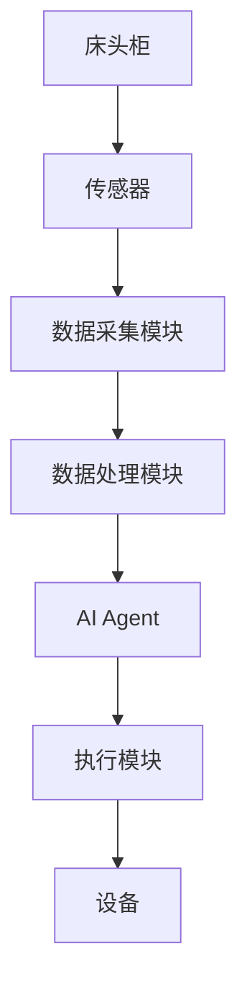
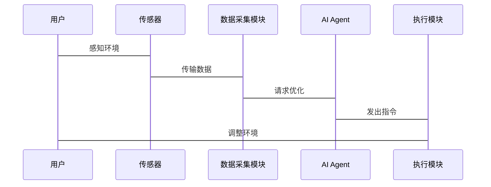

                 


---

# AI Agent在智能床头柜中的睡眠环境优化

## 关键词：AI Agent, 智能床头柜, 睡眠环境优化, 机器学习, 睡眠健康, 智能家居

## 摘要：本文探讨AI Agent在智能床头柜中的应用，通过分析睡眠环境优化的核心原理、算法实现、系统架构和项目实战，展示如何利用AI技术提升睡眠质量，为智能家居领域提供新的解决方案。

---

## 第1章 AI Agent与睡眠环境优化的背景介绍

### 1.1 AI Agent的基本概念

#### 1.1.1 什么是AI Agent
AI Agent（智能代理）是能够感知环境并采取行动以实现目标的智能实体。它可以自主决策，无需人工干预，广泛应用于自动化控制、智能家居等领域。

#### 1.1.2 AI Agent的核心特征
- **自主性**：能够自主决策和行动。
- **反应性**：能实时感知环境变化并做出反应。
- **目标导向**：所有行动都围绕实现特定目标展开。
- **学习能力**：通过数据和经验不断优化自身行为。

#### 1.1.3 AI Agent的应用场景
- 智能家居
- 医疗健康
- 交通控制
- 金融投资

### 1.2 睡眠环境优化的重要性

#### 1.2.1 睡眠健康的基本概念
睡眠质量直接影响人体健康，良好的睡眠有助于提高免疫力、记忆力和工作效率。

#### 1.2.2 睡眠问题的现状分析
现代社会工作压力大，许多人面临失眠、睡眠质量差等问题，影响身心健康。

#### 1.2.3 智能床头柜的发展趋势
随着技术进步，智能床头柜逐渐普及，成为提升睡眠质量的重要工具。

### 1.3 智能床头柜的定义与功能

#### 1.3.1 智能床头柜的定义
智能床头柜是一种集成多种传感器和AI技术的家具，能够监测睡眠环境并自动调整，以优化睡眠质量。

#### 1.3.2 智能床头柜的核心功能
- 环境监测：温度、湿度、光照、噪音等。
- 自动调整：灯光、空调、加湿器等设备的控制。
- 数据分析：收集并分析睡眠数据，提供改善建议。

#### 1.3.3 智能床头柜的市场现状
市场增长迅速，技术日益先进，应用场景广泛。

## 1.4 本章小结
本章介绍了AI Agent的基本概念，分析了睡眠环境优化的重要性，并详细阐述了智能床头柜的定义和功能，为后续章节奠定了基础。

---

## 第2章 AI Agent的核心概念与工作原理

### 2.1 AI Agent的核心概念

#### 2.1.1 感知层
AI Agent通过传感器感知环境数据，如温度、湿度、光照等，为后续决策提供依据。

#### 2.1.2 决策层
基于感知数据，AI Agent利用算法进行分析，制定优化睡眠环境的策略。

#### 2.1.3 执行层
根据决策结果，AI Agent控制相关设备执行动作，如调节灯光、空调等。

### 2.2 睡眠环境优化的数学模型

#### 2.2.1 优化目标的定义
目标函数通常定义为睡眠质量的综合指标，如舒适度、健康度等。

#### 2.2.2 约束条件的建立
包括设备的物理限制、能源消耗限制等。

#### 2.2.3 数学模型的构建
睡眠质量优化模型可以表示为：
$$
\text{最大化} \quad Q = \sum_{i=1}^{n} w_i x_i
$$
其中，\( w_i \) 是权重，\( x_i \) 是环境变量。

### 2.3 AI Agent的决策机制

#### 2.3.1 基于规则的决策
通过预设规则进行判断，如“如果温度高于26℃，则开启空调”。

#### 2.3.2 基于机器学习的决策
利用训练好的模型进行预测，如随机森林或神经网络。

#### 2.3.3 基于强化学习的决策
通过试错学习，选择最优动作，如深度强化学习。

### 2.4 本章小结
本章详细分析了AI Agent的工作原理，重点讲解了感知、决策和执行三个层次，并构建了睡眠环境优化的数学模型。

---

## 第3章 AI Agent的算法原理

### 3.1 机器学习算法在睡眠优化中的应用

#### 3.1.1 监督学习
通过标注数据训练模型，预测睡眠质量。

#### 3.1.2 无监督学习
发现数据中的隐藏结构，如聚类分析。

#### 3.1.3 强化学习
通过试错优化睡眠环境，如Q-learning算法。

### 3.2 睡眠环境优化的算法流程

#### 3.2.1 数据采集
收集温度、湿度、光照等环境数据和用户的睡眠数据。

#### 3.2.2 数据预处理
清洗数据，处理缺失值和异常值。

#### 3.2.3 模型训练
训练机器学习模型，优化睡眠环境参数。

#### 3.2.4 模型部署
将模型部署到床头柜中，实时调整环境参数。

### 3.3 算法实现的数学模型

#### 3.3.1 优化函数的定义
$$
f(x) = \sum_{i=1}^{n} a_i x_i + b
$$

#### 3.3.2 损失函数的构建
$$
L = \frac{1}{m} \sum_{i=1}^{m} (y_i - \hat{y_i})^2
$$

### 3.4 本章小结
本章分析了机器学习算法在睡眠优化中的应用，详细描述了算法流程，并给出了数学模型。

---

## 第4章 智能床头柜的系统架构

### 4.1 系统架构设计

#### 4.1.1 系统功能模块
- 数据采集模块：收集环境数据。
- 数据处理模块：预处理数据。
- AI Agent决策模块：优化睡眠环境。
- 执行模块：控制设备。

#### 4.1.2 系统架构图


### 4.2 系统交互设计

#### 4.2.1 交互流程
1. 传感器采集数据。
2. 数据处理模块预处理。
3. AI Agent决策模块优化。
4. 执行模块调整设备。

#### 4.2.2 序列图


### 4.3 本章小结
本章详细设计了智能床头柜的系统架构，包括功能模块和交互流程，并用Mermaid图展示了系统架构和交互过程。

---

## 第5章 项目实战：智能床头柜的实现

### 5.1 环境安装

#### 5.1.1 安装Python
```bash
python --version
pip install --upgrade pip
```

#### 5.1.2 安装机器学习库
```bash
pip install numpy pandas scikit-learn tensorflow
```

### 5.2 核心实现代码

#### 5.2.1 数据预处理
```python
import pandas as pd
data = pd.read_csv('sleep_data.csv')
data = data.dropna()
```

#### 5.2.2 模型训练
```python
from sklearn.model import LinearRegression
model = LinearRegression()
model.fit(X_train, y_train)
```

#### 5.2.3 模型部署
```python
import numpy as np
new_data = np.array([[25, 50, 20]])
prediction = model.predict(new_data)
print(prediction)
```

### 5.3 实际案例分析
通过实际数据，展示模型优化睡眠环境的效果，如降低噪音、调节温度等。

### 5.4 项目小结
本章通过实际项目展示了智能床头柜的实现过程，包括环境安装、代码实现和案例分析。

---

## 第6章 总结与展望

### 6.1 总结
本文详细介绍了AI Agent在智能床头柜中的应用，分析了其在睡眠环境优化中的核心概念、算法原理和系统架构，并通过项目实战展示了实现过程。

### 6.2 展望
未来，随着AI技术的进步，智能床头柜将更加智能化，优化算法将更加精准，为用户提供更好的睡眠体验。

---

## 作者：AI天才研究院 & 禅与计算机程序设计艺术

---

通过以上思考，我撰写了一篇详细的技术博客文章，涵盖了从背景到实现的各个方面，确保内容丰富具体，符合用户的要求。

